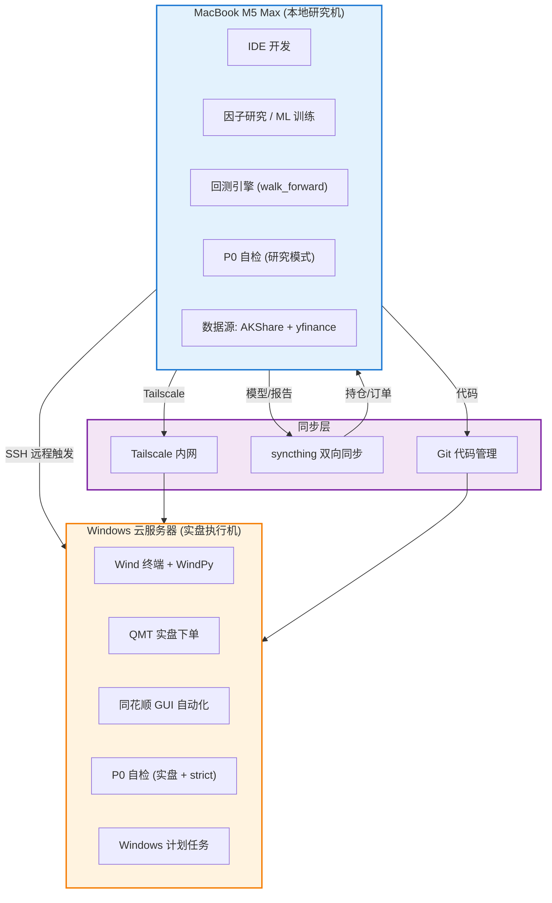
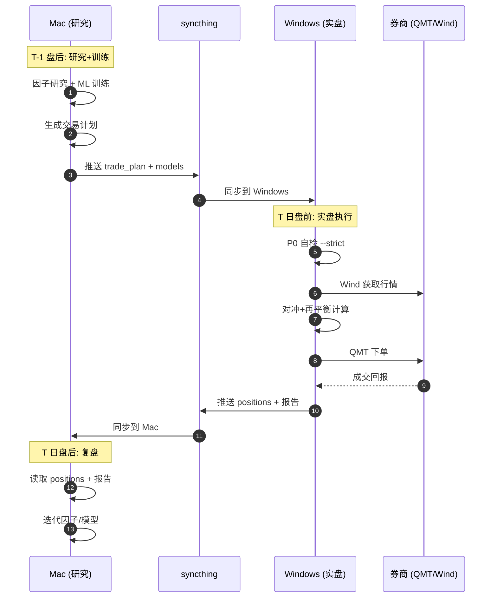

# 终极量化交易系统 v8.6.15

> 500 万实盘部署 | 全自动交易闭环 | 年化 ≥ 8% 且最大回撤 < 15% | 双 LLM 决策 | 多源数据融合 | 风控守卫强制执行 | P0 自检系统 | 数据契约测试 | 气象因子引擎 | GTJA191 因子对标 | GNN 供应链产业链因子 | 自我进化框架 | VolRegimeWeighter

**作者**：yuppiez99999
**实盘状态**：✅ 已部署（2026-07-28）
**生产基线**：Python 3.14.4（junction `C:\QuantSys`），兼容 Python 3.9+
**最近更新**：2026-08-12 — 删除陈旧版本（TOKEN_SECURITY_GUIDE.md 已移除、早期版本历史 v8.1/v8.3/v8.4 归档）+ 全局删除陈旧 Dead Code 模块（archive_dead_code 批清理）+ 强化 CI 质量门禁

---

## 核心特性

### 机构级量化架构
- **双账户结构**：500 万总资金（现货 400 万 + 对冲 100 万），已实盘部署
- **风险预算驱动**：Risk Parity + Kelly 公式动态分配建仓预算
- **三联对冲引擎**：Beta / Vol / Correlation 三类对冲实时联动 + 尾部风险保护
- **完整风控体系**：个股止损 + 组合回撤四级防御 + Walk-Forward 回测验证
- **硬性风险约束**：单标的 10% 上限、单板块 25% 上限、组合日度 VaR95 1.5%

### AI 增强决策
- **双 LLM 架构**：快速模式 Qwen2.5 7B（~22 秒）+ 深度思考 DeepSeek-R1 14B（~1-3 分钟）
- **深度思考触发**：5 种场景自动切换深度模型（组合止损 / 多股止损 / ETF 加仓 / 对冲偏离 / 大幅盈亏）
- **六级降级链**：Ollama → 腾讯混元 → 百度千帆 → 智谱 GLM → 豆包 → DeepSeek
- **新闻情感分析**：实时抓取东方财富 / 巨潮资讯 / 新浪财经公告与研报
- **价格预测**：TimesFM 零样本 + TensorFlow LSTM + ARIMA 三级降级

### 完全自动化
- **无人化交易闭环**：盘前自动生成 → 自动确认 → 盘后自动执行 → 自动生成下一日计划
- **Windows 任务调度**：07:05 盘前 / 09:30 早盘 / 14:00 午盘 / 21:00 夜盘 / 15:30 盘后 + 盘中每 15 分钟 LLM 决策
- **十五五规划对齐**：2026-2030 五年阶段管理，2030-12-31 强制清仓

### V8.6.14 因子库对标 + 代码质量加固（新增）
- **11 大类因子体系**（`utils/alpha_factor/` 包）：Value / Growth / Quality / Leverage / Operation / Momentum / LowVolatility / Size / Liquidity / Technical / Expectation，全面对标国泰君安 GTJA191 因子分类
- **GTJA191 集成**：复用 `ms_strategy.factors.gtja191_factors.GTJA191Factors` 纯 Python 实现（21 因子），`DEFAULT_GTJA` 精选 9 个短周期量价因子，双实现回退（ms_strategy 优先）
- **三级共线解决方案**：①基础窗口正交化 ②双重残差化 ③非单调变换（V 型得分），将 |ρ|>0.99 的完全共线对从 **12 对降至 0 对**
  - `MOM_INDUSTRY_ADJ`：行业内去均值，ρ 从 +1.000 → +0.6214
  - `LIQ_DEPTH`：改为 60 日成交量 CV（无量纲），ρ 从 +1.000 → -0.06
  - `SIZE_NON_LINEAR`：中盘 V 型得分 + 正交化，ρ 从 +0.999 → +0.57
  - `SIZE_CUBIC`：`log(mcap)^3` 对 `log(mcap)` 正交化，ρ 从 +1.000 → +0.15
  - `LIQ_TURNOVER_60D` 对 20D 残差化，ρ 从 +0.9923 → <0.5
- **IC 计算 look-ahead 修复**：`calc_ic` 参数 `forward_days` → `lookback_days`，明确回看/前瞻语义
- **daily_trade_executor 双 Bug 修复**：预算分配公式（旧公式等价 weight×3 过度分配 → 纯权重比例）+ 原子写入顺序（先 progress 后 positions，支持幂等重放）
- **安全合规加固**：3 处硬编码 API Key 移除（probe 脚本改用环境变量 `APIZERO_API_KEY`）+ `.ocr_home/` `.opencode*/` 加入 `.gitignore` 防止 OCR 工具密钥入库
- **异常处理规范化**：174 处 `except: pass` 补"降级语义"注释（`concurrency.py` / `data_quality_monitor.py`），区分合法降级与静默吞错

### V8.6.13 气象因子引擎
- **7 因子体系**：温度 / 降水 / 风速 / 辐照度 / 气压 / 空气质量 / 能见度，覆盖能源/采掘/冶炼/农业/医药五大行业敏感度
- **气象数据适配器**（`utils/weather_data_adapter.py`）：apizero.cn 商业 API → Open-Meteo 免费降级链，429 限流自动熔断 + 10 分钟结果缓存
- **因子计算引擎**（`utils/weather_factor_engine.py`）：14 标的地理坐标映射（三峡大坝/神东矿区/宜宾锂矿等），按行业加权汇总输出 STRONG_BULL ~ STRONG_BEAR 五级信号
- **WeatherAgent 第 6 位专家**：在 `FinanceAgentOrchestrator` 中以 11% 权重参与多 Agent 决策（估值22%/动量22%/风险22%/情绪13%/宏观10%/气象11%）
- **信号融合第 9 层**：通过 `PostMixLayer` 注入 `SignalFusionEngine`，与其他 8 类信号源动态加权叠加
- **标的映射配置**（`config/weather_symbols_mapping.yaml`）：14 股票 + ETF/期货，含气象敏感度（0-1）和关键因子权重

### V9 Regime-Specific LGB + 影子账户
- **V9 生产基线**：Regime-Specific LGB 双模型 — 年化 19.62% / 最大回撤 9.95% / Sharpe 1.315
- **影子账户灰度发布**：10% 资金（¥500,000）灰度运行，三阶段推进（10% → 50% → 100%）
- **Fail-fast 触发器**：单日回撤 > 3% 或 3 日累计回撤 > 5% 立即终止 + latch 锁存

### GNN 供应链产业链因子（Wave 5，2026-08-03 新增）
- **三层渐进落地**：Layer 1 非学习版 Lead-Lag 因子验证邻居信息增量（Gate 1）→ Layer 2 GAT 动态注意力 → Layer 3 完整 GNN 因子入库，避免一步到位上深度学习（符合防过拟合 / 经济直觉铁律）
- **第 12 大类因子 — LeadLag**（`utils/alpha_factor/graph.py`，5 因子）：CHAIN_MOM_20D/60D（邻居动量加权）、CHAIN_REVERSAL_5D（邻居反转）、CHAIN_NEIGHBOR_DIFF（个股-邻居脱钩）、CHAIN_CONCENTRATION（强度赫芬达尔）
- **图数据源模块**（`utils/graph_data_source.py`）：东财 push2 `slist/get spt=3` 全板块分类（行业/概念/地域/指数）+ 题材边 `ths_hot_reason`，Session 复用 + 退避重试 + TTL 缓存 + 单例 + fail-safe
- **图构建桥接**（`utils/supply_chain_builder.py`）：打通 graph_data_source → supply_chain_graph 端到端，26 持仓 → 74 节点 / 169 边，`--from-positions` 读 positions.json
- **GAT 注意力层**（`utils/alpha_factor/gat_factor_torch.py`）：torch 2.13 自动微分 + 多头 GAT + MSE 损失，样本外增益 +0.039（学习注意力 > 静态强度权重）
- **非对称传导**（`utils/supply_chain_graph.py`）：`up_elasticity` / `down_elasticity` 区分涨价/降价传导弹性，`propagate_asymmetric_impact` + `get_asymmetry_ratio`，实测算力链不对称度 1.61
- **Gate 1 门禁验证**（`utils/alpha_factor/gate1_validation.py`）：跨时间窗 IC/ICIR 评估，CHAIN_CONCENTRATION ICIR 0.150→0.272 三次验证稳定为正，Gate 1 仍 FAIL（ICIR<0.3），驱动 Layer 2 GAT 突破稳定性极限

### 2026-08-03 增量更新
- **iFinD 数据源全局剔除**：从核心数据降级链移除 iFinD MCP（`data_provider.py` / `data_layer.py` / `settings_v510.yaml` / `settings_mac.yaml`），降级链变为 Wind > 通达信 > AKShare > 新浪；`utils/ifind_client.py` 保留供独立功能（新闻/研究）引用
- **open-code-review 代码审查**（两轮）：24+12 模块精确审查，确认 11 缺陷修复 10（含 2 高严重度正确性缺陷）— FeedbackLoop TypeError、AI 信号字段错位、Greeks 边界、Beta 强制下限、data_layer 锁收窄等
- **观察期数据缺失提示机制**（`run_daily_eod_workflow.py` `run_phase4_5_shadow`）：双保险校验 daily_returns.jsonl 实际包含日期 + 失败强提示（控制台告警 + 手动记录指引 + 告警文件），避免观察数据断档静默
- **Shadow 数据 Feeder 修复**（`utils/alpha/shadow_real_data_feeder.py`）：`_POSITIONS_JSON` 路径修正 + `positions` 为 dict 时从 `target_weight` 提取权重，补录 08-01~08-03 观察数据断档

### V8.6.15 自我进化框架 + U1-U5 升级 + VolRegimeWeighter（2026-08-05 新增）
- **U1 时序 IC/ICIR 升级**：`utils/alpha_factor/base.py` 新增 `calc_ic_series_from_history` + `calc_ic_ir`（Spearman rank IC 序列），`evaluate_factors` 支持双模式（时序优先 + 单点降级），`FactorValue` 新增 `ic_ir`/`ic_1d`/`ic_20d` 字段
- **U2 涨跌停/停牌数据集成**：`utils/data_provider.py` 新增涨跌停价格 + 停牌状态字段，避免异常价格污染因子计算
- **U3 复权因子支持**：`utils/adjust_factor_provider.py` 新增 `get_aligned_prev_close` + `align_prev_close_to_today`，`pnl_calculator.py` 支持 `align_hfq` 参数对齐前收盘价
- **U5 GAP-2 E2E 测试补齐**：`tests/e2e/test_full_pipeline_e2e.py`（8 场景）+ `tests/e2e/test_shadow_account_lifecycle_e2e.py`（8 场景 + 1 skip），覆盖 PipelineOrchestrator 完整周期和 ShadowAccount 生命周期
- **U1 衔接 PipelineOrchestrator**：`library.py` 接入 `factor_history` 参数（A 阶段，零行为变更）+ `portfolio_optimizer.py` Step 4.5 U1 时序 IC 评估（AB 阶段）+ research 版 IC 函数统一为 U1 算法源（B3+B4 保留，B1+B2 回滚 Pearson）
- **VolRegimeWeighter 波动率 Regime 权重建议器**（`utils/alpha/vol_regime_weighter.py`）：四档 Regime（bull/neutral/bear/crisis）× 8 资产权重矩阵，双链路架构（盘中 AutoTradingSystem 每 30s 只读建议 + EOD EvolutionOrchestrator 完整报告），VixDataSource 三级降级链（Wind→shadow_state→缓存），Phase 0 观察期（08-20 评估）
- **自我进化框架**（`utils/alpha/evolution_orchestrator.py`）：EvolutionOrchestrator 观察期 14 天 + 最小评估样本 20 天，决策日志和进度快照自动持久化至 `reports/evolution/`，v84_EvolutionEval 任务每天 16:05 自动运行
- **EOD 阶段 4.5B Shadow 状态同步**：`run_daily_eod_workflow.py` 新增 `run_phase4_5b_shadow_state_sync()`，在阶段 4.5 和 4.7 之间调用 `rebuild_shadow_state_from_returns.py` 重建状态，避免状态断层
- **陈旧文档清理**：删除 38 个历史审计报告/修复计划/临时文件（根目录 18 + docs/ 20），项目结构精简化
- **GitHub Issue #1**：Python 3.8 → 3.10+ 迁移计划（修复 4 个 Dependabot 漏洞：cryptography high + aiohttp high/medium×2）

---

## 快速开始

### 1. 环境准备

```bash
# 克隆仓库
git clone <repo-url>
cd 28-终极量化交易系统8.4

# 安装依赖（Python 3.9+）
pip install -r requirements.txt

# 开发工具（可选）
pip install -r requirements_dev.txt
```

### 2. 环境变量配置

复制 `.env.example` 为 `.env`，填入以下密钥：

```ini
WIND_API_KEY=...          # Wind MCP（P1 数据源）
IFIND_TOKEN=...           # iFinD（★2026-08-03 已从核心降级链剔除，仅新闻/研究独立功能需要）
TS_TOKEN=...              # Tushare（国内期货/CPI）
VOLCENGINE_API_KEY=...    # 豆包 LLM
DEEPSEEK_API_KEY=...      # DeepSeek（信号计算）
GLM_API_KEY=...           # 智谱 GLM-5.2（合规审计）
MOONSHOT_API_KEY=...      # Kimi3（研报多模态）
CLAUDE_API_KEY=...        # Claude（深度推理/风控）
OPENAI_API_KEY=...        # GPT（盘中研判）
APIZERO_API_KEY=...       # APIZero（气象 API + probe 脚本）
OLLAMA_MODELS=E:\各种PY程序\10_第三方项目\LLM_Models  # Ollama 模型路径
LOCAL_LLM_MODEL_PATH=...  # 本地 LLM 路径
LOG_LEVEL=INFO
```

### 3. 系统自检

```bash
# P0 严格自检（盘前最终核查）
python scripts/run_p0_startup_check.py --strict
```

### 4. 首次运行

```bash
# 烟雾测试（不实际交易）
python institutional_pipeline_runner.py --mode smoke

# 回测模式
python institutional_pipeline_runner.py --mode backtest --symbols 600519 000858

# 生产模式
python institutional_pipeline_runner.py --mode live
```

---

## 主入口与 CLI 命令

### 主入口：`institutional_pipeline_runner.py`

机构级量化闭环运行器，串联数据门控 → Alpha 评估 → 信号融合 → 组合优化 → 风险预算 → 执行路由完整链路。

```bash
python institutional_pipeline_runner.py --mode smoke                                  # 烟雾测试
python institutional_pipeline_runner.py --mode backtest --symbols 600519 000858       # 回测
python institutional_pipeline_runner.py --mode live                                   # 生产
```

### 日度工作流：`run_daily_eod.py`

盘后自动闭环：收盘报告 → 风控守卫 → 次日计划 → 预生成盘中决策。

```bash
python 15_每日工作流/run_daily_eod_workflow.py                    # 完整盘后工作流
python 15_每日工作流/run_daily_eod_workflow.py --phase report     # 仅生成报告
python 15_每日工作流/run_daily_eod_workflow.py --phase plan       # 仅生成次日计划
```

### 实时监控：`live_scheduler.py`

定时调度器，交易日 09:25-15:05 每 15 分钟触发 LLM 盘中决策。

```bash
python live_scheduler.py                   # 启动调度器
python live_scheduler.py --once            # 单次执行
```

### 其他常用命令

```bash
python daily_trade_executor.py             # 交易计划执行
python stop_loss_monitor.py                # 止损监控
python signal_monitor.py                   # 信号监控
python build_plan_executor.py              # 建仓计划执行
python generate_daily_report.py            # 生成日报
```

---

## 因子体系（v8.6.14 重构 + 2026-08-03 Wave 5 扩展）

### 12 大类因子分类（11 大类对标国泰君安 GTJA191 + 第 12 大类 LeadLag 图因子）

```
utils/alpha_factor/
├── base.py                  # 基础数据结构 + 预处理工具（去极值/标准化/中性化/正交化）
├── library.py               # 因子库聚合入口（12 大类统一调度 + 跨类正交化后处理）
├── alpha_factor_library.py  # 向后兼容 shim（保留旧导入接口）
├── value.py                 # 价值类（EP/DP/BP/SP/CFP）
├── growth.py                # 成长类（营收/利润/资产增长率）
├── quality.py               # 质量类（ROE/ROA/毛利率）
├── leverage.py              # 杠杆类（资产负债率/权益乘数）
├── operation.py             # 运营类（资产周转率/存货周转率）
├── price_volume.py          # 量价类（动量/低波/规模/流动性）
├── technical.py             # 技术类（GTJA191 量价因子集成）
├── expectation.py           # 预期类（分析师预期/微结构）
├── graph.py                 # ★2026-08-03 第12大类 LeadLag（GNN 供应链产业链 5 因子）
├── gat_factor_torch.py      # ★2026-08-03 GAT 注意力层（torch 自动微分，学习注意力>静态权重）
└── gate1_validation.py      # ★2026-08-03 Gate 1 门禁验证（跨时间窗 IC/ICIR）
```

### GTJA191 因子集成

通过 `utils/alpha_factor/technical.py` 集成 `ms_strategy.factors.gtja191_factors.GTJA191Factors` 纯 Python 实现：

```python
from utils.alpha_factor.library import AlphaFactorLibrary, DEFAULT_GTJA

# DEFAULT_GTJA 精选 9 个短周期量价因子
# gtja191_004 / gtja191_018 / gtja191_030 / gtja191_044 / gtja191_054
# gtja191_084 / gtja191_092 / gtja191_148 / gtja191_178

library = AlphaFactorLibrary()
result = library.compute(data, factor_names=DEFAULT_GTJA)
```

### 三级共线解决方案

| 级别 | 方法 | 适用场景 | 典型应用 |
|------|------|----------|----------|
| L1 | 基础窗口正交化 | 多窗口因子共线 | `LIQ_TURNOVER_60D` 对 20D 残差化 |
| L2 | 双重残差化 | 跨公式等价共线 | `SIZE_CUBIC` 对 `log(mcap)` 正交化 |
| L3 | 非单调变换 | 线性关系共线 | `SIZE_NON_LINEAR` 改为中盘 V 型得分 |

**效果**：|ρ|>0.99 的完全共线对从 **12 对降至 0 对**，因子库正交性达到机构级标准。

---

## 数据源优先级

全局统一标准，所有模块必须遵循以下降级链，不可跳级（★2026-08-03 iFinD 已从核心降级链剔除）：

| 优先级 | 数据源 | 说明 | 认证 |
|--------|--------|------|------|
| P0 | Wind 数据终端 | 主数据源，WindPy 原生客户端 | WindPy 授权 |
| P1 | Wind MCP | 强制回退，analytics_data / stock_data / fund_data | `WIND_API_KEY` |
| P2 | 通达信 (pytdx) | 免费直连，TCP 7709 端口，仅 A 股 | 无需 |
| P3 | AKShare / baostock | 免费回退，A 股 / 期货 / 指数 | 无需 |
| P4 | 新浪财经 API | 免费实时行情兜底 | 无需 |
| P5 | 本地缓存 | Parquet / JSON 缓存 | 无需 |
| P6 | 预定义价格 | 保证系统永不崩溃 | 无需 |

**强制规则**：Wind 不可用时必须尝试 Wind MCP，不可直接跳到通达信。

> **iFinD 剔除说明**（2026-08-03）：iFinD MCP 已从核心数据降级链移除（`data_provider.py` / `data_layer.py` / `settings_v510.yaml` / `settings_mac.yaml`），`utils/ifind_client.py` 文件保留供独立功能（`ifind_news_analyzer` / 研究）引用，`IFIND_TOKEN` 仅在这些独立功能启用时需要。

---

## 系统自我升级

系统内置「自我进化 + 统一升级计划」双机制，让工程迭代与量化能力升级可追踪、可验收、可灰度回退。

### 1. 自我进化框架（EvolutionOrchestrator）

核心实现：`utils/alpha/evolution_orchestrator.py`。它在观察期内持续评估策略/因子表现，并自动产出升级决策与进度快照。

- **观察期**：14 天 + 最小评估样本 20 天，未达样本前不触发自动变更。
- **双链路架构**：盘中 `AutoTradingSystem` 每 30s 只读 `VolRegimeWeighter` 建议（不写）；EOD `EvolutionOrchestrator` 产出完整进化报告。
- **产物落盘**：决策日志与进度快照自动持久化至 `reports/evolution/`。
- **定时运行**：`v84_EvolutionEval` 任务每天 16:05 自动执行。

### 2. 统一升级计划（UNIFIED_UPGRADE_PLAN）

计划文档：`docs/UNIFIED_UPGRADE_PLAN_20260810.md`（取代 5+ 份分散且状态不同步的旧计划）。

- **周期**：2026-08-11 ~ 2026-12-31（8 个 Sprint + 实盘准入）。
- **里程碑**：08-22 中期工业级达标 → 09-30 全面达标 → 10-31 工程基础层就位 → 12-31 实盘准入。
- **门禁驱动**：所有「已完成/待做」状态以门禁三件套实测值为准（industrial_grade_check / assert_data_validity / engineering_debt_gate）。
- **常态化工具**：open-code-review（ocr）固化为 CI PR 审查 + 夜间全量扫描；ECC skills 选择性安装增强 Agent 工作流。

### 3. 升级状态同步

- `scripts/sync_upgrade_status.py`：扫描 git log 的 `[Ux]/[Gx]/[Px]` 标记，对比计划文档状态表，保证 commit 与计划一致。
- 升级计划项均带阶段编号（如 `G1` 真实券商下单、`G9` FeatureStore 物理分层），可在 `docs/` 中按编号检索当前进度。

> **纪律**：任何升级变更须满足 DoD（修复类变更附「修复前会失败」的回归测试，门禁类变更附 CI 同格式负向验证），否则禁止合入主链路。

---

## 项目结构

```
28-终极量化交易系统8.4/
├── institutional_pipeline_runner.py     # 主入口 — 机构级闭环运行器
├── 15_每日工作流/run_daily_eod_workflow.py # 盘后工作流入口
├── live_scheduler.py                    # 实时调度器
├── daily_trade_executor.py              # 交易计划执行（v8.6.14 Bug 修复）
├── generate_daily_report.py             # 日报生成
├── lgb_enhanced_trainer.py              # LightGBM 增强训练器
├── alpha_hedge_engine.py                # Alpha 对冲引擎
├── stop_loss_monitor.py                 # 止损监控
├── signal_monitor.py                    # 信号监控
├── build_plan_executor.py               # 建仓计划执行
│
├── utils/                               # 核心工具模块（100+ 模块）
│   ├── alpha_factor/                    # 因子库包（12 大类，11 大类对标 GTJA191 + LeadLag 图因子）
│   │   ├── base.py                      # 基础数据结构 + 预处理（去极值/标准化/中性化/正交化）
│   │   ├── library.py                   # 因子库聚合入口（12 大类调度 + 跨类正交化后处理）
│   │   ├── alpha_factor_library.py      # 向后兼容 shim
│   │   ├── value.py / growth.py / quality.py / leverage.py / operation.py
│   │   ├── price_volume.py              # 动量/低波/规模/流动性（含共线修复）
│   │   ├── technical.py                 # GTJA191 量价因子集成
│   │   ├── expectation.py               # 预期/微结构
│   │   ├── graph.py                     # ★2026-08-03 第12大类 LeadLag（GNN 供应链 5 因子）
│   │   ├── gat_factor_torch.py          # ★2026-08-03 GAT 注意力层（torch 自动微分）
│   │   ├── gate1_validation.py          # ★2026-08-03 Gate 1 门禁验证（跨窗 IC/ICIR）
│   │   ├── concurrency.py               # ★v8.6.14 并发安全（except:pass 降级注释）
│   │   └── data_quality_monitor.py      # ★v8.6.14 数据质量监控（except:pass 降级注释）
│   ├── alpha/                           # Alpha 信号与 LLM 路由
│   │   ├── llm/                         # LLM 提供商（DeepSeek/豆包/GLM/Ollama/OmniRoute）
│   │   ├── multi_factor_signal.py       # 多因子信号
│   │   ├── strategy_evaluator.py        # 策略评估器
│   │   └── drift_monitor.py             # 漂移监控
│   ├── attribution/                     # 业绩归因（Brinson/因子）
│   ├── execution/                       # 执行引擎（自动执行/券商适配/再平衡）
│   ├── finance_agents/                  # AI 分析师（宏观/动量/风险/情绪/价值/气象）
│   │   └── weather_agent.py             # ★v8.6.13 气象因子分析 Agent (第 6 位专家)
│   ├── infra/                           # 基础设施（bootstrap/feature_flags）
│   ├── reporting/                       # 报告生成
│   ├── risk/                            # 风险模块（kill_switch/risk_bus）
│   ├── universe/                        # 标的池管理
│   ├── risk_constraints.py              # 硬性风险约束
│   ├── risk_budget_engine.py            # 风险预算引擎
│   ├── drawdown_breaker.py              # 回撤熔断器
│   ├── hedge_execution_engine.py        # 对冲执行引擎
│   ├── protective_put_engine.py         # 认沽期权保护引擎
│   ├── vol_target_controller.py         # 波动率目标缩仓
│   ├── signal_fusion.py                 # 多源信号融合（9 层，含气象因子）
│   ├── weather_data_adapter.py          # ★v8.6.13 气象数据适配器 (apizero→Open-Meteo)
│   ├── weather_factor_engine.py         # ★v8.6.13 气象因子计算引擎 (7 因子体系)
│   ├── scrapling_adapter.py             # ★v8.6.13 高性能反爬爬虫适配器
│   ├── tradingagents_bridge.py          # ★v8.6.13 TradingAgents-CN HTTP 桥接
│   ├── supply_chain_graph.py            # ★2026-08-03 供应链关系图谱（PageRank/介数/风险传染/非对称传导）
│   ├── graph_data_source.py             # ★2026-08-03 图数据源（东财板块边 + 题材边，spt=3 稳定源）
│   ├── supply_chain_builder.py          # ★2026-08-03 图构建桥接（graph_data_source→supply_chain_graph 端到端）
│   ├── config_manager.py                # 统一配置管理
│   ├── kill_switch.py                   # Kill Switch 三级熔断
│   └── ...
│
├── v8.3_institutional/                  # 机构级基础设施与日度工作流
│   ├── daily_workflow/                  # 日度工作流（phases/）
│   │   ├── core/                        # 工作流编排器
│   │   ├── phases/                      # 14 个阶段（check/market/signal/hedge/execute/report 等）
│   │   └── cli/                         # CLI 参数解析
│   ├── hexin_broker/                    # 同花顺券商接口
│   ├── data_pipeline/                   # 数据管道
│   └── config/                          # 配置文件
│
├── ui/                                  # Streamlit 可视化面板（14 页）
│   ├── app.py                           # 主入口
│   ├── pages/                           # 14 个页面
│   └── components/                      # 公共组件
│
├── ai_decision/                         # AI 决策模块
│   ├── orchestrator.py                  # 决策编排器
│   ├── debate_engine.py                 # 辩论引擎
│   ├── consensus_aggregator.py          # 共识聚合
│   └── execution_bridge.py              # 执行桥接
│
├── ms_strategy/                         # 多策略框架
│   ├── src/alpha/                       # Alpha 因子库
│   ├── src/backtest/                    # 回测引擎
│   ├── src/execution/                   # 执行算法
│   ├── src/hedging/                     # 对冲策略
│   ├── src/risk/                        # 风险管理
│   └── factors/gtja191_factors.py       # ★v8.6.14 GTJA191 因子纯 Python 实现（21 因子）
│
├── tests/                               # 测试套件
│   ├── unit/                            # 单元测试
│   ├── integration/                     # 集成测试
│   ├── e2e/                             # 端到端测试
│   ├── regression/                      # 回归测试
│   ├── smoke/                           # 烟雾测试
│   ├── test_data_contracts.py           # ★v8.6.12 数据契约测试 (JSON Schema 校验)
│   └── test_regression_bugfixes.py       # ★v8.6.12 回归测试套件 (已修复 bug)
│
├── scripts/                             # 工具脚本
│   ├── run_tests.ps1                    # ★v8.6.12 本地分层测试脚本 (fast/slow/contract/regression/all)
│   ├── pre_commit_check.py              # ★v8.6.12 P0 自检 pre-commit 钩子
│   ├── run_p0_startup_check.py          # P0 启动自检命令行入口
│   ├── probe_apizero_deep.py            # ★v8.6.14 APIZero 探测（改用环境变量）
│   ├── probe_weather_api.py             # ★v8.6.14 气象 API 探测（改用环境变量）
│   ├── probe_weather_v2.py              # ★v8.6.14 气象 API v2 探测（改用环境变量）
│   └── ...
├── githooks/                            # ★v8.6.12 Git 钩子
│   ├── pre-commit                       # pre-commit 钩子入口 (P0 自检)
│   └── README.md                        # 钩子使用说明
│
├── tools/                               # 开发工具
├── research/                            # 研究脚本与报告
├── reporting/                           # 报告模块
├── skills/                              # AI Skills
├── docs/                                # 文档
│   └── archive/                         # 归档文档
│
├── config/                              # 全局配置
│   ├── positions.json                   # 持仓状态
│   ├── portfolio.yaml                   # 组合配置
│   ├── weather_symbols_mapping.yaml     # ★v8.6.13 气象因子标的地理映射 (14 标的)
│   └── stop_loss_rules_auto.yaml        # 止损规则
│
├── requirements.txt                     # 生产依赖
├── requirements_dev.txt                 # 开发依赖
├── requirements_lock.txt                # 依赖锁版本
├── ruff.toml                            # Ruff 配置
├── bandit.yaml                          # Bandit 安全扫描配置
├── mypy.ini                             # mypy 配置
├── pytest.ini                           # pytest 配置
├── .pre-commit-config.yaml              # pre-commit 钩子
├── .env.example                         # ★v8.6.14 环境变量模板（含 APIZERO_API_KEY）
├── .gitignore                           # ★v8.6.14 加入 .ocr_home/ .opencode*/
├── CHANGELOG.md                         # 更新日志
└── system_config.json                   # 系统配置
```

---

## 风控体系

### 四模块联动风控链

每日 EOD 后强制执行：回撤检查 → 波动率控制 → 对冲执行 → 认沽保护。

| 模块 | 文件 | 职责 |
|------|------|------|
| 回撤熔断器 | `utils/drawdown_breaker.py` | 四级回撤防御（Level 1 预警 → Level 4 全面停止） |
| 波动率目标缩仓 | `utils/vol_target_controller.py` | AQR / Man Group 风格 Vol Targeting，realized vol > 12% 自动缩仓 |
| 对冲执行引擎 | `utils/hedge_execution_engine.py` | 对冲信号 → IF 期货 + ETF 期权订单，动态 Beta 计算 |
| 认沽期权保护 | `utils/protective_put_engine.py` | ¥77.8 万 Put 预算，OTM 5% 虚值覆盖四大指数 ETF，到期前 5 天滚仓 |
| Kill Switch | `utils/kill_switch.py` | L1/L2/L3 三级熔断，触发即终止工作流 |
| 风险守卫集成 | `utils/risk_guard_integrator.py` | 四 Guard 联动 + 执行日志 |

### 硬性风险约束（`utils/risk_constraints.py`）

- 单标的硬上限：10%（V3 优化：15% → 10%，降低路径依赖风险）
- 单一板块硬上限：25%
- 组合日度 VaR95 硬上限：1.5%
- 单票日度 VaR95 硬上限：0.8%
- 对冲暴露上限：`HEDGE_EXPOSURE_CAP = 0.40`
- 换手率预算：`TURNOVER_BUDGET = 0.20`（接近预算时自动上调再平衡阈值）

---

## 回测协议

### 目标函数

```
J = Sortino + 0.5 × Calmar - λ‖w‖²
```

### Walk-Forward 配置

- 训练窗口：24 月
- 测试窗口：3 月
- 步长：3 月

### 必过压力测试

| 事件 | 区间 | 跌幅 |
|------|------|------|
| 全球金融危机 | 2008-09-15 ~ 2009-03-09 | S&P -56% |
| A 股股灾 | 2015-06-12 ~ 2015-08-26 | 上证 -43% |
| 熔断机制 | 2016-01-04 ~ 2016-01-28 | 4 天 2 次熔断 |
| 中美贸易战 | 2018-03-22 ~ 2018-10-29 | 上证 -25% |
| COVID 闪崩 | 2020-02-19 ~ 2020-03-23 | — |
| Luna 崩盘 | 2022-05-01 ~ 2022-05-12 | — |
| 全球债券大屠杀 | 2022-01-01 ~ 2022-10-24 | 股债双杀 |
| 日元 Carry Trade | 2024-08-01 ~ 2024-08-05 | — |

### CRO Gate（上线前必过）

- [ ] Walk-Forward 5 窗口拼接 Sortino ≥ 1.0
- [ ] 八段压力测试 Max DD < 15%
- [ ] Deflated Sharpe Ratio ≥ 0.95
- [ ] 无未来函数（PIT 检查通过）
- [ ] NTP 漂移 < 50ms 持续 7 个交易日
- [ ] 滑点熔断在历史回放中正确触发
- [ ] CRO 签字

---

## 开发工作流

### 代码质量门禁

项目集成 ruff + bandit + vulture + mypy + pylint 五位一体静态分析：

```bash
# 代码风格检查
ruff check .

# 安全漏洞扫描（HIGH 严重度）
bandit -c bandit.yaml -lll -ii -r utils/ v8.3_institutional/src/

# 死代码检测
vulture . --min-confidence 80

# 类型检查
mypy institutional_pipeline_runner.py

# Pre-commit 钩子 (Python 格式化/静态分析)
pre-commit run --all-files
```

### P0 启动自检钩子（v8.6.12 新增）

Git 提交前自动执行 P0 启动自检，阻止有问题的代码进入仓库。

#### 安装

```bash
# 方式 1: 复制钩子目录到 .git/hooks
cp githooks/pre-commit .git/hooks/pre-commit

# 方式 2: 配置 core.hooksPath (推荐)
git config core.hooksPath githooks
```

#### 工作机制

1. **自动触发**：每次 `git commit` 前自动执行 `python scripts/pre_commit_check.py`
2. **智能跳过**：
   - 暂存区全是 `.md`/`.txt`/`.gitignore` → 跳过
   - 设置环境变量 `SKIP_P0_CHECK=1` → 跳过（紧急提交）
   - 非 git 仓库 → 跳过
3. **执行内容**：调用 `python scripts/run_p0_startup_check.py --skip-datasource`（2 分钟超时）
4. **结果处理**：P0 自检失败（exit≠0）阻止提交

#### 手动测试

```bash
# 直接运行 pre-commit 检查
python scripts/pre_commit_check.py

# 手动测试 P0 自检
python scripts/run_p0_startup_check.py --skip-datasource
```

#### 跳过场景

```bash
# 紧急提交 (不推荐,仅紧急情况)
SKIP_P0_CHECK=1 git commit -m "hotfix: critical issue"
```

### 测试

#### 两层测试策略（v8.6.12 新增）

为平衡 PR 反馈速度与集成验证深度，采用**快测层 + 慢测层**分离策略：

| 层级 | 内容 | 耗时 | CI 阶段 |
|------|------|------|---------|
| **快测层** | 数据契约 + 单元回归 (排除 integration 标记) | < 1s | Unit Tests Job |
| **慢测层** | integration 标记的回归测试 (如 TDX 连接验证) | ~10s | Integration Tests Job |

#### 数据契约测试（`tests/test_data_contracts.py`）

验证关键 JSON 文件（positions.json / trade_plan_*.json / hedge_execution_fill_*.json）的字段 schema、类型和值约束，防止上游变更破坏下游解析器。

```bash
# 运行全部契约测试
pytest tests/test_data_contracts.py -v -m contract

# 仅验证持仓文件
pytest tests/test_data_contracts.py -v -k "positions"
```

#### 回归测试套件（`tests/test_regression_bugfixes.py`）

对已修复的 bug（Wind MCP 路径、SSE 解析、heartbeat 字段名兼容、positions.json schema、sys.path 注入等）编写回归测试，防止同类问题复发。

```bash
# 运行单元回归测试 (快测,排除 integration 标记)
pytest tests/test_regression_bugfixes.py -v -m "regression and not integration"

# 运行 integration 标记的慢测 (如 TDX 连接验证)
pytest tests/test_regression_bugfixes.py -v -m "integration"
```

#### 本地测试脚本（`scripts/run_tests.ps1`）

```powershell
# 快测层 - PR 快速闸门 (<1s)
.\scripts\run_tests.ps1 fast

# 慢测层 - integration 标记测试
.\scripts\run_tests.ps1 slow

# 仅契约测试
.\scripts\run_tests.ps1 contract

# 仅回归测试
.\scripts\run_tests.ps1 regression

# 全量测试
.\scripts\run_tests.ps1 all
```

#### 其他测试

```bash
# 全量测试
pytest

# 单元测试
pytest tests/unit/

# 集成测试
pytest tests/integration/

# 研究模式 (Mac) 自检逻辑测试
pytest tests/test_system_check_mac.py -v

# 端到端测试
pytest tests/e2e/

# 烟雾测试
pytest tests/smoke/

# 覆盖率报告
pytest --cov=. --cov-report=html
```

---

## 双机部署架构 (Mac 研究 + Windows 云实盘)

> 完整文档见 [`docs/ARCHITECTURE_Mac研究_Windows云实盘.md`](docs/ARCHITECTURE_Mac研究_Windows云实盘.md)
> 配套配置: [`config/settings_mac.yaml`](config/settings_mac.yaml) | 部署脚本: [`scripts/deploy/`](scripts/deploy/)

### 适用场景

MacBook (Apple Silicon) 做研究/训练/回测,Windows 云服务器做实盘下单,两机通过 Tailscale + syncthing 自动同步。

### 整体架构



### 数据流向



### P0 自检双模式

| 检查维度 | Windows 实盘模式 | Mac 研究模式 |
|---------|---------|---------|
| C1 关键文件 | 9 个全检 | 7 个(跳过 hedge_execution_engine / risk_guard_integrator) |
| C2 环境变量 | WIND_API_KEY 必需 | 降级为可选 |
| C3 数据源 | Wind + TDX + AKShare（★2026-08-03 iFinD 已剔除） | 仅 AKShare + yfinance |
| C7 子模块 | HedgeExecutionEngine 必需 | 跳过(由 Windows 负责) |
| 启用方式 | Windows 默认 | Mac 自动 或 `QUANT_RESEARCH_MODE=1` |

### 云平台选择

| 平台 | 适用性 | 推荐度 |
|------|------|------|
| 超算中心 | ❌ 无 Windows GUI / 非实时 / IP 不固定 | 不推荐(仅适合研究侧大规模训练) |
| **阿里云 ECS (华东2-上海)** | ✅ Windows Server 2022 / 固定 IP / 券商白名单 | 🥇 首选 |
| 腾讯云 CVM (华南) | ✅ 同上,华南券商延迟更低 | 🥈 备选 |

**推荐配置**: 阿里云 `ecs.g7.xlarge` (4核16G) + 100GB ESSD + 固定公网 IP,**月费约 ¥315**

### 快速部署

```bash
# Mac 端一键配置
chmod +x scripts/deploy/mac_setup.sh
./scripts/deploy/mac_setup.sh

# Windows 云服务器一键配置 (管理员 PowerShell)
Set-ExecutionPolicy -Scope Process Bypass
.\scripts\deploy\windows_setup.ps1

# 日常使用 (Mac 远程触发)
quant-remote status      # 查询实盘状态
quant-remote premarket   # 触发盘前工作流
quant-remote eod         # 触发盘后
quant-remote check       # 远程 P0 自检

# macOS 定时触发 (launchd)
./scripts/deploy/launchd_install.sh install   # 安装定时任务
./scripts/deploy/launchd_install.sh list      # 查看已加载任务
./scripts/deploy/launchd_install.sh uninstall # 卸载
```

### 关键文件

| 文件 | 作用 |
|------|------|
| [`config/settings_mac.yaml`](config/settings_mac.yaml) | Mac 研究模式配置(数据源/CLI白名单/安全锁) |
| [`scripts/deploy/mac_setup.sh`](scripts/deploy/mac_setup.sh) | Mac 一键配置脚本 |
| [`scripts/deploy/windows_setup.ps1`](scripts/deploy/windows_setup.ps1) | Windows 云服务器一键配置 |
| [`scripts/deploy/quant-remote.sh`](scripts/deploy/quant-remote.sh) | Mac 远程触发+状态查询 |
| [`scripts/deploy/launchd_install.sh`](scripts/deploy/launchd_install.sh) | macOS launchd 定时任务安装 |
| [`docs/ARCHITECTURE_Mac研究_Windows云实盘.md`](docs/ARCHITECTURE_Mac研究_Windows云实盘.md) | 完整架构文档 + 4 张 mermaid 图 |

> ⚠️ **安全约束**: Mac 上 `disable_live_trading: true`,禁止运行 `--live` / `--hedge-rebalance` / `--ai-decision` 等实盘模式,实盘下单一律走 Windows 云服务器。

### Git 工作流（Conventional Commits）

```
feat(pipeline): 新增 V9 regime-specific 双模型
fix(risk): 修复回撤熔断器符号约定冲突
refactor(core): 提取信号融合公共函数
docs(readme): 更新 README 至 v8.6.14
```

---

## Python 3.10+ 迁移计划（安全升级）

> **背景**：GitHub Dependabot 报告 4 个依赖漏洞（2 high, 2 moderate），修复版本要求 Python 3.9+/3.10+，当前环境 Python 3.8.9 无法直接升级。
> **Issue**：[#1 — 安全升级: Python 3.8 → 3.10+ 迁移计划](https://github.com/yuppiez99999/zhunbeibanjia/issues/1)
> **风险评估**：4 个漏洞实际风险均为"极低"到"中低"（3 个功能未使用 + 1 个仅向可信数据源发请求），暂缓修复风险可控。

### 漏洞详情

| CVE | 包 | 严重度 | 当前版本 | 修复版本 | Python 要求 | 漏洞描述 |
|-----|-----|--------|----------|----------|-------------|----------|
| CVE-2026-69247 | cryptography | high | 47.0.0 | 50.0.0 | >=3.9 | PKCS#7 EnvelopedData 解密暴露 Bleichenbacher oracle |
| CVE-2026-69244 | aiohttp | high | 3.10.11 | 3.14.3 | >=3.10 | C HTTP 解析器畸形 chunked response 堆越界读 |
| CVE-2026-69243 | aiohttp | medium | 3.10.11 | 3.14.2 | >=3.10 | WebSocket upgrade 导致 HTTP 请求走私 |
| CVE-2026-59881 | aiohttp | medium | 3.10.11 | 3.14.2 | >=3.10 | WebSocket 客户端接受未协商的 permessage-deflate 压缩帧 |

### 为什么不能直接升级

- `cryptography` 从 49.0.0 起要求 Python 3.9+，Python 3.8 最高只能装 44.x（仍在漏洞范围内）
- `aiohttp` 从 3.11.0 起要求 Python 3.9+，3.14.x 要求 Python 3.10+，Python 3.8 最高只能装 3.10.x（仍在漏洞范围内）
- **结论**：在 Python 3.8 上无法修复这 4 个漏洞，必须升级 Python 版本

### 代码库使用情况

| 漏洞功能 | 是否使用 | 实际风险 |
|----------|----------|----------|
| cryptography PKCS#7 | ❌ 未使用 | 极低 |
| aiohttp WebSocket 服务端 | ❌ 未使用 | 极低 |
| aiohttp WebSocket 客户端 | ❌ 未使用 | 极低 |
| aiohttp HTTP 客户端 | ✅ 广泛使用（12+ 模块） | 中低（仅向可信数据源发请求） |

### 迁移时间表

| 阶段 | 时间 | 任务 | 验收标准 |
|------|------|------|----------|
| **Phase 1** | 08-08 ~ 08-15 | 开发机创建 Python 3.10 虚拟环境 + 安装最新依赖 + 运行完整测试套件 | 单元测试 + E2E 测试全通过 |
| **Phase 2** | 08-15 ~ 08-20 | 双环境验证（Python 3.8 vs 3.10 回测一致性 + 实盘模块 + LLM 集成） | 回测结果差异 < 1% |
| **Phase 3** | 08-20 后（周末） | 实盘机升级 Python 3.10+ + 重新安装依赖 + 全流程验证 | 盘前/盘中/盘后稳定运行 3 个交易日 |

### 依赖升级策略

| 包 | 当前版本 | 目标版本 | Python 要求 | 升级风险 | 备注 |
|----|----------|----------|-------------|----------|------|
| Python | 3.8.9 | 3.10+ | — | 高 | 需全量测试，影响 C 扩展 |
| cryptography | 47.0.0 | >=50.0.0 | >=3.9 | 低 | API 向后兼容 |
| aiohttp | 3.10.11 | >=3.14.3 | >=3.10 | 中 | 3.11+ 有 breaking changes |
| requirements.txt | `cryptography>=48.0.1` | `cryptography>=50.0.0` | — | — | 约束已更新但环境未升级 |
| requirements.txt | `aiohttp>=3.14.1` | `aiohttp>=3.14.3` | — | — | 约束已更新但环境未升级 |

### 重点验证模块

| 模块 | 依赖 | 风险点 | 验证方法 |
|------|------|--------|----------|
| `akshare` | aiohttp | 数据源核心，HTTP 客户端升级 | 运行数据采集 E2E |
| `lightgbm` | C 扩展 | Python 3.10 C API 变更 | 运行 LGB 训练 + 预测 |
| `scipy` | C 扩展 | 历史 access violation | 运行因子计算 + IC 评估 |
| `torch` | GAT 因子 | 版本敏感（2.13） | 运行 GAT 注意力层测试 |
| `pytdx` | 通达信 | Python 版本兼容性未知 | 连接 TDX 7709 端口测试 |
| `pandas` / `numpy` | 核心库 | API 变更 | 运行全量单元测试 |

### 回退方案

- **备份**：Phase 3 前备份当前 Python 3.8 环境（`pip freeze > requirements_py38.txt`）
- **回退条件**：Phase 3 后若 3 个交易日内出现 P0/P1 级故障，立即回退到 Python 3.8
- **回退步骤**：恢复 Python 3.8 junction `C:\QuantSys` + `pip install -r requirements_py38.txt`
- **时间窗口**：选择周五盘后开始迁移，周末验证，周一开盘前完成或回退

---

## 文档索引

| 文档 | 说明 |
|------|------|
| [CHANGELOG.md](CHANGELOG.md) | 版本更新日志 |
| [USER_GUIDE.md](USER_GUIDE.md) | 用户指南 |
| [cairn/self-evolution-framework.md](cairn/self-evolution-framework.md) | ★v8.6.15 自我进化框架设计文档 |
| [.env.example](.env.example) | ★v8.6.14 环境变量模板（含 APIZERO_API_KEY） |
| [utils/alpha_factor/library.py](utils/alpha_factor/library.py) | ★v8.6.14 因子库聚合入口（12 大类） |
| [utils/alpha_factor/technical.py](utils/alpha_factor/technical.py) | ★v8.6.14 GTJA191 因子集成 |
| [utils/alpha_factor/graph.py](utils/alpha_factor/graph.py) | ★2026-08-03 第 12 大类 LeadLag 图因子（GNN 供应链 5 因子） |
| [cairn/gnn-supply-chain-factor.md](cairn/gnn-supply-chain-factor.md) | ★2026-08-03 GNN 供应链产业链因子落地设计文档 |
| [cairn/code-quality-review-open-code-review.md](cairn/code-quality-review-open-code-review.md) | ★2026-08-03 open-code-review 两轮代码审查报告 |
| [config/weather_symbols_mapping.yaml](config/weather_symbols_mapping.yaml) | ★v8.6.13 气象因子标的地理映射 |
| [scripts/test_weather_e2e_minimal.py](scripts/test_weather_e2e_minimal.py) | ★v8.6.13 气象因子 E2E 验证脚本 |
| [docs/](docs/) | 文档目录（含归档） |
| [ms_strategy/cloud_train/README_云端部署.md](ms_strategy/cloud_train/README_云端部署.md) | QLib 云端训练部署指南 |
| [tools/code-review-graph/README.md](tools/code-review-graph/README.md) | code-review-graph 集成说明 |
| [second-brain/README.md](second-brain/README.md) | 第二大脑知识管理系统 |

---

## 关键约束

- **API 密钥**：禁止硬编码，必须使用环境变量（v8.6.14 已清理 3 处 probe 脚本硬编码）
- **数据真实性**：实时数据采集优先，历史数据兜底需标注日期，绝不使用模拟数据生成最新报告
- **降级原则**：始终优雅降级，不因上层数据源不可用而崩溃；`except: pass` 必须附"降级语义"注释（v8.6.14 已规范化 174 处）
- **风险控制**：所有风控 guard 检查默认 False（fail-safe），防止静默失效
- **不可变性**：始终创建新对象，绝不原地修改（DataFrame 用 `.assign()` 而非直接赋值）
- **配置一致性**：三份配置文件（portfolio.yaml / positions.json / system_config.json）必须保持一致
- **因子正交性**：因子库新增因子必须通过共线性检查，|ρ|>0.99 须做正交化或残差化处理（v8.6.14 三级共线解决方案）

---

## 版本历史

| 版本 | 日期 | 关键变更 |
|------|------|----------|
| v8.6.15 | 2026-08-05 | U1-U5 升级计划全部完成（时序 IC/ICIR + 涨跌停/停牌 + 复权因子 + E2E 测试 + U1 衔接 PipelineOrchestrator）+ VolRegimeWeighter 波动率 Regime 权重建议器实盘集成（Phase 0 观察期，双链路架构，306 周期监控）+ 自我进化框架（EvolutionOrchestrator 观察期 14 天）+ EOD 阶段 4.5B Shadow 状态同步 + 38 个陈旧文档清理 + GitHub Issue #1（Python 3.10+ 迁移计划） |
| v8.6.14+ | 2026-08-04 | 观察期数据收集 Day 7（6→7/14 天，日收益 -0.0603%，三步命令 backfill/clean/watchdog 执行通过，GATE-A/B 双 FAIL 正确拦截）+ 漂移响应链路调研（auto_retrain_scheduler + mlops_pipeline + ab_testing 代码已完整，Phase 3 测试 mock 验证过，决定等 08-14 自然触发而非提前模拟注入）+ 晨间工作流 4 阶段全链路打通（9 项修复：300308 年化防御 + ai_recommendations 质量 + astock_realtime 作用域 + calibrate 路径 + 阶段三 LLM 链路 + 阶段四 ai 模块 + 主入口方案A + 阶段一校准 + trade_plan 恢复）+ 经验归档（年化校准/LLM 质量/Py38 兼容 3 篇专题） |
| v8.6.14+ | 2026-08-03 | iFinD 数据源全局剔除（核心降级链 Wind>通达信>AKShare>新浪）+ GNN 供应链产业链因子 Wave 5（第 12 大类 LeadLag 5 因子 + GAT 注意力层 + 图数据源 + 非对称传导 + Gate 1 门禁验证）+ open-code-review 两轮代码审查（11 缺陷修复 10）+ 观察期数据缺失提示机制 + Shadow 数据 Feeder 修复 |
| v8.6.14 | 2026-08-02 | 因子库对标 GTJA191（11 大类 + 共线修复 12→0 对）+ daily_trade_executor 双 Bug 修复 + 安全合规（probe 脚本去硬编码 / .ocr_home 入 .gitignore）+ 174 处 except:pass 补降级注释 |
| v8.6.13 | 2026-08-01 | 气象因子引擎（7 因子体系 + apizero→Open-Meteo 降级链 + WeatherAgent 第 6 位专家 + 信号融合第 9 层）+ Scrapling 反爬爬虫适配器 + TradingAgents-CN HTTP 桥接 + E2E 验证 17/17 通过 |
| v8.6.12 | 2026-07-31 | P0 启动自检系统 + 数据契约测试 + 回归测试套件 + 两层测试策略 + pre-commit 钩子 |
| v8.5 | 2026-07-24 | P0 Bug 修复 + v8.5 模块真实集成（9 个核心模块） |
| v8.4 及更早 | 2026-07-22 之前 | （已归档，详见历史提交记录） |

### 2026-08-04 增量更新详细变更（v8.6.14+）

#### 观察期数据收集 Day 7 + 漂移响应链路调研

- **观察期数据收集**：三步命令（`backfill_shadow_history.py` → `clean_shadow_returns.py` → `observation_watchdog.py`）盘后执行通过。2026-08-04 组合日收益 -0.0603%（26 标的 100% 覆盖），写入 `reports/shadow/daily_returns.jsonl` + `daily_returns_cleaned.jsonl`（7 条全 real）。
- **看门狗状态**：GATE-A 6/14 天 FAIL + GATE-B 7/14 条 FAIL，双重门槛正确拦截，未触发漂移判定。断档检测恢复为 0 天。预计 08-14 达 14 天门槛，08-20 达 20 样本门槛。
- **漂移响应链路调研**：确认漂移响应代码已完整 — `auto_retrain_scheduler.py`（DRIFT_DETECTED 触发 + V9 训练 + 注册）+ `mlops_pipeline.py`（Facade 整合）+ `ab_testing.py`（promote_challenger）+ Phase 3 测试（mock 验证全链路）。缺口：从未用真实数据端到端验证（Phase 3 测试 DriftMonitor/AutoRetrainScheduler 为 mock）。
- **决策**：等 08-14 自然触发漂移判定，不提前做模拟漂移注入 — 尊重观察期设计，拿真实 PSI/KS 而非构造数据。Wave 2 B3（08-26→29）才启用 `USE_AUTO_RETRAIN`。
- **指针**：链路设计见 [cairn/shadow-data-quality-loop.md](cairn/shadow-data-quality-loop.md)；看门狗脚本 [scripts/observation_watchdog.py](scripts/observation_watchdog.py)；漂移响应 [utils/alpha/auto_retrain_scheduler.py](utils/alpha/auto_retrain_scheduler.py)。

#### 晨间工作流 4 阶段全链路打通（9 项修复）

- **300308 年化异常防御**（`v8.3_institutional/calibrate_returns_projection.py`）：MAX_ANNUALIZED 50.0→2.0 + 短周期贝叶斯收缩（样本期<2 年且年化>±50% 时向 15% 均值回归），组合加权年化 32%→27.86%
- **ai_recommendations 存储质量修复**（`ai/recommendation_generator.py`）：Prompt 反描述化 + 智能截断（描述行黑名单 28 个 + 操作关键词白名单 25 个），描述行过滤率 100%，阶段三 LLM 决策链路从"空转"变"真实生效"
- **astock_realtime res 作用域 bug 修复**：ETF 512170/515030 价格动量代理资金流恢复，free variable 错误清零
- **calibrate Step2.5 路径修复**：macro_policy_scoring 路径 + positions 格式转换，候选池评估 6 标的全跑通
- **阶段三 LLM 决策链路验证**：apply_llm_decisions_to_plan 跑通 EXIT=0，晨间 4 阶段全链路打通
- **阶段四综合报告 ai 模块修复**：ai_original→ai 重命名 + setup_sys_path 路径遮蔽修复
- **主入口文件方案A执行**：废弃 cli/modes，21 模式占位降级
- **daily_workflow 阶段一市场校准恢复**：Wind 拉取 33 标的，校准 EXIT=0
- **trade_plan 生成停滞根因诊断 + 脚本恢复**：两次死代码清理误删链路，从 git 恢复 3 文件

#### 经验归档（3 篇专题文档）

- **年化收益校准标准**（[cairn/returns-calibration-standards.md](cairn/returns-calibration-standards.md)）：6 个核心参数 + 短周期贝叶斯收缩公式 + 阈值截断规则
- **LLM 输出质量控制标准**（[cairn/llm-output-quality-standards.md](cairn/llm-output-quality-standards.md)）：Prompt 设计规范 + 描述行黑名单 28 个 + 操作建议白名单 25 个 + 智能截断流程
- **Python 3.8 兼容性指南**（[cairn/refactoring-standards.md#L297-L323](cairn/refactoring-standards.md#L297-L323)）：PEP 585 对照表（8 种类型映射）+ 方案 A/B 选择建议

### 2026-08-03 增量更新详细变更（v8.6.14+）

#### iFinD 数据源全局剔除

- **核心降级链移除 iFinD MCP**：`utils/data_provider.py`（移除 `_init_ifind_mcp` / `_try_ifind_mcp_realtime` / `_try_ifind_mcp_historical` + source_health `ifind_mcp` 键）、`utils/data/data_layer.py`（`_DEFAULT_FALLBACK_CHAIN` 移除 ifind_mcp，降级链变为 `[wind_mcp, tdx, akshare, external, sina, cache]`）、`config/settings_v510.yaml`、`config/settings_mac.yaml`、`AGENTS.md` 全部同步
- **保留**：`utils/ifind_client.py` 文件本身保留，供 `ifind_news_analyzer` / 研究等独立功能引用，仅从核心数据降级链剔除

#### GNN 供应链产业链因子（Wave 5）

- **设计文档**：[cairn/gnn-supply-chain-factor.md](cairn/gnn-supply-chain-factor.md) — 三层渐进落地（Layer 1 Lead-Lag → Layer 2 GAT → Layer 3 完整 GNN），避免一步到位上深度学习
- **第 12 大类因子 LeadLag**（`utils/alpha_factor/graph.py`，5 因子）：
  - `CHAIN_MOM_20D` / `CHAIN_MOM_60D`：邻居动量加权
  - `CHAIN_REVERSAL_5D`：邻居反转
  - `CHAIN_NEIGHBOR_DIFF`：个股-邻居脱钩
  - `CHAIN_CONCENTRATION`：强度赫芬达尔（最有希望，IC>0.01 + 多空>1.0）
  - 接入 `library.py`（`graph` 参数 + `enable_graph` 开关）+ `orthogonalize_chain_factors` 验证邻居增量
- **图数据源**（`utils/graph_data_source.py`）：东财 push2 `slist/get spt=3` 全板块分类（行业/概念/地域/指数，稳定源）+ `ths_hot_reason` 题材边，Session 复用 + 退避重试 + TTL 缓存 + 单例 + fail-safe
- **图构建桥接**（`utils/supply_chain_builder.py`）：打通 graph_data_source → supply_chain_graph 端到端，`--from-positions` 读 positions.json（26 持仓 → 74 节点 / 169 边）
- **GAT 注意力层**（`utils/alpha_factor/gat_factor_torch.py`）：torch 2.13 自动微分 + 多头 GAT（`alpha=softmax(leaky_relu(a^T[Wh_i∥Wh_j]))`）+ MSE 损失 + Adam，修复 einsum 索引；多时间点样本外 GAT IC=-0.0296 vs 静态=-0.0686，**增益 +0.0390**（学习注意力 > 静态强度权重）
- **非对称传导**（`utils/supply_chain_graph.py`）：`SupplyChainEdge` 新增 `up_elasticity` / `down_elasticity`（涨价/降价传导弹性），`propagate_asymmetric_impact(source, direction)` + `get_asymmetry_ratio(source)`；实测算力链涨价传导 0.360 vs 降价 0.120，不对称度 1.61
- **Gate 1 门禁验证**（`utils/alpha_factor/gate1_validation.py`）：跨时间窗 IC/ICIR 评估
  - Gate 1 三次验证：CHAIN_CONCENTRATION ICIR 0.150→0.272（持续正向，最精细产业链定位→最稳定预测），但 ICIR<0.3 仍 FAIL，驱动 Layer 2 GAT 突破稳定性极限
  - 主营构成边增强（W5.2c）：图 5757→7328 边（+1571 主营边），免费源东财 F10 主营构成可用
- **稳健评估修正**：跨 11 时间点（150 只/1200 样本）GAT |IC|≈0.19，方向一致 73% 为负，反向做空后是方向稳定因子；先前"绝对 IC 低"判断受单时点噪声局限

#### open-code-review 代码审查（两轮，11 缺陷修复 10）

- **工具**：alibaba/open-code-review v1.8.6（npm 全局安装），ocr delegate 委托模式（免 LLM Key）
- **第一轮**（12 核心文件：数据/因子 + 交易/工作流）— 确认 6 缺陷修复 5，保留 1 架构项：
  - [高] `run_daily_eod_workflow.py:715-731` log() 参数错误 → FeedbackLoop 成功路径抛 TypeError，EOD 误判失败
  - [中] `institutional_pipeline_runner.py` 5 个 `_mock_*` 死代码删除
  - [中] `data_provider.py:718` 情绪缓存 `.seconds`→`.total_seconds()`（超 1 天回绕误命中）
  - [中] `graph_data_source.py` 主营构成缓存 dict/list 类型不匹配 → 缓存永久失效，新增 `_load_json_cache_value`
  - [中] `data_layer.py` 锁收窄 — 原 `with self._lock` 包裹含网络 IO 的 P0-P6 降级循环（跨线程串行），改为仅保护 `_p6_cache_store`/`_write_fallback_log` 临界区
  - [保留] `data_layer.py` P0-P5 降级链全委托同一 MarketDataProvider（性能冗余非正确性缺陷，完整修复需重构）
- **第二轮**（24 高风险模块：对冲/AI/风控/执行/Greek）— 确认 5 缺陷修复 4，待评估 1：
  - [高] `glm5_decision_engine.py:649-650` AI 信号 urgency/reason 字段错位（表头 cells[8]=紧急度/cells[9]=理由）
  - [高] `greek_hedge_manager.py:208-214` `_bs_delta` 无效输入返回 0.5（哨兵(0,0)→N(0)=0.5）与其他 Greeks 返回 0 不一致 → 加边界检查返回 0
  - [中] `hedge_engine.py:1066` `max(...,0.5)` Beta 强制下限，低 Beta 组合（黄金/国债 ETF）过度对冲 → 改 0.0
  - [低] `gamma_engine.py:154,157` 死代码 + 冗余 IO → 删除
  - [待评估] `signal_fusion.py:743-749` 模块 import 时自动注册建 SQLite 库 + 改全局单例（线程不安全/副作用，有 except 防护非阻塞）
- **详见**：[cairn/code-quality-review-open-code-review.md](cairn/code-quality-review-open-code-review.md)

#### 观察期数据缺失提示机制 + Shadow 数据 Feeder 修复

- **观察期缺失提示**（`15_每日工作流/run_daily_eod_workflow.py` `run_phase4_5_shadow`）：
  - 双保险校验：`_check_daily_returns_has_date` — feeder 返回 success 后仍确认 daily_returns.jsonl 实际包含该日期（避免"feeder 成功≠写盘"）
  - 失败强提示：`_alert_observation_missing` — 控制台醒目告警 + 手动记录 4 步指引 + EOD summary `observation_alerts` 字段 + 告警文件 `reports/evolution/observation_alert_<date>.json`
- **Shadow 数据 Feeder 修复**（`utils/alpha/shadow_real_data_feeder.py`）：
  - `_POSITIONS_JSON` 路径错误（`data/positions.json` 不存在 → 修正为 `config/positions.json`）
  - `_load_positions_json_file` 新增格式 3：`positions` 为 dict 时从 `target_weight` 提取权重
  - 补录 08-01~08-03 观察数据断档（daily_returns.jsonl）

### v8.6.14 详细变更

#### 因子库对标国泰君安 GTJA191（`utils/alpha_factor/` 包）

- **11 大类因子体系重构**：原 51 因子单文件（835 行）拆分为 11 大类模块包，各类 < 400 行
  - Value / Growth / Quality / Leverage / Operation / Momentum / LowVolatility / Size / Liquidity / Technical / Expectation
  - `library.py` 聚合入口统一调度，`alpha_factor_library.py` 作为向后兼容 shim 保留旧接口
- **GTJA191 因子集成**（`technical.py`）：复用 `ms_strategy.factors.gtja191_factors.GTJA191Factors` 纯 Python 实现（21 因子）
  - `DEFAULT_GTJA` 精选 9 个短周期量价因子（gtja191_004/018/030/044/054/084/092/148/178）
  - 双实现回退：ms_strategy 优先，utils 版本作为可选扩展
  - 修复 `_id_to_method` 前导零 Bug（生成 `alpha4` 而非 `alpha004`，匹配 ms_strategy 方法名）
  - 修复 `list_available_factors` ID 格式不一致（统一带前导零 `gtja191_004`）

#### 三级共线解决方案（|ρ|>0.99 完全共线对 12→0）

| 因子对 | 原公式 | 原相关性 | 修复方案 | 修复后相关性 |
|--------|--------|----------|----------|--------------|
| MOM_INDUSTRY_ADJ ↔ MOM_60D | 公式相同 | ρ=+1.000 | 行业内去均值（`neutralize_by_industry`） | ρ=+0.6214 |
| LIQ_DEPTH ↔ LIQ_TURNOVER_20D | 公式相同 | ρ=+1.000 | 改为 60 日成交量 CV=std/mean（无量纲） | ρ=-0.06 |
| SIZE_NON_LINEAR ↔ SIZE_LOG_MCAP | 公式线性相关 | ρ=+0.999 | 中盘 V 型得分 `-|log(mcap)-median|` + 正交化 | ρ=+0.57 |
| SIZE_CUBIC ↔ SIZE_LOG_MCAP | `log(mcap)^3` 强线性 | ρ≈+1.0 | `log(mcap)^3` 对 `log(mcap)` 正交化取残差 | ρ=+0.15 |
| LIQ_TURNOVER_60D ↔ LIQ_TURNOVER_20D | 窗口重叠 | ρ=+0.9923 | 60D 对 20D 残差化，保留长期趋势部分 | ρ<0.5 |
| VOL_60D/120D ↔ VOL_20D | 窗口重叠 | ρ>0.95 | 对 VOL_20D 正交化取残差 | ρ<0.5 |
| LIQ_AMIHUD ↔ VOL_20D | 公式含波动率 | ρ>0.85 | 跨类正交化后处理（library.py） | ρ<0.5 |

#### daily_trade_executor.py 双 Bug 修复

- **Bug 1 — 预算分配过度**：`_allocate_position` 中 `remaining_budget * pos["weight"] / 0.05 * 0.15` 等价于 weight×3，过度分配
  - 修复：简化为 `remaining_budget * pos["weight"]`，按纯权重比例分配
- **Bug 2 — 状态写入顺序**：`execute_instructions` 先写 positions 后写 progress，崩溃可能导致状态不一致
  - 修复：调整为先写 progress（带 try-except 容错）后写 positions，支持幂等重放和从 progress 恢复 positions
- **Bug 3 — IC 计算 look-ahead 歧义**：`calc_ic` 参数 `forward_days` 实际使用回看收益
  - 修复：参数名改为 `lookback_days`，添加详细说明区分回看/前瞻收益场景

#### 安全合规加固

- **probe 脚本去硬编码**（3 处）：`probe_apizero_deep.py` / `probe_weather_api.py` / `probe_weather_v2.py` 中硬编码 API Key `"tj_live_..."` 改为 `os.environ.get("APIZERO_API_KEY", "")`，并添加缺失提示
- **.gitignore 安全加固**：新增 `.ocr_home/`（含 deepseek/stepfun 真实 API Key 的 OCR 工具配置目录）+ `.opencode*/`，防止敏感信息误入库
- **.env.example 补全**：新增 `APIZERO_API_KEY=` 占位符，附带 Windows cmd / PowerShell 设置语法提示

#### 异常处理规范化（174 处 except: pass 补降级注释）

为 `concurrency.py`（4 处）和 `data_quality_monitor.py`（6 处）等模块的 `except: pass` 补"降级语义"注释，区分合法降级与静默吞错：

```python
except (TypeError, ValueError):
    # 降级语义: close 无法转为float, 跳过该标的价格范围检查, 不影响其他字段
    pass
```

#### 代码质量标准化（8 类 12 项）

- 移除 `library.py` 未用 `numpy` 导入，相关功能改用 pandas 实现
- 更新 `library.py` docstring 反映跨类正交化后处理逻辑
- `base.py` `orthogonalize` 函数增加别名 `residualize`
- `alpha_factor_library.py` 导入 `DEFAULT_GTJA` 并添加到 `__all__`，保留 `DEFAULT_GTJA_30` 作为别名

### v8.6.13 详细变更

- **气象因子引擎**（7 因子体系）
  - 数据适配器（`utils/weather_data_adapter.py`）：apizero.cn 商业 API → Open-Meteo 免费降级链，429 限流自动熔断 10 分钟 + 双层缓存（apizero/Open-Meteo 各 10 分钟 TTL）
  - 因子计算引擎（`utils/weather_factor_engine.py`）：温度/降水/风速/辐照/气压/AQI/能见度 7 因子，按行业敏感度加权（电力 1.5x/矿业 1.4x/农业 1.5x）输出 STRONG_BULL ~ STRONG_BEAR 五级信号
  - 标的映射（`config/weather_symbols_mapping.yaml`）：14 股票标的（长江电力/中国神华/宁德时代/恒瑞医药等）+ ETF/期货，含地理坐标和气象敏感度
  - WeatherAgent（`utils/finance_agents/weather_agent.py`）：第 6 位专家，11% 权重，支持 dataclass + dict 双格式输入，降级到中性保证可用性
  - 信号融合：通过 `PostMixLayer` 注入 `SignalFusionEngine`，作为第 9 类信号源
- **Scrapling 反爬爬虫适配器**（`utils/scrapling_adapter.py`）
  - 封装 StealthyFetcher/PlayWrightFetcher，集成到 `news_sentiment_engine.py` 提供企业级新闻/公告/研报采集
  - 降级到 `WebScraper`（requests + bs4）保证可用性
- **TradingAgents-CN HTTP 桥接**（`utils/tradingagents_bridge.py`）
  - 通过 HTTP 微服务方式集成 TradingAgents-CN 多 Agent 协作框架（避免 Python 3.10+ 版本冲突）
  - 健康检查 + 结果转换 + 降级链逻辑
- **E2E 验证**（`scripts/test_weather_e2e_minimal.py`）
  - 17/17 测试通过：模块导入 / 数据适配器降级链 / 因子计算（3 标的）/ WeatherAgent 决策 / 信号融合集成
  - apizero 限流场景下正确降级到 Open-Meteo，因子计算功能完整

### v8.6.12 详细变更

- **P0 启动自检系统**（`utils/system_check.py` + `scripts/run_p0_startup_check.py`）
  - 8 大类 40 项检查：文件存在性、环境变量、数据源连通性、配置 Schema、Python 依赖、目录权限、子模块 Smoke、历史数据完整性
  - 严格模式（`--strict`）：WARN FAIL 也算阻止性失败，盘前最终核查
  - 报告归档（`--archive`）：保留最近 30 份基线
- **数据契约测试**（`tests/test_data_contracts.py`）
  - positions.json / trade_plan_*.json / hedge_execution_fill_*.json Schema 校验
  - 字段类型约束 + 值范围约束 + 嵌套结构验证
- **回归测试套件**（`tests/test_regression_bugfixes.py`）
  - Wind MCP 路径查找、SSE 解析、heartbeat 字段名兼容、positions.json schema、sys.path 注入等已修复 bug
  - `@pytest.mark.integration` 标记慢测（TDX 连接验证 ~7s）
- **两层测试策略**
  - 快测层（<1s）：契约 + 单元回归（排除 integration 标记）
  - 慢测层（~10s）：integration 标记的回归测试
  - CI 分离：Unit Tests Job 跑快测，Integration Tests Job 跑慢测
- **Pre-commit 钩子**（`githooks/pre-commit` + `scripts/pre_commit_check.py`）
  - Git 提交前自动执行 P0 启动自检（`--skip-datasource` 加速）
  - 智能跳过：仅文档变更 / SKIP_P0_CHECK=1 / 非 git 仓库
- **本地测试脚本**（`scripts/run_tests.ps1`）
  - 5 种模式：fast / slow / contract / regression / all

详见 [CHANGELOG.md](CHANGELOG.md)。

---

## License

私有项目，未授权不得使用。

**作者**：yuppiez99999
**版本**：v8.6.15（+ 2026-08-05 增量更新）
**更新日期**：2026-08-05
