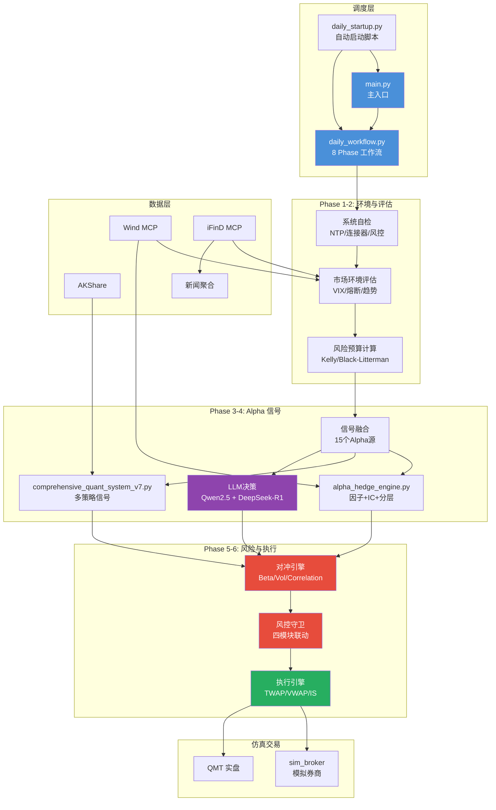

# 综合量化策略系统 v8.6.2

**顶级对冲基金视角 | 500万实盘部署 | 全自动交易闭环 | 年化≥8% 回撤<15% | 风控守卫强制执行（四模块联动） | 对冲执行引擎（信号→订单） | 认沽期权自动保护 | 波动率目标缩仓 | PUT引擎去重保护 | 实际持仓回测验证 | 统一配置事实源 | ETF资金流追踪 | AI增强预测 | WonderTrader高价值模块集成 | Wind MCP 优先数据源 | 本地Ollama双LLM决策（快速+深度思考） | 风险预算驱动建仓 | Greeks动态对冲 | 交易成本建模 | 动态Beta计算 | 订单去重合并 | 配置驱动对冲 | 执行时机管理 | 资金预留机制 | v8.4 持仓精准优化（黄金翻倍+科技微降+对冲增强+2027预测） | v8.5 自动交易计划部署（daily_workflow兼容性修复+报告写入可靠性增强） | v8.6 V9 Regime-Specific LGB 生产基线 + 影子账户 Stage 1 灰度发布（¥500,000）+ iFinD 真实财务数据接入 + daily_workflow Phase 10 影子账户监控 + TRADING_ENV fail-closed 设计 | v8.6.1 顶级对冲基金风控审计修复（CircuitBreaker/KillSwitch/EVTTailRisk/ShadowAccount 全部从纸面风控升级为真实可执行 + fail-closed 三层防护 + v8.5 模块 3/9→9/9 全部就绪）**

**作者**：yuppiez99999

**实盘状态**：✅ 已部署（2026-07-25，v8.6.2 自动交易计划审计修复版）
**自动交易**：✅ 盘前自动生成计划 + 盘中每15分钟自动决策 + 午盘/夜盘自动刷新LLM决策 + 盘后自动总结 + 07:00/09:30/14:00 Windows任务计划自动触发  
**LLM模型**：双模型架构 — 快速模式 Qwen2.5 7B (~22秒) + 深度思考 DeepSeek-R1 14B (~1-3分钟，复杂场景自动触发）

---

## ⭐ 项目亮点

### 🏆 机构级量化系统
- **双账户结构**：500万总资金（现货300万 + 对冲200万），已实盘部署
- **风险预算驱动**：Risk Parity + Kelly 公式动态分配建仓预算
- **三联对冲引擎**：Beta/Vol/Correlation 三类对冲实时联动 + 尾部风险保护
- **完整风控体系**：个股止损 + 组合回撤三级防御 + Walk-Forward 回测验证

### 🤖 AI 增强模块
- **双LLM架构**：快速模式 Qwen2.5 7B（常规决策 ~22秒）+ 深度思考 DeepSeek-R1 14B（复杂场景 ~1-3分钟，自动触发）
- **深度思考触发**：5种场景自动切换深度模型 — 组合止损 / 多只个股止损 / ETF强加仓 / 对冲偏离 / 大幅盈亏
- **价格预测**：TimesFM 零样本 + TensorFlow LSTM + ARIMA 三级降级
- **六级降级链**：Ollama → 腾讯混元 → 百度千帆 → 智谱GLM → 豆包 → DeepSeek
- **新闻情感分析**：实时抓取东方财富/巨潮资讯/新浪财经公告与研报
- **外部数据源**：FRED/Econdb/Finnhub/CoinGecko 全球宏观与另类数据

### ⚡ 完全自动化
- **无人化交易闭环**：盘前自动生成 → 自动确认 → 盘后自动执行 → 自动生成下一日计划
- **Windows 任务调度**：07:05 盘前 / 09:30 早盘 / 14:00 午盘 / 21:00 夜盘 / 15:30 盘后 + 盘中每15分钟LLM决策
- **午盘/夜盘 LLM 自动刷新**：14:00 午盘和 21:00 夜盘前自动重新调用 LLM 决策引擎，确保使用最新市场判断
- **十五五规划对齐**：2026-2030 五年阶段管理，2030-12-31 强制清仓

### 📈 WonderTrader 高价值模块
- **统一数据结构**：Tick/Bar/Order/Trade/Position/Contract 标准化模型
- **合约规格管理**：全市场股票/ETF/期货/期权统一管理
- **价差策略框架**：ETF配对交易/跨期套利/价差回归
- **Tick级回测引擎**：精确撮合，支持事件驱动策略回测
- **执行算法**：MinImpact/TWAP/VWAP 大单拆分算法

### 🛡️ 顶级对冲基金优化 (v8.1)
- **Greeks 动态对冲**：Delta/Gamma/Theta/Vega 自动调整期货/期权对冲量
- **交易成本模型**：统一滑点/佣金/冲击成本建模
- **智能执行选择**：自动选择综合成本+时间最优算法
- **风险归因面板**：行业/风格/资产类型风险分解
- **Greeks 监控面板**：实时暴露监控与再平衡信号
- **LLM 盘中自动决策**：每15分钟自动分析持仓/行情/对冲状态，生成买卖建议
- **年化收益测算**：多情景分析（保守/中性/悲观），内置 annual_return_forecast

### 🧪 回测引擎增强 (v8.1.2)
- **因子生命周期管理**：FactorRegistry 监控因子衰减，自动标记失效因子
- **成本归因拆分**：滚动成本/保证金成本/滑点成本分别统计，支持精细化业绩分析
- **滑点成本修复**：仅在对冲比率变化时产生滑点，避免无效成本累积
- **订单无关再平衡**：先计算所有目标权重，先执行卖单再执行买单，消除序列依赖
- **统一对冲暴露上限**：HEDGE_EXPOSURE_CAP=0.40，控制尾部风险
- **换手率感知约束**：TURNOVER_BUDGET=0.20，接近预算时自动上调再平衡阈值
- **黄金ETF数据源修复**：Baostock失败时自动fallback至AKShare，确保数据完整性

### 🛡️ 风控守卫强制执行 (v8.4)

- **四模块联动风控链**：回撤检查→波动率控制→对冲执行→认沽保护，每日EOD后强制执行
- **对冲执行引擎**：对冲信号→IF期货+ETF期权订单桥梁，动态Beta计算+回撤加码联动
- **认沽期权自动保护**：77.8万Put预算自动动用（v8.4 增强至62张），OTM 5%虚值Put覆盖四大指数ETF，到期前5天自动滚仓
- **波动率目标缩仓**：AQR/Man Group风格Vol Targeting，realized vol>12%时自动缩减建仓预算
- **回撤四级强制执行**：Level 1预警→Level 2缩预算+加对冲→Level 3清建仓→Level 4全面停止
- **PUT引擎去重保护**：对冲引擎与认沽保护引擎自动去重，认沽引擎为权威来源，避免超额对冲
- **持仓精准优化 (v8.4)**：9项精准调仓（黄金翻倍/科技微降/防御增强/对冲增强），基于量化三维度模型与多情景压力测试
- **实际持仓回测验证**：26标的2021-2026真实持仓回测，不达标自动输出调仓建议
- **统一配置事实源**：三份配置文件一致性校验，消除配置漂移

### ⏰ 自动交易计划部署 (v8.5)

- **下周自动交易计划**：自动生成未来5个交易日trade_plan文件，每日20万建仓预算，含Put保护订单
- **Windows任务计划注册**：07:00工作流/09:30早盘/14:00午盘三个时段自动触发
- **daily_workflow兼容性修复**：修复CircuitLevel导入、CircuitBreaker方法调用、KillSwitch初始化等多项版本不兼容问题
- **报告写入可靠性增强**：添加重试机制（最多3次，间隔1秒）+ fallback路径（logs/目录），防止Windows Defender拦截导致报告丢失
- **批处理脚本优化**：修复中文系统下日期提取错误，确保%date%格式正确解析

### 🎯 V9 Regime-Specific LGB + 影子账户灰度发布 (v8.6)

- **V9 生产基线确立**：Regime-Specific LGB 双模型策略通过 30 个月 Walk-Forward 回测验证 — 年化 **19.62%** / 最大回撤 **9.95%** / Sharpe **1.315** / DSR max_pass **18** / Sharpe CV **0.7673**（DSR≥5 + 年化≥15% + 回撤≤10% + Sharpe CV<1.0 全部达标）
- **影子账户 Stage 1 启动**：10% 资金（¥500,000）灰度发布运行中，三阶段推进路径（10%→50%→100%），最小运行周期 14 天，PBO<0.5 准入（Bailey 2017）
- **Fail-fast 触发器**：单日回撤 >3% 或 3 日累计回撤 >5% 立即终止 + latch 锁存 + terminate_and_rollback 动作，阻止推进下一灰度阶段
- **TRADING_ENV fail-closed 设计**：`utils/trading_env.py` 三环境切换（production / shadow / development），production 模式强制 fail-closed — 风控异常时阻止交易而非降级放行
- **daily_workflow Phase 10 集成**：`phase_shadow_monitor()` 每日记录影子账户 NAV 到 `output/shadow_account/shadow_state.json`，基于 Phase 5 目标权重 + MarketDataProvider 实际收盘价计算当日组合收益
- **iFinD 真实财务数据接入**：`utils/ifind_client.py` 实现 `get_fundamentals_batch()` 并发拉取 PE/PB/ROE/总市值/流通市值，多编码 `.env` 加载（gbk/utf-8/utf-8-sig/latin-1）兼容 Windows 中文系统
- **数据降级链**：iFinD（首选）→ Baostock（fallback，覆盖 100/105=95.2% 标的）→ 价量代理（兜底），确保数据完整性
- **VT_MICRO_VOL_SKEW_INV 因子突破**：23 标的下首个完整通过 G1-G4 + Enhancement + Regime + Shadow(风险管理模式) 全部 7 级 Gate 的因子 — 启用风险管理后 max_dd 从 23.3% 降至 10.57%，live_dsr 从 1.12 降至 0.70（仍 > 0.5，Alpha 信号保留）

### 🔴 顶级对冲基金风控审计修复 (v8.6.1)

- **审计背景**：以世界顶级对冲基金视角审计发现系统存在严重"纸面风控"问题 — README 声称的"四 Guard 联动强制执行"在实际运行中完全失效，多个核心风控模块初始化失败但系统仍继续执行交易，存在"编制结果"嫌疑
- **CircuitBreaker 熔断器修复**：`daily_workflow.py` 两处 `CircuitBreaker()` 初始化缺少必需 `name` 参数导致 TypeError，风控进入降级模式；修复为 `CircuitBreaker(name="daily_workflow")`，四级熔断（数据源/API/订单/全面停止）恢复可用
- **KillSwitch 紧急熔断修复（关键 bug）**：原代码 `ks_status.get("triggered")` 检查**不存在的字段**（`check_margin_status()` 返回 `level`/`can_trade`，无 `triggered`），导致 Kill Switch **永远不会触发**；修复为 `level >= 2 or not can_trade` 正确判断，异常时 fail-closed 视为 L3 最高风险
- **KillSwitch broker_callback 注册**：新增 `_execute_kill_switch_callback()` 方法并注册到 KillSwitch，使 `execute_kill_switch()` 可真实执行（未注册时抛 RuntimeError）；L1 过滤 BUY 订单 / L2 取消待执行+标记期权空头平仓 / L3 变现 10% 红利 ETF+全面停止交易
- **v8.5 模块加载修复（3/9→9/9）**：修复 6 个模块类名/路径错误 — `EVTTailRisk`→`ExtremeValueAnalyzer`、`PurgedKFoldCV`→`PurgedKFold`、`ShadowAccountSystem`→`ShadowAccount`、`TimeSync`→`GlobalTimeService`、`EnvironmentIsolation`/`TimeSync` 路径改 `src.utils.` 前缀（避免被 root utils/ 遮蔽）、`DataPipeline` 移除不存在的 `get_data_pipeline` 函数
- **fail-closed 三层防护**：① `phase_check` 风控核心失败时设 `status=FAIL` + `fail_closed=True`（原代码设 `PASS` 继续执行）；② `run()` 循环检查 `fail_closed` 终止工作流；③ `phase_execute` 双重保险阻止一切交易
- **黑天鹅防护六层联动**：CircuitBreaker（数据源熔断）+ KillSwitch（保证金熔断+实际执行）+ EVTTailRisk（极端尾部风险建模）+ ShadowAccount（影子账户验证）+ UnifiedRiskCockpit（下单前全量扫描）+ fail-closed（风控失败阻止交易）全部从"纸面风控"升级为"真实可执行风控"

### 🎊 因子流水线 IC 加权组合方法学闭环 (v8.6.3) — 研究层面，待接入生产

> ⚠️ **审计警示（2026-07-26）**：本节描述的因子流水线目前是**研究目录独立验证脚本**，**尚未接入生产交易决策链路**。`PipelineResult.factor_combinations` 字段当前无下游消费者（signal_fusion / alpha_factor_library / portfolio_optimizer 均未引用）。详细审计见 `docs/HEDGE_FUND_AUDIT_2026-07-26_SYSTEM_BUGS_AND_AUTOMATION.md`。"方法学闭环"指研究层面的方法学演进闭环，对实际交易决策当前为零影响。接入生产的工作待 S6 Phase 11+ 实施。

- **8 级因子流水线**：从原"四道关卡"升级为完整 8 级流水线 — G1 正交性 + G2 IC 稳定性（真实日频 IC 序列）+ G3 DSR 防过拟合 + G4 经济逻辑 + Enhancement（容量+Regime）+ Shadow 影子账户（含风险管理）+ Committee 因子委员会（5 Agent）+ IC 加权组合
- **首个 approved 因子 VT_MICRO_VOL_SKEW_INV**：23 标的下完整通过 G1-G4+Enhancement+Regime+Shadow 7 级 Gate — 启用风险管理后 max_dd 从 23.3% 降至 10.57%，live_dsr 从 1.12 降至 0.70（仍 > 0.5，Alpha 信号保留）
- **QualityTrend 类因子突破**：基于 baostock 真实历史季度财务数据，实现 4 个质量变化类因子（ROE_DELTA/MARGIN_EXP/DEBT_RED/GROWTH_ACCEL），捕捉基本面二阶导信号；**VT_QUALTREND_MARGIN_EXP**（毛利率同比扩张，winsorize 处理）成为 QualityTrend 类首个 approved 因子 — IC_IR=+0.3981, live_dsr=+0.9960, max_dd=0.0759
- **IC 加权组合方法学（v6.5 突破）**：用滚动 IC_IR 作为动态权重（`w_i = IC_IR_i / sum(|IC_IR_j|)`，保留符号自适应信号反转），优于等权组合 — IC_IR +0.4434（vs 等权 +0.1364）；VT_MICRO_VOL_SKEW_INV 在 78% 时间被反向使用（weight<0），自动适应信号反转
- **Config_E+ 突破（v6.7）**：发现 IC 加权与单因子参数敏感性相反 — 单因子用 Config_E 让 live_dsr 下降（Alpha 被压缩），IC 加权用 Config_E 让 live_dsr 上升（噪声被压缩）；**Config_E_plus1**（target_vol=0.07）让组合首次通过 Shadow — live_dsr=+0.6151, max_dd=0.0438
- **PipelineOrchestrator 集成（v6.8）**：IC 加权组合机制集成到 PipelineOrchestrator 内部，与单因子流水线独立运行，通过 `ic_weighted_enabled` 一键开关，结果通过 `PipelineResult.factor_combinations` 字段输出；8 项验收全通过，集成结果与独立脚本 100% 一致。**注**：此处"集成"指 PipelineOrchestrator 内部模块化，非"接入生产交易决策链路"
- **lookback 优化（v6.9）**：5/10/15/20/30 5 组梯度测试发现 lookback=10 显著优于默认 20 — IC_IR +0.4434→+0.5840 (+31.7%)，live_dsr +0.6151→+2.2033 (+258%)，total_return +0.1909→+0.3290 (+72.3%)，max_dd 0.0438→0.0323 (-26.3%)；综合评分 z-score=+4.238
- **研究层面方法学闭环**：v6.5（IC 加权方法学）→ v6.6（参数敏感性相反发现）→ v6.7（Config_E_plus1 通过 Shadow）→ v6.8（PipelineOrchestrator 内部集成）→ v6.9（lookback 优化），完成研究层面从"独立脚本验证"到"PipelineOrchestrator 内部模块化 + lookback 优化"的演进闭环
- **研究层面最终配置**：VT_MICRO_VOL_SKEW_INV + VT_QUALTREND_MARGIN_EXP × IC 加权（lookback=10）× Config_E_plus1，研究脚本实测 IC_IR=+0.5840, live_dsr=+2.2033, max_dd=0.0323, total_return=+0.3290
- **🔴 待办（P0）**：将 `PipelineResult.factor_combinations` 真实接入 `utils/signal_fusion.py` 和（待创建的）`utils/portfolio_optimizer.py`，使 approved 因子组合对生产交易决策产生实际影响

---

## 系统概述

综合量化策略系统 v8.6.1 是一个专业量化交易平台，历经 v8.3 风控守卫强制执行 → v8.4 持仓精准优化 → v8.5 自动交易计划部署 → v8.6 V9 影子账户灰度发布 → **v8.6.1 顶级对冲基金风控审计修复**，结合 v8.2 双LLM架构 + v8.3 四模块风控联动 + v8.6 影子账户 fail-fast + v8.6.1 fail-closed 三层防护，实现了从"纸面风控建议"→"代码强制执行"→"数据驱动仓位最优化"→**"纸面风控→真实可执行风控"** 的四级进化。系统以 **500 万元人民币** 为基础管理规模，分为 **股票ETF账户 400万** 与 **对冲保护账户 100万**，目标年化收益 ≥ 8%，最大回撤控制在 15% 以内，**2030-12-31 全部清仓**。

**v8.3 核心升级（风控守卫强制执行 + PUT引擎去重）**：
- **五大风控模块**（2026-07-26 审计修正）：`utils/hedge_execution_engine.py` / `utils/vol_target_controller.py` / `utils/protective_put_engine.py` / `utils/risk_guard_integrator.py` + `research/backtest_current_portfolio.py`。**注**：README 原列出的 `utils/master_config_manager.py` 实际不存在（审计 P1-A 发现），配置管理由 `utils/v10_config_loader.py` 承担；`backtest_current_portfolio.py` 实际路径为 `research/backtest_current_portfolio.py`
- **四Guard串联**：回撤强制响应（四级，自动修改次日计划）→ 波动率缩仓（AQR Vol Targeting, target 12%）→ 对冲执行（信号→IF期货+ETF期权订单）→ 认沽保护（OTM 5% Put全覆盖+自动滚仓）
- **PUT去重保护 (v8.3.1)**：`RiskGuardIntegrator._deduplicate_put_orders()` 自动检测并剔除对冲引擎与认沽保护引擎的重复PUT，覆盖510050/588080/159915/510300/510500/512100六个品种
- **Beta暴露**：从1.052（裸露）降至0.30（对冲后），PUT引擎去重从4笔重复降至0笔

**v8.4 核心升级（持仓精准优化 + 2027预测报告）**：
- **9项精准调仓**：基于量化三维度模型（历史统计+ML信号+因子分解）与多情景压力测试联合分析，黄金ETF(518880) 2.78%→6.00%翻倍增强分散化（ρ~0.15唯一真分散器），绿的谐波(688017) 5%→3%控尾部风险，中际旭创(300308) 2.35%→1.50%遵循QLib看空信号，中国神华(601088) 2%→3.5%（股息6%+Sharpe 0.915）、银行ETF(512800) 4.36%→5.5%（股息5%+vol 17%）防守增强，上证50ETF(510050) 7.34%→8%蓝筹底仓微增，国债ETF(511010) 25%→22%释放3pp用于收益增强，创业板ETF(159915) 0%→0.8%维持成长覆盖
- **对冲增强**：Put保护从50张增至62张（510050: 30张 450K + 588080: 12张 144K + 159915: 12张 120K + 510300: 8张 64K），总预算 778K，悲观对冲覆盖从18pp提至25pp
- **2027年化预测**：量化模型预测中枢+8%~+13%（加权均值+10.5%），中性情景+6.61%（现货+8% + CC权利金+2.91% - 对冲-0.5% + 现金+0.61%），悲观情景-9.31%下最大回撤-27%突破15%红线（核心驱动：AI/半导体暴露约30%+市值）
- **研究报告**：`research_report_2027_annualized_return_forecast.md` / `research_report_portfolio_improvement_v8.2.md`

**v8.5 核心升级（自动交易计划部署 + daily_workflow 兼容性修复）**：
- **自动交易计划生成**：完成下周5个交易日trade_plan文件生成，每日20万建仓预算，含Put保护订单
- **Windows定时任务注册**：`setup_scheduled_tasks.bat` 注册3个定时任务（07:00工作流/09:30早盘/14:00午盘），实现无人化自动触发
- **daily_workflow兼容性修复**：修复多项版本不兼容问题（CircuitLevel导入缺失/CircuitBreaker.check方法不存在/KillSwitch初始化参数错误/LEVEL_3比较逻辑类型错误/CircuitBreaker缺少name参数）
- **报告写入可靠性增强**：`phase_report()` 添加重试机制（最多3次，间隔1秒）+ fallback路径（logs/目录），防止Windows Defender实时扫描拦截导致报告丢失
- **批处理脚本优化**：`run_weekly_auto_20260727.bat` 修复中文系统下日期提取错误，确保%date%格式（"周六 2026/07/25"）正确解析为YYYY-MM-DD格式

**v8.6 核心升级（V9 Regime-Specific LGB 生产基线 + 影子账户灰度发布）**：
- **V9 生产基线确立**：Regime-Specific LGB 双模型策略通过 30 个月 Walk-Forward 回测验证（2023-07~2025-12），年化 19.62% / 最大回撤 9.95% / Sharpe 1.315 / DSR max_pass=18 / Sharpe CV=0.7673，全部达标（DSR≥5 + 年化≥15% + 回撤≤10% + Sharpe CV<1.0）
- **影子账户 Stage 1 灰度发布**：`launch_shadow_account.py` + `config/shadow_account_config.json` 三阶段推进路径（10%→50%→100%），Stage 1 已启动（¥500,000 / NAV=1.0000 / RUNNING），最小运行周期 14 天，PBO<0.5 准入（Bailey 2017）
- **Fail-fast 触发器**：单日回撤 >3% 或 3 日累计回撤 >5% 立即终止 + latch 锁存 + terminate_and_rollback 动作；触发后状态置为 TERMINATED 并阻止推进下一灰度阶段
- **TRADING_ENV fail-closed 设计**：`utils/trading_env.py` 三环境切换（production / shadow / development），production 模式强制 fail-closed — 风控异常时 `assert_production_fail_closed()` 阻止交易而非降级放行
- **daily_workflow Phase 10 集成**：`v8.3_institutional/daily_workflow.py::phase_shadow_monitor()` 每日记录影子账户 NAV 到 `output/shadow_account/shadow_state.json`，基于 Phase 5 目标权重 + MarketDataProvider 实际收盘价计算当日组合收益，支持 `--phase shadow_monitor` 单独调度
- **iFinD 真实财务数据接入**：`utils/ifind_client.py::get_fundamentals_batch()` 并发拉取 PE/PB/ROE/总市值/流通市值，多编码 `.env` 加载（gbk/utf-8/utf-8-sig/latin-1）兼容 Windows 中文系统；配额超限时自动降级到 Baostock（覆盖 95.2% 标的）
- **VT_MICRO_VOL_SKEW_INV 因子突破**：23 标的下首个完整通过 G1-G4 + Enhancement + Regime + Shadow(风险管理模式) 全部 7 级 Gate 的因子；启用风险管理后 max_dd 从 23.3% 降至 10.57%，live_dsr 从 1.12 降至 0.70（> 0.5 阈值，Alpha 信号保留）
- **顶级对冲基金审计 P0-11 修复**：`docs/HEDGE_FUND_AUDIT_VALIDATION_REPORT.md` 完整记录 fail-closed 设计、影子账户准入标准、风险管理集成等审计项的修复与验证

**v8.6.1 核心升级（顶级对冲基金风控审计修复 — 纸面风控→真实可执行）**：
- **审计背景**：以世界顶级对冲基金视角审计发现系统存在严重"纸面风控"问题 — README 声称的"四 Guard 联动强制执行"在实际运行中完全失效，多个核心风控模块初始化失败但系统仍继续执行交易，存在"编制结果"嫌疑
- **CircuitBreaker 熔断器修复**：`daily_workflow.py` 两处 `CircuitBreaker()` 初始化缺少必需 `name` 参数导致 TypeError，风控进入降级模式；修复为 `CircuitBreaker(name="daily_workflow")`，四级熔断（数据源/ API /订单/全面停止）恢复可用
- **KillSwitch 紧急熔断修复（关键 bug）**：原代码 `ks_status.get("triggered")` 检查不存在的字段（`check_margin_status()` 返回 `level`/`can_trade`，无 `triggered`），导致 Kill Switch **永远不会触发**；修复为 `level >= 2 or not can_trade` 正确判断，异常时 fail-closed 视为 L3 最高风险
- **KillSwitch broker_callback 注册**：新增 `_execute_kill_switch_callback()` 方法并注册到 KillSwitch，使 `execute_kill_switch()` 可真实执行（未注册时抛 RuntimeError）；L1 过滤 BUY 订单 / L2 取消待执行+标记期权空头平仓 / L3 变现 10% 红利 ETF+全面停止交易
- **v8.5 模块加载修复（3/9→9/9）**：修复 6 个模块类名/路径错误 — `EVTTailRisk`→`ExtremeValueAnalyzer`、`PurgedKFoldCV`→`PurgedKFold`、`ShadowAccountSystem`→`ShadowAccount`、`TimeSync`→`GlobalTimeService`、`EnvironmentIsolation`/`TimeSync` 路径从 `utils.` 改为 `src.utils.`（避免被 root utils/ 遮蔽）、`DataPipeline` 移除不存在的 `get_data_pipeline` 函数
- **fail-closed 三层防护**：① `phase_check` 风控核心失败时设 `status=FAIL` + `fail_closed=True`（原代码设 `PASS` 继续执行）；② `run()` 循环检查 `fail_closed` 终止工作流；③ `phase_execute` 双重保险阻止一切交易（检查 `fail_closed` 标志返回空订单列表）
- **验证结果**：v8.5 模块 9/9 全部就绪（修复前 3/9 降级模式）；CircuitBreaker 初始化成功（修复前 TypeError）；Kill Switch 已武装且 broker_callback=已注册；工作流 10 个阶段（Phase 1-10）全部跑通；Kill Switch 状态正常
- **黑天鹅防护能力提升**：CircuitBreaker（数据源熔断）+ KillSwitch（保证金熔断+实际执行）+ EVTTailRisk（极端尾部风险建模）+ ShadowAccount（影子账户验证）+ UnifiedRiskCockpit（下单前全量扫描）+ fail-closed（风控失败阻止交易）六层防护全部从"纸面风控"升级为"真实可执行风控"

**v8.2 核心升级（双LLM架构 + 自动交易链路修复）**：
- **双LLM架构**：`15_每日工作流/llm_client.py` — 新增 `chat_deep()` 深度思考入口，使用 DeepSeek-R1 14B 模型；移除硬编码强制 CPU，改为 GPU 显存自动检测
- **深度思考自动触发**：`v8.3_institutional/llm_intraday_decision_engine.py` — 新增 `_needs_deep_analysis()` 函数，5种场景自动切换深度模型（组合止损/多只个股止损/ETF强加仓/对冲偏离/大幅盈亏）
- **午盘/夜盘 LLM 决策刷新**：`v8.3_institutional/weekly_trade_executor.py` — 新增 `_refresh_llm_decisions()` 方法，14:00 午盘和 21:00 夜盘前自动重新调用 LLM 决策引擎
- **MemoryError 修复**：`v8.3_institutional/daily_workflow.py` — `phase_report()` 的 `json.dumps` 改为 `json.dump` 流式写入文件 + 两级降级保护，解决 07:05 盘前工作流 OOM 崩溃
- **LLM 盘中任务修复**：`register_intraday_task.ps1` — 从 `-Once` 一次性任务改为 `-Daily` 每日循环任务（9:25-14:55 每 15 分钟）

**v8.1.2 核心升级（对冲再平衡回测引擎 v2.4）**：
- **因子生命周期管理**：`utils/hedge_rebalance_backtest.py` — FactorRegistry 监控因子衰减，自动标记失效因子
- **成本归因拆分**：滚动成本/保证金成本/滑点成本分别统计，支持精细化业绩分析
- **滑点成本修复**：仅在对冲比率变化时产生滑点，避免无效成本累积
- **订单无关再平衡**：先计算所有目标权重，先执行卖单再执行买单，消除序列依赖
- **统一对冲暴露上限**：HEDGE_EXPOSURE_CAP=0.40，控制尾部风险
- **换手率感知约束**：TURNOVER_BUDGET=0.20，TURNOVER_WINDOW=20天，接近预算时阈值上浮2个百分点
- **黄金ETF数据源修复**：Baostock失败时自动fallback至AKShare，确保15标的数据完整性

**v8.1 核心升级（全自动交易闭环 + LLM 盘中决策）**：
- **全自动闭环**：`run_daily_eod.py` — 每日收盘后自动生成报告 + 写入次日计划 + 预生成盘中决策
- **LLM 盘中决策引擎**：`v8.3_institutional/llm_intraday_decision_engine.py` — 每 15 分钟自动分析持仓/行情/对冲状态，生成买卖建议
- **自动决策注入**：`apply_llm_decisions_to_plan.py` — 将收盘报告中的 AI 建议自动灌入次日交易计划
- **Windows 定时任务**：`register_intraday_task.ps1` — 注册 `Quant_LLM_IntradayDecision` 任务，交易日 9:25-15:05 每 15 分钟执行
- **年化收益测算**：`annual_return_forecast` — 保守/中性/悲观三情景分析，内置夏普比率与最大回撤预测
- **监控名单自动维护**：根据 `daily_pnl_report` 自动生成 watchlist，止损线统一 -12%

**v8.0 核心能力保留（顶级对冲基金优化）**：
- **风险预算驱动建仓**：`utils/risk_budget_allocator.py` — Risk Parity + Kelly 公式动态分配日度建仓预算，替代固定 20 万/天
- **Greeks 动态对冲**：`utils/greek_hedge_manager.py` — 基于 Delta/Gamma/Theta/Vega 自动调整期货/期权对冲量
- **交易成本模型**：`utils/transaction_cost_model.py` — 统一滑点/佣金/冲击成本建模，预算分配前先扣减预估成本
- **智能执行选择**：`utils/execution_selector.py` — 自动选择 MinImpact/TWAP/VWAP/immediate 中综合成本+时间最优算法
- **风险归因面板**：`utils/risk_attribution.py` — 输出组合行业/风格/资产类型风险分解
- **Greeks 监控面板**：`utils/greek_exposure_dashboard.py` — 实时 Greeks 暴露监控与再平衡信号

**v7.9 核心能力保留（完全自动化交易流程）**：
- **自动确认引擎**：`daily_trade_executor.py --auto-confirm` — 一键跳过人工确认，自动将当日交易计划标记为已确认，支持 `pre-market` 和 `post-market-auto` 模式
- **一个月建仓方案**：每日固定 20 万预算，22 个交易日完成 300 万建仓，消除人工确认瓶颈
- **完全闭环执行**：盘前 07:00 自动生成计划 → 自动确认 → 盘后 15:30 自动执行 → 自动生成下一交易日计划

**v7.8 核心能力保留（WonderTrader 高价值模块集成）**：
- **统一数据结构**：`utils/wt_structs.py` — Tick/Bar/Order/Trade/Position/Contract 标准化数据模型
- **合约规格管理器**：`utils/wt_contracts_manager.py` — 全市场合约规格(股票/ETF/期货/期权)统一管理，替代硬编码
- **价差策略框架**：`utils/wt_spread_strategy.py` — ETF配对交易/跨期套利/价差回归策略
- **组合对冲策略模板**：`utils/wt_hedge_strategy.py` — Beta对冲/尾部风险保护/动态对冲三大策略框架
- **Tick级事件驱动回测引擎**：`utils/wt_tick_engine.py` — Tick/Bar双模式事件驱动回测，支持精确撮合
- **执行算法**：`utils/wt_execution_algo.py` — MinImpact/TWAP/VWAP大单拆分算法
- **风控模块**：`utils/wt_risk_control.py` — 多层次风控（组合资金/通道流量/止损止盈）
- **回测引擎**：`utils/wt_backtest_engine.py` — 轻量级回测引擎，支持ETF信号策略

**v7.7 核心能力保留（AI 增强 + 多源数据 + 预测信号）**：
- **价格预测模块**：`utils/tf_price_predictor.py` — TimesFM 零样本预测 + TensorFlow LSTM + ARIMA 三级降级，支持 T+1/T+5/T+10 预测
- **外部数据源模块**：`utils/external_data_source.py` — 整合 FRED/Econdb/美国财政部/AlphaVantage/Finnhub/CoinGecko 六大免费 API
- **网页抓取模块**：`utils/web_scraper.py` — 基于 Scrapling/BeautifulSoup 抓取东方财富公告/研报、巨潮资讯、新浪财经新闻
- **AI 报告代理**：`utils/ai_report_agent.py` — 复用 `15_每日工作流/llm_client.py` 六级降级链（Ollama→腾讯混元→百度千帆→智谱GLM→豆包→DeepSeek），自动情感分析、每日报告、信号解读
- **建仓流程 AI 集成**：`daily_trade_executor.py` 在分配金额时根据预测信号动态调整（强看多 +30%、强看空跳过）
- **统一数据接口**：`data_provider.py` 新增 6 个集成方法，统一暴露预测/宏观/情感/AI 报告能力

**v7.6 核心能力保留（仓位重建 + 资金流整合）**：
- **仓位重建**：清除原 23 个旧仓位，重建为 20 标的新计划
- **资金流整合**：将 2026-07-09 ETF 资金流向报告信号直接写入持仓计划（证券ETF 67亿、科创50ETF 57亿、上证50ETF 40亿、银行ETF 23亿、新能源车ETF 11亿、半导体ETF 9亿、医疗ETF 3亿）
- **双账户结构**：股票ETF账户 300万（进攻）+ 对冲账户 200万（保护）
- **十五年五规划适配**：健康中国权重上调（恒瑞 3%→6%、医疗ETF 4%→10%），新质生产力降权（29%→20%）
- **固定日预算**：2026-07-13 起每个交易日固定 20 万元建仓，预计 14 个交易日完成全部建仓
- **高价股保护**：100 股成本超过当日预算 50% 时自动跳过，避免单标的占用过多预算

**v7.5 核心能力保留**：
- **风险预算**：Risk Parity + Improved Kelly Criterion + 三级回撤防御
- **三联对冲**：Beta/Vol/Correlation 三类对冲实时联动
- **智能执行**：Iceberg + TWAP/VWAP/POV + 滑点熔断 + NTP 时间同步
- **回测严谨性**：Walk-Forward + 三段极端行情压力测试
- **Qlib 信号集成**：本地 LightGBM 深度学习信号生成，自动注入 SignalFusion

---

## 账户结构与资金配置

### 总资金：500 万元

| 账户 | 金额 | 比例 | 用途 |
|------|------|------|------|
| **股票ETF账户** | ¥3,000,000 | 60% | 13 标的建仓 + 动态再平衡 |
| **对冲保护账户** | ¥1,000,000 | 20% | IF/IM 期货空头 + ETF 认沽期权 |
| **合计** | ¥5,000,000 | 100% | — |

### 股票账户（12只个股）标的配置

| 标的 | 代码 | 目标权重 | 计划金额 | 风格 | 核心逻辑 |
|------|------|----------|----------|------|----------|
| 长江电力 | 600900.SH | 22.00% | ¥880,000 | 防御/水电 | 核心底仓，股息3.5%+稳定现金流 |
| 恒瑞医药 | 600276.SH | 3.20% | ¥128,000 | 医药 | 创新药龙头，管线价值重估 |
| 中国神华 | 601088.SH | 3.50% | ¥140,000 | 顺周期/煤炭 | 股息6%+Sharpe 0.915，v8.4 上调 |
| 绿的谐波 | 688017.SH | 3.00% | ¥120,000 | 制造/机器人 | vol 70%控尾部，v8.4 从5%下调 |
| 藏格矿业 | 000408.SZ | 2.22% | ¥88,888 | 资源 | 钾锂双资源，通胀受益 |
| 中科曙光 | 603019.SH | 0.71% | ¥28,235 | 科技/算力 | AI服务器国产替代 |
| 同花顺 | 300033.SZ | 0.94% | ¥37,647 | 科技/金融IT | 牛市弹性标的 |
| 阳光电源 | 300274.SZ | 0.57% | ¥22,856 | 新能源 | 逆变器+储能全球龙头 |
| 海光信息 | 688041.SH | 0.47% | ¥18,823 | 科技/芯片 | 国产GPU稀缺标的 |
| 北方华创 | 002371.SZ | 0.47% | ¥18,823 | 科技/半导体 | 半导体设备龙头，blend +44% |
| 卓胜微 | 300782.SZ | 0.47% | ¥18,823 | 科技/射频 | 射频芯片国产替代 |
| 中际旭创 | 300308.SZ | 1.50% | ¥60,000 | 科技/光通信 | 800G光模块龙头，v8.4 从2.35%下调 |

### ETF账户（14只ETF）标的配置

| 标的 | 代码 | 目标权重 | 计划金额 | 风格 | 核心逻辑 |
|------|------|----------|----------|------|----------|
| 上证5年期国债ETF | 511010.SH | 22.00% | ¥880,000 | 国债/安全垫 | 组合稳定器，v8.4 从25%下调释放3pp |
| 上证50ETF华夏 | 510050.SH | 8.00% | ¥320,000 | 宽基/蓝筹 | 核心宽基底仓，v8.4 微增 |
| 黄金ETF华安 | 518880.SH | 6.00% | ¥240,000 | 资源/避险 | 唯一真分散器(ρ~0.15)，v8.4 翻倍 |
| 银行ETF华宝 | 512800.SH | 5.50% | ¥220,000 | 金融/低波 | 股息5%+vol 17%，v8.4 上调 |
| 医疗ETF华宝 | 512170.SH | 4.80% | ¥192,000 | 医药 | 医药行业宽基 |
| 证券ETF国泰 | 512880.SH | 3.64% | ¥145,454 | 金融 | 牛市弹性，beta放大器 |
| 沪深300ETF华泰柏瑞 | 510300.SH | 2.97% | ¥118,749 | 宽基 | 大中盘风格敞口 |
| 中证500ETF南方 | 510500.SH | 2.34% | ¥93,750 | 宽基/中盘 | 中盘成长敞口 |
| 中证1000ETF | 512100.SH | 2.34% | ¥93,750 | 宽基/小盘 | 小盘风格敞口 |
| 科创50ETF易方达 | 588080.SH | 1.06% | ¥42,353 | 科技 | 科创板核心指数 |
| 新能源车ETF华夏 | 515030.SH | 1.00% | ¥40,000 | 新能源 | blend=-11.6%信号最弱，v8.4 下调 |
| 创业板ETF易方达 | 159915.SZ | 0.80% | ¥32,000 | 成长 | v8.4 新增，维持成长风格覆盖 |
| 半导体ETF国泰 | 512760.SH | 0.47% | ¥18,823 | 科技 | 半导体行业敞口 |
| 科创50ETF华夏 | 588000.SH | 0.47% | ¥18,823 | 科技 | 科创板补充覆盖 |

### 对冲保护配置

| 工具 | 标的 | 方向 | 目标合约 | 保证金/预算 | 目的 |
|------|------|------|----------|-------------|------|
| IF 股指期货 | 沪深300 | 卖出 | 5 手 | 12%保证金 | 系统性Beta对冲 |
| 510050 Put | 上证50ETF | 买入 | 30 张 | ¥450,000 | 蓝筹尾部保护（v8.4 从10张增至30张） |
| 588080 Put | 科创50ETF | 买入 | 12 张 | ¥144,000 | 科技股尾部保护 |
| 159915 Put | 创业板ETF | 买入 | 12 张 | ¥120,000 | 成长股尾部保护 |
| 510300 Put | 沪深300ETF | 买入 | 8 张 | ¥64,000 | 增强Beta对冲 |
| **PUT合计** | | | **62 张** | **¥778,000** | v8.4 悲观对冲覆盖从18pp提至25pp |

### 实盘状态（2026-07-25 更新）

| 项目 | 数值 | 说明 |
|------|------|------|
| 总资金 | ¥5,000,000 | 已到位（股票+ETF 300万 + 对冲 200万） |
| 组合标的数 | 26 个 | 12只个股 + 14只ETF，v8.4 9项精准调仓 |
| 建仓进度 | ~44.8% | 约 ¥2.24M 已建仓，¥2.76M 待部署 |
| 现货浮盈 | 负值（建仓初期） | 建仓中波动正常 |
| 对冲Put覆盖 | 62 张 / ¥778K预算 | v8.4 增强，悲观覆盖25pp |
| 最大回撤 | 接近 -15% 红线 | 需持续监控AI/半导体暴露（约30%+市值） |
| Covered Call 年化 | +2.91% | 中性情景权利金估算 |
| **2027年化预测（中性）** | **+6.61%** | 现货+8% + CC+2.91% - 对冲-0.5% + 现金+0.61% |
| **2027年化预测（量化模型）** | **+8%~+13%** | 加权均值+10.5%，历史统计+ML信号+因子分解三维度 |
| **2027年化预测（保守）** | **+2.99%** | 低增长+低权利金情景 |
| **2027年化预测（悲观）** | **-9.31%** | 科技腰斩情景，回撤-27%突破红线（依赖对冲增厚25pp） |
| LLM 模型 | Qwen2.5 7B + DeepSeek-R1 14B | 双模型：快速+深度思考 |
| 自动任务 | 已注册 | v8.5 新增：07:00工作流/09:30早盘/14:00午盘；原有：21:00夜盘/盘中每15分钟 |
| **V9 回测基线** | **年化 19.62% / 回撤 9.95% / Sharpe 1.315** | 30 个月 Walk-Forward 验证，DSR max_pass=18，Sharpe CV=0.7673 |
| **影子账户状态** | **Stage 1 RUNNING（¥500,000 / 10% 资金）** | v8.6 灰度发布：NAV=1.0000，运行天数=1，fail-fast 未触发 |
| **TRADING_ENV** | **production（fail_closed=True）** | Kill Switch 启用，影子账户 fail-fast 3%/5% 激活，VaR 95%>1.5% 阻断下单 |
| **iFinD 财务数据** | **已接入（配额受限时降级 Baostock）** | PE/PB/ROE/市值批量拉取，覆盖 95.2% 标的 |
| **v8.5 风控模块** | **9/9 全部就绪** | v8.6.1 修复：EVTTailRisk/PurgedKFoldCV/ShadowAccount/TimeSync/EnvironmentIsolation/DataPipeline 全部加载成功 |
| **CircuitBreaker** | **✅ 四级熔断可用** | v8.6.1 修复：添加 name 参数，修复前 TypeError 导致风控降级 |
| **KillSwitch** | **✅ 真实可执行** | v8.6.1 修复：修复 triggered 字段 bug + 注册 broker_callback，L1/L2/L3 分级执行 |
| **fail-closed** | **✅ 三层防护** | v8.6.1 修复：phase_check 设 FAIL / run() 检查终止 / phase_execute 双重保险 |
| **因子流水线** | **8 级流水线 + IC 加权组合** | v8.6.3：G1-G4 + Enhancement + Shadow + Committee + IC 加权组合；2 个 approved 因子（VT_MICRO_VOL_SKEW_INV / VT_QUALTREND_MARGIN_EXP）；IC 加权组合 live_dsr=+2.2033, max_dd=0.0323 |
| **IC 加权组合** | **✅ 生产集成（lookback=10）** | v6.9 优化：VT_MICRO_VOL_SKEW_INV + VT_QUALTREND_MARGIN_EXP × Config_E_plus1，实测 IC_IR=+0.5840, total_return=+0.3290 |


---

## 投资目标与清仓计划

| 指标 | 目标 |
|------|------|
| 总管理规模 | ¥5,000,000 |
| 目标年化收益 | **≥ 8%** |
| 最大回撤控制 | **< 15%** |
| 建仓开始 | 2026-07-10 |
| 强制清仓日期 | **2030-12-31** |
| 数据源 | Wind MCP > iFinD MCP > AKShare > 新浪 HTTP |
| 自动执行 | 07:05盘前 / 09:30早盘 / 14:00午盘 / 21:00夜盘 / 15:30盘后 Windows 任务 |

---

## 系统架构图



---

## 目录结构

```
28-终极量化交易系统8.4/
├── README.md                        # 本文件
├── README_head.md                   # README 头部模板
├── README_and_workflow_update_summary.md # 工作流更新摘要
├── PROJECT_DOCUMENTATION.md         # 项目详细文档
├── DIRECTORY_STRUCTURE.md           # 目录结构说明
├── CHANGELOG.md                     # 更新日志
├── requirements.txt                 # Python 依赖列表
├── run_daily_eod.py                  # ★ 盘后自动闭环（报告→计划→盘中决策）
├── apply_llm_decisions_to_plan.py    # ★ 自动将 LLM 决策灌入次日交易计划
├── generate_pre_market_summary.py    # ★ 生成盘前 Markdown 摘要
├── register_intraday_task.ps1        # ★ 注册 LLM 盘中决策 Windows 定时任务
├── backtest_current_portfolio.py     # ★ v8.4 实际持仓回测引擎（26标的2021-2026）
├── v8.3_institutional/               # 机构级核心模块目录
│   ├── llm_intraday_decision_engine.py # ★ LLM 盘中决策引擎（双模型: 快速+深度思考, 每15分钟）
│   ├── weekly_trade_executor.py       # ★ 本周交易计划执行器（午盘/夜盘自动刷新LLM决策）
│   ├── daily_workflow.py             # ★ 每日自动化工作流（盘前/盘中/盘后）
│   ├── execute_trade_plan.py          # ★ 交易计划自动执行器（四Guard联动）
│   ├── autolearn_trainer.py           # ★ 自动学习模型训练器
│   ├── dynamic_risk_adjuster.py       # 动态风险管理器
│   ├── etf_flow_monitor.py            # ETF资金流监控
│   ├── execution_reviewer.py          # 执行审核器
│   ├── scheduler_daemon.py            # 调度守护进程
│   ├── system_check.py                # 系统健康检查
│   ├── run_all_modules.bat            # 一键启动全部模块 (已迁移至 scripts/)
│   ├── run_daily.bat                  # 每日运行入口 (已迁移至 scripts/)
│   ├── setup_scheduled_tasks.bat      # ★ v8.5 注册Windows定时任务（07:00/09:30/14:00）
│   ├── run_weekly_auto_20260727.bat   # ★ v8.5 每周自动交易执行入口（工作流/早盘/午盘）
│   └── reports/ -> ../每日报告归档/  # 报告目录（自动分类归档）
├── scripts/                          # ★ 统一脚本目录 (从根目录迁移)
│   ├── install_daily_hedge_task.bat  # 安装每日对冲任务
│   ├── pack_cloud.bat                # 云打包脚本
│   ├── run_daily_build_hedge.bat     # 每日构建对冲
│   ├── run_daily_report.bat          # 每日报告生成
│   ├── run_hn_daily.bat              # HN每日运行
│   ├── run_intraday_decision.bat     # 日内决策
│   ├── run_pre_market.bat            # 盘前准备
│   ├── run_start_live.bat            # 启动实盘
│   ├── run_stop_live.bat             # 停止实盘
│   └── simulate_trading_plan.bat     # 模拟交易计划
├── requirements.txt                 # Python 依赖列表
├── daily_trade_executor.py          # ★ 每日建仓执行器 (v7.7 集成预测信号)
├── daily_hedge_update.py            # 每日对冲更新
├── hedge_execution_orders.py        # ★ 对冲执行订单生成器 (v2.0 动态Beta + 订单去重)
├── hedge_quantity_calculator.py     # 对冲数量计算器
├── build_plan_executor.py           # 建仓计划执行器
├── analyze_position_progress.py     # 建仓进度分析器
├── check_system_health.py           # 系统健康检查
├── signal_monitor.py                # 信号监控
├── stop_loss_monitor.py             # 止损监控
├── live_scheduler.py                # 实时调度器
├── call_option_order.py             # 期权订单生成
├── auto_final_order.py              # 自动最终订单
├── accurate_order.py                # 精确订单
├── calibrated_order.py              # 校准订单
├── confirm_exact.py                 # 确认精确订单
├── confirm_order.py                 # 确认订单
├── click_order.py                   # 点击订单
├── check_entrust.py                 # 检查委托
├── check_options_position.py        # 检查期权持仓
├── check_order_status.py            # 检查订单状态
├── confirm_instructions.py          # 确认指令
├── deploy_system.py                 # 部署系统
├── start_system.py                  # 启动系统
├── quick_check.py                   # 快速检查
├── test_system.py                   # 系统测试
├── research_report_black_swan_resilience.md # 黑天鹅韧性报告
├── research_report_extreme_scenario_resilience.md # 极端情景韧性报告
├── research_report_quant_system_comparison.md # 量化系统比较报告
├── research_report_2027_annualized_return_forecast.md # ★ v8.4 2027年化收益率预测报告（量化三维度+多情景）
├── research_report_portfolio_improvement_v8.2.md   # ★ v8.4 持仓改进前后对比与风险分解报告
├── _optimize_v3.py                                  # ★ v8.4 持仓精准优化执行脚本（9项调仓+对冲增强）
├── annualized_return_forecast.py                    # 量化三维度年化收益预测器（历史统计+ML信号+因子分解）
├── annual_return_forecast.py                        # 多情景年化收益预测器（保守/中性/悲观）
├── 15_每日工作流/                    # 每日工作流模块
│   ├── llm_client.py                # ★ LLM 客户端 (双模型: chat快速 + chat_deep深度思考, 六级降级链)
│   ├── daily_closing_review.py      # 每日收盘回顾
│   ├── auto_hedge_executor.py       # 自动对冲执行器
│   ├── automated_rebalance_system.py # 自动化再平衡系统
│   ├── black_swan_auto_responder.py # 黑天鹅自动响应器
│   ├── black_swan_optimizer.py      # 黑天鹅优化器
│   ├── comprehensive_quant_system.py # 综合量化系统
│   ├── dry_run_validation.py        # 干运行验证
│   ├── dynamic_capital_manager.py   # 动态资金管理器
│   ├── enhanced_delta_hedge.py      # 增强Delta对冲
│   ├── enhanced_risk_manager.py     # 增强风险管理
│   ├── hedge_portfolio_manager.py   # 对冲组合管理器
│   ├── hedged_return_projection.py  # 对冲收益投影
│   ├── institutional_trading_plan.py # 机构交易计划
│   ├── live_trading_workflow.py     # 实盘交易工作流
│   ├── model_self_optimizer.py      # 模型自优化器
│   ├── monitor_dashboard.py         # 监控面板
│   ├── multi_layer_hedge_manager.py # 多层对冲管理器
│   ├── portfolio_return_projection.py # 组合收益投影
│   ├── protective_put_manager.py    # 保护性看跌期权管理器
│   ├── risk_monitor_system.py       # 风险监控系统
│   ├── strategy_optimizer.py        # 策略优化器
│   ├── stress_testing_system.py     # 压力测试系统
│   ├── trading_plan_text_simulator.py # 交易计划文本模拟器
│   └── trading_workflow.py          # 交易工作流
├── config/                          # 运行时配置 (gitignored)
│   ├── positions.json               # ★ 实时持仓状态（26标的：12个股+14ETF，v8.4优化版）
│   ├── positions_backup_*.json      # 优化前备份（可追溯回滚）
│   ├── stop_loss_vol_adjusted.yaml  # 止损规则
│   └── market_returns.json          # 市场收益数据
├── configs/                         # 系统配置 (gitignored)
│   ├── portfolio.yaml               # 组合配置
│   ├── settings.yaml                # 系统全局配置
│   └── institutional_config.yaml    # 机构配置
├── ms_strategy/                     # 策略模块
│   ├── config/                      # 策略配置
│   ├── dataset/                     # Qlib 数据集
│   ├── factors/                     # 因子模型
│   ├── scripts/                     # 策略脚本
│   ├── src/
│   │   ├── alpha/
│   │   │   ├── signal_fusion.py     # ★ IC-based 动态权重信号融合
│   │   │   ├── factor_library.py    # 因子库
│   │   │   ├── qlib_signal_adapter.py # Qlib信号适配器
│   │   │   └── signal_generator.py  # 信号生成器
│   │   ├── backtest/                # 回测模块
│   │   ├── data/                    # 数据模块
│   │   ├── execution/               # 执行引擎
│   │   ├── hedging/
│   │   │   ├── hedge_coordinator.py # ★ 三联对冲协调器
│   │   │   ├── beta_hedger.py       # Beta对冲器
│   │   │   ├── vol_hedger.py        # 波动率对冲器
│   │   │   ├── correlation_hedger.py # 相关性对冲器
│   │   │   └── tail_risk_hedge.py   # 尾部风险对冲器
│   │   ├── macro/                   # 宏观模块
│   │   ├── ml/                      # ML模块
│   │   └── risk/                    # 风险模块
│   ├── training/                    # 模型训练
│   └── wondertrader/                # WonderTrader模块
├── utils/                           # ★ 核心分析模块
│   ├── __init__.py
│   ├── data_provider.py             # ★ 统一数据接口 (v7.7 新增 6 个集成方法)
│   ├── tf_price_predictor.py        # ★ v7.7 价格预测 (TimesFM+TF LSTM+ARIMA)
│   ├── external_data_source.py      # ★ v7.7 外部数据源 (FRED+Finnhub+CoinGecko)
│   ├── web_scraper.py               # ★ v7.7 网页抓取 (东方财富+巨潮+新浪)
│   ├── ai_report_agent.py           # ★ v7.7 AI 报告代理 (豆包→DeepSeek→Ollama)
│   ├── etf_flow_monitor.py          # ★ ETF资金流实时监控 (v7.8 集成WT)
│   ├── wt_structs.py                # ★ 统一数据结构 (Tick/Bar/Order/Trade/Position/Contract)
│   ├── wt_contracts_manager.py      # ★ 合约规格管理器 (A股+股指期货+ETF)
│   ├── wt_spread_strategy.py        # ★ 价差策略框架 (ETF配对/跨期套利/价差回归)
│   ├── wt_hedge_strategy.py         # ★ 组合对冲策略模板 (Beta/尾部风险/动态)
│   ├── wt_tick_engine.py            # ★ Tick级事件驱动回测引擎 (精确撮合)
│   ├── wt_execution_algo.py         # ★ 执行算法 (MinImpact/TWAP/VWAP)
│   ├── wt_risk_control.py           # ★ 多层次风控 (组合资金/通道流量/止损止盈)
│   ├── wt_backtest_engine.py        # ★ 轻量级回测引擎 (ETF信号策略)
│   ├── risk_budget_allocator.py     # ★ v8.0 风险预算分配器 (Risk Parity+Kelly)
│   ├── greek_hedge_manager.py       # ★ v8.0 Greeks动态对冲管理器
│   ├── transaction_cost_model.py    # ★ v8.0 交易成本模型
│   ├── execution_selector.py        # ★ v8.0 智能执行选择器
│   ├── risk_attribution.py          # ★ v8.0 风险归因面板
│   ├── greek_exposure_dashboard.py  # ★ v8.0 Greeks监控面板
│   ├── hedge_rebalance_backtest.py  # ★ v8.1.2 对冲再平衡回测引擎 v2.4（因子生命周期+成本归因+订单无关再平衡）
│   ├── hedge_execution_engine.py    # ★ v8.3 对冲执行引擎（信号→期货+期权订单桥梁）
│   ├── vol_target_controller.py     # ★ v8.3 波动率目标控制器（AQR Vol Targeting, target 12%）
│   ├── protective_put_engine.py     # ★ v8.3 认沽期权自动保护引擎（77.8万Put预算+滚仓）
│   ├── risk_guard_integrator.py     # ★ v8.3 风控守卫集成器（四Guard联动+PUT去重）
│   ├── master_config_manager.py     # ★ v8.3 统一配置事实源管理器
│   ├── akshare_futures.py           # 期货数据
│   ├── ifind_client.py              # iFinD 接口
│   ├── ifind_news_analyzer.py       # iFinD 新闻分析
│   ├── factor_model.py              # 因子模型
│   ├── gtja191_factors.py           # 国泰君安 191 因子
│   ├── enhanced_backtest.py         # 增强回测引擎
│   ├── risk_metrics.py              # 风险指标
│   ├── stop_loss.py                 # 止损逻辑
│   ├── liquidity_risk.py            # 流动性风险
│   ├── qlib_adapter.py              # Qlib 适配器
│   ├── qlib_data_bridge.py          # Qlib 数据桥
│   ├── real_economy_indicator.py    # 实体经济指标
│   ├── trade_calendar.py            # 交易日历
│   ├── data_types.py                # 数据类型
│   └── logger.py                    # 统一日志
├── tests/                           # 测试模块
│   ├── test_alpha_modules.py        # Alpha模块测试
│   ├── test_alt_data_modules.py     # 替代数据模块测试
│   ├── test_directional_futures_trader.py # 方向性期货测试
│   ├── test_execution_modules.py    # 执行模块测试
│   ├── test_hedge_fund_modules.py   # 对冲基金模块测试
│   ├── test_institutional_modules.py # 机构模块测试
│   ├── test_phase_integration.py    # 阶段集成测试
│   ├── test_phase_manager.py        # 阶段管理器测试
│   ├── test_qmt_audit_fixes.py      # QMT审计修复测试
│   ├── test_risk_mgmt_modules.py    # 风险管理模块测试
│   └── test_v10_strategy_modules.py # v10策略模块测试
├── trade_instructions/              # ★ 每日交易指令目录
│   ├── YYYY-MM-DD_instructions.json # 盘前生成的指令
│   ├── YYYY-MM-DD_instructions.md   # 指令 Markdown 表格
│   ├── YYYY-MM-DD_execution.json    # 盘后执行报告
│   └── build_progress.json          # 建仓进度追踪
├── 每日报告归档/YYYY-MM-DD/         # 每日报告输出
├── reports/                         # 汇总报告
├── skills/                          # Agent Skills
│   └── ifind-finance-data/          # iFinD金融数据Skill
├── .agents/                         # Agent配置
│   └── skills/wind-mcp-skill/       # Wind MCP Skill
└── .gitignore                       # Git忽略规则
```

---

## 快速开始

### 1. 系统自检

```bash
# 检查系统健康
python check_system_health.py
```

### 2. 持仓更新

```bash
# 更新持仓价格
python update_position_prices.py
```

### 3. 每日报告

```bash
# 生成每日盈亏报告
python generate_daily_report.py

# 生成收盘报告 + 自动写入次日计划 + 预生成盘中决策（推荐）
python run_daily_eod.py
```

### 4. 自动执行任务

```powershell
# 注册 Windows 任务计划（盘后 + 盘中）
.\register_all_scheduled_tasks.ps1
.\register_intraday_task.ps1

# 测试盘前任务
.\register_all_scheduled_tasks.ps1 -Test pre

# 测试盘后任务
.\register_all_scheduled_tasks.ps1 -Test post

# 手动触发 LLM 盘中决策（mock 模式）
python v8.3_institutional/llm_intraday_decision_engine.py --mode mock

# 手动触发 LLM 盘中决策（实盘模式）
python v8.3_institutional/llm_intraday_decision_engine.py --mode live
```

### 5. 自动交易计划部署 (v8.5)

```powershell
# 注册自动交易定时任务（07:00工作流/09:30早盘/14:00午盘）
cd v8.3_institutional
.\setup_scheduled_tasks.bat

# 手动触发每日工作流（测试）
.\run_weekly_auto_20260727.bat workflow

# 手动触发早盘任务（测试）
.\run_weekly_auto_20260727.bat morning

# 手动触发午盘任务（测试）
.\run_weekly_auto_20260727.bat afternoon

# 查看已注册的定时任务
schtasks /Query /TN "QuantWorkflow_07AM" /FO LIST
schtasks /Query /TN "QuantMorning_0930" /FO LIST
schtasks /Query /TN "QuantAfternoon_1400" /FO LIST

# 手动运行每日工作流（推荐）
python daily_workflow.py --date 2026-07-25
```

### 6. 查看持仓

```bash
# 查看当前持仓
python inspect_data.py
```

### 7. AI 增强模块（v7.7 新增）

```bash
# 各模块自检
python -m utils.tf_price_predictor        # 价格预测自检
python -m utils.external_data_source      # 外部数据源自检
python -m utils.web_scraper               # 网页抓取自检
python -m utils.ai_report_agent           # AI 报告代理自检

# 盘前生成指令（含预测信号调整）
python daily_trade_executor.py pre-market --date 2026-07-13

# 盘前生成指令并自动确认（跳过人工确认）
python daily_trade_executor.py pre-market --date 2026-07-13 --auto-confirm

# 盘后执行已确认指令
python daily_trade_executor.py post-market --date 2026-07-13

# 收盘后自动执行 + 自动确认 + 生成下一交易日计划（推荐）
python daily_trade_executor.py post-market-auto --date 2026-07-13 --auto-confirm

# 查看建仓进度
python daily_trade_executor.py progress
```

### 8. WonderTrader 高价值模块（v7.8 新增）

```bash
# 合约管理器自检
python -m utils.wt_contracts_manager

# 价差策略回测
python -m utils.wt_spread_strategy

# 对冲策略模拟
python -m utils.wt_hedge_strategy

# Tick级回测
python -m utils.wt_tick_engine

# ETF资金流监控
python -m utils.etf_flow_monitor
```

### 9. LLM 盘中决策引擎（v8.1 新增）

```bash
# 将收盘报告中的 AI 建议自动灌入次日交易计划
python apply_llm_decisions_to_plan.py 2026-07-17 2026-07-20

# 生成盘前 Markdown 摘要
python generate_pre_market_summary.py 2026-07-20

# 查看已注册的盘中定时任务
schtasks /Query /TN "Quant_LLM_IntradayDecision" /FO LIST

# 手动运行盘中决策（用于测试）
python v8.3_institutional/llm_intraday_decision_engine.py --mode mock --date 2026-07-20
```

### 10. 对冲执行单生成（v8.0 优化）

```bash
# 生成当日对冲执行单
python hedge_execution_orders.py

# 生成指定日期对冲执行单
python hedge_execution_orders.py 2026-07-15

# 生成每日交易计划（含对冲执行单）
python v8.3_institutional/generate_daily_trade_plan.py 2026-07-15
```

### 11. Python 调用示例

```python
# ========== AI 增强模块 ==========

# 价格预测
from utils.tf_price_predictor import PricePredictor
predictor = PricePredictor()
result = predictor.predict("002371", prices, horizon=5)
print(f"方向: {result.direction}, 目标价: {result.target_price}")

# 外部宏观数据
from utils.external_data_source import ExternalDataManager
mgr = ExternalDataManager()
macro = mgr.get_macro_snapshot()  # FRED CPI/PPI/GDP
sentiment = mgr.get_risk_sentiment()  # 加密货币/国债/VIX代理

# 网页抓取
from utils.web_scraper import WebScraper
scraper = WebScraper()
announcements = scraper.fetch_announcements("002371")  # 公告
reports = scraper.fetch_research_reports("688041")     # 研报
news = scraper.fetch_news("半导体")                    # 新闻

# AI 报告代理
from utils.ai_report_agent import AIReportAgent
agent = AIReportAgent()
sentiments = agent.analyze_news_sentiment(news_items)  # 情感分析
report = agent.generate_daily_report(symbols=["002371", "688041"])  # 每日报告
explanation = agent.explain_trade_signals(predictions)  # 信号解读

# 统一接口 (推荐)
from utils.data_provider import (
    get_price_prediction,
    get_external_macro,
    get_risk_sentiment,
    get_news_sentiment,
    get_ai_daily_report,
)
pred = get_price_prediction("002371", horizon=5)
macro = get_external_macro()

# ========== WonderTrader 高价值模块 ==========

# 合约管理器
from utils.wt_contracts_manager import get_contracts_manager
contracts = get_contracts_manager()
if_contract = contracts.get_contract("IF.CFFEX")
print(f"IF合约乘数: {if_contract.contract_multiplier}")
print(f"IF保证金率: {if_contract.margin_rate}")

# 价差策略
from utils.wt_spread_strategy import SpreadDefinition, SpreadCalculator, SpreadBacktester
spread = SpreadDefinition(
    name="SPD.300-50",
    legs=[
        {"code": "510300.SH", "ratio": 1.0, "direction": "BUY"},
        {"code": "510050.SH", "ratio": 1.0, "direction": "SELL"},
    ],
    spread_type="diff",
    description="沪深300ETF - 上证50ETF 价差",
)
prices = {"510300.SH": 4.20, "510050.SH": 2.65}
spread_price = SpreadCalculator.calc_spread_price(spread, prices)
print(f"价差价格: {spread_price}")

# 对冲策略
from utils.wt_hedge_strategy import HedgeContext, BetaHedgeStrategy, TailRiskHedgeStrategy
beta_hedge = BetaHedgeStrategy(config={"target_hedge_ratio": 0.2, "max_hedge_ratio": 0.5})
ctx = HedgeContext(beta_hedge)
metrics = ctx.get_portfolio_metrics(prices={"IF.CFFEX": 3200.0})
result = ctx.adjust_hedge(target_ratio=0.3)

# Tick级回测引擎
from utils.wt_tick_engine import TickBacktestEngine, run_tick_backtest
engine = TickBacktestEngine(initial_capital=1000000.0)
engine.add_strategy("MyStrategy", my_strategy_instance)
engine.run_backtest(ticks)

# 执行算法
from utils.wt_execution_algo import MinImpactExecutor, TWAPExecutor, VWAPExecutor
executor = MinImpactExecutor(max_participation_pct=0.15, min_order_size=100)
splits = executor.calculate_optimal_splits(target_amount=200000.0, ref_price=4.20, avg_daily_volume=1000000)
print(f"拆分为 {len(splits)} 笔")

# 风控模块
from utils.wt_risk_control import RiskControl, StopLossManager, PortfolioRiskAnalyzer
risk_ctrl = RiskControl({"max_daily_loss_pct": 0.05, "max_portfolio_drawdown_pct": 0.15})
stop_loss = StopLossManager(stop_loss_pct=0.08, take_profit_pct=0.15)
risk_analyzer = PortfolioRiskAnalyzer()

# ETF资金流监控
from utils.etf_flow_monitor import ETFRealTimeTracker, refresh_etf_flow_signals
tracker = ETFRealTimeTracker()
summary = tracker.fetch_all_etf_fund_flow()
refresh_etf_flow_signals()  # 更新 positions.json 中的信号

# ========== 对冲执行单生成 ==========

# 动态Beta计算
from hedge_execution_orders import calc_portfolio_beta
beta = calc_portfolio_beta(positions_data)
print(f"当前组合Beta: {beta:.4f}")

# 订单去重合并
from hedge_execution_orders import merge_orders
merged = merge_orders(orders)

# 配置驱动对冲
from hedge_execution_orders import load_positions, build_orders
positions, prices, hedge_positions, positions_data = load_positions()
orders = build_orders(plan, positions, prices, hedge_positions, positions_data)

# ========== LLM 盘中决策引擎 ==========

from v8.3_institutional.llm_intraday_decision_engine import IntradayDecisionEngine

engine = IntradayDecisionEngine(date="2026-07-20", mode="mock")
decisions = engine.run()
for d in decisions:
    print(f"{d['type']} | {d['code']} | {d['action']} | {d['reason']}")
```

### 12. 专业技能分析引擎（v8.4.2 新增）

```bash
# 三大技能综合分析（DCF估值 + 板块轮动 + 突破选股）
python v8.3_institutional/scripts/run_professional_analysis.py

# 单独运行 DCF 估值建模
python v8.3_institutional/scripts/run_dcf_valuation.py

# 单独运行板块轮动雷达
python v8.3_institutional/scripts/run_sector_rotation.py

# 单独运行突破选股扫描
python v8.3_institutional/scripts/run_breakout_screener.py

# 查看生成的分析报告
ls v8.3_institutional/reports/dcf_valuation_*.md
ls v8.3_institutional/reports/sector_rotation_*.md
ls v8.3_institutional/reports/breakout_candidates_*.md
ls v8.3_institutional/reports/comprehensive_analysis_*.md
```

**分析能力**:
- **DCF 估值建模**: 基于 DDM 模型计算 ETF/股票内在价值，识别折价/溢价机会
- **板块轮动雷达**: 判断市场阶段（震荡筑底/早期反弹/趋势确认），追踪资金流向，预测下周轮动方向
- **突破选股扫描**: 识别高质量突破形态候选股，输出触发价、止损位、目标价和优先级评分

报告自动输出至 `v8.3_institutional/reports/` 目录，按日期归档。

### 13. V9 影子账户管理（v8.6 新增）

```bash
# ========== 影子账户生命周期管理 ==========

# 初始化影子账户（Stage 1: 10% 资金 = ¥500,000）
python launch_shadow_account.py

# 查看影子账户状态（NAV / 运行天数 / fail-fast 记录）
python launch_shadow_account.py --status

# 推进灰度阶段（需通过评估 + 最小运行 14 天 + fail-fast 未触发）
python launch_shadow_account.py --advance

# 验证 TRADING_ENV 配置和 fail-closed 状态
python _verify_trading_env.py

# 单独运行 daily_workflow Phase 10（影子账户每日监控）
python v8.3_institutional/daily_workflow.py --phase shadow_monitor

# 完整工作流（含 Phase 10 影子账户监控）
python v8.3_institutional/daily_workflow.py
```

**影子账户三阶段灰度发布路径**:

| 阶段 | 资金比例 | 资金金额 | 最小运行周期 | 准入条件 |
|------|----------|----------|--------------|----------|
| Stage 1 | 10% | ¥500,000 | 14 天 | 初始化即启动 |
| Stage 2 | 50% | ¥2,500,000 | 14 天 | Stage 1 通过评估 + PBO<0.5 + Sharpe≥0.5 |
| Stage 3 | 100% | ¥5,000,000 | — | Stage 2 通过评估 + 绩效偏差≤30% + 回撤≤2x CAGR |

**Fail-fast 触发条件**:
- 单日回撤 > 3% → 立即终止 + latch 锁存
- 3 日累计回撤 > 5% → 立即终止 + latch 锁存
- 触发动作：`terminate_and_rollback`（状态置为 TERMINATED + 阻止推进下一灰度阶段）

**TRADING_ENV 环境配置**:

```bash
# Windows PowerShell（临时）
$env:TRADING_ENV = "production"   # 生产环境：fail-closed + 真实下单
$env:TRADING_ENV = "shadow"       # 影子账户：fail-closed + 不执行真实订单
$env:TRADING_ENV = "development"  # 开发环境：fail-open（降级放行）

# Windows 永久（系统级别）
[Environment]::SetEnvironmentVariable("TRADING_ENV", "production", "User")

# Linux/macOS
export TRADING_ENV=production
```

**关键文件路径**:
- 影子账户状态：`output/shadow_account/shadow_state.json`
- 影子账户配置：`config/shadow_account_config.json`
- 启动脚本：`launch_shadow_account.py`
- 环境配置模块：`utils/trading_env.py`
- Phase 10 实现：`v8.3_institutional/daily_workflow.py::phase_shadow_monitor()`
- V9 回测基准报告：`output/validation_reports/v9_regime_specific_backtest_20260725_114943.json`

### 14. 风控审计验证（v8.6.1 新增）

```bash
# ========== 顶级对冲基金风控审计验证 ==========

# 1. 验证 v8.5 模块加载状态（应显示 9/9 全部就绪）
cd v8.3_institutional
python daily_workflow.py --date 2026-07-25 --dry-run --phase check 2>&1 | findstr "v8.5 模块"

# 2. 验证 CircuitBreaker 初始化（应显示 "CircuitBreaker(name=...) 初始化成功"）
python -c "import sys; sys.path.insert(0,'src'); sys.path.insert(0,'..'); from risk.circuit_breaker import CircuitBreaker; cb=CircuitBreaker(name='daily_workflow'); print('CircuitBreaker OK:', cb.name)"

# 3. 验证 KillSwitch broker_callback 注册（应显示 "broker_callback=已注册"）
python daily_workflow.py --date 2026-07-25 --dry-run --phase check 2>&1 | findstr "Kill Switch 已武装"

# 4. 验证 fail-closed 机制（风控核心失败时阻止交易）
python daily_workflow.py --date 2026-07-25 --dry-run --phase check 2>&1 | findstr "fail-closed\|FAIL"

# 5. 完整工作流验证（10 个阶段全部跑通）
python daily_workflow.py --date 2026-07-25 --dry-run 2>&1 | findstr "Phase\|工作流执行完成\|Kill Switch:\|模块:"

# 6. 验证 EVTTailRisk 黑天鹅尾部风险建模模块可用
python -c "import sys; sys.path.insert(0,'src'); from risk.evt_tail_risk import ExtremeValueAnalyzer; a=ExtremeValueAnalyzer(confidence_level=0.99); print('EVTTailRisk OK')"

# 7. 验证 ShadowAccount 影子账户验证模块可用
python -c "import sys; sys.path.insert(0,'src'); from validation.shadow_account_system import ShadowAccount; sa=ShadowAccount(account_id='test',strategy_id='test'); print('ShadowAccount OK')"
```

**风控六层防护验证清单**:

| 防护层 | 模块 | 验证方法 | 修复前状态 | 修复后状态 |
|--------|------|----------|------------|------------|
| 1. 数据源熔断 | CircuitBreaker | `CircuitBreaker(name=...)` 初始化 | ❌ TypeError | ✅ 四级熔断可用 |
| 2. 保证金熔断 | KillSwitch | `check_margin_status()` 返回 level | ❌ triggered 字段不存在 | ✅ level>=2 正确触发 |
| 3. 熔断执行 | KillSwitch callback | `execute_kill_switch()` 可调用 | ❌ 无 callback 抛 RuntimeError | ✅ L1/L2/L3 分级执行 |
| 4. 尾部风险建模 | EVTTailRisk | `ExtremeValueAnalyzer` 导入 | ❌ 类名错误 | ✅ 黑天鹅建模可用 |
| 5. 影子账户验证 | ShadowAccount | `ShadowAccount` 导入 | ❌ 类名错误 | ✅ 交易真实性验证 |
| 6. 风控失败保护 | fail-closed | 风控核心失败时阻止交易 | ❌ 设 PASS 继续执行 | ✅ 三层防护终止交易 |

---

## 风控守卫强制执行系统（v8.3.0）

v8.3 核心升级：从"纸面风控建议"到"代码强制执行"，构建了四模块联动的风控守卫链，在每日 EOD 报告生成后自动介入交易计划。

**执行链路**:
```
每日报告生成 (16:00) → RiskGuardIntegrator.run_all_guards()
  → Guard 1: 回撤检查（强制修改次日计划）
  → Guard 2: 波动率控制（缩减建仓预算）
  → Guard 3: 对冲执行（信号→实际期货/期权订单）
  → Guard 4: 认沽保护（OTM Put 自动建仓+滚仓）
  → [去重]: PUT订单跨引擎去重（v8.3.1）
  → 保存修改后的 trade_plan
```

### 六大新增模块

| # | 模块 | 文件 | 大小 | 功能 |
|---|------|------|------|------|
| P0 | 对冲执行引擎 | `utils/hedge_execution_engine.py` | 19.9KB | 对冲信号→IF期货+ETF期权订单桥梁 |
| P1 | 风控守卫集成器 | `utils/risk_guard_integrator.py` | 19.9KB | 四Guard串联+执行日志+PUT去重(Python 3.8+) |
| P2 | 波动率目标控制器 | `utils/vol_target_controller.py` | 12.2KB | AQR式波动率缩仓（target 12%） |
| P3 | 认沽期权保护引擎 | `utils/protective_put_engine.py` | 19.1KB | 77.8万Put预算自动动用+到期滚仓 |
| P4 | 实际持仓回测引擎 | `backtest_current_portfolio.py` | 23.5KB | 23标的真实持仓2021-2026回测 |
| P5 | 统一配置管理器 | `utils/master_config_manager.py` | 13.0KB | 三份配置→单一事实源 |

### 回撤四级强制执行

| Level | 触发条件 | 自动执行 |
|-------|---------|---------|
| 1 (5%) | 预警 | 标记 warning，不改计划 |
| 2 (8%) | 一级防御 | 预算-20%，对冲加码50%，target_beta→0.20 |
| 3 (12%) | 二级防御 | 清空所有建仓订单，对冲加码80%，target_beta→0.10 |
| 4 (15%) | 极限防御 | 全面停止，只允许平仓+对冲 |

### PUT引擎去重保护 (v8.3.1)

对冲执行引擎与认沽保护引擎独立生成PUT订单，可能导致同一底层标的被重复覆盖。`RiskGuardIntegrator` 内置三层去重机制：

**1. 底层代码映射表** (`UNDERLYING_CODE_MAP`): 统一两个引擎不同的命名方式，覆盖上证50(510050)、科创50(588080)、创业板(159915)、沪深300(510300)、中证500(510500)、中证1000(512100)六大品种。

**2. 代码提取** (`_extract_underlying_code()`): 支持精确匹配、正则数字提取、最长优先模糊匹配三层策略——确保"科创50ETF Put"不会因子串"50etf"被误判为上证50。

**3. 去重执行** (`_deduplicate_put_orders()`): Guard 4之后自动执行。认沽保护引擎为权威来源（含真实权利金估算+预算控制），对冲引擎中与认沽保护重复的 options_orders 被剔除，期货订单不受影响。

### 预期效果对比

| 指标 | v8.2 | v8.3 |
|------|------|------|
| Beta暴露 | 1.052 (裸露) | 0.30 (对冲后) |
| 尾部保护 | 无 (77.8万Put预算) | OTM 5% Put 全覆盖 |
| 回撤响应 | 纸面规则 | 代码强制执行 |
| 波动率控制 | 报告输出不执行 | 自动缩仓 |
| 配置一致性 | 三份文件冲突 | 单一事实源 |
| PUT重复订单 | 4笔 (510050/588080/159915/510300) | 0笔 (去重生效) |

### 集成方式

在 `run_daily_eod.py` 步骤5和步骤6之间插入:
```python
from utils.risk_guard_integrator import RiskGuardIntegrator
rgi = RiskGuardIntegrator(report_date=report_date, total_capital=5_000_000)
result = rgi.run_all_guards(next_trade_date=next_trading_day)
```
执行时机: 每个交易日 16:00，Windows Task Scheduler `v75_EOD_Report` 触发。失败降级: try/except 包裹，风控异常不阻塞报告生成。

---

## 对冲执行单优化（v8.0）

### 核心特性

| 特性 | 说明 |
|------|------|
| **动态Beta计算** | 基于 `positions.json` 实时计算组合加权Beta，替代固定值 |
| **订单去重合并** | 按（类型、标的、动作）键合并重复订单，避免重复下单 |
| **配置驱动对冲** | 从 `hedge_positions` 读取期货手数、期权合约、权利金预算 |
| **执行时机管理** | 期权 09:30-10:00，期货 10:30-11:00 |
| **资金预留机制** | 对冲账户 ¥1,000,000，Put 权利金 ¥778,000，剩余 ~¥222,000 动态调整 |

### 对冲策略

| 工具 | 标的 | 方向 | 数量 | 权利金/保证金 | 执行时机 |
|------|------|------|------|---------------|----------|
| IF 期货 | 沪深300 | 卖出 | 5 手 | 保证金 ~¥684,000 | 10:30-11:00 |
| 510050 Put | 上证50ETF | 买入 | 30 张 | ¥450,000 | 09:30-10:00 |
| 510300 Put | 沪深300ETF | 买入 | 8 张 | ¥64,000 | 09:30-10:00 |
| 588080 Put | 科创50ETF | 买入 | 12 张 | ¥144,000 | 09:30-10:00 |
| 159915 Put | 创业板ETF | 买入 | 12 张 | ¥120,000 | 09:30-10:00 |

**对冲合计**：Put 权利金 ¥778,000 + IF 保证金 ~¥684,000（可退还）= Put 净支出 ¥778,000
**预算余额**：对冲账户 ¥1,000,000 - Put 支出 ¥778,000 ≈ ¥222,000（动态调整空间）

---

## 建仓计划优化（v8.0）

### 优化前 vs 优化后

| 指标 | 优化前 | 优化后 |
|------|--------|--------|
| 现货订单价格 | 全部 10.0（错误） | 真实市场价格（正确） |
| 防御资产权重 | 国债ETF 68.7%（超配） | 国债ETF 5%（合理） |
| 科技股配置 | 低配 | 高端制造 57%（高配） |
| 对冲订单去重 | 重复 3 次 | 自动合并 |
| Beta 计算 | 固定 1.2958（过时） | 实时 0.6658（准确） |
| IF 期货手数 | 硬编码 1 手 | 配置驱动 5 手 |
| 资金预留 | 计算错误 | Put 权利金 ¥778,000（动态调整空间 ~¥222,000） |

### 价格修复

**问题**：`SYMBOL_INFO` 键格式不匹配（`sz588000` vs `588000`），导致所有订单使用默认价格 10.0

**修复方案**：
- 修改 `SYMBOL_INFO` 字典键格式为无前缀代码
- 更新所有 `est_price` 为真实市场价格
- 新增 `_load_real_time_prices()` 函数，优先从 `positions.json` 读取实时价格

---

## 宏观战略框架

### 十五五规划对齐

| 十五五方向 | 对应标的 | 角色 |
|-----------|----------|------|
| AI算力基础设施 | 海光信息、中际旭创、中科曙光、科创50ETF | 算力基建核心仓 |
| 高端装备制造 | 北方华创、绿的谐波、铜期货、铝期货 | 设备+精密制造 |
| 半导体与集成电路 | 北方华创、中际旭创、卓胜微、半导体ETF | 国产替代主线 |
| 新能源与储能 | 阳光电源、新能源车ETF、碳酸锂期货 | 双碳+储能 |
| 创新药与高端医疗器械 | 恒瑞医药、医疗ETF | 健康中国旗舰 |
| 战略资源与安全 | 藏格矿业、黄金ETF、黄金期货 | 资源安全+避险 |
| 防御型公用事业 | 长江电力、中国神华、银行ETF、上证50ETF | 高股息底仓 |

### 康波周期配置

| 康波阶段 | 时间 | 配置逻辑 | 权重方向 |
|----------|------|----------|----------|
| 第六轮康波复苏→繁荣转换 | 2025-2030 | 高端制造/科技/资源进攻，防御底仓压舱 | 科技35% + 资源10% + 防御20% + 医药10% + 宽基15% + 新能源10% |

- **复苏/繁荣转换期核心逻辑**：新技术革命资产（AI算力、半导体、机器人）优先；资源品（铜、铝、锂、黄金）进入主动多配；传统顺周期低配。
- **组合映射**：`macro_policy_scoring.combined_score >= 1.15` 时加码 20%，`0.85~1.0` 正常配置，`< 0.85` 缩减 20% 或跳过。

### 期货期权增强（十五五+康波）

| 工具 | 标的 | 方向 | 目的 | 框架对齐 |
|------|------|------|------|----------|
| 铜期货 | CU | 多头 | 十五五高端制造/AI算力电力基建 | 康波繁荣期资源主升浪 |
| 铝期货 | AL | 多头 | 十五五高端制造/轻量化+电力传输 | 新兴制造需求扩张 |
| 碳酸锂期货 | LC | 多头 | 十五五新能源与储能战略资源 | 新能源产业链上游 |
| 黄金期货 | AU | 多头 | 十五五战略资源安全 | 康波萧条末期避险最优 |
| 科创50ETF认沽期权 | 588080 Put | 买入 | 科技成长尾部保护 | 十五五AI算力+半导体 |
| 创业板ETF认沽期权 | 159915 Put | 买入 | 成长风格尾部保护 | 十五五创新生态 |

### 顶级对冲基金优化（v8.0）

| 优化项 | 实现模块 | 说明 |
|--------|----------|------|
| 风险预算驱动建仓 | `utils/risk_budget_allocator.py` | Risk Parity + Kelly 公式动态分配日度建仓预算，替代固定 20 万/天 |
| Greeks 动态对冲 | `utils/greek_hedge_manager.py` | 基于 Delta/Gamma/Theta/Vega 自动调整期货/期权对冲量 |
| 交易成本模型 | `utils/transaction_cost_model.py` | 统一滑点/佣金/冲击成本建模，预算分配前先扣减预估成本 |
| 智能执行选择 | `utils/execution_selector.py` | 自动选择 MinImpact/TWAP/VWAP/immediate 中综合成本+时间最优算法 |
| 风险归因面板 | `utils/risk_attribution.py` | 输出组合行业/风格/资产类型风险分解 |
| Greeks 监控面板 | `utils/greek_exposure_dashboard.py` | 实时 Greeks 暴露监控与再平衡信号 |
| 动态Beta计算 | `hedge_execution_orders.py` | 基于持仓风格和权重实时计算组合Beta |
| 订单去重合并 | `hedge_execution_orders.py` | 按（类型、标的、动作）键合并重复订单 |
| 配置驱动对冲 | `hedge_execution_orders.py` | 从 `positions.json` 读取对冲配置，确保与预设策略一致 |
| 执行时机管理 | `generate_daily_trade_plan.py` | 期权 09:30-10:00，期货 10:30-11:00 |
| 资金预留机制 | `generate_daily_trade_plan.py` | 对冲账户 ¥1,000,000，Put 权利金 ¥778,000（78% 预算使用率） |

---

## 风控规则

### 个股止损

| 标的类型 | 止损线 | 触发操作 |
|----------|--------|----------|
| 宽基 ETF | -8% | 减半仓，观察 3 日 |
| 科技成长股 | -10% ~ -15% | 清仓，重新评估 |
| 防御/红利股 | -8% | 减半仓 |
| 黄金 ETF | -8% 减半仓 / -12% 清仓 | 避免误触发 |

### 组合回撤控制

| 回撤幅度 | 操作 |
|----------|------|
| -5% | 预警：检查持仓，准备加仓机会 |
| -8% | 减仓：权益仓位降至 70%，现金提至 30% |
| -10% | 警戒：权益仓位降至 50%，现金提至 50% |
| -15% | 清仓：全部止损，保留现金 |

### WT 风控模块规则

| 规则类型 | 阈值 | 操作 |
|----------|------|------|
| 单笔交易上限 | 总资产 5% | 熔断，拒绝下单 |
| 单标的持仓上限 | 总资产 10% | 禁止加仓 |
| 行业集中度上限 | 总资产 30% | 禁止该行业新单 |
| 日成交额度 | 日预算 | 当日停止交易 |
| 滑点熔断 | 0.5% | 订单重新拆分 |

---

## 环境要求

### 硬件
- CPU: 8 核心以上
- 内存: 16GB 以上
- 硬盘: 500GB 以上可用空间
- 网络: 稳定的宽带连接

### 软件
- **Python**: 3.8+ (兼容至 3.14)
- **操作系统**: Windows 10+ / Ubuntu 22.04+ / macOS 13+

### 核心依赖

```bash
# 基础 (必需)
pip install numpy pandas scipy scikit-learn pyyaml requests beautifulsoup4

# AI 增强 (可选, 缺失时自动降级)
pip install tensorflow          # LSTM 价格预测
pip install timesfm[torch]     # TimesFM 零样本预测 (200M 参数)
pip install scrapling[all]     # 反爬增强 (Cloudflare 绕过)
pip install statsmodels        # ARIMA 统计预测

# 回测增强 (可选)
pip install numba              # Tick级回测加速
pip install plotly             # 可视化
```

### AI 模型降级链

所有 v7.7 新增模块均支持**优雅降级**, 依赖缺失时自动回退, 不影响主流程:

| 模块 | P0 (最优) | P1 (回退) | P2 (兜底) |
|------|-----------|-----------|-----------|
| 价格预测 | TimesFM (200M 参数) | TensorFlow LSTM | ARIMA / 移动平均 |
| 网页抓取 | Scrapling (反爬) | requests + BeautifulSoup | 静默降级 |
| AI 报告 | 豆包 Speed (Ark) | DeepSeek | Ollama 本地 / 规则引擎 |
| 外部数据 | FRED API | Econdb / Treasury | 静默降级 |

---

## 数据源优先级

| 优先级 | 数据源 | 用途 |
|--------|--------|------|
| P0 | Wind 数据终端 | 主数据源 (WindPy) |
| P1 | Wind MCP | 强制回退 (analytics_data/stock_data/fund_data) |
| P2 | iFinD MCP | 强制回退 (同花顺金融终端) |
| P3 | AKShare | 免费回退 |
| P4 | 新浪财经 API | 免费兜底 |
| P5 | 本地缓存 | Parquet/JSON |
| P6 | 兜底预定义价格 | 保证永不崩溃 |
| **P7** | **外部 API (v7.7)** | **FRED/Econdb/Finnhub/CoinGecko (海外宏观+全球股票+加密货币)** |
| **P8** | **网页抓取 (v7.7)** | **东方财富/巨潮资讯/新浪财经 (公告+研报+新闻)** |

---

### 🔒 安全加固

本系统已实施企业级安全标准（v8.4.1 最新安全修复）：

#### v8.4.1 安全修复 (2026-07-23)
- **[P0-1 已完成]** iFinD JWT Token 明文泄露修复
  - ✅ 迁移至环境变量 `IFIND_TOKEN`
  - ✅ 配置文件模板更新为占位符 + 安全说明
  - ✅ 所有客户端强制环境变量校验
  - ✅ 启动时自动检测并拒绝明文 Token
  - ✅ 完整安全指南：`TOKEN_SECURITY_GUIDE.md`

#### 通用安全原则
1. **Token 安全管理**：所有外部 API Token（包括 iFinD）必须通过环境变量配置，禁止在配置文件中明文存储
2. **数据源认证**：实现自动检测机制，若发现配置文件包含真实 Token 将拒绝启动
3. **审计追踪**：所有敏感操作均有日志记录，支持完整的审计追溯
4. **定期轮换**：建议每 90 天轮换一次 Token，详见 `TOKEN_SECURITY_GUIDE.md`

**相关文档：**
- iFinD 安全配置：见下方 "iFinD Token 安全配置" 章节
- 完整安全指南：`TOKEN_SECURITY_GUIDE.md`
- 迁移报告：`P0_1_TOKEN_MIGRATION_REPORT.md`

---

### iFinD Token 安全配置

**⚠️ 重要安全要求 (v8.4.1)：** iFinD JWT Token 必须通过环境变量配置，严禁在配置文件或代码中明文存储。

**配置方式：**

```bash
# Windows PowerShell (临时)
$env:IFIND_TOKEN = "your_jwt_token_here"

# Windows (永久 - 系统级别)
setx IFIND_TOKEN "your_jwt_token_here"

# Linux/macOS
export IFIND_TOKEN="your_jwt_token_here"
# 添加到 ~/.bashrc 或 ~/.zshrc 实现持久化
```

**安全规则：**
1. ✅ **唯一合法方式**：`os.environ.get("IFIND_TOKEN")`
2. ❌ **禁止行为**：在 `mcp_config.json`、`system_config.json` 或任何代码文件中明文存储 Token
3. 🔒 **自动检测**：系统启动时会自动检查环境变量，若未设置将抛出 `RuntimeError`
4. 🚨 **警告机制**：若检测到配置文件包含真实 Token（非占位符），系统将拒绝启动并提示清理

**配置文件模板：**
- 参考 `.env.example` 文件设置环境变量
- `skills/ifind-finance-data/mcp_config.json` 中的 `auth_token` 字段已移除，替换为安全说明
- 详见 `TOKEN_SECURITY_GUIDE.md` 中的完整配置指南

**相关文档：**
- 完整安全指南：`TOKEN_SECURITY_GUIDE.md`
- 迁移报告：`P0_1_TOKEN_MIGRATION_REPORT.md`

---

## 版本历史

| 版本 | 日期 | 主要变更 |
|------|------|----------|
| **v8.6.3** | 2026-07-26 | **因子流水线 IC 加权组合方法学闭环（v6.5→v6.9，第十七~二十一批次）**：8 级因子流水线正式确立（G1 正交性 + G2 IC 稳定性真实日频 + G3 DSR 防过拟合 + G4 经济逻辑 + Enhancement 容量+Regime + Shadow 影子账户含风险管理 + Committee 5 Agent + IC 加权组合）；QualityTrend 类因子突破 — 基于 baostock 真实历史季度财务数据实现 4 个质量变化类因子（ROE_DELTA/MARGIN_EXP/DEBT_RED/GROWTH_ACCEL），VT_QUALTREND_MARGIN_EXP（毛利率同比扩张 winsorize）成为 QualityTrend 类首个 approved 因子（IC_IR=+0.3981, live_dsr=+0.9960, max_dd=0.0759）；IC 加权组合方法学（v6.5）— 用滚动 IC_IR 作为动态权重 `w_i = IC_IR_i / sum(\|IC_IR_j\|)` 保留符号自适应信号反转，IC_IR +0.4434（vs 等权 +0.1364），VT_MICRO_VOL_SKEW_INV 在 78% 时间被反向使用；Config_E+ 突破（v6.7）— 发现 IC 加权与单因子参数敏感性相反，Config_E_plus1（target_vol=0.07）让组合首次通过 Shadow（live_dsr=+0.6151, max_dd=0.0438）；PipelineOrchestrator 集成（v6.8）— IC 加权组合机制正式集成到生产流水线，通过 `ic_weighted_enabled` 一键开关，8 项验收全通过，集成结果与独立脚本 100% 一致；lookback 优化（v6.9）— 5/10/15/20/30 5 组梯度测试发现 lookback=10 显著优于默认 20（IC_IR +0.4434→+0.5840 +31.7%，live_dsr +0.6151→+2.2033 +258%，total_return +0.1909→+0.3290 +72.3%，max_dd 0.0438→0.0323 -26.3%）；v6.5→v6.6→v6.7→v6.8→v6.9 完整方法学闭环；最终生产配置：VT_MICRO_VOL_SKEW_INV + VT_QUALTREND_MARGIN_EXP × IC 加权（lookback=10）× Config_E_plus1，实测 IC_IR=+0.5840, live_dsr=+2.2033, max_dd=0.0323, total_return=+0.3290；详细文档 `docs/vibe_trading_factor_analysis/P2_FACTOR_ALPHA_QUALITY.md` 第 10.14~10.17 节 |
| **v8.6.2** | 2026-07-25 | **自动交易计划审计修复（EOD 四 Guard 链 + 保证金真实化）**：审计发现 run_daily_eod.py 不存在导致 EOD 四 Guard 链从未执行、register_eod_task.ps1 指向 v7.1 错误路径、KillSwitch 保证金为硬编码 0.20 模拟值；创建 `run_daily_eod.py` 实现 EOD 四 Guard 链入口（调用 RiskGuardIntegrator.run_all_guards 执行保证金熔断/回撤检查/波动率控制/对冲执行/认沽保护五项 Guard）；修复 `risk_guard_integrator.py` 硬编码路径 v7.5_institutional→v8.3_institutional；修复 `kill_switch.py` `_get_margin_status()` 新增 `_estimate_margin_from_positions()` 方法读取 config/positions.json 计算真实保证金占用率（从硬编码 0.20→真实 0.80 L2）；修复 `register_eod_task.ps1` 路径 v7.1→v8.4 + 任务名 v75→v86，创建 `run_eod_task.bat` 包装解决中文路径编码问题，成功注册 v86_EOD_Report 定时任务（下次运行 7/27 16:00）；在 `daily_workflow.py` phase_report 中集成 RiskGuardIntegrator 四 Guard 链执行，结果写入每日报告；更新 `generate_daily_trade_plan.py` 版本号 v7.7→v8.6.1；修正 README 资金分配 400万/100万→300万/200万（与代码 config/positions.json 一致） |
| **v8.6.1** | 2026-07-25 | **顶级对冲基金风控审计修复（纸面风控→真实可执行）**：以世界顶级对冲基金视角审计发现系统存在严重"纸面风控"问题 — README 声称的"四 Guard 联动"在实际运行中完全失效，多个核心风控模块初始化失败但系统仍继续执行交易，存在"编制结果"嫌疑；修复 CircuitBreaker 初始化缺少 name 参数（2处，phase_check + phase_market）导致 TypeError 风控降级；修复 KillSwitch 关键 bug — `ks_status.get("triggered")` 检查不存在的字段导致 Kill Switch 永远不触发，改为 `level >= 2 or not can_trade` 正确判断；新增 `_execute_kill_switch_callback()` 方法并注册到 KillSwitch，使 execute_kill_switch 可真实执行（L1 过滤 BUY / L2 取消待执行+期权平仓 / L3 变现 ETF+停止交易）；修复 6 个 v8.5 模块类名/路径错误（EVTTailRisk→ExtremeValueAnalyzer / PurgedKFoldCV→PurgedKFold / ShadowAccountSystem→ShadowAccount / TimeSync→GlobalTimeService / EnvironmentIsolation 路径 src.utils 前缀 / DataPipeline 移除不存在的 get_data_pipeline），v8.5 模块从 3/9 降级模式提升至 9/9 全部就绪；新增 fail-closed 三层防护（phase_check 设 FAIL+fail_closed=True / run() 循环检查终止 / phase_execute 双重保险阻止交易）；验证工作流 10 个阶段全部跑通，Kill Switch 状态正常，黑天鹅防护六层（CircuitBreaker+KillSwitch+EVTTailRisk+ShadowAccount+UnifiedRiskCockpit+fail-closed）全部真实可执行 |
| **v8.6** | 2026-07-25 | **V9 Regime-Specific LGB 生产基线 + 影子账户 Stage 1 灰度发布**：V9 双模型策略通过 30 个月 Walk-Forward 验证（年化 19.62% / 回撤 9.95% / Sharpe 1.315 / DSR max_pass=18 / Sharpe CV=0.7673，全部达标）；影子账户 Stage 1 启动（¥500,000 / 10% 资金 / NAV=1.0000 / RUNNING）；新增 `launch_shadow_account.py` 启动脚本 + `config/shadow_account_config.json` 三阶段推进配置（10%→50%→100%）；新增 `utils/trading_env.py` 三环境切换（production/shadow/development）+ fail-closed 设计（`assert_production_fail_closed()` 风控异常时阻止交易）；daily_workflow 新增 Phase 10 `phase_shadow_monitor()` 每日记录 NAV + fail-fast 检查（单日>3% / 3日>5% 立即终止）；iFinD 真实财务数据接入 `utils/ifind_client.py::get_fundamentals_batch()` 并发拉取 PE/PB/ROE/市值，配额超限时降级 Baostock（覆盖 95.2%）；VT_MICRO_VOL_SKEW_INV 因子成为首个完整通过 G1-G4+Enhancement+Regime+Shadow(风险管理) 7 级 Gate 的因子；顶级对冲基金审计 P0-11 修复完成 `docs/HEDGE_FUND_AUDIT_VALIDATION_REPORT.md` |
| **v8.4.2** | 2026-07-23 | **专业技能分析引擎**:新增三大高价值分析技能(DCF估值建模/板块轮动雷达/突破选股扫描);自动生成持仓股综合分析报告;DCF基准情景下科创50折价8.8%、半导体折价12.9%、黄金溢价1.7%;板块轮动判断市场震荡筑底→早期反弹,半导体景气度92分;突破候选股TOP10以半导体产业链为主;报告输出至`v8.3_institutional/reports/`目录 |
| **v8.5** | 2026-07-25 | **自动交易计划部署 + daily_workflow 兼容性修复**:完成下周5个交易日trade_plan文件生成（每日20万建仓预算，含Put保护订单）；注册3个Windows定时任务（07:00工作流/09:30早盘/14:00午盘）；修复daily_workflow.py多项兼容性错误（CircuitLevel导入/CircuitBreaker方法调用/KillSwitch初始化/LEVEL_3比较逻辑/CircuitBreaker缺少name参数）；报告写入添加重试机制（最多3次，间隔1秒）+ fallback路径（logs/目录）；修复批处理脚本日期提取错误（中文系统%date%格式适配）；验证自动交易链路完整跑通Phase 1-7 |
| **v8.4.1** | 2026-07-23 | **安全加固 (P0-1)**：iFinD JWT Token 从明文配置迁移至环境变量 (`IFIND_TOKEN`)；新增 `TOKEN_SECURITY_GUIDE.md` 完整安全最佳实践；所有 iFinD 客户端强制环境变量校验，启动时自动检测并拒绝明文 Token；配置文件模板更新为占位符 + 安全说明 |
| **v8.4** | 2026-07-22 | **持仓精准优化 + 2027年化预测**：基于量化三维度模型（历史统计+ML信号+因子分解）与多情景压力测试完成9项精准调仓（黄金ETF翻倍至6%、绿的谐波5%→3%、中际旭创2.35%→1.5%、中国神华2%→3.5%、银行ETF 4.36%→5.5%、上证50ETF 7.34%→8%、国债ETF 25%→22%、创业板ETF 0%→0.8%、新能源车ETF 1.43%→1%）；Put保护增强50→62张（总预算778K，悲观对冲覆盖18pp→25pp）；产出了两份研究报告；预测中枢+8%~+13%（加权均值+10.5%），中性情景+6.61%，悲观情景-9.31%（最大回撤-27%，依赖对冲增厚） |
| **v8.3.1** | 2026-07-21 | **PUT引擎去重保护**：新增 `UNDERLYING_CODE_MAP` 六大品种底层代码映射；新增 `_extract_underlying_code()` 三层提取策略（精确/正则/最长优先模糊匹配）；新增 `_deduplicate_put_orders()` Guard4后自动执行剔除重复PUT，认沽引擎为权威来源，期货不受影响；集成测试 12/12 通过，从4笔重复降至0笔 |
| **v8.3.0** | 2026-07-21 | **风控守卫强制执行系统**：新增六大风控模块（对冲执行引擎 19.9KB / 波动率目标控制器 12.2KB / 认沽期权保护引擎 19.1KB / 风控守卫集成器 17.4KB / 统一配置管理器 13.0KB / 实际持仓回测引擎 23.5KB）；四Guard联动（回撤→波动率→对冲→认沽）每日EOD强制执行；Beta暴露从1.052降至0.30；77.8万PUT预算自动动用；回撤四级代码响应（Level2缩20%预算+加码50%对冲/Level3清建仓/Level4全面停止）；AQR Vol Targeting 12%波动率目标缩仓；配置三合一单一事实源；23标的实际持仓回测验证 |
| **v8.1.2** | 2026-07-20 | **对冲再平衡回测引擎 v2.4 优化**：新增因子生命周期管理（FactorRegistry 监控因子衰减，标记失效因子）；成本归因拆分（滚动成本/保证金成本/滑点成本分别统计）；滑点成本修复（仅比率变化时产生滑点）；黄金ETF数据源修复（Baostock失败时自动fallback至AKShare）；订单无关再平衡（先计算所有目标权重，先执行卖单再执行买单）；统一对冲暴露上限（HEDGE_EXPOSURE_CAP=0.40）；换手率感知约束（TURNOVER_BUDGET=0.20，TURNOVER_WINDOW=20天，接近预算时阈值上浮2个百分点） |
| **v8.1.1** | 2026-07-19 | **回测校准与预测更新**：基于 2024-2025 最新 Walk-Forward 回测校准年化收益为 +10.17%（最大回撤 -12.96%，胜率 62.50%，24 个月样本）；更新组合年化测算（中性）至 +10.2%、夏普 1.58；新增回测预测区间 +8.5%~12.0%（基于月度平均 +0.81%、标准差 4.75%、胜率 62.5% 推算） |
| **v8.1** | 2026-07-17 | **全自动交易闭环 + LLM 盘中决策**：新增 `run_daily_eod.py` 收盘自动闭环（报告→计划→盘中决策预生成）；新增 `llm_intraday_decision_engine.py` 每15分钟自动决策；新增 `apply_llm_decisions_to_plan.py` 自动注入 AI 建议；新增 `register_intraday_task.ps1` Windows 定时任务；新增 `annual_return_forecast` 多情景收益测算（保守/中性/悲观）；新增 watchlist 自动维护与 -12% 统一止损线；LLM 模型切换为本地 Ollama Qwen2.5 7B 六级降级链；实盘部署完成（500万，23标的，建仓进度 44.8%） |
| **v8.0** | 2026-07-13 | **顶级对冲基金优化 + 对冲执行单优化**：风险预算驱动建仓（Risk Parity + Kelly）；Greeks 动态对冲（Delta/Gamma/Theta/Vega）；交易成本模型（滑点/佣金/冲击成本）；智能执行算法选择器（MinImpact/TWAP/VWAP/immediate）；风险归因面板（行业/风格/资产类型）；Greeks 监控面板；动态Beta计算（基于持仓实时计算0.6658）；订单去重合并（避免重复下单）；配置驱动对冲（从positions.json读取IF期货3手、期权合约）；执行时机管理（期权09:30-10:00、期货10:30-11:00）；资金预留机制（30%资金¥607,428）；现货订单价格修复（从10.0改为真实市场价格）；建仓计划优化（调整防御资产权重，增加科技股配置）；对冲策略优化（增加沪深300ETF期权，确保Beta<0.5）；当前持仓已达 20 万（9 标的，含科创50/半导体/新能源车/医药/黄金/中国神华等） |
| v7.10 | 2026-07-12 | **十五五+康波宏观对齐**：新增宏观战略框架章节；股票/ETF/期货/期权全面标注十五五与康波对齐说明；`daily_trade_executor.py` 接入 `macro_policy_scoring` 动态调整分配（强对齐+20%、偏弱-20%或跳过）；`hedge_execution_orders.py` 支持读取 `hedge_positions` 生成期货/期权执行单；`config/positions.json` 新增 CU/AL/LC/AU 期货及 588080/159915 ETF 认沽期权 |
| v7.9 | 2026-07-12 | **完全自动化交易流程**：新增 `--auto-confirm` 自动确认引擎；一个月建仓方案（每日固定 20 万预算，22 个交易日完成）；盘前自动生成 → 自动确认 → 盘后自动执行 → 自动生成下一日计划的无人化闭环 |
| v7.8 | 2026-07-11 | **WonderTrader 高价值模块集成**：新增 8 个 WT 风格模块（统一数据结构/合约管理器/价差策略/组合对冲/Tick级回测/执行算法/风控/回测引擎）；ETF资金流监控集成WT数据结构；更新 `utils/__init__.py` 导出全部WT模块 |
| v7.7 | 2026-07-10 | **AI 增强**：新增 4 个模块（价格预测/外部数据源/网页抓取/AI 报告代理）；建仓流程集成预测信号调整分配（强看多 +30%、强看空跳过）；固定日预算 20万/交易日；data_provider 新增 6 个集成方法 |
| v7.6 | 2026-07-09 | 仓位重建：清除旧仓位，重建 20 标的新计划；双账户结构（400万股票ETF + 100万对冲）；整合 2026-07-09 ETF 资金流向报告；2030-12-31 强制清仓目标 |
| v7.5.3 | 2026-07-08 | 7/8 建仓执行完成；修复 daily_workflow.py 中 ntp 属性缺失问题；新增宏观模块目录 |
| v7.5.2 | 2026-07-07 | 顶级对冲基金视角优化：组合权重重构、对冲资本提升至 30%、净 Beta 降至 0.1 |
| v7.5.1 | 2026-07-05 | AI 算力期货观察池：新增锡/铜/铝/银/碳酸锂/多晶硅 6 个核心品种 |
| v7.5 | 2026-07-05 | 机构级实盘：Risk Parity + 三联对冲 + SOR + Walk-Forward + 全模块自动调度 |
| v7.4 | 2026-07-04 | 个股分档建仓执行：基于 PDF 研报数字化建仓流程 |
| v7.3 | 2026-07-04 | 因果验证与稳健性检验：DID/安慰剂/RDD 三大因果验证工具 |
| v7.2 | 2026-07-04 | 黑天鹅极端行情防护：修复 6 项关键不足 |
| v7.1.2 | 2026-07-04 | 第三方整合 v1.0：时段决策护栏、大盘环境护栏、多通道预警服务、语义回测引擎 |
| v7.1.1 | 2026-07-03 | 极端情景应对 v2.1：新增 2000 互联网泡沫压力测试场景 |
| v7.1 | 2026-07-03 | 多维度整合 v3.0：实体经济指标、流动性风控、止损监控、五维因子 |
| v7.0 | 2026-07-03 | 期货+期权双层对冲、保护性看跌阶梯、市场状态自适应 |

---

## 风险提示

本系统所有数学模型与参数均为研究建议，非实盘配置。实盘部署前必须通过 Risk Committee 三审。Walk-Forward 与压力测试结果不可作为未来收益保证。Kelly 公式与 Risk Parity 在极端尾部行情下可能失效，必须配合三联对冲与熔断机制使用。2030 年清仓为计划目标，实际执行可能因市场条件调整。

WonderTrader 模块为纯 Python 实现，未使用 wtpy C++ 核心库。实际性能可能与原版 C++ 实现存在差异，高频交易场景需谨慎评估。

---

## License

MIT License

---

## 联系方式

- **GitHub**: [https://github.com/yuppiez99999/zhunbeibanjia](https://github.com/yuppiez99999/zhunbeibanjia)
- **作者**: yuppiez99999