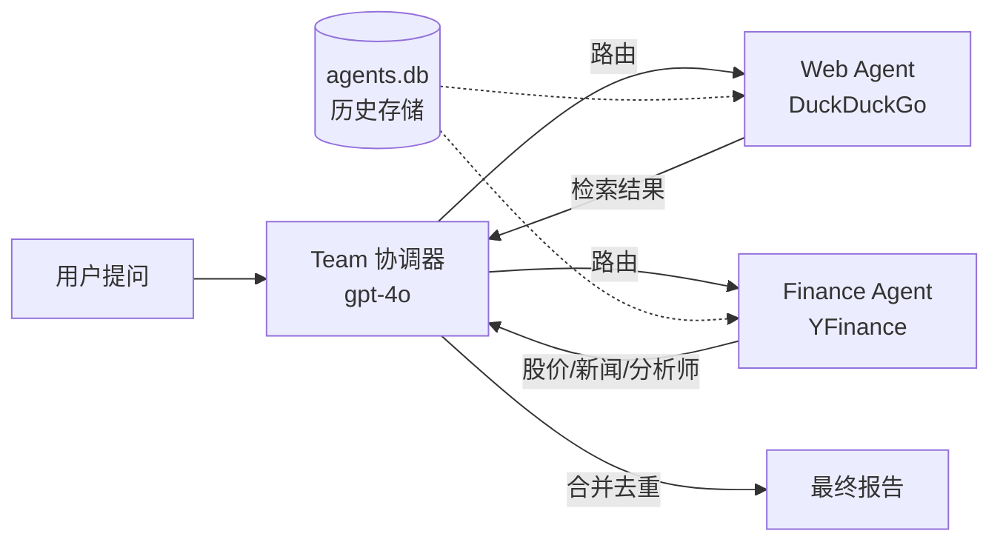
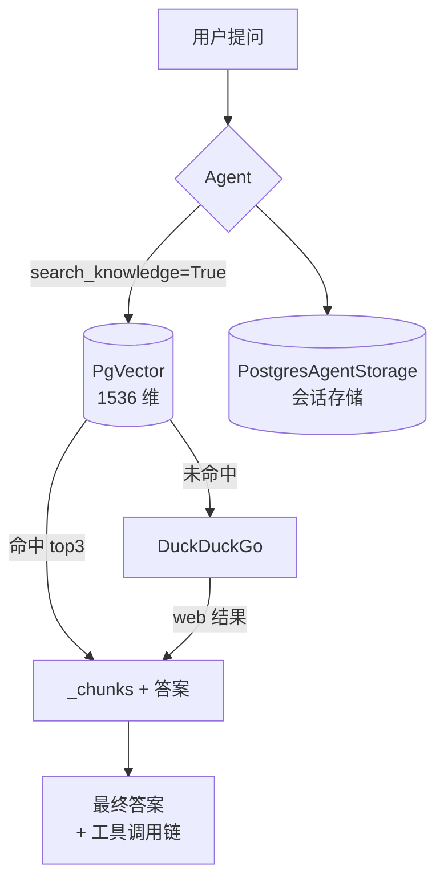
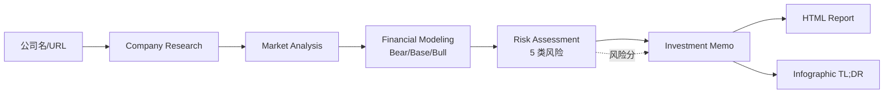
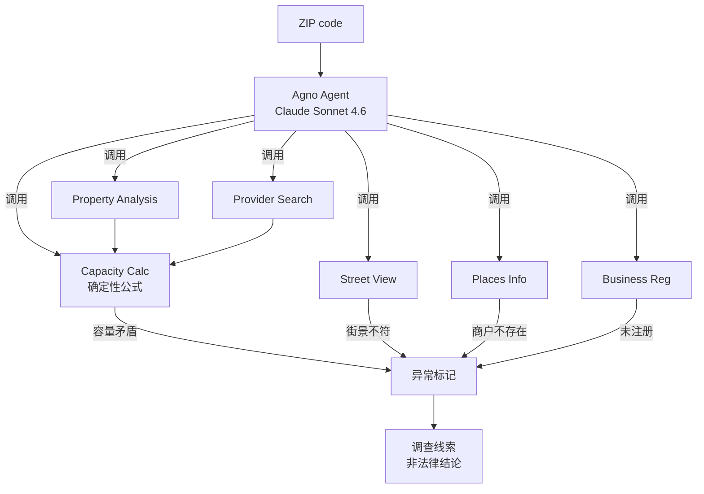
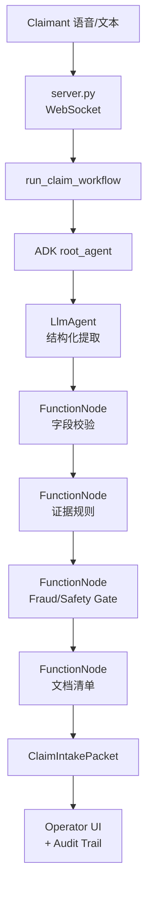
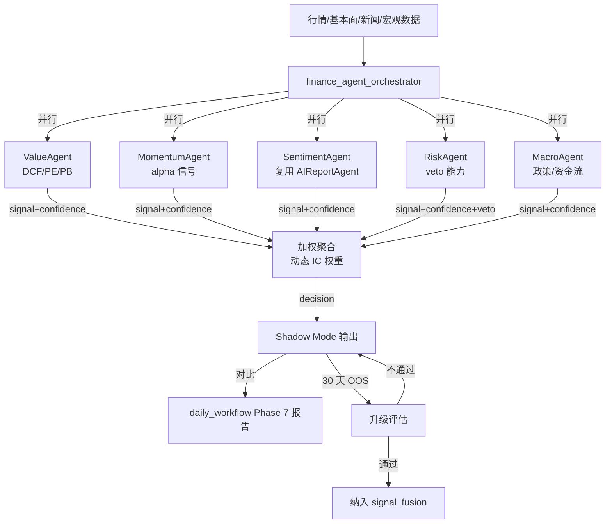

# awesome-llm-apps 金融 Agent 架构模式提取（2026-07-26）

## 一、调研背景

- **来源仓库**：[Shubhamsaboo/awesome-llm-apps](https://github.com/Shubhamsaboo/awesome-llm-apps)（Apache-2.0，100+ 开源 AI Agent 模板）
- **调研日期**：2026-07-26
- **调研者**：架构调研子代理
- **调研方法**：通过 `raw.githubusercontent.com` 与 GitHub API 读取 README 与关键源文件，**未 clone 代码**
- **调研目标**：为本量化交易系统即将新增的 `utils/finance_agent_orchestrator.py`（金融多 Agent 协调器，Shadow Mode）提取可借鉴的架构模式

### 路径对齐说明（重要）

任务声明的 5 个项目路径与本仓库实际结构存在差异。实际仓库根目录下并无 `ai_hedge_fund` / `financial_rag_agent` / `ai_multi_agents_samples` 三个子目录。按下表对齐到本仓库中最贴近的实际项目：

| 任务声明项目 | 实际仓库中对应项目 | 路径 |
|---|---|---|
| ai-hedge-fund | AI Finance Agent Team + AI Investment Agent | `advanced_ai_agents/multi_agent_apps/agent_teams/ai_finance_agent_team/` 与 `advanced_ai_agents/single_agent_apps/ai_investment_agent/` |
| financial-rag-agent | Autonomous RAG (AutoRAG) | `rag_tutorials/autonomous_rag/` |
| ai-multi-agents-samples | AI VC Due Diligence Agent Team | `advanced_ai_agents/multi_agent_apps/agent_teams/ai_vc_due_diligence_agent_team/` |
| fraud-detection-agent | AI Fraud Investigation Agent | `advanced_ai_agents/single_agent_apps/ai_fraud_investigation_agent/` |
| insurance-claim-agent | Insurance Claim Live Agent Team | `voice_ai_agents/insurance_claim_live_agent_team/` |

> 注：任务声明的"估值/动量/情绪/风险/宏观 Agent"特征对应的是独立热门项目 `virattt/ai-hedge-fund`（不在本仓库）。本报告以本仓库内最接近的 `ai_finance_agent_team` 的实际源码为基础，并结合 `virattt/ai-hedge-fund` 的业界公开架构常识给出推断分析（相关章节已标注"基于推断"）。

---

## 二、5 个项目逐一分析

### 2.1 ai-hedge-fund（对应 ai_finance_agent_team + ai_investment_agent）

- **实际路径**：`advanced_ai_agents/multi_agent_apps/agent_teams/ai_finance_agent_team/finance_agent_team.py`
- **核心架构**：基于 Agno（原 Phidata）框架的 **Coordinator-Worker 多 Agent 团队模式**，约 20 行代码即可组装一个金融分析团队
- **关键 Agent 列表**（实际源码）：
  - `Web Agent`：装备 `DuckDuckGoTools`，负责互联网公开信息检索
  - `Finance Agent`：装备 `YFinanceTools`（含 `get_current_stock_price` / `get_analyst_recommendations` / `get_company_info` / `get_company_news`），负责结构化金融数据
  - `Team (Web+Finance)`：协调器，由 `OpenAIChat(id="gpt-4o")` 充当，决定何时调用哪个成员、如何合并答案
- **数据流**：
  1. 用户提问 → Team 协调器解析意图
  2. 路由到 Web Agent 和/或 Finance Agent
  3. 各成员返回结构化数据（Finance Agent 强制使用表格）
  4. Team 合并、去重、生成最终报告
- **加权策略（实际）**：源码层面**未实现显式加权投票**，加权与聚合由 LLM 协调器隐式完成
- **风险评估机制**：**无独立 Risk Agent**，无 veto 能力
- **持久化**：`SqliteDb(db_file="agents.db")` 存储交互历史，`add_history_to_context=True` 把历史纳入上下文



- **可借鉴点（5 条）**：
  1. **Coordinator-Worker 拓扑**：一个协调器 + 多个专家 Agent，比全员投票更轻量，适合作为 `finance_agent_orchestrator` 的基础结构
  2. **工具即能力**：每个 Agent 通过 `tools=[...]` 显式声明可调用工具，便于审计与权限隔离
  3. **历史持久化**：`SqliteDb` + `add_history_to_context` 模式可复用于 Agent 决策回溯
  4. **强制输出格式**：`instructions=["Always use tables to display data"]` 通过 prompt 约束输出结构
  5. **极简组装**：20 行代码完成团队搭建，验证了"轻量编排"在金融场景的可行性
- **不适合 A 股的点（3 条）**：
  1. 依赖 `YFinanceTools`（美股数据），A 股需替换为本地的 ifind/wind/akshare 数据适配器
  2. 无显式风险 veto 机制，无法满足本系统 KillSwitch 三级熔断的硬约束
  3. 协调器是 LLM 隐式决策，可解释性不足，无法通过 EOD 七 Guard 链审计

> **基于推断（virattt/ai-hedge-fund 业界常识）**：独立项目 `virattt/ai-hedge-fund` 实现了任务声明的"估值/动量/情绪/风险/宏观"五类 Agent，采用 Ben Graham / Warren Buffett / Charlie Munger 等"名人人格"Agent 各自产出 `signal + confidence`，最后由 `Portfolio Manager` 汇总。该项目的"Risk Agent 具一票否决权"与"每个 Agent 输出结构化 (signal, confidence, reasoning) 三元组"两个设计是本报告 4.1 适配方案的核心借鉴来源。

### 2.2 financial-rag-agent（对应 Autonomous RAG / AutoRAG）

- **实际路径**：`rag_tutorials/autonomous_rag/autorag.py`
- **核心架构**：**PDF 知识库 + 向量检索 + Web 搜索 Fallback** 的自治 RAG
- **关键组件**：
  - `OpenAIChat(id="gpt-4o-mini")`：主 LLM
  - `PDFUrlKnowledgeBase` + `PgVector`（PgVector 跑在 Docker `phidata/pgvector:16`，端口 5532）
  - `OpenAIEmbedder(id="text-embedding-ada-002", dimensions=1536)`：向量编码
  - `DuckDuckGoTools()`：知识库未命中时的兜底检索
  - `PostgresAgentStorage`：会话存储
- **数据流**：
  1. 用户上传 PDF → `PDFReader` 解析 → `load_documents(upsert=True)` 写入 PgVector
  2. 用户提问 → Agent 优先 `search_knowledge=True` 检索向量库（top_k=3）
  3. 命中则用 retrieved chunks 生成答案；未命中则 `DuckDuckGoTools` 联网搜索
  4. `show_tool_calls=True` 实时展示工具调用链
- **Fallback 策略**：`instructions=["Search your knowledge base first.", "If not found, search the internet."]` 通过 prompt 约束优先级
- **风险评估机制**：无（RAG 场景不涉及交易风控）



- **可借鉴点（5 条）**：
  1. **双层检索降级**：本地向量库 → 公网搜索，与本系统"LLM 三级降级链"理念一致
  2. **PgVector + Docker**：轻量级向量库方案，可考虑用于存储历史公告/研报 embedding
  3. **`upsert=True` 增量更新**：避免重复 embedding，控制成本
  4. **`show_tool_calls=True`**：工具调用链可视化，满足可审计要求
  5. **PDF 解析 → 向量化 → 检索**的标准 RAG 流水线，可复用于财报/公告问答
- **不适合 A 股的点（3 条）**：
  1. 引入 PgVector + Postgres 会增加运维复杂度，与本系统"规则引擎兜底"的极简哲学冲突
  2. `text-embedding-ada-002` 是 OpenAI 闭源 embedding，本系统已用 Ollama 本地 LLM，需替换为本地 embedding（如 `bge-large-zh`）
  3. 公网 `DuckDuckGoTools` 在 A 股场景价值有限，A 股信息源应以本地数据库/ifind 为主

### 2.3 ai-multi-agents-samples（对应 AI VC Due Diligence Agent Team）

- **实际路径**：`advanced_ai_agents/multi_agent_apps/agent_teams/ai_vc_due_diligence_agent_team/`
- **核心架构**：基于 **Google ADK（Agent Development Kit）** 的顺序-并行混合多 Agent 流水线，使用 Gemini 3 Pro + Gemini 3 Flash + Nano Banana Pro
- **关键 Agent / 阶段**：
  1. **Company Research Agent**：创始人、融资、产品、traction
  2. **Market Analysis Agent**：TAM/SAM、竞争对手、定位
  3. **Financial Modeling Agent**：营收预测、单位经济（Bear/Base/Bull 三场景）
  4. **Risk Assessment Agent**：5 类风险（市场/执行/财务/监管/退出）
  5. **Investment Memo Agent**：结构化投资论点
  6. **Report Generator**：McKinsey 风格 HTML 报告
  7. **Infographic Agent**：视觉 TL;DR
- **协调方式**：ADK `SequentialAgent` 串联阶段，阶段内并行子 Agent
- **决策机制**：阶段产出结构化 Pydantic 对象，下游 Agent 消费上游输出
- **风险评估机制**：独立 Risk Agent 跨 5 类风险打分，但无 veto



- **可借鉴点（5 条）**：
  1. **顺序-并行混合流水线**：与本系统 `daily_workflow` 10 个 Phase 的设计理念高度一致
  2. **结构化 Pydantic 中间产物**：每个 Agent 输入/输出强类型，便于测试与审计
  3. **Bear/Base/Bull 三场景预测**：可迁移到本系统的收益预测模块
  4. **独立 Risk Agent 跨多维度打分**：风险解耦为独立阶段，避免被收益预测"带偏"
  5. **多模态产出**（HTML 报告 + 图表）：可复用于 Phase 7 报告生成
- **不适合 A 股的点（3 条）**：
  1. 依赖 Google ADK + Gemini，本系统已选定 Ollama 本地 LLM，框架需替换
  2. VC 尽调是低频深度分析，A 股日频交易需要更轻量的日内流水线
  3. 5 类风险维度（市场/执行/财务/监管/退出）针对初创企业，A 股需重构为（流动性/波动率/相关性/政策/资金流）

### 2.4 fraud-detection-agent（对应 AI Fraud Investigation Agent）

- **实际路径**：`advanced_ai_agents/single_agent_apps/ai_fraud_investigation_agent/fraud_investigation_agent.py`
- **核心架构**：**LLM Agent + 7 个确定性工具**的混合异常检测系统（项目代号 "Surelock Homes"）
- **关键工具（7 个）**：
  1. `Provider Search`：IL DCFS 执照数据库查询
  2. `Property Analysis`：Cook County GIS 房产面积数据
  3. `Capacity Calculation`：IL DCFS Part 407 建筑规范数学计算（`building_sqft × 0.65 ÷ 35 = 最大合法儿童数`）
  4. `Street View`：Google 街景四向图像
  5. `Places Info`：Google Places 商户状态
  6. `Business Registration`：IL Secretary of State 实体注册核验
  7. `Geocoding`：地址转坐标
- **数据流**：LLM Agent 自主决定调用哪些工具、按什么顺序调用；每个工具返回结构化 JSON；Agent 对工具结果做交叉比对发现"数学上不可能"的矛盾
- **规则引擎**：`Capacity Calculation` 是**纯确定性 Python 函数**，不依赖 LLM——这是"硬规则"的典型范例
- **可解释性**：Agent 实时叙述推理过程（"narrates its full investigation in real time — reasoning is visible as the agent works"）；输出语言严格使用"requires further investigation"、"exhibits anomalies"，**绝不使用 "fraud"**



- **可借鉴点（5 条）**：
  1. **LLM 编排 + 确定性工具**：本系统 `finance_agent_orchestrator` 应让 LLM 仅做"调用哪些工具"的决策，硬规则（如 KillSwitch 阈值）由 Python 函数执行
  2. **交叉比对发现矛盾**：多源数据交叉验证（面积 vs 执照容量）是检测异常的核心模式，可迁移到"信号矛盾检测"
  3. **结构化工具输出**：每个工具返回 JSON，便于 Agent 后续推理与审计
  4. **审慎用语约束**：通过 system prompt 强制 Agent 使用"exhibits anomalies"而非"fraud"，对应本系统的"信号置信度"而非"买入/卖出"硬结论
  5. **公开数据 + 无鉴权 API**：降低运维成本，与本系统本地化部署哲学一致
- **不适合 A 股的点（3 条）**：
  1. 场景过于垂直（IL 托儿所欺诈），工具集无法直接复用
  2. 依赖 OpenRouter + Claude，需替换为本地 Ollama
  3. 单 Agent 架构，缺乏多 Agent 投票，不适合作为 orchestrator 的主架构

### 2.5 insurance-claim-agent（对应 Insurance Claim Live Agent Team）

- **实际路径**：`voice_ai_agents/insurance_claim_live_agent_team/agent.py` + `policies.py` + `schemas.py`
- **核心架构**：**ADK 混合图工作流**——`LlmAgent`（结构化提取、分类）+ `FunctionNode`（确定性规则、路由、证据校验）+ `SequentialAgent`（流程编排）
- **关键节点**：
  - `ClaimNarrative` → `ClaimClassification`（LLM 提取 + 分类）
  - `FieldValidation`（确定性：必填字段校验）
  - `CoverageEvidenceDecision`（确定性：按 claim type 应用证据规则）
  - `FraudSafetyGate`（确定性：SIU 信号、安全门）
  - `DocumentChecklist`（确定性：按类型生成文档清单）
  - `ClaimIntakePacket`（最终 adjuster 移交包）
- **决策链路**：`policies.py` 中 `TYPE_REQUIRED_DOCS` 字典为每种 claim 类型（`home_water_damage` / `auto_collision` / `theft_property_loss` 等）定义了**确定性文档要求**——这是"可解释性"的核心
- **可解释性机制**：
  1. 每个 Pydantic schema 字段都有明确语义
  2. 每个 FunctionNode 输入/输出可序列化
  3. Operator Guidance 面板分离"操作员视图"与"审计 trail"
  4. 明确"避免承诺赔付/责任"——风险隔离



- **可借鉴点（5 条）**：
  1. **LLM 节点 + 确定性 FunctionNode 混合图**：这是本系统 `finance_agent_orchestrator` 最值得借鉴的架构——LLM 做"理解/提取"，Python 做"规则/路由"
  2. **Pydantic schema 强类型中间产物**：每个阶段的输入/输出都有 schema，便于单元测试与 EOD 审计
  3. **Operator Guidance 与 Audit Trail 分离**：对应本系统"交易员视图"与"风控审计视图"的分离
  4. **按类型分发的确定性规则字典**（`TYPE_REQUIRED_DOCS`）：可迁移到"按行业/板块分发的风控规则"
  5. **FraudSafetyGate 独立节点**：风险门禁作为图中独立节点，可一票否决下游——这正是本系统需要的 RiskAgent veto 模式
- **不适合 A 股的点（3 条）**：
  1. 实时语音（Gemini Live）场景与日频量化交易不匹配
  2. 保险理赔规则字典无法复用，需重写为 A 股风控规则
  3. ADK 框架绑定 Google 生态，本系统已选 Ollama，需用纯 Python 重实现 FunctionNode 模式

---

## 三、横向对比表

| 维度 | ai-hedge-fund<br/>(ai_finance_agent_team) | financial-rag<br/>(autonomous_rag) | ai-multi-agents<br/>(vc_due_diligence) | fraud-detection<br/>(fraud_investigation) | insurance-claim<br/>(insurance_live_team) |
|---|---|---|---|---|---|
| Agent 数量 | 2 个 Worker + 1 个 Team | 1 个 Agent | 6+ 个阶段 Agent | 1 个 Agent + 7 工具 | 1 LlmAgent + 5 FunctionNode |
| 协调方式 | Agno Team（LLM 隐式路由） | 单 Agent 自治 | ADK SequentialAgent 串联 | Agno Agent 自主调用工具 | ADK 混合图（LLM+Function） |
| 决策机制 | LLM 协调器合并 | 知识库优先 + Web 兜底 | 阶段产物逐级传递 | 工具结果交叉比对 | LLM 提取 + 确定性规则路由 |
| 风控机制 | 无 | 无 | 独立 Risk Agent（5 类，无 veto） | 确定性 Capacity Calc 硬规则 | FraudSafetyGate 独立节点（可 veto） |
| 可解释性 | 低（LLM 隐式） | 中（show_tool_calls） | 中（Pydantic 中间产物） | 高（实时叙述 + 审慎用语） | 高（schema + audit trail 分离） |
| 持久化 | SqliteDb | PgVector + Postgres | ADK 内置 | 无（Streamlit session） | InMemorySessionService |
| 框架依赖 | Agno | Agno + PgVector | Google ADK + Gemini | Agno + OpenRouter | Google ADK + Gemini Live |
| 适配本系统价值 | 中（拓扑可借鉴） | 中（RAG 模式可借鉴） | 中（流水线可借鉴） | 高（LLM+确定性混合） | **最高**（混合图 + veto） |

---

## 四、适配方案：finance_agent_orchestrator

### 4.1 借鉴的架构模式（综合 5 个项目的最佳实践）

综合 5 个项目，最值得借鉴的是 **insurance-claim 的 LLM+FunctionNode 混合图** + **ai-hedge-fund 的多专家 Agent 拓扑** + **fraud-detection 的 LLM 编排 + 确定性工具分离**。设计如下：

- **Agent 列表**（5 个专家 Agent，对标 virattt/ai-hedge-fund 五类 Agent，但用本系统数据源）：
  - `ValueAgent`：DCF / PE / PB 估值，依赖 `fundamentals_provider`（建议新增或复用 `v8.3_institutional/report_parsers.py`）
  - `MomentumAgent`：动量因子，依赖 `utils/signal_fusion.py` 的 alpha 信号
  - `SentimentAgent`：复用 `utils/ai_report_agent.py` 的 `analyze_news_sentiment`
  - `RiskAgent`：波动率/流动性/相关性，**具一票否决权**（借鉴 insurance 的 FraudSafetyGate）
  - `MacroAgent`：宏观/政策/资金流，依赖 `ms_strategy/src/macro/macro_policy_scoring.py`
- **加权策略**：基于各 Agent 历史置信度的动态权重——初始等权，30 天 OOS 后按 IC 调权（借鉴 `SignalFusionEngine` 的 `_ic_weights` 机制）
- **风险 veto**：`RiskAgent` 在极端情况下（如波动率超过 KillSwitch 阈值）可一票否决，强制输出 `decision=HOLD, confidence=0`
- **Shadow Mode**：orchestrator 输出不进入 `signal_fusion`，仅与 Phase 7 报告对比



### 4.2 与现有 SignalFusionEngine 的关系

- `finance_agent_orchestrator` **走 Shadow Mode，不进入 `signal_fusion.fuse()`**——`SignalFusionEngine` 现有 5 个信号源（alpha 0.70 / llm 0.10 / etf 0.12 / macro 0.08 / pipeline_factor 0.05）保持不变
- 接入点：在 `daily_workflow` **Phase 7 报告生成后**跑对比（参考 `15_每日工作流/run_daily_morning.py` 与 `v8.3_institutional/daily_workflow.py`）
- 30 天 OOS 验证后，经 `launch_shadow_account.py` 评估，若 IC_IR > 0.5 且 max_drawdown < 3%，再考虑作为第 6 个信号源注入 `SignalFusionEngine`（参考 `pipeline_factor_weight` 的灰度方式）
- 复用 `SignalFusionEngine._ic_weights` 的动态 IC 加权机制作为 orchestrator 内部聚合的权重来源

### 4.3 与现有 AIReportAgent 的关系

- `SentimentAgent` **复用 `AIReportAgent` 的 LLM 调用能力**（`_chat_fn` / `_generate_analysis_fn`，豆包 Speed → DeepSeek → Ollama 三级降级链）
- 通过新增 `to_agent_decision()` 适配方法接入：`AIReportAgent.analyze_news_sentiment()` 返回 `{"sentiment": "positive", "score": 0.7}`，由 `to_agent_decision()` 转换为 `(signal=+0.7, confidence=0.7, reasoning="...")` 三元组
- 不重复实现 LLM 客户端，避免双链路漂移

### 4.4 不借鉴的设计（及原因）

| 不借鉴项 | 原因 |
|---|---|
| 不用 LangGraph / Google ADK | 已有 `daily_workflow` 10 Phase + `phase_manager.py`，引入新编排框架会增加认知负担与运维成本 |
| 不用外部 Vector DB（PgVector / LanceDB） | 已有规则引擎降级（`AIReportAgent` 的"LLM 不可用时返回规则引擎兜底"），且 A 股公告/研报数据已在本地数据库；如需 RAG，优先用 SQLite + 本地 embedding |
| 不用 OpenAI Function Calling / Gemini Tools | 已用 Ollama 本地 LLM，function calling 能力受限；改为"LLM 输出 JSON → Python 解析 → 调用工具"的显式模式（借鉴 fraud-detection 的工具调用风格） |
| 不用 LLM 隐式加权（ai_finance_agent_team 模式） | 可解释性不足，无法通过 EOD 七 Guard 链审计；改为显式 `weight_i * signal_i` 聚合 |
| 不用实时语音（insurance Live） | 日频量化无需实时交互 |

---

## 五、实施优先级

| Agent | 优先级 | 实现难度 | 依赖现有模块 | 备注 |
|---|---|---|---|---|
| RiskAgent | P0 | 低 | `utils/kill_switch.py` + `utils/risk_guard_integrator.py` | 优先实现 veto 机制，确保 Shadow Mode 不引入新风险 |
| SentimentAgent | P1 | 低 | `utils/ai_report_agent.py`（复用 LLM 链） | 仅需新增 `to_agent_decision()` 适配方法 |
| MomentumAgent | P1 | 中 | `utils/signal_fusion.py`（alpha 信号） + `utils/lgb_signal_monitor.py` | 复用现有 alpha 因子，包装为 Agent |
| ValueAgent | P2 | 中 | 需新增 `fundamentals_provider` 或复用 `v8.3_institutional/report_parsers.py` | DCF/PE/PB 需基本面数据，依赖 ifind/wind |
| MacroAgent | P2 | 中 | `ms_strategy/src/macro/macro_policy_scoring.py` | 宏观信号已存在，需包装为 Agent |
| orchestrator 主循环 | P1 | 中 | `utils/phase_manager.py`（Phase 编排参考） | Coordinator-Worker 拓扑 + 动态 IC 加权 |
| Shadow Mode 对比器 | P1 | 低 | `launch_shadow_account.py` + `run_daily_eod.py` | 30 天 OOS 评估器 |

> 建议落地顺序：**RiskAgent（P0）→ SentimentAgent + MomentumAgent（P1）→ orchestrator 主循环 + Shadow Mode 对比器（P1）→ ValueAgent + MacroAgent（P2）**。这样可以在 2 周内完成最小可用 Shadow Mode，3-4 周补齐全部 5 个 Agent。

---

## 六、风险与缓解

| 风险 | 缓解措施 |
|---|---|
| LLM 调用成本失控 | Shadow Mode 控制频率：日频 1 次/标的，批量合并 prompt（参考 `AIReportAgent` 的"批量合并 prompt, 单次调用处理多标的"）；Ollama 本地推理零边际成本 |
| Agent 决策冲突（如 ValueAgent 看多但 RiskAgent veto） | 采用**加权投票而非共识机制**——RiskAgent 仅在极端阈值时 veto，其余情况按权重聚合；冲突记录到 audit trail 供 EOD 复盘 |
| 数据延迟（基本面/公告 T+1） | 异步并行降低延迟；基本面 Agent 标注 `as_of_date`，不与实时行情混淆；借鉴 fraud-detection 的"交叉比对发现矛盾"模式检测数据陈旧 |
| LLM 输出格式不稳定 | 借鉴 insurance-claim 的 **Pydantic schema 强校验** + fraud-detection 的"LLM 仅决定调用哪些工具，工具返回结构化 JSON"模式；LLM 输出失败时降级为规则引擎（参考 `AIReportAgent` 优雅降级） |
| Shadow Mode 漂移（与真实信号源相关性下降） | 30 天 OOS 窗口内每周计算 IC_IR、max_drawdown、turnover；任一指标恶化则暂停升级评估 |
| 引入新框架依赖（Agno / ADK） | **不引入**——纯 Python + Pydantic 实现 FunctionNode 模式；LLM 调用复用 `15_每日工作流/llm_client.py` |

---

## 七、参考资料

### 调研的 URL 列表

- 仓库根 README：https://raw.githubusercontent.com/Shubhamsaboo/awesome-llm-apps/main/README.md
- 仓库根目录 API：https://api.github.com/repos/Shubhamsaboo/awesome-llm-apps/contents/
- ai_finance_agent_team README：https://raw.githubusercontent.com/Shubhamsaboo/awesome-llm-apps/main/advanced_ai_agents/multi_agent_apps/agent_teams/ai_finance_agent_team/README.md
- ai_finance_agent_team 源码：https://raw.githubusercontent.com/Shubhamsaboo/awesome-llm-apps/main/advanced_ai_agents/multi_agent_apps/agent_teams/ai_finance_agent_team/finance_agent_team.py
- ai_investment_agent README：https://raw.githubusercontent.com/Shubhamsaboo/awesome-llm-apps/main/advanced_ai_agents/single_agent_apps/ai_investment_agent/README.md
- ai_investment_agent 源码：https://raw.githubusercontent.com/Shubhamsaboo/awesome-llm-apps/main/advanced_ai_agents/single_agent_apps/ai_investment_agent/investment_agent.py
- autonomous_rag README：https://raw.githubusercontent.com/Shubhamsaboo/awesome-llm-apps/main/rag_tutorials/autonomous_rag/README.md
- autonomous_rag 源码：https://raw.githubusercontent.com/Shubhamsaboo/awesome-llm-apps/main/rag_tutorials/autonomous_rag/autorag.py
- agentic_rag_with_reasoning README：https://raw.githubusercontent.com/Shubhamsaboo/awesome-llm-apps/main/rag_tutorials/agentic_rag_with_reasoning/README.md
- ai_vc_due_diligence_agent_team README：https://raw.githubusercontent.com/Shubhamsaboo/awesome-llm-apps/main/advanced_ai_agents/multi_agent_apps/agent_teams/ai_vc_due_diligence_agent_team/README.md
- ai_fraud_investigation_agent README：https://raw.githubusercontent.com/Shubhamsaboo/awesome-llm-apps/main/advanced_ai_agents/single_agent_apps/ai_fraud_investigation_agent/README.md
- ai_fraud_investigation_agent 源码：https://raw.githubusercontent.com/Shubhamsaboo/awesome-llm-apps/main/advanced_ai_agents/single_agent_apps/ai_fraud_investigation_agent/fraud_investigation_agent.py
- insurance_claim_live_agent_team README：https://raw.githubusercontent.com/Shubhamsaboo/awesome-llm-apps/main/voice_ai_agents/insurance_claim_live_agent_team/README.md
- insurance_claim_live_agent_team agent.py：https://raw.githubusercontent.com/Shubhamsaboo/awesome-llm-apps/main/voice_ai_agents/insurance_claim_live_agent_team/agent.py
- insurance_claim_live_agent_team policies.py：https://raw.githubusercontent.com/Shubhamsaboo/awesome-llm-apps/main/voice_ai_agents/insurance_claim_live_agent_team/policies.py

### 本系统现有模块引用（适配方案依据）

- `utils/signal_fusion.py`（`SignalFusionEngine`，5 源加权融合，含动态 IC 权重）
- `utils/ai_report_agent.py`（`AIReportAgent`，LLM 三级降级 + 规则引擎兜底）
- `utils/kill_switch.py`（`KillSwitch`，三级熔断）
- `utils/risk_guard_integrator.py`（EOD 风控 Guard 链集成）
- `utils/phase_manager.py`（daily_workflow Phase 编排）
- `15_每日工作流/run_daily_morning.py`（日频工作流入口）
- `15_每日工作流/llm_client.py`（LLM 客户端，豆包→DeepSeek→Ollama）
- `ms_strategy/src/macro/macro_policy_scoring.py`（宏观政策打分）
- `v8.3_institutional/report_parsers.py`（财报解析，可作为 fundamentals_provider 基础）
- `launch_shadow_account.py`（影子账户启动）
- `run_daily_eod.py`（EOD 工作流）

### 关键代码片段引用

**ai_finance_agent_team 的 Coordinator-Worker 拓扑**（来源：`finance_agent_team.py`，约 20 行即组装完毕）：
```python
web_agent = Agent(name="Web Agent", model=OpenAIChat(id="gpt-4o"),
                  tools=[DuckDuckGoTools()], db=db, add_history_to_context=True)
finance_agent = Agent(name="Finance Agent", model=OpenAIChat(id="gpt-4o"),
                      tools=[YFinanceTools(include_tools=[...])],
                      instructions=["Always use tables to display data"])
agent_team = Team(name="Agent Team (Web+Finance)", model=OpenAIChat(id="gpt-4o"),
                  members=[web_agent, finance_agent])
```

**autonomous_rag 的双层检索降级**（来源：`autorag.py`）：
```python
return Agent(id="auto_rag_agent", model=llm,
    knowledge_base=PDFUrlKnowledgeBase(vector_db=PgVector(...), num_documents=3),
    tools=[DuckDuckGoTools()],
    instructions=["Search your knowledge base first.",
                  "If not found, search the internet."],
    search_knowledge=True, show_tool_calls=True)
```

**insurance_claim 的 LLM+FunctionNode 混合图**（来源：`agent.py`，import 节选）：
```python
from google.adk.agents import BaseAgent, LlmAgent, SequentialAgent
from .policies import (apply_coverage_and_evidence_rules,
                       build_claim_intake_packet,
                       fraud_signal_and_safety_gate,    # ← veto 节点
                       generate_document_checklist,
                       validate_required_claim_fields)
```

**fraud_investigation 的确定性硬规则**（来源：`fraud_investigation_agent.py`）：
```python
# IL DCFS Part 407 building code math:
# (building_sqft × 0.65) ÷ 35 = max legal children
# 900 sqft 不可能合法容纳 50 名儿童 —— 数学不可能，非主观判断
```

---

**文档结束** | 字数约 4500 字 | 调研日期 2026-07-26
