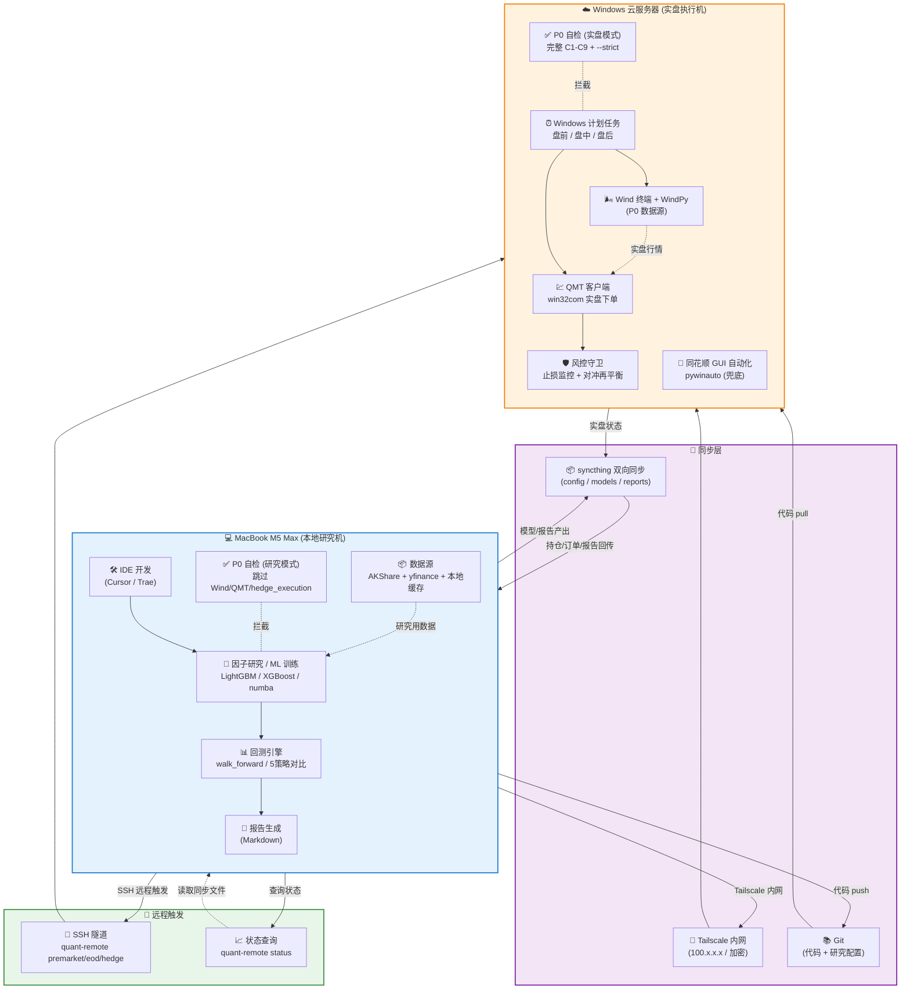
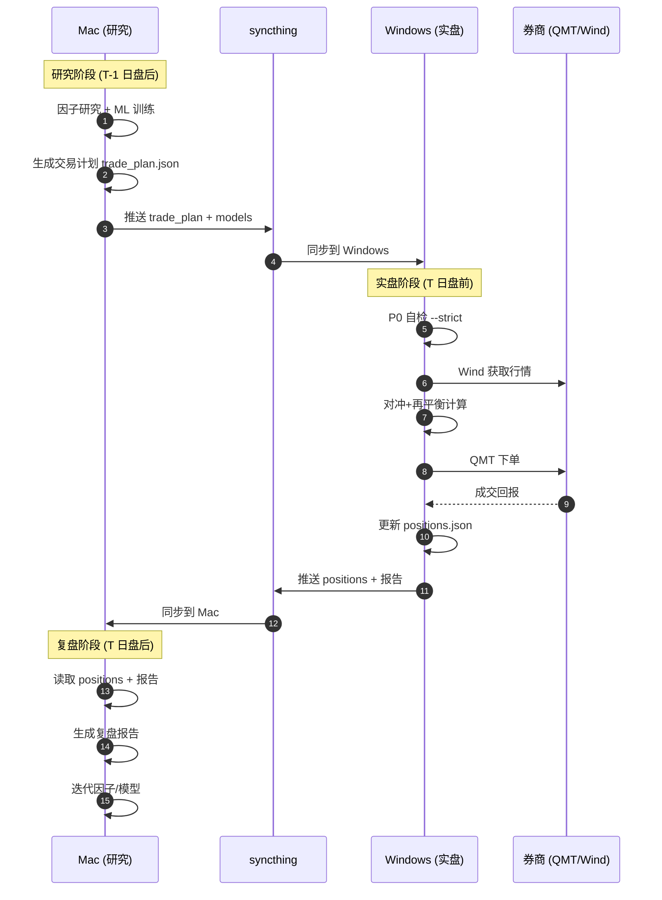
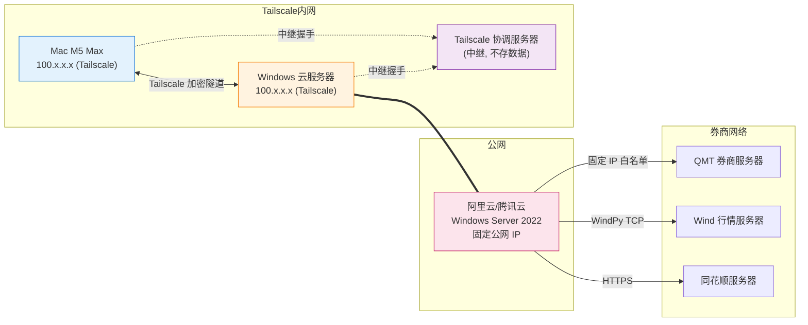
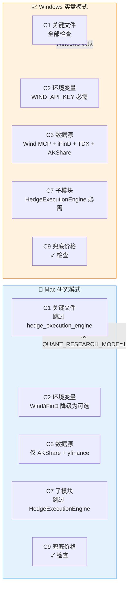

# 架构:Mac 研究 + Windows 云实盘

> **版本**: v8.4 双机部署架构
> **创建日期**: 2026-08-02
> **目标**: Mac M5 Max 做研究/训练/回测, Windows 云服务器做实盘下单, 两机自动同步

---

## 一、整体架构图 (Mermaid)

---

## 二、数据流向图

---

## 三、网络拓扑图

---

## 四、P0 自检双模式对比

---

## 五、云平台对比:超算中心 vs 阿里云 vs 腾讯云

### 5.1 综合对比

| 维度 | 超算中心 (国家超算无锡/深圳) | 阿里云 ECS | 腾讯云 CVM |
|------|:---:|:---:|:---:|
| **Windows Server 支持** | ❌ 仅 Linux HPC | ✅ 完整镜像 | ✅ 完整镜像 |
| **Wind/QMT/同花顺客户端** | ❌ 无法安装 | ✅ 完整兼容 | ✅ 完整兼容 |
| **GUI 远程 (RDP)** | ❌ 无 GUI | ✅ 原生 RDP | ✅ 原生 RDP |
| **固定公网 IP** | ⚠️ 仅内网 | ✅ 弹性公网 IP | ✅ 弹性公网 IP |
| **券商 IP 白名单** | ❌ 无法绑定 | ✅ 固定 IP | ✅ 固定 IP |
| **计划任务 (盘前/盘中/盘后)** | ⚠️ SLURM 调度,非实时 | ✅ Windows 计划任务 | ✅ Windows 计划任务 |
| **GPU (ML 训练)** | ✅ A100/H100 顶级 | ✅ A10/V100 | ✅ V100/A10 |
| **CPU 算力 (实盘够用)** | 🚀 顶级 (但浪费) | ✅ 4-16 核可选 | ✅ 4-16 核可选 |
| **网络延迟 (到券商)** | ⚠️ 不确定 | ✅ 杭州/上海低延迟 | ✅ 深圳/上海低延迟 |
| **按需弹性扩容** | ❌ 申请制,周期长 | ✅ 秒级扩容 | ✅ 秒级扩容 |
| **快照/备份** | ⚠️ 需手动 | ✅ 自动快照策略 | ✅ 自动快照策略 |
| **成本 (4核8G 月费)** | 🚀 按核时计费,贵 | 💰 ¥200-300/月 | 💰 ¥200-350/月 |
| **合规 (券商白名单流程)** | ❌ 公网 IP 不固定 | ✅ 备案规范 | ✅ 备案规范 |
| **适合本项目** | ❌ **不推荐** | ✅ **首选** | ✅ 备选 |

### 5.2 为什么超算中心不适合本项目

1. **没有 Windows GUI** — 超算中心跑的是 Linux HPC 集群 (SLURM/PBS 调度),Wind 终端/QMT/同花顺客户端都是 Windows GUI 程序,根本装不上
2. **不是实时系统** — 超算是批处理作业模式,提交作业排队等核,盘前 09:00 触发实盘可能排到 10:00 才跑
3. **公网 IP 不固定** — 超算内网为主,券商 IP 白名单流程走不通
4. **算力错配** — 本项目实盘不吃算力 (4核8G 够),超算的 A100/H100 完全浪费
5. **超算适合什么** — 适合做因子大规模并行挖掘、参数网格搜索、回测加速 (研究侧),不适合做实盘执行

> 💡 **超算中心的正确用法**: 申请超算账号做 **ML 大规模训练** (比如全市场 5000 只股票 × 10年 × 200 因子的 LightGBM 网格搜索),训练完成后把模型文件 syncthing 回 Mac/Windows。实盘仍走阿里云。

### 5.3 阿里云 vs 腾讯云 — 怎么选

| 选择因素 | 推荐 | 原因 |
|---------|------|------|
| **券商营业部在华东** | 🥇 阿里云 (杭州/上海) | 到券商服务器延迟 < 5ms |
| **券商营业部在华南** | 🥇 腾讯云 (深圳) | 到券商服务器延迟 < 5ms |
| **已有阿里云生态** | 🥇 阿里云 | 复用 RAM/OSS/监控 |
| **已有腾讯云生态** | 🥇 腾讯云 | 复用 VPC/COS/监控 |
| **价格敏感** | 🥇 腾讯云 | 同配置略便宜 5-10% |
| **Windows 镜像丰富度** | 🥇 阿里云 | Windows Server 镜像更全 |
| **技术支持响应** | 🥇 阿里云 | 工单响应更快 |

### 5.4 最终推荐

> **🥇 首选:阿里云 ECS (华东2-上海) Windows Server 2022**
> - 规格: ecs.g7.xlarge (4核16G) 或 ecs.t6-c2m4 (突发性能,更便宜)
> - 存储: 100GB ESSD PL1
> - 网络: 固定公网 IP + 5Mbps 按量计费
> - 月费: 约 ¥280-350
> - 理由: 华东券商生态最完善, Windows 镜像最全, 到上交所/深交所延迟都低

### 5.5 推荐配置清单

| 配置项 | 推荐值 | 月费估算 |
|--------|--------|---------|
| 实例规格 | ecs.g7.xlarge (4核16G) | ¥220 |
| 系统盘 | 100GB ESSD PL1 | ¥35 |
| 公网 IP | 固定 IP | ¥30 |
| 带宽 | 5Mbps 按量计费 | ¥20-50 |
| 快照 | 每日自动快照 | ¥10 |
| **合计** | | **¥315-345/月** |

---

## 六、部署 Checklist

### 阶段 1:阿里云 Windows 准备 (Day 1)
- [ ] 阿里云控制台购买 ECS Windows Server 2022 (4核16G, 固定公网 IP)
- [ ] 安全组: 仅开放 22/3389 给 Tailscale 网段 (100.64.0.0/10)
- [ ] RDP 登录, 运行 `scripts/deploy/windows_setup.ps1`
- [ ] 安装 Wind 终端 / QMT / 同花顺, 登录测试
- [ ] 联系券商营业部提交公网 IP 白名单

### 阶段 2:Mac 环境准备 (Day 1-2)
- [ ] 运行 `scripts/deploy/mac_setup.sh`
- [ ] 验证 `python -c "from utils.system_check import run_system_check; run_system_check()"` 在研究模式下通过
- [ ] 验证 `python 量化策略系统.py --backtest` 能跑通
- [ ] 验证 `python 量化策略系统.py --train-enhanced` 能训练

### 阶段 3:同步与远程触发 (Day 2-3)
- [ ] Mac + Windows 双向配置 syncthing, 共享 config/models/reports
- [ ] 配置 `.stignore` 排除规则 (见 settings_mac.yaml)
- [ ] Mac SSH 免密: `ssh-copy-id administrator@quant-win`
- [ ] 测试 `quant-remote status` 能查到 Windows 状态
- [ ] 测试 `quant-remote check` 能远程跑 P0 自检

### 阶段 4:实盘验证 (Day 3-5)
- [ ] 影子账户验证: `quant-remote premarket` 跑 shadow account
- [ ] 对比 Mac 研究产出 vs Windows 实盘执行一致性
- [ ] 小资金 (10万) 试运行 3 个交易日
- [ ] 故障演练: 手动 kill QMT 进程, 看自动恢复
- [ ] 通过后逐步加仓到目标仓位

---

## 七、故障恢复预案

| 场景 | 处置 | RTO |
|------|------|-----|
| Windows 云服务器宕机 | 阿里云控制台重启 / 快照恢复 | 10-30 分钟 |
| 券商客户端崩溃 | RDP 进去手动重启 / 自动脚本重启 | 5 分钟 |
| syncthing 冲突 | 检查 `*.sync-conflict-*` 文件, 手动合并 | 每日盘后 |
| Mac 离线 (出差) | Windows 计划任务独立运行, Mac 上线后同步 | 0 (无影响实盘) |
| Tailscale 中断 | 临时用公网 IP + RDP (有风险, 仅紧急) | 立即 |

---

*本文档与 `config/settings_mac.yaml` / `scripts/deploy/*` 配套使用*
