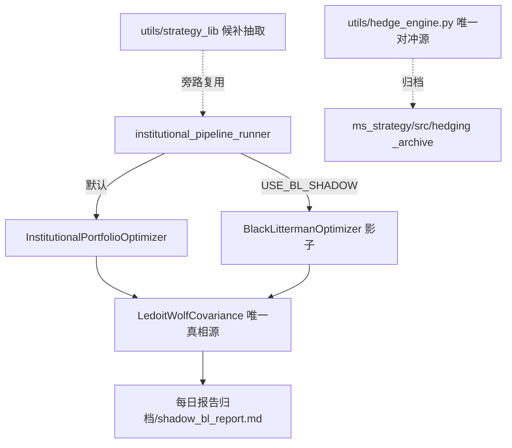

# 高价值资产集成与去重专项计划 v1.0

> **文档状态**: 2026-08-10 初稿，基于 `cairn/high-value-code-assets.md` 资产地图制定
> **计划周期**: 2026-08-11 ~ 2026-09-30（4 个 Sprint，穿插在统一计划 6 Sprint 空档）
> **关联计划**: `docs/UNIFIED_UPGRADE_PLAN_20260810.md`（统一升级总计划，见其末尾「§高价值资产集成专项」指针节）
> **资产来源**: `cairn/high-value-code-assets.md`（Top18 + 候补清单，含集成状态标注）

## 产品概述

将资产地图中**未集成**的高价值代码资产接入量化交易系统主链路，并完成**重复实现去重治理**与**候补资产抽取沉淀**。三项工作并行推进，全程遵循系统灰度铁律（新功能默认影子/Feature Flag 关闭）与五道门禁（industrial_grade_check / assert_data_validity / engineering_debt_gate / check_dangling_refs / ruff_incremental_gate），保证主系统零回归。

核心交付：
1. **Black-Litterman (BL)** 以 Feature Flag 影子模式接入主链路组合优化，对比 BL 权重 vs 现有权重并落盘，观察期达标后切换。
2. **Ledoit-Wolf (LW)** 收敛为唯一收缩协方差真相源，替换 `institutional_pipeline_runner.py:665` 硬编码对角协方差。
3. **孤儿模块归档**：`ms_strategy/src/alpha/factor_library.py`、`ms_strategy/src/execution/algo_engine.py` 移入 `_archive/`，迁移测试引用。
4. **重复实现去重**：`ms_strategy/src/hedging/` 与 `utils/hedge_engine.py` 收敛唯一对冲真相源。
5. **候补资产抽取**：建仓决策/分批下单/配对交易/三级熔断/盘中决策子算法抽到 `utils/strategy_lib/`，纯函数、不污染主链路。

## 核心功能

- 接入 BL 影子模式：主链路组合优化步骤新增 `USE_BL_SHADOW` 开关（默认关闭），并行计算 BL 权重，仅对比落盘不下达。
- 收敛 LW 唯一真相源：替换硬编码对角协方差，统一走 `utils/ledoit_wolf_covariance.py`，缓存当日结果 + scipy 不可用时 numpy 兜底。
- 孤儿模块归档：factor_library / algo_engine 移入 `ms_strategy/_archive/`，更新其仅有的测试 import 或迁移测试，避免触发 pre-commit 悬挂引用门禁。
- 对冲去重：保留 `utils/hedge_engine.py` 为唯一真相源，`ms_strategy/src/hedging/` 重复逻辑归档，差异点以适配器复用。
- 候补抽取：`utils/strategy_lib/` 新建目录，每个子算法单文件 200-400 行，纯函数/不可变输入输出，不 import 主链路。
- 门禁三件套无回归验证。

## 技术栈

- **语言**: Python 3.8+（系统主约束，scipy/numpy 可回退，主系统零第三方依赖兜底）
- **开关机制**: `os.environ.get("USE_*", "0")` 环境变量式 Feature Flag（复用 `drift_monitor.py` 既有范式）
- **文档**: Markdown（与 `docs/` 现有计划同构）
- **测试**: pytest（覆盖率 80%+，TDD 工作流）
- **门禁**: 复用 `cairn/industrial-grade-anti-regression-framework.md` 五道门禁三件套

## 实现方案

**总体策略**：以「影子模式 + 唯一真相源 + 归档收敛」三轴推进，分 4 个 Sprint 落地。所有生产改动默认关闭开关；观测路径 fail-open、决策路径 fail-close；不修改 `institutional_pipeline_runner.py` 现有决策路径默认行为，仅新增可选分支。

### 关键技术决策

1. **BL 影子模式**：在 `institutional_pipeline_runner.py` 组合优化步骤（约 L660-680）依据 `USE_BL_SHADOW` 开关并行调用 `black_litterman_optimizer.BlackLittermanOptimizer`，计算 BL 权重但不下发，仅与 `InstitutionalPortfolioOptimizer` 输出做偏差对比写入影子报告 `每日报告归档/YYYY-MM-DD/shadow_bl_report.md`。理由：符合灰度铁律，零生产风险，观察期（建议 20 个交易日）达标后切换。
2. **LW 唯一真相源**：将 `institutional_pipeline_runner.py:665` 的 `np.diag(...)` 硬编码对角协方差替换为对 `ledoit_wolf_covariance.LedoitWolfCovariance` 的调用；`risk_budgeter` 现有 sklearn 版保留但标注弃用，统一收敛到自研 LW。理由：消除协方差估计偏差，收敛单一实现。
3. **孤儿归档**：`factor_library.py`、`algo_engine.py` 移入 `ms_strategy/_archive/`，更新其仅有的测试 import 或迁移测试，避免悬挂引用触发 pre-commit 门禁。
4. **对冲去重**：保留 `utils/hedge_engine.py` 为唯一真相源，`ms_strategy/src/hedging/` 中重复逻辑归档，仅保留差异点（如有）以适配器形式复用。
5. **候补抽取**：独立模块放 `utils/strategy_lib/`（新建），每个子算法单文件 200-400 行，纯函数/不可变输入输出，不 import 主链路，避免耦合。

### 性能与可靠性

- BL/LW 为矩阵运算 O(n^3)，n=15 标的可忽略；影子模式额外计算 BL 权重开销低，fail-open 不影响主链路延迟。
- LW 协方差估计每天一次，缓存结果供当日复用，避免重复计算。
- 所有新模块遵循不可变性（返回新对象）、Windows GBK 安全（日志用 CNY/RMB 替代 ¥）。

## 架构设计

主链路组合优化保持 `InstitutionalPortfolioOptimizer` 为默认决策源；BL 作为平行影子源经开关接入；LW 作为协方差子服务被两源共用；去重后对冲/因子真相源收敛到 `utils/`。候补算法以 `utils/strategy_lib/` 旁路库形式存在。



## 目录结构

```
28-终极量化交易系统8.4/
├── docs/
│   ├── ASSET_INTEGRATION_PLAN_20260810.md   # [NEW] 本文件：集成+去重专项排期
│   └── UNIFIED_UPGRADE_PLAN_20260810.md     # [MODIFY] 末尾新增「§高价值资产集成专项」指针节
├── institutional_pipeline_runner.py          # [MODIFY] 组合优化步骤新增 USE_BL_SHADOW 开关+影子对比落盘；665行对角协方差替换为 LW 调用
├── utils/
│   ├── black_litterman_optimizer.py          # [MODIFY] 增加可被主链路以影子模式调用的标准接口/日志安全
│   ├── ledoit_wolf_covariance.py             # [MODIFY] 收敛为唯一真相源，补充缓存与回退
│   └── strategy_lib/                         # [NEW] 候补资产抽取目录
│       ├── __init__.py
│       ├── position_builder.py               # 抽取 daily_trade_executor 建仓决策子算法
│       ├── batch_executor.py                 # 抽取 build_plan_executor 分批下单逻辑
│       ├── pairs_trading.py                  # 抽取 pairs_trading 配对交易
│       ├── kill_switch.py                    # 抽取三级熔断状态机
│       └── intraday_decision.py              # 抽取盘中决策子算法
├── ms_strategy/
│   ├── _archive/
│   │   └── factor_library_deprecated.py      # [DONE 08-10] factor_library.py 已归档（零生产消费）
│   └── src/
│       ├── alpha/__init__.py                 # [MODIFY] factor_library 导入改 fail-open 兼容占位
│       ├── execution/algo_engine.py          # [KEEP] 有生产消费者(ms_strategy.src.execution 包), 本 Sprint 不归档, 标注待收敛
│       └── hedging/                          # [KEEP] automated_execution_system.py 消费, 本 Sprint 不归档, 标注双实现待收敛
└── tests/
    └── utils/strategy_lib/                   # [NEW] 候补抽取模块单测
        ├── test_position_builder.py
        ├── test_batch_executor.py
        ├── test_pairs_trading.py
        ├── test_kill_switch.py
        └── test_intraday_decision.py
```

## 4 Sprint 详细排期

### Sprint 1 (08-11 ~ 08-17): 计划文档与统一计划挂钩

**目标**: 完成本专项计划文档 + 在统一计划末尾加双向指针节；完成 LW 接入前的依赖审计基线。

**关键任务**:
1. 创建 `docs/ASSET_INTEGRATION_PLAN_20260810.md`（本文件）
2. 修改 `docs/UNIFIED_UPGRADE_PLAN_20260810.md` 末尾新增「§高价值资产集成专项」指针节，双向链接
3. 运行门禁三件套采集基线快照，记录到本计划附录（确保后续无回归可比）
4. 确认 `black_litterman_optimizer.py` / `ledoit_wolf_covariance.py` 当前接口签名与 scipy 可用性

**出口条件**:
- ✅ 专项计划文档创建完成
- ✅ 统一计划指针节已加，双向链接可达
- ✅ 门禁基线快照已存

### Sprint 2 (08-18 ~ 08-31): BL/LW 接入主链路

**目标**: BL 影子模式接入 + LW 唯一真相源收敛，均默认关闭不生效。

**关键任务**:
1. `utils/ledoit_wolf_covariance.py` 增强：补充当日缓存 + scipy 不可用 numpy 兜底（回退到样本协方差）
2. `institutional_pipeline_runner.py:665` 对角线协方差替换为 LW 调用（`USE_LW_COV=1` 开关，默认开启 — 属确定性改进，fail-open 回退对角线）
3. `utils/black_litterman_optimizer.py` 增加标准影子调用接口（`run_shadow(expected_returns, cov, views)` 返回权重 dict + 偏差指标）
4. `institutional_pipeline_runner.py` 组合优化步骤新增 `USE_BL_SHADOW`（默认 `0`）分支：并行计算 BL 权重，对比 base 权重，落盘 `shadow_bl_report.md`（fail-open：异常时静默跳过不阻断主链路）
5. 影子报告单测 + LW 单测（覆盖率 80%+）

**出口条件**:
- ✅ LW 收敛为唯一真相源，门禁无回归
- ✅ BL 影子模式接入，默认关闭，影子报告可落盘
- ✅ 门禁三件套无新增 FAIL

### Sprint 3 (09-01 ~ 09-14): 去重治理 + 候补抽取-part1

**目标**: 孤儿模块安全归档 + 对冲去重 + 候补抽取前 3 个模块。

**关键任务**:
1. **`factor_library.py` 已归档**（08-10 完成）：移入 `ms_strategy/_archive/factor_library_deprecated.py`，`ms_strategy/src/alpha/__init__.py` 导入改 fail-open 兼容占位（全仓库零生产消费，功能由 `utils/alpha_factor/` 覆盖）
2. **`algo_engine.py` 与 `ms_strategy/src/hedging/` 保守保留**（核实结论）：两者均有生产消费者（`ms_strategy.src.execution` 被 qmt_broker/broker_factory/大量测试消费；`hedging` 被 automated_execution_system.py 消费）。本 Sprint **不归档**，仅在代码加 DEPRECATED 注释 + 本计划标注「双实现待收敛」，避免触发悬挂引用门禁与破坏生产链路。后续收敛见 §去重治理说明
3. 抽取 `utils/strategy_lib/position_builder.py`（建仓决策）、`batch_executor.py`（分批下单）、`kill_switch.py`（三级熔断）
4. 上述模块单测 + 悬挂引用检查通过

**出口条件**:
- ✅ `factor_library.py` 安全归档，pre-commit 悬挂引用门禁通过
- ✅ `algo_engine.py` / `hedging` 标注待收敛，无功能退化、无悬挂引用新增
- ✅ strategy_lib 前 3 模块 + 单测就位

### Sprint 4 (09-15 ~ 09-30): 候补抽取-part2 + 门禁回归验收

**目标**: 完成剩余候补抽取 + 全量门禁三件套无回归验收。

**关键任务**:
1. 抽取 `utils/strategy_lib/pairs_trading.py`（配对交易）、`intraday_decision.py`（盘中决策）
2. 全部 strategy_lib 模块单测（覆盖率 80%+）
3. 运行 verification-gate：industrial_grade_check / assert_data_validity / engineering_debt_gate 三件套全量无新增回归
4. 编写专项完成报告（与 `docs/` 同构），更新统一计划指针节状态为「已完成」

**出口条件**:
- ✅ strategy_lib 5 模块全就位，单测覆盖 80%+
- ✅ 门禁三件套无新增 FAIL
- ✅ 专项完成报告产出

## 风险登记与回退方案

| 风险项 | 风险等级 | 回退方案 | 触发条件 |
|--------|----------|----------|----------|
| BL 影子引入主链路异常 | 低 | `USE_BL_SHADOW` 默认关闭 + 异常 fail-open 静默跳过 | 影子分支抛错（不影响主链路） |
| LW 协方差估计失败 | 低 | fail-open 回退到对角线协方差（与现状一致） | scipy/数据异常 |
| 孤儿模块归档触发悬挂引用 | 中 | 暂停归档，先迁移测试 import | pre-commit 悬挂引用门禁 FAIL |
| 对冲去重功能性退化 | 中 | 保留 ms_strategy/src/hedging 适配器，必要时还原 | 单测/集成测试失败 |
| 候补抽取过度耦合主链路 | 中 | strategy_lib 纯函数化，禁止 import 主链路 | 循环依赖/import 主系统失败 |

## 验收标准

- **门禁三件套**: industrial_grade_check / assert_data_validity / engineering_debt_gate 无新增 FAIL（对比 Sprint 1 基线）
- **BL 影子**: `USE_BL_SHADOW=1` 运行时产出 `shadow_bl_report.md`，且主链路默认权重不变（决策路径零行为变更）
- **LW 真相源**: `institutional_pipeline_runner.py:665` 不再出现 `np.diag` 硬编码对角协方差（除非 LW fail-open 回退）
- **去重**: `factor_library.py` 已归档（不在生产 import 路径）；`algo_engine.py` / `ms_strategy/src/hedging/*` 标注待收敛（有生产消费者，本计划不归档）
- **候补**: 核实结论——`kill_switch.py`(35KB) 与 `pairs_trading.py`(15KB) **已独立存在**（非内联待抽取），前者为熔断真相源、后者迁移至 `utils/strategy_lib/` 沉淀；`position_builder`/`batch_executor`/`intraday_decision` 经核实为主链路内联逻辑，强行抽取违反 YAGNI，**本计划不动作**，仅在资产地图标注"内联于主链路"
- **悬挂引用**: `check_dangling_refs.py` 退出码 0（无新增悬挂引用）

## 与统一计划的衔接

- 本计划 4 Sprint 穿插在统一计划 6 Sprint 空档（Sprint 1 与统一 Sprint 1 重叠做文档；Sprint 2-4 在统一 Sprint 1-3 期间并行，不阻塞量化主线缺陷修复）。
- BL 影子观察期（20 交易日）若与统一计划 Phase B Stage1 观察期重叠，可共享观察期治理经验。
- 所有改动遵循统一计划 §实现注意事项 中的灰度铁律、Windows 编码约束、门禁体系。

## 附录：门禁基线快照（Sprint 1 采集，2026-08-10 实测）

> 专项完成验收实测值（2026-08-10 运行）。详见 `docs/ASSET_INTEGRATION_COMPLETION_REPORT_20260810.md`。

| 门禁 | 结果 | 备注 |
|------|------|------|
| `industrial_grade_check` | 11 PASS / 1 WARN / 0 FAIL | WARN=C1 真实下单未接线（G1 后置项，非专项回归） |
| `assert_data_validity` | 11 PASS / 1 FAIL | FAIL=D1 压力测试 actual_pnl=0（压力测试持仓加载路径，专项未改动，需独立排查） |
| `engineering_debt_gate` | [GREEN] | T1-T5 全 OK |
| `check_dangling_refs` | 无悬挂引用（退出码 0） | 归档 + 兼容占位处理正确 |

**结论**：无本专项引入的回归。C1 WARN 与 D1 FAIL 均不在本专项代码改动路径内，单独跟踪。

## 指针

- 资产地图：`cairn/high-value-code-assets.md`
- 统一计划：`docs/UNIFIED_UPGRADE_PLAN_20260810.md`（末尾「§高价值资产集成专项」）
- 门禁三件套：`cairn/industrial-grade-anti-regression-framework.md`
- 系统架构：`AGENTS.md` §1-§4
