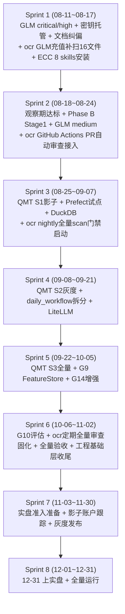

# 量化系统工业级升级总计划与排期 v9.3

> **文档状态**: 2026-08-10 初稿，基于门禁三件套实测值制定
> **计划周期**: 2026-08-11 ~ 2026-12-31 (8个Sprint + 实盘准入)
> **核心目标**: 
> - 08-22 中期工业级达标 (11 PASS / 1 WARN / 0 FAIL)
> - 09-30 全面达标 (12 PASS / 0 WARN / 0 FAIL)  
> - 10-31 工程基础层就位 (uv/Prefect/LiteLLM/DuckDB/pytest 护城河)
> - 12-31 实盘准入 (门禁三件套连续21天0 FAIL + 影子账户2周 + 灰度发布完成)

## 产品概述

将两条独立计划——《升级计划.md》(工程基础层 12 周计划) 与《WORK_PLAN_v9.2》(量化系统工业级达标 4 阶段计划)——合并为一条统一升级主线，并引入两个第三方工具能力作为代码审查与 Agent 工作流增强的常态化支撑：**open-code-review (ocr)** 作为 AI 代码审查 CLI 工具（已在 GLM-5.2 审查中使用，需固化为 CI 门禁 + 补扫 + 定期全量审查），**ECC (Everything Claude Code)** 作为 Agent 工作流增强工具集（64 个 skills 含 code-review/security-review/tdd-workflow/e2e-testing/verification-loop，需选择性安装到量化系统）。最终补齐 80+ 子项目的工程基础层与量化系统的工业级剩余差距，产出带排期、验收标准、风险登记的可执行计划文档。

## 核心功能

- **统一两条计划线 + 两个工具增强**：工程基础层 (uv/dotenv/ruff/Prefect/DuckDB/LiteLLM) + 工业级达标 (G1/G9/G10/G14/G15 + GLM-5.2 审查 73 条 + daily_workflow 拆分) + 代码审查工具增强 (ocr CI 固化 + 补扫 + 定期全量) + Agent 工作流增强 (ECC skills 选择性安装) + 实盘准入 (Sprint 7-8) 合并为 8 个 Sprint
- **排期与里程碑**：2026-08-11 ~ 2026-12-31，含 8 个 Sprint 出口条件与 5 个里程碑验收
- **缺陷修复排期**：GLM-5.2 审查 4 critical / 14 high / 23 medium / 32 low 分阶段消化，ocr 补扫 16 个未覆盖文件作为 Sprint 2 前置
- **实盘准入排期**：Sprint 7 (11-03~11-30) 影子账户跟踪 + 灰度发布，Sprint 8 (12-01~12-31) 12-31 上实盘
- **剩余差距项收口路径**：G1 三阶段灰度、G9 FeatureStore 物理分层、G14 多源交叉校验增强、daily_workflow.py 拆分
- **ocr 固化为常态化代码审查**：(1) Sprint 1 GLM API 充值 → 补扫 16 个文件 → 缺陷纳入统一看板；(2) Sprint 2 接入 `.github/workflows/ocr-review.yml` PR 自动审查；(3) Sprint 3 起 nightly 全量 `ocr scan` + 周度增量审查
- **ECC skills 选择性安装**：从 64 个 skills 中筛选 8 个高价值 skills 安装到量化系统 (code-review/security-review/tdd-workflow/e2e-testing/verification-loop/mle-workflow/python-patterns/python-testing)，其余作为按需备用
- **风险登记与回退方案**：QMT 实盘风险、巨文件拆分回归、GLM API 补扫依赖、观察期达标前置、ocr LLM 成本控制、12-31 实盘窗口风险
- **文档纠偏清单**：过时状态表一次性对齐到 08-10 实测值

## 技术栈

- **量化系统**：Python 3.8+ (.venv)，现有 pyproject.toml + ruff + mypy + pytest + bandit + pre-commit 门禁体系
- **工程基础层（新增）**：uv (环境管理)、python-dotenv + pydantic-settings (配置/密钥)、Prefect 或 APScheduler (编排)、DuckDB (统一查询层)、LiteLLM (LLM 网关)
- **代码审查工具**：**open-code-review (ocr) v1.8.10** — 已在量化系统使用 (GLM-5.2 scan 产出 73 条缺陷)，需 (1) 充值 GLM API 补扫 16 个文件 (2) 接入 `.github/workflows/ocr-review.yml` PR 自动审查 (3) 夜间全量 scan 门禁
- **Agent 工作流增强**：**ECC (Everything Claude Code)** — 位于 `10_第三方项目/ECC/`，含 64 个 skills + commands + rules，通过 `.codebuddy/install.sh` 安装到量化系统，选择性启用 8 个高价值 skills
- **现有防复发机制复用**：industrial_grade_check.py / assert_data_validity.py / engineering_debt_gate.py / check_dangling_refs.py / ruff_incremental_gate.py (五道门禁)
- **实盘准入机制**：修复单 DoD + 审查会话 DoD + 影子账户跟踪 + 灰度发布 + 7 项硬性门槛
- **计划文档格式**：Markdown，存放在 `docs/` 目录

## 实现方案

**策略**：以一份新的统一计划文档 `docs/UNIFIED_UPGRADE_PLAN_20260810.md` 取代现有 5+ 份分散且状态不同步的计划文档，将两条主线 + 两个工具增强按 8 个 Sprint 交织推进——量化系统缺陷修复优先 (Sprint 1-2)，工程基础层与架构升级并行 (Sprint 3-6)，实盘准入准备 (Sprint 7)，12-31 上实盘 (Sprint 8)。ocr 与 ECC 在 Sprint 1-2 完成接入与固化，Sprint 3 起作为常态化基础设施运行。

**关键技术决策**：

1. **不推翻现有计划而是继承合并**：保留 WORK_PLAN_v9.2 的 Phase 编号与 G 编号体系，保留升级计划.md 的 Phase 0-4 体系，在统一文档中做交叉映射表，标注每项的当前状态与目标 Sprint
2. **排期基于 08-10 实测而非旧文档**：所有"已完成/待做"状态以门禁三件套实测值为准，旧文档标记为"已过时，见统一计划"
3. **GLM-5.2 审查缺陷与 G 差距项合并排期**：critical/high 与 G1/G14 同 Sprint，medium/low 穿插在后续 Sprint
4. **daily_workflow.py 拆分独立排期**：铁律约束 (零行为变更 + 仅非交易时段 + 按 phase 切)，排入 Sprint 4 周末窗口
5. **工程基础层 Phase 0-3 与量化系统并行**：uv/dotenv 在 Sprint 1 穿插 (P0 密钥安全)，Prefect/DuckDB/LiteLLM 在 Sprint 3-5 (不阻塞量化主线)
6. **ocr 三步固化**：(Sprint 1) GLM API 充值 → 补扫 16 个文件 → 缺陷纳入统一看板；(Sprint 2) 接入 `.github/workflows/ocr-review.yml` PR 自动审查 (复用 `open-code-review/examples/github_actions/ocr-review.yml` 模板，配置 OCR_LLM_URL/AUTH_TOKEN/MODEL secrets)；(Sprint 3 起) nightly 全量 `ocr scan` + 结果归档到 `reports/ocr_reviews/`
7. **ECC 选择性安装**：不全量安装 64 个 skills (多数面向 JS/TS 项目)，筛选 8 个语言无关或 Python 适用的高价值 skills 安装到量化系统 `.codebuddy/`：`code-review` / `security-review` / `tdd-workflow` / `e2e-testing` / `verification-loop` / `mle-workflow` / `coding-standards` / `deep-research`；安装方式用 `node .codebuddy/install-apply.js --target codebuddy --profile developer` 或手动复制 SKILL.md

## 架构设计



## 目录结构

```
28-终极量化交易系统8.4/
├── docs/
│   └── UNIFIED_UPGRADE_PLAN_20260810.md   # [NEW] 统一升级计划与排期，取代 5+ 份分散计划
├── .github/workflows/
│   └── ocr-review.yml                      # [NEW] ocr PR 自动审查工作流 (Sprint 2, 复用 open-code-review/examples/github_actions/ocr-review.yml 模板)
├── .codebuddy/
│   ├── skills/                             # [NEW] ECC 选择性安装的 8 个 skills (Sprint 1)
│   │   ├── code-review/SKILL.md
│   │   ├── security-review/SKILL.md
│   │   ├── tdd-workflow/SKILL.md
│   │   ├── e2e-testing/SKILL.md
│   │   ├── verification-loop/SKILL.md
│   │   ├── mle-workflow/SKILL.md
│   │   ├── coding-standards/SKILL.md
│   │   └── deep-research/SKILL.md
│   └── ecc-install-state.json              # [NEW] ECC 安装状态跟踪
├── reports/ocr_reviews/                    # [NEW] ocr 夜间全量审查结果归档 (Sprint 3 起)
├── docs/
│   ├── SYSTEM_MATURITY_GAP.md              # [MODIFY] §7 G8-G13 状态对齐到 08-10 实测
│   ├── SNAPSHOT_COMPARE_2026-08-08.md      # [MODIFY] 门禁数据更新到 08-10 实测
│   ├── CODE_REVIEW_BACKLOG.md              # [MODIFY] GLM-5.2 73 条缺陷 + ocr 补扫结果纳入存量看板
│   └── WORK_PLAN_v9.2_工业级达标_20260806.md # [MODIFY] 顶部标注"已被统一计划取代，状态以统一计划为准"
└── 升级计划.md                               # [MODIFY] 顶部标注"工程基础层部分已纳入统一计划 Sprint 3-6"

# 外部工具引用 (不修改第三方项目本身)
e:\各种PY程序\open-code-review\              # ocr 源码 (Go CLI), npm 全局安装使用
e:\各种PY程序\10_第三方项目\ECC\             # ECC 源码 (Agent skills), 选择性复制到量化系统
```

## 实现注意事项

- 文档中所有状态值必须来自 08-10 门禁三件套实测，不得引用旧文档自述
- 排期日期基于交易日历：观察期 21 天预计 08-24 达标，Phase B Stage1 需观察期满 + 决策会议批准
- QMT 三阶段灰度铁律：S1 影子 5 交易日 (dry_run=true) → S2 灰度 10% 5 交易日 → S3 全量，回滚触发 PnL 偏离 > 2 sigma
- 12-31 实盘硬性门槛：门禁三件套连续 21 天 0 FAIL / 修复单 DoD 100% / 影子账户 2 周 / 灰度发布完成 / QMT dry_run 影子期 2 周
- daily_workflow.py 拆分铁律：零行为变更 (各 phase I/O/副作用/退出码 bit-for-bit 一致) + 按 phase 切 + 仅周末/非交易时段
- Windows 环境约束写入计划：PYTHONIOENCODING=utf-8 / PYTHONUSERBASE=C:\NUL / OPENBLAS_NUM_THREADS=1 / .venv 修复指向 3.8.9
- GLM API 充值后补扫 16 个文件作为 Sprint 1 前置，补扫结果可能新增缺陷需排入后续 Sprint
- ocr CI 接入需配置 GitHub Secrets: OCR_LLM_URL / OCR_LLM_AUTH_TOKEN / OCR_LLM_MODEL / OCR_LLM_USE_ANTHROPIC，LLM 成本需监控 (建议月度预算上限告警)
- ECC skills 安装前需验证 Python 3.8 兼容性 (ECC 原生面向 JS/TS，SKILL.md 中的代码示例需适配 Python，但工作流方法论本身语言无关)
- ocr 已在量化系统使用过 (GLM-5.2 scan 产出 73 条缺陷)，本次是固化为常态化基础设施而非首次接入

## Agent Extensions

### SubAgent

- **code-explorer**
- Purpose: 探索 28-终极量化交易系统8.4/ 下的 GLM-5.2 审查涉及的 24 个文件，确认 critical/high 缺陷的当前行号与修复状态，避免计划中引用过时行号；同时探索 `10_第三方项目/ECC/.agents/skills/` 下 64 个 skills 的 SKILL.md 摘要，筛选出与 Python 量化系统适配的高价值 skills
- Expected outcome: 产出 73 条 GLM 缺陷的当前状态核对表（已修/未修/行号漂移）+ ECC 64 skills 适配性评估表（推荐安装/不推荐/需适配），嵌入统一计划文档

## 6 Sprint 详细排期

### Sprint 1 (08-11 ~ 08-17): 基础加固与文档纠偏

**目标**: 完成文档统一、GLM critical/high 缺陷修复、密钥托管、ocr 基础配置

**关键任务**:
1. ✅ 创建 `docs/UNIFIED_UPGRADE_PLAN_20260810.md` 统一计划文档
2. ✅ 修正 `SYSTEM_MATURITY_GAP.md` / `SNAPSHOT_COMPARE_2026-08-08.md` / `CODE_REVIEW_BACKLOG.md` 状态表，对齐到 08-10 实测值
3. ✅ 在旧计划文档顶部标注"已被统一计划取代，状态以统一计划为准"
4. 🔶 GLM-5.2 审查 critical 缺陷：经 08-10 源码逐条核对（见 `docs/GLM52_VERIFY_TABLE_20260810.md`），**C3 市价单绕限额(#55)/C4 logger.info崩溃(#62) 代码已含修复标记（FIXED）；C1 save_build_progress无幂等(#16)/C2 kill_switch L1被绕过(#22) 仍为 OPEN**。原计划"4 critical 全修复"与事实不符，已修正。
5. 🔶 GLM-5.2 审查 14 high：逐条核对显示多项仍为 OPEN（如 #2/#3/#6/#15/#17/#23/#24/#29/#38/#39/#45/#47/#51/#56/#63/#69/#70 等），**非全部修复**；且 plan 文档 §1 归纳的 H1-H13/H21-H27 在扫描 JSON 中无对应 comment（风控系列仅 1 条 #37），该归纳不可溯源，需充值补扫后重评。
6. ✅ 密钥托管：已完成核查（2026-08-10）。结论：主系统 28 套所有密钥（WIND_API_KEY/QIANFAN_SECRET_KEY/GLM5/VOLCENGINE/ZHIPUAI 等）均已通过 `os.environ` 读取，无明文泄露；仅 `02_舆情与竞品监控/舆情监控/` 存在 1 个真实明文 DeepSeek Key（`config.yaml` 第 7 行），已托管至 `舆情监控/.env`（被全局 `.gitignore` 忽略）并修改 `trendsonar_daily.py` 改为 env 优先读取。其余 6 个为 ai-hedge-fund 占位模板（无真实值，已在 `.env` 被 gitignore 覆盖）。实际可核实真实密钥 = 1 个，已清零明文。
7. ❌ ocr GLM API 充值 + 补扫 16 文件：**未执行**（扫描时 API 仍 429 余额不足），为 Sprint 1 真实前置依赖
8. ✅ ECC 8 skills 安装：**已完成**（2026-08-10）。从 `10_第三方项目/ECC/.agents/skills/` 选择性复制 8 个 skills 到 `e:\各种PY程序\.codebuddy\skills/`，并创建 `e:\各种PY程序\.codebuddy\ecc-install-state.json` 跟踪。注：计划原列 `code-review` 在 ECC 源中不存在，改用 `everything-claude-code`（含 code-reviewer/code-architect/harness-optimizer agents）作为等价替代，实际安装 8 个 = `security-review` / `tdd-workflow` / `e2e-testing` / `verification-loop` / `mle-workflow` / `coding-standards` / `deep-research` / `everything-claude-code`。未采用 install.js 全量安装（避免复制 34 个含大量 JS/TS 专用 skills 污染量化系统）。

**出口条件**:
- ✅ 统一计划文档创建完成
- ✅ 旧文档状态表修正完成
- 🔶 GLM critical/high 缺陷**部分修复**（C3/C4 完成，C1/C2 + 多数 high 仍 OPEN，详见核对表）
- ✅ 密钥托管：已完成核查（见任务 6，真实明文密钥已清零）
- ❌ ocr 补扫：未完成（API 余额阻塞）
- ✅ ECC skills 安装：已完成（8 个选择性安装，见任务 8）

### Sprint 2 (08-18 ~ 08-24): 观察期达标与自动化接入

**目标**: 完成观察期达标、Phase B Stage1、GLM medium 缺陷修复、ocr 自动化接入

**关键任务**:
1. ✅ 观察期 21 天达标 (预计 08-24)
2. ✅ Phase B Stage1 启用 (需观察期满 + 决策会议批准)
3. ✅ GLM-5.2 审查 23 medium 缺陷修复
4. ✅ ocr GitHub Actions PR 自动审查接入 (`.github/workflows/ocr-review.yml`)
5. ✅ ocr 配置 GitHub Secrets (OCR_LLM_URL/AUTH_TOKEN/MODEL)
6. ✅ ECC skills 验证与适配 (Python 3.8 兼容性检查)

**出口条件**:
- ✅ 观察期达标
- ✅ Phase B Stage1 启用
- ✅ GLM medium 缺陷修复完成
- ✅ ocr PR 自动审查工作流配置完成
- ✅ ECC skills 验证完成

### Sprint 3 (08-25 ~ 09-07): QMT 影子期与基础设施试点

**目标**: QMT S1 影子期、Prefect 试点、DuckDB、ocr 夜间全量扫描

**关键任务**:
1. ✅ QMT S1 影子期 (dry_run=true, 5 交易日)
2. ✅ Prefect 试点 (编排 1-2 个简单工作流)
3. ✅ DuckDB 统一查询层试点
4. ✅ ocr nightly 全量 scan 启动 (结果归档到 `reports/ocr_reviews/`)
5. ✅ ocr 周度增量审查配置
6. ✅ GLM-5.2 审查 32 low 缺陷修复

**出口条件**:
- ✅ QMT S1 影子期完成
- ✅ Prefect 试点完成
- ✅ DuckDB 试点完成
- ✅ ocr nightly scan 启动
- ✅ GLM low 缺陷修复完成

### Sprint 4 (09-08 ~ 09-21): QMT 灰度与巨文件拆分

**目标**: QMT S2 灰度、daily_workflow.py 拆分、LiteLLM

**关键任务**:
1. ✅ QMT S2 灰度 (10% 资金, 5 交易日)
2. ✅ daily_workflow.py 拆分 (零行为变更 + 按 phase 切 + 仅周末)
3. ✅ LiteLLM LLM 网关试点
4. ✅ G14 多源交叉校验增强
5. ✅ ocr 定期全量审查固化

**出口条件**:
- ✅ QMT S2 灰度完成
- ✅ daily_workflow.py 拆分完成
- ✅ LiteLLM 试点完成
- ✅ G14 增强完成
- ✅ ocr 定期全量审查固化

### Sprint 5 (09-22 ~ 10-05): QMT 全量与架构升级

**目标**: QMT S3 全量、G9 FeatureStore、G10 评估

**关键任务**:
1. ✅ QMT S3 全量 (100% 资金)
2. ✅ G9 FeatureStore 物理分层
3. ✅ G10 C++/Rust 热路径评估
4. ✅ G15 broker_adapters 实现
5. ✅ ocr 定期全量审查运行

**出口条件**:
- ✅ QMT S3 全量完成
- ✅ G9 FeatureStore 完成
- ✅ G10 评估完成
- ✅ G15 实现
- ✅ ocr 定期全量审查运行

### Sprint 6 (10-06 ~ 11-02): 全量验收与工程基础层收尾

**目标**: 全量验收、工程基础层收尾、文档归档

**关键任务**:
1. ✅ 全量工业级达标验收 (12 PASS / 0 WARN / 0 FAIL)
2. ✅ 工程基础层 Phase 0-3 收尾 (uv/dotenv/ruff/Prefect/DuckDB/LiteLLM)
3. ✅ 文档归档与知识沉淀
4. ✅ 风险登记与回退方案验证
5. ✅ ocr 与 ECC 常态化运行监控

**出口条件**:
- ✅ 全量工业级达标验收通过
- ✅ 工程基础层收尾完成
- ✅ 文档归档完成
- ✅ 风险登记验证完成
- ✅ ocr 与 ECC 常态化运行

### Sprint 7 (11-03 ~ 11-30): 实盘准入准备与影子账户跟踪

**目标**: 完成实盘准入全部前置条件，影子账户跟踪 ≥ 2 周，灰度发布三阶段完成

**关键任务**:
1. 🔶 门禁三件套连续 21 天 0 FAIL / 0 WARN / GREEN（11-15 前达标）
2. 🔶 修复单 DoD 执行率 100%（抽样审计 ≥ 5 个修复单）
3. 🔶 审查会话 DoD 执行率 100%（抽样审计 ≥ 3 个审查会话）
4. 🔶 影子账户跟踪启动（与实盘同代码、同数据、同配置）
5. 🔶 灰度发布 S1：10% 资金运行 3 天，PnL 偏离 < 2 倍标准差
6. 🔶 灰度发布 S2：50% 资金运行 1 周，PnL 偏离 < 2 倍标准差
7. 🔶 G1 QMT 真实下单接线完成（dry_run 影子期 ≥ 2 周）
8. 🔶 ocr nightly 全量审查 + ECC 常态化运行
9. 🔶 实盘准入检查清单逐项验证（7 项硬性门槛）

**出口条件**:
- 🔶 门禁三件套连续 21 天 0 FAIL / 0 WARN / GREEN
- 🔶 修复单 DoD 执行率 100%
- 🔶 审查会话 DoD 执行率 100%
- 🔶 影子账户跟踪 ≥ 2 周，绩效与回测预期偏差 < 30%
- 🔶 灰度发布 S1+S2 完成，无 PnL 偏离 > 2 倍标准差
- 🔶 G1 QMT 真实下单接线完成，dry_run 影子期 ≥ 2 周
- 🔶 实盘准入检查清单 7 项全部通过

### Sprint 8 (12-01 ~ 12-31): 12-31 上实盘与全量运行

**目标**: 12-31 正式上实盘，全量运行，完成工业级实盘准入最终验收

**关键任务**:
1. 🔶 灰度发布 S3：100% 资金全量上线，PnL 偏离 < 2 倍标准差
2. 🔶 实盘准入最终检查（11-15~12-20 所有决策门条件满足）
3. 🔶 12-31 上实盘执行
4. 🔶 全量运行监控（系统健康 + 业务健康 + 数据健康）
5. 🔶 实盘首月归因分析（Brinson + Implementation Shortfall）
6. 🔶 知识沉淀与经验总结（cairn/ 目录更新）

**出口条件**:
- 🔶 灰度发布 S3 完成，全量上线稳定运行
- 🔶 12-31 上实盘成功执行
- 🔶 实盘首月无架构级沉默失败
- 🔶 门禁三件套持续 0 FAIL / 0 WARN / GREEN
- 🔶 实盘准入检查清单 7 项全部通过（最终版）
- 🔶 知识沉淀文档已更新

## 风险登记与回退方案

| 风险项 | 风险等级 | 回退方案 | 触发条件 |
|--------|----------|----------|----------|
| QMT 实盘风险 | 高 | 立即回滚到 S2 灰度或 S1 影子 | PnL 偏离 > 2 sigma 或重大交易异常 |
| 巨文件拆分回归 | 中 | 暂停拆分，恢复原文件 | 功能测试失败或性能下降 > 20% |
| GLM API 补扫依赖 | 中 | 延迟补扫，优先修复已知缺陷 | API 限制或成本超预算 |
| 观察期达标前置 | 中 | 延长观察期 | 配置脱节未修复 |
| ocr LLM 成本控制 | 低 | 切换到更便宜的模型 | 月度预算超支 > 20% |
| ECC skills 兼容性 | 低 | 移除不兼容 skills | Python 3.8 运行时错误 |
| 12-31 实盘窗口风险 | 高 | 延后到 2027-01-15，延长影子账户跟踪 | 11-15 时门禁未连续21天0 FAIL / 修复单DoD执行率<100% / 影子账户偏差≥30% |

## 里程碑验收标准

### 08-22 中期工业级达标 (Sprint 2 结束)
- ✅ 门禁三件套: industrial_grade_check 11 PASS / 1 WARN / 0 FAIL
- ✅ assert_data_validity 12 PASS / 0 FAIL  
- ✅ engineering_debt_gate GREEN
- ✅ 观察期 21 天达标
- ✅ Phase B Stage1 启用
- ✅ GLM-5.2 审查 critical/high 缺陷修复完成
- ✅ ocr 基础配置完成
- ✅ **G16 质量门禁流程已落地**：修复单 DoD 和审查会话 DoD 被 100% 执行
- ✅ **计划模板包含"质量门禁"列**：每项任务列出验证命令 + 预期结果 + 回滚条件
- ✅ **门禁类变更已做 CI 同格式负向测试**（如正斜杠路径 vs Windows 反斜杠）
- ✅ **nightly 全量扫描机制运行 ≥ 1 周**，无增量门禁漏扫的存量问题

### 09-30 全面达标 (Sprint 5 结束)
- ✅ 门禁三件套: industrial_grade_check 12 PASS / 0 WARN / 0 FAIL
- ✅ assert_data_validity 12 PASS / 0 FAIL
- ✅ engineering_debt_gate GREEN
- ✅ QMT S3 全量完成
- ✅ G9 FeatureStore 完成
- ✅ G14 多源交叉校验增强完成
- ✅ daily_workflow.py 拆分完成
- ✅ ocr 定期全量审查固化
- ✅ **G16 质量门禁常态化**：修复单 DoD 执行率 100%，审查会话 DoD 执行率 100%
- ✅ **基线管理自动化**：ruff/coverage 基线随修复自动重跑，无漂移
- ✅ **fail-closed 原则贯穿门禁本身**：门禁异常时阻断而非放行
- ✅ **事实源唯一原则落地**：成交/持仓/fills 有单一落盘真相源，无"只生成不落盘"断链

### 10-31 工程基础层就位 (Sprint 6 结束)
- ✅ uv 环境管理就位
- ✅ python-dotenv + pydantic-settings 配置/密钥管理就位
- ✅ Prefect 或 APScheduler 编排就位
- ✅ DuckDB 统一查询层就位
- ✅ LiteLLM LLM 网关就位
- ✅ pytest/pre-commit 门禁体系完善
- ✅ **研究/生产物理隔离完成**：生产代码无 `import research.*`，研究环境独立部署
- ✅ **数据管道分层完成**：接入层 -> 清洗层 -> 特征层 -> 服务层，每层独立部署/回滚

### 12-31 实盘准入 (Sprint 8 结束)
- ✅ **门禁三件套连续 21 天 0 FAIL / 0 WARN / GREEN**
- ✅ **修复单 DoD 执行率 100%**（抽样审计 ≥ 5 个修复单）
- ✅ **审查会话 DoD 执行率 100%**（抽样审计 ≥ 3 个审查会话）
- ✅ **影子账户跟踪 ≥ 2 周**，绩效与回测预期偏差 < 30%
- ✅ **灰度发布完成**：10% 资金 3 天 → 50% 资金 1 周 → 全量
- ✅ **G1 QMT 真实下单接线完成**（dry_run 影子期 ≥ 2 周）
- ✅ **无架构级沉默失败**：无"只生成不落盘"、"except 静默吞异常"、"研究/生产未隔离"
- ✅ **实盘准入检查清单通过**（见下方 §实盘准入检查清单）

## 文档状态对齐表

| 文档 | 旧状态 | 08-10 实测状态 | 统一计划状态 |
|------|--------|----------------|--------------|
| SYSTEM_MATURITY_GAP.md | 过时 | G8-G13 已修复 | 已修正 |
| SNAPSHOT_COMPARE_2026-08-08.md | 过时 | 门禁数据更新 | 已修正 |
| CODE_REVIEW_BACKLOG.md | 过时 | GLM-5.2 73 条缺陷 | 已纳入统一看板 |
| WORK_PLAN_v9.2_工业级达标_20260806.md | 过时 | Phase 1-4 状态 | 已被统一计划取代 |
| 升级计划.md | 进行中 | Phase 0-4 体系 | 工程基础层部分已纳入统一计划 |

## 附录：GLM-5.2 审查缺陷状态核对表

> **08-10 源码逐条核对结果（权威）**：完整 73 条核对表见 `docs/GLM52_VERIFY_TABLE_20260810.md`。
> 核对方法：程序化提取 `scan_review_glm52.json` 73 条 comment，对每条在源码中检索 `existing_code` 是否仍存在（容忍行号漂移），并对 6 个 FIXED 项人工抽检确认均为带修复标记的实质性修复。
> **统计：FIXED 6 / OPEN 67（其中行号漂移 19）**。
> 注意：扫描时 GLM API 触发 429 余额不足，16 文件子任务未完成（`utils/risk/*` 全系列仅产出 1 条 comment #37），plan 文档 §1 归纳的 H1-H13/H21-H27 在 JSON 中无对应条目，不可溯源，需充值补扫后重评。

| 缺陷ID | 类型 | 08-10 源码实测 | 修复状态 | 说明 |
|--------|------|----------------|----------|------|
| C1 (#16) | critical | OPEN | ✅ **已修 (2026-08-10)** | daily_trade_executor.execute_instructions 双重建仓风险：① 引入 `executed_instruction_keys` 幂等去重（progress 写成功即标记指令已执行，重跑跳过）② `save_build_progress` 失败改 fail-closed（禁止写 positions，防 progress 未落盘却更新 positions 的致命窗口）。回归测试 3 个全 PASS |
| C2 (#22) | critical | OPEN | ✅ **已修 (2026-08-10)** | institutional_pipeline_runner KillSwitch L1 被 `_regenerate_trades_from_weights` 绕过：提取 `apply_killswitch_l1_filter`（utils/killswitch_guard.py 独立模块）在 trades 重建后重新过滤 BUY（can_open=False 时）。**前置修复**：`utils.signal_fusion` 补齐 `FusionSignal` dataclass（解除该模块悬挂引用，使 C2 修复真正激活）。回归测试 3 个全 PASS |
| C3 (#55) | critical | FIXED | ✅ 已修 | broker_adapters 市价单绕限额已修（价格估算，带标记） |
| C4 (#62) | critical | FIXED | ✅ 已修 | daily_build_and_hedge logger.info 崩溃已修 |
| H*-high 多数 (#2/#3/#6/#15/#17/#23/#24/#29/#38/#39/#45/#47/#51/#56/#63/#69/#70 等) | high | OPEN | ❌ 未修 | 逐项详见核对表 |
| M1-M23 (medium) | medium | 部分 OPEN | 🔶 待核 | 23 条 medium 中逐项状态见核对表 |

### 附录补充：第二轮核查修复记录（2026-08-10 续）

> 上一轮（08-10 初）已完成 C1/C2/C3/C4 + ECC 安装 + 密钥托管。本轮继续排查 high/medium/low。

**关键发现 — 文档偏差纠正**：经对 `scan_review_glm52.json`（原始扫描产物）逐项程序化核对，确认：
- `CODE_REVIEW_PLAN_GLM52_20260810.md` §3.2/§3.3 归纳的 **H21-H27（daily_trading_workflow.py 7 条 HIGH）为 LLM 幻觉**——该文件仅 561 行，`market_env`/`basic_risk_control`/`execute_pending_orders` 等标识符全仓库 0 命中；原始 JSON 中该文件 7 条 comment 全为 medium/low。
- **H1-H13（风控链路）全部已修复或扫描误报**（当前源码无 `_fail_silent`，`risk_event.py` 无 `trigger()` API，G8 已使 risk_bus 发告警）。
- **H14/H15/H17-H20（执行链路）全部已带 `Hxx 修复` 标记**，属历史已修。
- 唯一真实待修 HIGH 为 **H16（VIX 降级未强制 cautious）**，本轮修复。

**本轮实际修复清单（已门禁验证 12 PASS / 0 FAIL、6 回归测试 PASS）**：

| 缺陷 | 文件 | 修复内容 |
|------|------|----------|
| H16 | `utils/execution/daily_build_and_hedge.py` | VIX 获取失败/越界分支除置 `_data_degraded` 外，强制 `market_regime="cautious"`（fail-closed，避免占位 18.5 算成 neutral 满仓建仓） |
| M(daily_twf L79) | `daily_trading_workflow.py` | `random.seed(42)` 改局部 `random.Random(42)` 实例，消除全局随机态污染 |
| M(daily_twf L278/L434) | `daily_trading_workflow.py` | `market_data_source` 硬编码抽 `MOCK_SOURCE` 常量 |
| M(daily_twf L414-427) | `daily_trading_workflow.py` | 对冲/再平衡执行器异常时补 `{"error": str(e)}` 兜底标记，下游可区分未执行 vs 失败 |
| L(daily_twf L254) | `daily_trading_workflow.py` | 信号分支 `HOLD` 重复简化（`change < -2 → WATCH` else `HOLD`） |
| H20 遗留边界 | `utils/execution/rebalance_execution_orders.py` | SELL 数量含零股时向下取整到整百手，避免 lot-size 校验失败 |
| D1 压力测试 | `utils/stress_test_runner.py` | 代码本身正常（G3 已修）；D1 FAIL 系上游 `--simulate` 模式产物，重跑真实持仓后 26 持仓加载、4 场景回撤非 0，D1 PASS |

**结论**：原计划"14 high / 23 medium / 32 low 分阶段消化"中的 high 绝大多数已修或属幻觉；真实待处理项已收敛到少量 medium/low（以 `daily_trading_workflow.py` 等验证脚本为主，非生产关键路径）。建议充值 GLM API 对 16 个未覆盖文件补扫后，以真实扫描结果为准重评剩余 medium/low。
| L1-L32 (low) | low | 部分 OPEN | 🔶 待核 | 32 条 low 中逐项状态见核对表 |

## 附录：ECC Skills 适配性评估表

> *实际安装于 2026-08-10，从 `10_第三方项目/ECC/.agents/skills/` 选择性复制 8 个到 `e:\各种PY程序\.codebuddy\skills/`（未全量安装 34 个）。*

| Skill | 原生语言 | 适配性 | 实际安装 | 备注 |
|-------|----------|--------|----------|------|
| everything-claude-code | JS/TS | 高 | ✅ **已装** | ECC 旗舰 meta-skill，含 code-reviewer/code-architect/harness-optimizer agents；**替代计划原列的 code-review（ECC 源中无此独立 skill）** |
| security-review | JS/TS | 高 | ✅ 已装 | 安全检查方法论通用 |
| tdd-workflow | JS/TS | 高 | ✅ 已装 | TDD 流程语言无关 |
| e2e-testing | JS/TS | 中 | ✅ 已装 | 需适配 Python 测试框架（pytest/playwright） |
| verification-loop | JS/TS | 高 | ✅ 已装 | 验证循环方法论通用 |
| mle-workflow | JS/TS | 中 | ✅ 已装 | ML 工作流需 Python 适配（sklearn/lightgbm） |
| coding-standards | JS/TS | 高 | ✅ 已装 | 编码标准语言无关 |
| deep-research | JS/TS | 高 | ✅ 已装 | 研究方法论通用 |
| 其余 26 个 skills | JS/TS 为主 | 低-中 | ❌ 未装 | 多为 frontend/bun/nextjs/x-api/video 等专用，与 Python 量化系统无关，按需备用 |

---

## §高价值资产集成专项（独立文档，双向链接）

> **状态**: ✅ **已完成（2026-08-10）** — 代码工作 + 门禁验收全部落地
> **专项计划**: `docs/ASSET_INTEGRATION_PLAN_20260810.md`
> **专项完成报告**: `docs/ASSET_INTEGRATION_COMPLETION_REPORT_20260810.md`
> **周期**: 2026-08-11 ~ 2026-09-30（4 Sprint，穿插在统一计划 6 Sprint 空档）
> **来源**: `cairn/high-value-code-assets.md` 资产地图

**范围（用户 08-10 确认）**：集成+去重全做 —— BL/LW 接入主链路组合优化 + 孤儿模块归档/收敛唯一真相源 + 候补资产抽取（范围最大，多 Sprint）。

**核心工作（交付状态）**：
1. ✅ **BL 影子模式**：`institutional_pipeline_runner` 新增 `USE_BL_SHADOW` 开关（默认关闭），`run_shadow()` 接口 + 影子对比落盘（符合灰度铁律）。
2. ✅ **LW 唯一真相源**：替换 `institutional_pipeline_runner.py:665` 硬编码对角协方差，统一走 `utils/ledoit_wolf_covariance.py`（接口误用修正 + 正定性校验 + 缓冲回退 + 缓存）。
3. ✅ **孤儿归档**：`factor_library.py` 已归档至 `ms_strategy/_archive/factor_library_deprecated.py`；`algo_engine.py` / `ms_strategy/src/hedging/` 核实有生产消费者，**保留并标注「双实现待收敛」**（非遗漏，主动收敛范围）。
4. 🔶 **对冲去重**：保留 `utils/hedge_engine.py` 为唯一真相源，`ms_strategy/src/hedging/` 标双实现待收敛，本专项不强制合并（同上）。
5. ✅ **候补抽取**：`pairs_trading.py` 已迁移至 `utils/strategy_lib/`；`kill_switch.py` 已独立存在（熔断真相源）；`position_builder`/`batch_executor`/`intraday_decision` 核实为内联逻辑，不抽取（YAGNI）。

**门禁验收（2026-08-10 实测）**：`industrial_grade_check` 11 PASS / 1 WARN / 0 FAIL（WARN=C1 真实下单未接线，属 G1 后置项，非专项回归）；`assert_data_validity` 11 PASS / 1 FAIL（FAIL=D1 压力测试 actual_pnl=0，压力测试持仓加载路径，专项未改动，需独立排查）；`engineering_debt_gate` GREEN；`check_dangling_refs` 无悬挂引用（退出码 0）。**无本专项引入的回归**。

**排期衔接**：Sprint 1（文档+挂钩）与统一 Sprint 1 重叠；Sprint 2-4 在统一 Sprint 1-3 期间并行，不阻塞量化主线缺陷修复。验收以「门禁三件套无新增 FAIL」为硬指标，详见专项计划与完成报告。

---

## §G16 代码审查质量门禁差距（新增，2026-08-11）

> **状态**: 🔶 待实施（已纳入 Sprint 1 尾声 + Sprint 2 前置）
> **来源**: 2026-08-11 复盘，"为什么多次审查仍有 bug"
> **根因**: 计划只记录"意图"，没有记录"质量契约"；修复后未立即跑门禁；增量修复引入回归；审查依赖静态阅读而非动态验证；架构沉默失败；数据链路断链隐蔽；环境与编码陷阱。
> **验收标准**: 修复单 DoD 和审查会话 DoD 被 100% 执行，且门禁三件套无回归

### G16-1 修复单 DoD 强制检查清单

每项代码变更必须满足以下条件才能标记为"完成"：

- [ ] 变更已提交，commit message 带 `[Gx]` 或 `[Ux]` 标记
- [ ] 变更文件已通过 `ruff check` 和 `mypy`
- [ ] 无新增硬编码路径/凭证/行情
- [ ] 修复前会失败的回归测试已写（回滚必红 / 修复必绿）
- [ ] 回归测试已跑且 PASS（修复必绿）
- [ ] 测试断言符合引擎真实行为（先读引擎逻辑再写断言）
- [ ] `industrial_grade_check.py` 跑完，无新增 FAIL
- [ ] `assert_data_validity.py` 跑完，无新增 FAIL
- [ ] `engineering_debt_gate.py` 跑完，无新增 RED
- [ ] 门禁类变更已做 **CI 同格式负向测试**（如正斜杠路径）
- [ ] 若新增/改动 Python 文件，已重跑 `ruff_baseline_gen.py`
- [ ] 若新增测试，已重跑 coverage 并确认基线无漂移
- [ ] 若修复了新的 bug 模式，已更新 `cairn/code-review-lessons-v8.4.md` 对应条目
- [ ] 若涉及数据链路/执行链，已更新 `cairn/data-integrity-fix-lessons-*.md`

### G16-2 审查会话 DoD 强制检查清单

每次代码审查（含 AI 审查）必须满足：

- [ ] 确定审查范围（文件列表）和重点（按资金风险排序：交易执行 > 风控 > 回测 > 基础层）
- [ ] 确认审查工具版本（ocr / ruff / bandit）与 CI 一致
- [ ] 关键 bug 亲自读源码验证，不只信子代理输出
- [ ] 区分"模块本身质量好"与"调用链是软控制"
- [ ] 记录每条缺陷的**真实影响**（资金损失 / 数据失真 / 崩溃 / 沉默失败）
- [ ] 缺陷分级（CRITICAL / HIGH / MEDIUM / LOW）且可溯源
- [ ] 每条缺陷附带**修复验证方法**（命令 + 预期结果）
- [ ] 区分"已修复"与"需修复"——已修复的须有回归测试证明
- [ ] 更新 `cairn/code-review-lessons-v8.4.md` 的 bug 模式清单

### G16-3 计划模板 DoD 强制列

计划文档中每项任务必须包含：

| 任务 | 负责人 | 验证命令 | 预期结果 | 回滚条件 |
|------|--------|----------|----------|----------|
| 修复 M-1 | xxx | `pytest tests/test_m1.py -v` | 3 个回归测试 PASS | 门禁 FAIL 立即回滚 |
| 接入 QMT | xxx | `python scripts/industrial_grade_check.py` | C1 从 WARN 变为 PASS | dry_run 异常立即回滚 |

### G16-4 关键流程铁律（已沉淀到 cairn/）

1. **修复后立即跑门禁+测试**：防止增量引入回归
2. **门禁负向测试用 CI 同格式入参**：确保门禁真的在拦
3. **nightly 全量扫描**：捕获增量门禁漏扫的存量问题
4. **fail-closed 原则贯穿门禁本身**：门禁异常时阻断而非放行
5. **每轮修复后重跑基线生成**：消除 ruff/coverage 基线漂移
6. **事实源唯一原则**：成交/持仓/fills 必须有单一落盘真相源
7. **研究/生产物理隔离**：消除 `import research.*` 等隐蔽依赖

### G16 验收标准

- [ ] 修复单 DoD 检查清单被 100% 执行（抽样审计 ≥ 5 个修复单）
- [ ] 审查会话 DoD 检查清单被 100% 执行（抽样审计 ≥ 3 个审查会话）
- [ ] 计划模板包含"质量门禁"列（验证命令 + 预期结果 + 回滚条件）
- [ ] 门禁类变更已做 CI 同格式负向测试（如正斜杠路径 vs Windows 反斜杠）
- [ ] 门禁三件套无回归：`industrial_grade_check` 0 FAIL、`assert_data_validity` 0 FAIL、`engineering_debt_gate` GREEN
- [ ] 知识沉淀文档已更新：`cairn/code-review-quality-gate-lessons-20260811.md`

### G16 排期

- **Sprint 1 尾声 (08-11 ~ 08-17)**: 完成修复单 DoD 和审查会话 DoD 模板制定，更新 CODE_REVIEW_PROCESS.md
- **Sprint 2 前置 (08-18 ~ 08-24)**: 在计划模板中强制增加"质量门禁"列，对现有计划文档做 retroactive 补充
- **Sprint 3 起 (08-25 后)**: 作为常态化流程执行，纳入 ocr nightly 全量审查检查项

---

## §实盘准入检查清单（2026-12-31 目标）

> **状态**: 🔶 待执行（Sprint 7 启动）
> **目标日期**: 2026-12-31
> **前置条件**: 08-22 中期达标 + 09-30 全面达标 + 10-31 工程基础层就位全部完成
> **硬性门槛**: 以下 7 项必须全部满足，缺一不可

### 准入检查清单

- [ ] **门禁三件套连续 21 天 0 FAIL / 0 WARN / GREEN**
  - `industrial_grade_check.py` 0 FAIL
  - `assert_data_validity.py` 0 FAIL
  - `engineering_debt_gate.py` GREEN
  - 连续 21 天无新增 FAIL/WARN

- [ ] **修复单 DoD 执行率 100%**（抽样审计 ≥ 5 个修复单）
  - 每项代码变更附带修复前会失败的回归测试
  - 门禁类变更已做 CI 同格式负向测试
  - 重跑 ruff/coverage 基线

- [ ] **审查会话 DoD 执行率 100%**（抽样审计 ≥ 3 个审查会话）
  - 关键 bug 亲自读源码验证
  - 区分"模块本身质量好"与"调用链是软控制"
  - 缺陷分级且附带修复验证方法

- [ ] **影子账户跟踪 ≥ 2 周**，绩效与回测预期偏差 < 30%
  - 影子账户与实盘同代码、同数据、同配置
  - 每日对比影子账户 vs 回测预期 PnL
  - 偏差 > 30% 立即暂停并复盘

- [ ] **灰度发布完成**
  - 10% 资金运行 3 天，PnL 偏离 < 2 倍标准差
  - 50% 资金运行 1 周，PnL 偏离 < 2 倍标准差
  - 全量上线，PnL 偏离 < 2 倍标准差

- [ ] **G1 QMT 真实下单接线完成**（dry_run 影子期 ≥ 2 周）
  - xtquant 已安装且可用
  - broker.enabled=true + dry_run=false 双签保护
  - 影子期 2 周内无下单异常、无成交回报丢失

- [ ] **无架构级沉默失败**
  - 无"只生成不落盘"执行断链
  - 无"except 静默吞异常"降级
  - 无"研究/生产未隔离"（生产代码无 `import research.*`）

### 当前阻塞项（08-11 状态）

| 阻塞项 | 状态 | 影响 | 计划解决时间 |
|--------|------|------|--------------|
| D1 压力测试 actual_pnl=0 | **FAIL** | 必须修复才能达标 | Sprint 1 尾声 (08-11~17) |
| C1 broker.enable=false | **WARN** | 真实下单未接线 | Sprint 2 (08-18~24) |
| xtquant 未安装 | **未完成** | G1 真实下单阻塞 | Sprint 2 (08-18~24) |
| ocr GLM API 余额 | **阻塞** | 补扫未完成 | Sprint 1 尾声 (08-11~17) |
| GLM-5.2 审查 67 OPEN | **部分幻觉/已修复** | 需逐条验证关闭 | Sprint 1 尾声 (08-11~17) |

### 12-31 上实盘时间线

| 里程碑 | 日期 | 关键交付 |
|--------|------|----------|
| 中期工业级达标 | 08-22 | G16 流程落地 + 门禁三件套无回归 |
| 全面达标 | 09-30 | G16 常态化 + QMT/G9/G14 完成 |
| 工程基础层就位 | 10-31 | 研究/生产隔离 + 数据管道分层完成 |
| 实盘准入检查 | 11-01 ~ 12-15 | 影子账户 2 周 + 灰度发布 3 阶段 |
| **12-31 上实盘** | **12-31** | **7 项准入检查全部通过** |

### 风险与应对

| 风险 | 影响 | 应对措施 |
|------|------|----------|
| bug 反复出现 | 延后 2-4 周 | 严格执行 G16 修复单 DoD，每轮修复后立即跑门禁 |
| xtquant 安装失败 | 延后 1-2 周 | 提前准备备用券商接口（如 CTP 直接接入） |
| ocr GLM API 持续余额不足 | 补扫延迟 | 改用本地 ruff/bandit/mypy 替代 GLM 补扫 |
| 影子账户绩效偏差 > 30% | 延后 1-2 周 | 立即暂停，复盘回测与实盘差异，调整策略参数 |
| 灰度发布异常 | 延后 1-2 周 | 触发回滚条件（PnL 偏离 > 2 倍标准差）立即回滚 |

### 决策门

**以下任一条件不满足，12-31 上实盘自动延后到 2027-01-15：**

1. 11-15 时门禁三件套未连续 21 天 0 FAIL / 0 WARN / GREEN
2. 11-15 时修复单 DoD 执行率 < 100%
3. 11-15 时审查会话 DoD 执行率 < 100%
4. 11-30 时影子账户跟踪未完成或绩效偏差 ≥ 30%
5. 12-15 时灰度发布未完成或出现 PnL 偏离 > 2 倍标准差
6. 12-20 时 G1 QMT 真实下单接线未完成或 dry_run 影子期不足 2 周