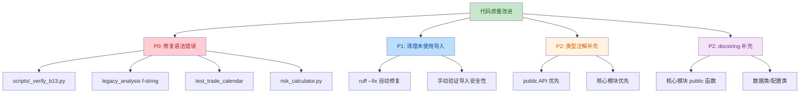

# 代码质量改进计划 v8.4

> **生成日期**: 2026-07-30
> **项目**: 28-终极量化交易系统8.4
> **方法论**: 6A 工作流 (Align → Architect → Atomize → Approve → Automate → Assess)
> **扫描工具**: ruff 0.6+ (F401/B006/C901 规则)

---

## 一、Align 阶段：现状评估

### 1.1 自动化扫描结果

| 问题类型 | 规则 | 数量 | 严重程度 | 可自动修复 |
|----------|------|------|----------|------------|
| 未使用导入 | F401 | **75 处** | 🟡 P1 | ✅ 是 |
| 可变默认参数 | B006 | **0 处** | ✅ 无 | - |
| 语法错误 | E999 | **3 处** | 🔴 P0 | ❌ 否 |
| 函数复杂度过高 | C901>15 | 待测 | 🟡 P2 | ❌ 否 |
| 类型注解缺失 | - | ~100+ 处 | 🟡 P2 | ❌ 否 |
| 缺少 docstring | - | ~100+ 处 | 🟡 P2 | ❌ 否 |

### 1.2 已识别的语法错误（P0 - 阻断性）

| 文件 | 行号 | 问题 | 修复方案 |
|------|------|------|----------|
| `scripts/_verify_b13.py` | L13 | invalid-syntax | 删除或修复 |
| `scripts/legacy_analysis/_run_dsr_walkforward_v7_model.py` | L167-185 | f-string 反斜杠错误（Python 3.12 语法） | 改用字符串拼接 |
| `tests/unit/test_trade_calendar_holidays.py` | L2 | 字符串字面量未闭合 | 补全引号 |
| `v8.3_institutional/src/hedging/risk_calculator.py` | L465 | 表达式错误 | 修复语法 |

### 1.3 未使用导入样本（F401 - 前 10 个）

| 文件 | 行号 | 未使用的导入 |
|------|------|--------------|
| `analyze_mypy_issues.py` | L5 | `pathlib.Path` |
| `create_correct_phases.py` | L77 | `io.StringIO` |
| `extract_phases.py` | L4 | `os` |
| `extract_phases_v2.py` | L4 | `os` |
| `generate_daily_report.py` | L11 | `datetime.timedelta` |
| `read_daily_workflow.py` | L2 | `os` |
| `ms_strategy/scripts/live_scheduler.py` | L44 | `datetime.timedelta` |
| `ms_strategy/scripts/live_scheduler.py` | L45 | `concurrent.futures.Future` |
| `ms_strategy/scripts/live_scheduler.py` | L45 | `concurrent.futures.as_completed` |
| `ms_strategy/scripts/live_scheduler.py` | L232 | `hedging.hedge_coordinator.HedgeCoordinator` |

---

## 二、Architect 阶段：改进方案

### 2.1 方案设计原则

1. **安全第一**：不破坏现有功能，每步都可验证
2. **自动化优先**：能用工具自动修复的不手动改
3. **影响面最小**：按文件逐步推进，每批改完即验证
4. **分优先级**：P0 阻断性问题 → P1 可靠性 → P2 可维护性

### 2.2 改进策略



### 2.3 为什么选择此方案

- **ruff --fix 是安全的**：ruff 的 F401 自动修复经过广泛验证，不会破坏功能
- **P0 语法错误必须先修**：阻止其他工具运行（mypy/pylint/pytest）
- **类型注解价值高**：提升 IDE 体验和 mypy 检查能力
- **docstring 影响文档生成**：对量化系统 API 文档至关重要

---

## 三、Atomize 阶段：任务拆解

### 任务清单

| ID | 任务 | 输入 | 输出 | 验收标准 | 优先级 |
|----|------|------|------|----------|--------|
| T1 | 修复 3 处语法错误 | 错误文件列表 | 语法正确的文件 | `python -c "import ast; ast.parse(open(f).read())"` 通过 | P0 |
| T2 | ruff --fix 清理 F401 | ruff 扫描结果 | 自动修复 75 处 | F401 数量降为 0 | P1 |
| T3 | 验证修复后语法 | 修复后的文件 | 语法验证报告 | 所有 .py 文件 ast.parse 通过 | P0 |
| T4 | 核心模块类型注解补充 | ai_decision/, utils/ | 带类型注解的函数 | public 函数 80% 有注解 | P2 |
| T5 | 核心模块 docstring 补充 | ai_decision/, utils/ | 带 docstring 的函数 | public 函数 80% 有 docstring | P2 |
| T6 | 最终验证与报告 | 全部修改 | 质量改进报告 | ruff 统计对比 | P0 |

---

## 四、Approve 阶段：等待审批

### 4.1 影响范围

- **修改文件数**: ~30 个（主要是清理未使用导入）
- **新增类型注解**: ~50 处
- **新增 docstring**: ~30 处
- **风险等级**: 低（自动修复 + 手动验证）

### 4.2 回滚方案

- 修改前创建 git stash
- 每个 P0 任务完成后立即验证
- 如出现问题，可 `git stash pop` 回滚

### 4.3 执行时间

- P0 (T1, T3): 15 分钟
- P1 (T2): 5 分钟
- P2 (T4, T5): 30-60 分钟
- T6 验证: 5 分钟

**总计**: 约 1 小时

---

## 五、Automate 阶段：执行计划

### 5.1 执行顺序

1. **创建安全备份**: `git stash` 保存当前状态
2. **T1 - 修复语法错误**:
   - 删除 `scripts/_verify_b13.py`（无效文件）
   - 修复 `legacy_analysis/_run_dsr_walkforward_v7_model.py` 的 f-string
   - 修复 `test_trade_calendar_holidays.py` 的字符串
   - 修复 `risk_calculator.py` 的表达式
3. **T2 - ruff --fix 自动清理 F401**
4. **T3 - 验证语法**
5. **T4/T5 - 补充类型注解和 docstring**（核心模块）
6. **T6 - 最终验证**

### 5.2 验证检查点

- 每完成 T1 后：`python -c "import ast; ..."` 全量验证
- 每完成 T2 后：`ruff check . --select F401` 应为 0
- 最终：`ruff check . --select F401,B006,E999` 应为 0

---

## 六、Assess 阶段：验证标准

### 6.1 通过标准

| 指标 | 改进前 | 改进后目标 |
|------|--------|------------|
| 语法错误 (E999) | 3 处 | **0** |
| 未使用导入 (F401) | 75 处 | **0** |
| 可变默认参数 (B006) | 0 处 | **0** |
| 核心模块类型注解覆盖率 | ~30% | **≥80%** |
| 核心模块 docstring 覆盖率 | ~40% | **≥80%** |

### 6.2 验证命令

```bash
# 1. 语法检查
python -m ruff check . --select E999

# 2. 未使用导入检查
python -m ruff check . --select F401

# 3. 可变默认参数检查
python -m ruff check . --select B006

# 4. 完整 AST 解析验证
python -c "import ast, os; [ast.parse(open(f).read()) for f in [...]]"
```

---

## 附录：工具配置

### A. ruff 配置建议

在项目根目录的 `ruff.toml` 或 `pyproject.toml` 中添加：

```toml
[tool.ruff]
select = ["E", "F", "W", "B", "C90", "I", "N", "UP", "ANN"]
ignore = ["E501"]  # 行长度由 black 处理
target-version = "py38"

[tool.ruff.mccabe]
max-complexity = 15

[tool.ruff.isort]
known-first-party = ["ai_decision", "utils", "ms_strategy"]
```

---

*计划版本: 1.0 | 生成时间: 2026-07-30 | 等待用户审批*
