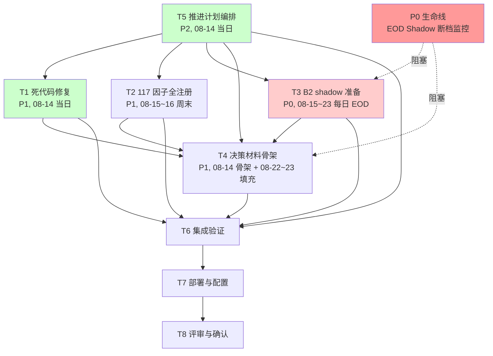

# 08-24 决策前推进计划

> **生成日期**: 2026-08-14
> **决策日**: 2026-08-24
> **来源**: `.codeartsdoer/specs/pre_decision_advance/{spec,design,tasks}.md`
> **状态**: 进行中
> **P0 生命线**: EOD Shadow 断档监控（08-14~23 每日），决策前禁止断档

---

## 一、任务总览

| ID | 模块 | 标题 | 优先级 | 排期 | 依赖 | 预估 | 状态 |
|----|------|------|--------|------|------|------|------|
| T1 | A | L148 风险预算分配死代码修复 | P1 | 08-14 当日 | 无 | 1.5h | ✅ 完成 |
| T2 | B | T5 G9 FeatureStore 117 因子全注册 | P1 | 08-15~16 周末 | 无 | 4h | ⬜ 未开始 |
| T3 | C | T4 Phase B B2 shadow 准备 | P0 | 08-15~23 每日 EOD | B1 健康 | 3h + 0.3h/日 | ⬜ 未开始 |
| T4 | D | T3 08-24 决策材料骨架搭建 | P1 | 08-14 骨架 + 08-22~23 填充 | T1/T2/T3 | 2h + 1.5h | 🔄 骨架进行中 |
| T5 | E | 推进计划编排与跟踪 | P2 | 08-14 当日 | 无 | 1h | ✅ 完成 |

---

## 二、5 任务清单与七属性

### T1 — L148 风险预算分配死代码修复

| 属性 | 值 |
|------|-----|
| id | T1 |
| name | L148 风险预算分配死代码修复 |
| priority | P1 |
| parallelizable | True（与 T2/T3 可并行） |
| blockers | 无 |
| expected_output | `utils/risk_budget_allocator.py` 条件顺序调整 + 特征化测试 + skip 测试 |
| schedule | 08-14 当日 |
| status | ✅ 完成 (2026-08-14) |

### T2 — T5 G9 FeatureStore 117 因子全注册

| 属性 | 值 |
|------|-----|
| id | T2 |
| name | T5 G9 FeatureStore 117 因子全注册 |
| priority | P1 |
| parallelizable | True（与 T1/T3 可并行） |
| blockers | 无 |
| expected_output | `scripts/register_all_factors_to_feature_store.py` + 注册报告 + 117 因子全注册 |
| schedule | 08-15~16 周末窗口 1 |
| status | ⬜ 未开始 |

### T3 — T4 Phase B B2 shadow 准备

| 属性 | 值 |
|------|-----|
| id | T3 |
| name | T4 Phase B B2 shadow 准备 |
| priority | P0（生命线） |
| parallelizable | False（独占 EOD 调度） |
| blockers | B1 已启用且健康（`phase_b_progressive_enabler.py --check` 处于 `drift_monitor` 阶段） |
| expected_output | `scripts/phase_b_b2_shadow_runner.py` + shadow 验证报告 + 预热 ≥3 天 + flag 不变式 |
| schedule | 08-15~23 每日 EOD |
| status | ⬜ 未开始 |

### T4 — T3 08-24 决策材料骨架搭建

| 属性 | 值 |
|------|-----|
| id | T4 |
| name | T3 08-24 决策材料骨架搭建 |
| priority | P1 |
| parallelizable | True（骨架部分可并行，填充部分依赖 T1/T2/T3） |
| blockers | T1（死代码修复完成）/ T2（因子全注册完成）/ T3（shadow 预热数据） |
| expected_output | `docs/自我进化框架/OBSERVATION_PERIOD_DECISION.md` 升至 v1.3-draft → v1.3 |
| schedule | 08-14 骨架 + 08-22~23 填充 |
| status | 🔄 骨架进行中 |

### T5 — 推进计划编排与跟踪

| 属性 | 值 |
|------|-----|
| id | T5 |
| name | 推进计划编排与跟踪 |
| priority | P2 |
| parallelizable | False（需最先完成以指导其余 4 任务） |
| blockers | 无 |
| expected_output | 本文档（`docs/自我进化框架/0824决策前推进计划_20260814.md`） |
| schedule | 08-14 当日 |
| status | ✅ 完成 (2026-08-14) |

---

## 三、阻塞关系 DAG

**P0 生命线说明**：
- EOD Shadow 断档监控（08-14~23 每日），决策前禁止断档
- 决策前禁止执行可能引入回归的高风险改动
- T3 B2 shadow 每日 EOD 运行，断档即告警

---

## 四、周末窗口排期表

| 日期 | 类型 | 任务 | 说明 |
|------|------|------|------|
| 08-14 (周五) | 交易日 | T5 + T1 + T4 骨架 | 轻量改动 + 纯文档框架 |
| 08-15~16 (周末窗口 1) | 周末 | T2 因子全注册 + T3 B2 shadow 首次运行 | 结构性改动，利用周末释放窗口 |
| 08-17~21 (交易日) | 交易日 | T3 每日 EOD shadow + P0 生命线监控 | 轻量任务，持续预热 |
| 08-22~23 (周末窗口 2) | 周末 | T4 决策材料填充 + T3 预热达标确认 | v1.3-draft → v1.3 |
| 08-24 (决策日) | 交易日 | Go/No-Go 判定 | 五任务全部就位，决策材料 v1.3 完整 |

**排期规则**：
- 结构性改动（T2 因子注册 / T3 B2 shadow / T4 决策材料填充）排至周末窗口
- 交易日仅排轻量任务（T1 死代码修复 / T4 骨架搭建 / T5 计划编排 / T3 每日 EOD / P0 监控）
- 若结构性改动被误排到交易日：拒绝排期，提示移至周末窗口

---

## 五、状态跟踪表

| 任务 | 状态 | 变更时间戳 | 阻塞原因 |
|------|------|-----------|----------|
| T1 | ✅ 完成 | 2026-08-14 | — |
| T2 | ⬜ 未开始 | — | — |
| T3 | ⬜ 未开始 | — | — |
| T4 | 🔄 进行中（骨架） | 2026-08-14 | — |
| T5 | ✅ 完成 | 2026-08-14 | — |

**状态变更规则**：
- 每任务状态变更记录时间戳与原因，禁止静默跳过
- 若任务实际阻塞但状态仍为"进行中"：巡检发现状态与实际不符，自动更新为"阻塞"并告警

---

## 六、关键里程碑

| 里程碑 | 时间 | 内容 |
|--------|------|------|
| M1 | 08-14 EOD | T1 + T5 + T4 骨架完成 |
| M2 | 08-16 EOD | T2 完成 + T3 预热 1 天 |
| M3 | 08-21 EOD | T3 预热 6 天（远超 ≥3 门槛） |
| M4 | 08-23 EOD | T4 填充完成 v1.3 + T3 预热 8 天 |
| M5 | 08-24 决策日 | 五任务全部就位，决策材料 v1.3 完整，执行 Go/No-Go 判定 |

---

## 七、关联文档

- 需求规格：`.codeartsdoer/specs/pre_decision_advance/spec.md`
- 技术设计：`.codeartsdoer/specs/pre_decision_advance/design.md`
- 任务分解：`.codeartsdoer/specs/pre_decision_advance/tasks.md`
- 决策材料：`docs/自我进化框架/OBSERVATION_PERIOD_DECISION.md`（v1.2 → v1.3-draft → v1.3）
- Phase B 调度器：`scripts/phase_b_progressive_enabler.py`
- Feature Flag 配置：`system_config.json` + `utils/infra/feature_flags.py`
