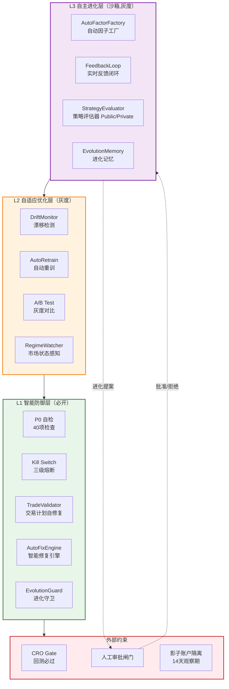
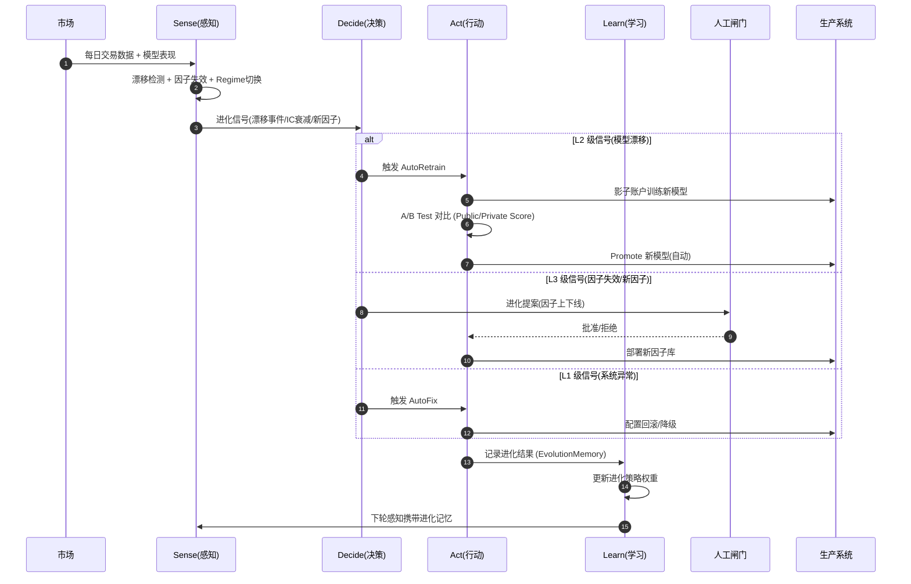
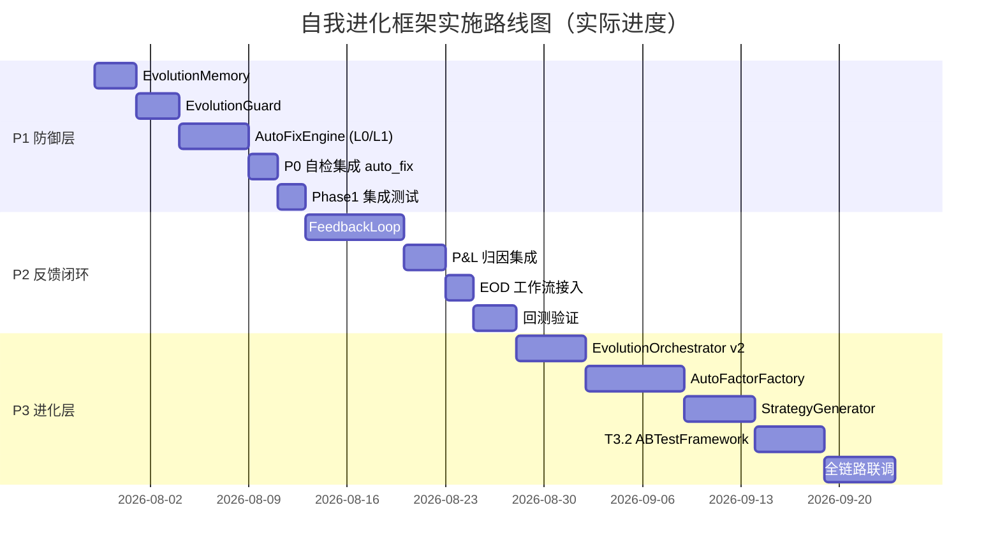

# ARCHITECTURE 自我进化框架（合并版）

> **文档类型**：架构设计方案
> **任务名**：自我进化框架
> **版本**：v2.0（合并版 — 整合 AIDE² 理论基础 + 三层落地架构）
> **创建日期**：2026-08-02
> **合并来源**：
> - 旧版 v1.0（2026-07-29，基于 AIDE² 双层优化循环，原位于 `docs/模块整合_8.4/`）
> - 新版 v1.0（2026-08-02，三层框架 L1/L2/L3，原位于 `docs/自我进化框架/`）
> **状态**：已交付并进入 Phase B 渐进启用（2026-09-08 更正；原"实施中 / T4.7 影子验证待启动"为 08-02 过时口径——T4.7 已于 08-04 验收 PASS，见 `FINENG_ACCEPTANCE_REPORT.md`）
> **关联模块**：`utils/evolution/`、`utils/alpha/`、`utils/system_check.py`、`utils/alpha_factor/`、`15_每日工作流/`
> **硬约束**：HC-1（Feature Flag 默认 False）/ HC-4（14 天观察期阻塞）/ HC-5（ConfigManager 4 级优先级）
> **完成进度**：22 任务中 22 完成（100%）— T4.7 影子验证器 + 阶段 B 渐进启用器 + T0.6 观察期追踪器全部交付 (2026-08-02)
> **启用状态注记（2026-09-08）**：Phase B 已推进至 orchestrator 最终阶段——B1 `USE_DRIFT_DETECTOR`（08-26）/ B2 `USE_FEEDBACK_LOOP`（08-27）/ B3 `USE_AUTO_RETRAIN`（09-01）等 9 个 flag 已启用，B4 `USE_MLOPS_PIPELINE` shadow warmup 中（达标约 09-09）。本文 §2.3 Feature Flag 表为 08-02 快照仅作历史参考；权威源 = `cairn/ROADMAP.md` + `reports/evolution/phase_b_status.json`。

---

## 0. 文档目的与设计哲学

基于对当前系统（v8.6.14）自进化能力的全面检视，融合 **AIDE² 递归自我改进思想** 与 **分层防御架构**，设计一套自我进化框架，将系统从"被动防御 + 人工迭代"升级为"主动进化 + 闭环自优化"，同时保持机构级风控的硬约束。

**设计哲学**：
- **可控进化**：进化方向必须可审计、可回滚、可熔断
- **分层解耦**：防御层（必开）→ 优化层（灰度）→ 进化层（沙箱）
- **人在环上**：关键进化决策保留人工审批闸门，避免失控
- **KISS 原则**：复用现有 DriftMonitor / AutoRetrain / P0 自检基础设施，不重造轮子
- **自适应而非自治**：人类始终在环（human-in-the-loop），特别是涉及实盘资金时

---

## 1. 背景与动机（源自 AIDE²）

### 1.1 AIDE² 核心思想

AIDE²（Weco AI, 2026-07-14）通过 **双层优化循环**（bi-level optimization）实现 Level 1 递归自我改进（RSI）：
- **外层**：强模型（Claude Opus）重写内层 agent 的 harness 代码
- **内层**：弱模型（Gemini Flash）在任务上运行，返回 public/private 分数
- **关键**：模型权重不动，改的是 harness（搜索策略/上下文管理/反作弊）

AIDE² 在 8 天 100 轮后超越人类工程师手工调优两年的版本，并在 3 个 held-out benchmark 上验证了二阶泛化。

### 1.2 量化系统与 AIDE² 的差异

| 维度 | AIDE² 环境 | 量化进化环境 | 应对策略 |
|------|-----------|-------------|---------|
| 目标函数 | 明确（代码性能） | 多重冲突（收益/风险/稳定性） | 加权评分体系 + Public/Private 分离 |
| 环境稳定性 | 评测数据固定 | 市场分布漂移 | DriftMonitor 4 维度检测 + 周期重训 |
| 试错成本 | Token + 算力 | 真金白银 | Shadow 影子账户先行 + 灰度发布 |
| Reward Hacking | 代码作弊 | 过拟合回测 | DSR + Purged K-Fold + PITChecker |
| 可解释性 | 不重要 | 极度重要（合规） | 完整审计日志 + 决策理由记录 |

### 1.3 定位：自适应系统，非完全自治

本框架的目标是 **自适应系统**（Adaptive System），而非 **完全自治**（Autonomous System）：
- 人类始终在环（human-in-the-loop），特别是涉及实盘资金时
- 新策略上线前必须通过 Shadow 14 天观察期
- 单策略累计改进幅度超阈值时触发人工审核
- 实盘资金分级推进：Shadow → 10% → 50% → 100%

---

## 2. 现状评估（As-Is）

### 2.1 能力盘点

| 层级 | 能力 | 现状 | 闭环完整度 |
|------|------|------|------------|
| **L1 防御层** | P0 启动自检 | ✅ 已实现，C1-C8 共 40 项检查 | 检测✅ / 阻断✅ / 修复⚠️(浅层) |
| **L1 防御层** | Kill Switch 三级熔断 | ✅ 已实现，触发即终止工作流 | 检测✅ / 阻断✅ / 修复❌ |
| **L1 防御层** | pre-commit 钩子 | ✅ 已实现，提交前自动 P0 自检 | 检测✅ / 阻断✅ / 修复❌ |
| **L1 防御层** | 交易计划自修复 | ⚠️ `trade_plan_validator.auto_fix()` 仅格式修复 | 检测✅ / 修复⚠️(浅层) |
| **L1 防御层** | AutoFixEngine 智能修复 | ✅ `utils/evolution/auto_fix_engine.py` 已实现 | 检测✅ / 修复✅(L0/L1) |
| **L1 防御层** | EvolutionGuard 五道防线 | ✅ `utils/evolution/guard.py` 已实现 | 频率✅ / 幅度✅ / 回滚✅ / 影子✅ / 熔断✅ |
| **L1 防御层** | P0 自检集成 auto_fix | ✅ `system_check.py` + `--auto-fix` CLI 参数 | 检测✅ / 修复✅ / 重检✅ |
| **L2 优化层** | 漂移检测 DriftMonitor | ⚠️ 已实现 ADWIN/IC/KS/PSI，Feature Flag 默认 False | 检测✅ / 触发❌ |
| **L2 优化层** | 自动重训 AutoRetrain | ⚠️ 3 模式已实现，Feature Flag 默认 False | 触发✅ / 验证❌ / 部署❌ |
| **L2 优化层** | MLOps 编排 | ⚠️ Train→Register→A/B→Promote 链路完整，未启用 | 全链路❌ |
| **L2 优化层** | V9 影子账户 | ✅ 10% 资金灰度 + Fail-fast 已实现 | 部署✅ / 回滚✅ |
| **L3 进化层** | EvolutionMemory 进化记忆 | ✅ `utils/evolution/memory.py` 已实现 | 记录✅ / 查询✅ / 学习✅ |
| **L3 进化层** | FeedbackLoop 实时反馈闭环 | ✅ `utils/evolution/feedback_loop.py` 已实现 | 权重更新✅ / 归因集成✅ / EOD接入✅ / 回测验证✅ |
| **L3 进化层** | AutoFactorFactory 自动因子工厂 | ✅ `utils/evolution/auto_factor_factory.py` 已实现 | 发现✅ / 验证✅ / 部署✅ / 监控✅ / 淘汰✅ |
| **L3 进化层** | StrategyGenerator 策略自动生成 | ✅ `utils/evolution/strategy_generator.py` 已实现 | 模板✅ / 生成✅ / 验证✅ / 部署✅ |
| **L3 进化层** | EvolutionOrchestratorV2 编排器 | ✅ `utils/evolution/orchestrator.py` 已实现 | L1✅ / L2✅ / L3✅ / Memory✅ / Guard✅ |

### 2.2 关键缺口

```
研究层 ───[人工桥接]──→ 生产层           ← 缺口1：自动因子工厂
生产层 ───[无反馈]───→ 改进              ← 缺口2：实时反馈闭环
防御层 ───[仅检测]───→ 修复              ← 缺口3：智能修复引擎
```

### 2.3 Feature Flag 现状

| Flag | 默认值 | 位置 | 启用风险 |
|------|--------|------|----------|
| `USE_AUTO_RETRAIN` | False | `config/system_config.json` | 低（影子账户隔离） |
| `USE_MLOPS_PIPELINE` | False | `config/system_config.json` | 中（涉及模型部署） |
| `USE_DRIFT_DETECTOR` | False | `config/system_config.json` | 低（仅监控） |
| `USE_FEEDBACK_LOOP` | False | `utils/evolution/feedback_loop.py` | 中（权重调整） |
| `USE_STRATEGY_GENERATOR` | False | `utils/evolution/strategy_generator.py` | 中（策略生成） |
| `USE_AUTO_FACTORY` | False | `utils/evolution/auto_factor_factory.py` | 高（因子部署） |

---

## 3. 目标愿景（To-Be）

### 3.1 自我进化的定义

系统具备以下四项能力，且形成闭环：

```
感知（Sense）→ 决策（Decide）→ 行动（Act）→ 学习（Learn）
   ↑                                                    │
   └────────────────────────────────────────────────────┘
```

| 能力 | 含义 | 对应组件 |
|------|------|----------|
| **感知** | 检测模型漂移、因子失效、市场状态切换、系统异常 | DriftMonitor + RegimeDetector + P0 自检 |
| **决策** | 判断是否需要重训、调参、切换策略、修复问题 | EvolutionOrchestrator |
| **行动** | 执行重训、调参、因子上下线、配置回滚 | AutoRetrain + AutoFactorFactory + AutoFixEngine |
| **学习** | 记录进化结果，更新进化策略本身 | FeedbackLoop + EvolutionMemory |

### 3.2 设计目标

| 指标 | 现状 | 目标 |
|------|------|------|
| 因子迭代周期 | 人工 1-2 周 | 自动 1-3 天 |
| 模型重训响应 | 人工触发 | 漂移自动触发 < 4 小时 |
| Bug 修复响应 | 人工介入 | 配置类自动 < 5 分钟 |
| 进化决策可审计 | 无 | 100% 决策留痕 |
| 进化过程可回滚 | 部分 | 100% 进化动作可一键回滚 |

### 3.3 不做什么（Out of Scope）

- ❌ **不自动修改交易策略核心逻辑**（Kelly/Risk Parity 公式由人工把关）
- ❌ **不自动调整风控参数**（止损阈值/VaR 上限由 CRO 签字）
- ❌ **不自动上线未通过回测的因子**（CRO Gate 不可绕过）
- ❌ **不自我修改代码后直接部署**（需 pre-commit + 人工 review）

---

## 4. 总体架构

### 4.1 量化版双层循环（源自 AIDE²）

```
┌─────────────────────────────────────────────────────────────┐
│  外层循环: 策略进化引擎 (Research Loop)                       │
│                                                             │
│  ┌─────────────┐   ┌─────────────┐   ┌─────────────┐       │
│  │ 1. 监控评估  │──▶│ 2. 问题诊断  │──▶│ 3. 假设生成  │       │
│  │ (Strategy   │   │ (DriftMonitor│   │ (LLM + 规则 │       │
│  │  Evaluator) │   │  + IC 衰减)  │   │  引擎)      │       │
│  └─────────────┘   └─────────────┘   └──────┬──────┘       │
│                                               │              │
│  ┌─────────────┐   ┌─────────────┐          ▼              │
│  │ 6. 知识沉淀  │◀──│ 5. 决策部署  │◀──┌─────────────┐       │
│  │ (决策日志   │   │ (晋升/回滚/  │   │ 4. A/B 测试 │       │
│  │  + 反馈循环)│   │  继续)       │   │ (ABTest     │       │
│  │             │   │             │   │  Framework) │       │
│  └─────────────┘   └─────────────┘   └─────────────┘       │
└─────────────────────────────────────────────────────────────┘
                         │
                         ▼ (新策略/参数配置)
┌─────────────────────────────────────────────────────────────┐
│  内层循环: 策略执行与评估 (Execution Loop)                    │
│                                                             │
│  • 接收外层的新策略/参数                                     │
│  • 在历史数据 + Shadow 账户中验证                            │
│  • 多维度量化评估 (StrategyEvaluator)                       │
│  • 返回 Public Score (agent 可见) + Private Score (外层用)   │
│  • Shadow 14 天观察期 → 灰度发布 → 全量上线                  │
└─────────────────────────────────────────────────────────────┘
```

### 4.2 三层落地架构（L1/L2/L3）

双层循环对应到三层落地架构，外层循环 = L2+L3，内层循环 = L1+L2：



### 4.3 层级职责

| 层级 | 职责 | 默认状态 | 失败影响 | 对应循环 |
|------|------|----------|----------|----------|
| **L1 防御层** | 阻止异常进入生产，保证系统稳定 | 必开 | 系统崩溃 | 内层循环 |
| **L2 优化层** | 模型/参数自适应调整，保持策略有效性 | 灰度 | 策略衰减 | 内层+外层 |
| **L3 进化层** | 因子/结构自主进化，提升策略竞争力 | 沙箱 | 错失机会 | 外层循环 |

### 4.4 进化数据流



### 4.5 Public/Private 分数分离（AIDE² 核心机制）

借鉴 AIDE² 的反作弊设计，本框架采用分数分离：

| 分数类型 | 可见性 | 用途 | 数据来源 |
|---------|--------|------|---------|
| **Public Score** | 内层 agent 可见 | 引导 agent 搜索方向 | 样本内 IC / 训练集 Sharpe |
| **Private Score** | 仅外层决策用 | 晋升/回滚决策 | 样本外 DSR / Walk-Forward Sharpe / PIT 通过率 |

**实现**：`StrategyEvaluator` 同时返回两个分数，内层 agent 只接收 public 部分，防止过拟合样本外。

---

## 5. 现有基础设施复用清单

### 5.1 验证工具（`v8.3_institutional/src/validation/`）

| 工具 | 文件 | 复用角色 |
|------|------|---------|
| **DeflatedSharpe** | `deflated_sharpe.py` | Private Score 核心 — 多重测试偏差校正 |
| **DSR Bootstrap** | `dsr_bootstrap.py` | 小样本场景 DSR 补充 |
| **WalkForward** | `walk_forward.py` | Private Score — Purged Walk-Forward CV |
| **PurgedKFold** | `purged_cv.py` | 反 reward hacking — 时序安全 CV |
| **PITChecker** | `pit_checker.py` | 反 reward hacking — 6 维度未来函数检测 |
| **PreDeployValidator** | `pre_deploy.py` | 部署前 7 项检查清单 |
| **StatSig** | `stat_sig.py` | Bootstrap CI + 置换检验 |
| **ParamSensitivity** | `parameter_sensitivity.py` | 参数稳定性评分 |
| **DynamicTarget** | `dynamic_target.py` | 动态目标阈值（防固定阈值操纵） |
| **CAGRDetection** | `cagr_decay.py` | 前后段 CAGR 衰减检测 |

### 5.2 Alpha 评估（`utils/alpha/`）

| 模块 | 文件 | 复用角色 |
|------|------|---------|
| **ShadowAccountAdapter** | `shadow_account_adapter.py` | Shadow 14 天观察期评估 + Fail-Fast |
| **ABTestFramework** | `ab_testing.py` | Champion/Challenger A/B 测试 |
| **DriftMonitor** | `drift_monitor.py` | 4 维度漂移检测（IC/ADWIN/KS/PSI） |
| **ModelRegistry** | `model_registry.py` | 模型版本管理 + 阶段转换 |
| **MLOpsPipeline** | `mlops_pipeline.py` | Facade 编排入口 |
| **AutoRetrainScheduler** | `auto_retrain_scheduler.py` | 自动重训调度 |

### 5.3 反 Reward Hacking 机制（已有 24 项）

本框架不重复造轮子，直接复用上述 24 项机制，重点关注：
- 多重测试偏差：DSR（n_trials 校正）
- 前视偏差：PITChecker + PurgedKFold
- 参数过拟合：ParameterSensitivity + DynamicTarget
- 实时风险：FailFastMonitor + GrayReleaseManager
- A/B 反作弊：多维度晋升阈值 + Cohen's d
- 模型治理：阶段转换合法性 + PRODUCTION 单例

---

## 6. 核心组件设计

### 6.1 StrategyEvaluator（策略多维评估器）— 源自旧版 AIDE²

**职责**：策略级/组合级评估，产出 Public/Private 分离的 ScoreReport，作为进化决策的客观依据。

**文件**：`utils/alpha/strategy_evaluator.py`（新增）
**定位**：区别于 `utils/alpha_evaluator.py` 的因子级 IC 评估
**Feature Flag**：`USE_STRATEGY_EVALUATOR`（默认 False，HC-1）

**核心 API**：

```python
@dataclass
class ScoreReport:
    """策略评分报告 — Public/Private 分离"""
    # Public Score (agent 可见)
    public_score: float                    # 样本内综合得分
    public_metrics: Dict[str, float]       # 训练集 IC / Sharpe
    # Private Score (外层决策用)
    private_score: float                   # 样本外综合得分
    private_metrics: Dict[str, float]      # DSR / WF Sharpe / PIT 通过率
    # 反作弊指标
    reward_hacking_risk: float             # 0.0-1.0, 越高越危险
    pit_violations: int                    # 未来函数违规数
    # 决策建议
    recommendation: str                    # promote / rollback / continue
    reason: str

class StrategyEvaluator:
    """量化策略多维评估器 (只读, 不影响基线)"""
    def evaluate(
        self,
        daily_returns: Sequence[float],
        dates: Optional[Sequence[str]] = None,
        signal_history: Optional[Dict] = None,
        n_trials: int = 100,
    ) -> ScoreReport: ...
```

**评分维度**：

| 维度 | Public/Private | 计算方法 | 权重 |
|------|---------------|---------|------|
| 绝对收益 | Public | 年化收益率 vs 基准 | 0.15 |
| 风险调整 | Public | 样本内 Sharpe | 0.15 |
| 稳定性 | Private | 最大回撤 vs 阈值 | 0.20 |
| 稳健性 | Private | Walk-Forward Sharpe 衰减率 | 0.20 |
| 反作弊 | Private | DSR + PIT 通过率 | 0.20 |
| 复杂度惩罚 | Private | 特征数 / 参数数 | 0.10 |

### 6.2 EvolutionOrchestrator（进化编排器）— 整合两版

**职责**：统一调度 L1/L2/L3 三层进化动作，整合 Evaluator + DriftMonitor + ABTestFramework + ModelRegistry，确保进化决策可审计、可回滚。

**文件**：`utils/evolution/orchestrator.py`（新增）
**Feature Flag**：`USE_EVOLUTION_ORCHESTRATOR`（默认 False，HC-1）

**设计原则**：
1. 所有进化动作必须先写入 EvolutionMemory（审计）
2. L3 级动作必须经人工闸门批准
3. 任何进化动作可一键回滚（RollbackStack）
4. Kill Switch 触发时立即冻结所有进化

**核心数据结构**：

```python
from dataclasses import dataclass
from enum import Enum


class EvolutionLevel(Enum):
    L1_DEFENSE = "L1"      # 防御层: 自动执行, 无需审批
    L2_OPTIMIZE = "L2"     # 优化层: 影子账户验证, 自动 Promote
    L3_EVOLVE = "L3"       # 进化层: 必须人工审批


@dataclass
class EvolutionProposal:
    """进化提案 — 所有进化动作的统一载体"""
    proposal_id: str
    level: EvolutionLevel
    action_type: str           # retrain / factor_deploy / config_rollback / auto_fix
    trigger_reason: str        # 触发原因(漂移事件/IC衰减/异常检测)
    target_module: str         # 目标模块
    proposed_change: dict      # 提案变更内容
    expected_impact: str       # 预期影响
    rollback_plan: str         # 回滚方案
    score_report: Optional[ScoreReport] = None  # 评估报告(含 Public/Private)
    requires_human_approval: bool = False  # L3 强制 True
    status: str = "pending"    # pending / approved / rejected / executed / rolled_back
```

**核心流程**（源自旧版 + 新版扩展）：
1. 从 `daily_returns.jsonl` 读取最新数据
2. 调用 `StrategyEvaluator.evaluate()` 得到 ScoreReport
3. 根据 private_score 和 reward_hacking_risk 决策：
   - private_score > 0.7 且 risk < 0.3 → 启动 A/B 测试
   - private_score < 0.3 或 risk > 0.7 → 触发重训
   - 其他 → 继续
4. L3 级提案路由到人工闸门
5. 记录决策日志到 `reports/evolution/decisions.jsonl` + EvolutionMemory

### 6.3 AutoFactorFactory（自动因子工厂）— 源自新版

**职责**：打通"研究层 → 生产层"的人工桥接，实现因子自动发现、验证、部署。

**文件**：`utils/evolution/auto_factor_factory.py`（新增）

**流水线设计**：

```
┌─────────────┐    ┌─────────────┐    ┌─────────────┐    ┌─────────────┐
│  Discovery  │───→│ Validation  │───→│ Deployment  │───→│ Monitoring  │
│  因子发现    │    │  因子验证    │    │  因子部署    │    │  因子监控    │
└─────────────┘    └─────────────┘    └─────────────┘    └─────────────┘
       │                  │                  │                  │
   QLib 3800股       CRO Gate           影子账户5日         IC<0.02
   LightGBM挖掘      Walk-Forward       A/B对比             持续20日
   遗传算法          8段压力测试         人工Code Review     自动下线
```

| 阶段 | 输入 | 输出 | 自动化程度 | 人工介入 |
|------|------|------|------------|----------|
| Discovery | 历史数据 + 因子模板 | 候选因子列表(含公式) | 全自动 | 无 |
| Validation | 候选因子 | 回测报告 + IC/IR/换手率 + Private Score | 全自动 | CRO 签字 |
| Deployment | 通过验证的因子 | 生产代码 + library.py 注册 | 半自动 | Code Review |
| Monitoring | 生产因子表现 | 失效告警 + 下线建议 | 全自动 | 无 |
| Retirement | 失效因子 | 下线 + 归档 | 全自动 | 无 |

**与现有系统集成**：

```python
# 复用现有模块,不重造轮子
from research.factor_discovery_enhanced import discover_factors  # 发现
from ms_strategy.src.backtest.walk_forward import walk_forward   # 验证
from utils.alpha_factor.library import AlphaFactorLibrary        # 部署
from utils.alpha.drift_monitor import DriftMonitor               # 监控
```

### 6.4 FeedbackLoop（实时反馈闭环）— 源自新版

**职责**：将每日交易结果反馈到因子权重和模型参数，形成"交易→学习→改进"闭环。

**文件**：`utils/evolution/feedback_loop.py`（新增）

**反馈链路**：每日 P&L → 归因分析 → 因子贡献度 → 权重调整 → 次日决策

**反馈机制**：

| 反馈信号 | 来源 | 作用对象 | 调整幅度 |
|----------|------|----------|----------|
| 因子 IC 衰减 | DriftMonitor | 因子权重 | ≤ 5%/日 |
| 因子 P&L 贡献 | 归因分析 | 因子权重 | ≤ 10%/日 |
| 模型预测误差 | 实盘 vs 预测 | 模型集成权重 | ≤ 3%/日 |
| 市场状态切换 | RegimeWatcher | 策略权重分配 | 按状态规则 |

**调整算法**（基于贝叶斯更新）：

```python
def update_factor_weight(
    current_weight: float,
    factor_ic: float,           # 近期 IC
    factor_pnl_contribution: float,  # P&L 贡献
    confidence: float = 0.1,    # 学习率(保守)
) -> float:
    """
    贝叶斯式权重更新 — 近期表现好的因子增权,差的减权

    约束:
    - 单日调整 ≤ 10%
    - 权重范围 [0, 0.3] (单因子上限 30%)
    - 总权重归一化
    """
    performance_score = 0.6 * normalize(factor_ic) + 0.4 * normalize(factor_pnl_contribution)
    adjustment = confidence * performance_score
    new_weight = current_weight * (1 + adjustment)

    # 单日调整幅度限制
    max_change = 0.10
    new_weight = clip(new_weight,
                      current_weight * (1 - max_change),
                      current_weight * (1 + max_change))

    return clip(new_weight, 0, 0.3)
```

### 6.5 AutoFixEngine（智能修复引擎）— 源自新版

**职责**：扩展 P0 自检系统，从"仅检测"升级为"检测 + 修复"，处理配置类、数据源类、依赖类问题。

**文件**：`utils/evolution/auto_fix_engine.py`（新增）

**修复范围（按风险分级）**：

| 风险等级 | 修复范围 | 自动执行 |
|----------|----------|----------|
| L0 零风险 | 配置 Schema 修复 / 数据源降级切换 / 缓存过期清理 / 临时文件清理 | ✅ 自动 |
| L1 低风险 | positions.json 字段补全 / heartbeat 字段名兼容 / sys.path 注入修复 | ✅ 自动(记录) |
| L2 中风险 | 模型文件损坏恢复 / 因子库代码 Bug 生成 Patch / 依赖版本冲突建议 | ❌ 仅建议 |
| 高风险 | 交易逻辑 Bug / 风控参数异常 / 持仓数据不一致 | ❌ 仅告警 |

**与 P0 自检集成**：

```python
# 扩展 utils/system_check.py
def assert_system_ready(auto_fix: bool = False):
    """
    P0 自检 — 新增 auto_fix 参数

    auto_fix=False (默认): 仅检测,失败则 sys.exit(1)
    auto_fix=True: 检测 + L0/L1 自动修复,修复后重检
    """
    results = run_all_checks()
    failures = [r for r in results if not r.passed]

    if not failures:
        return  # 全部通过

    if auto_fix:
        for failure in failures:
            fix_result = AutoFixEngine.try_fix(failure)
            if fix_result.fixed:
                log_audit(f"自动修复: {failure.check_id} → {fix_result.action}")

    # 修复后重检
    results = run_all_checks()
    failures = [r for r in results if not r.passed]

    if failures:
        raise SystemExit(1)  # 仍有失败,阻断
```

### 6.6 EvolutionGuard（进化守卫）— 源自新版

**职责**：防止进化失控，对每一个进化动作施加五道硬约束。

**文件**：`utils/evolution/guard.py`（新增）

**五道防线**：

| 防线 | 约束 | 触发动作 |
|------|------|----------|
| 1. 频率限制 | 同模块 24h 内进化 ≤ 1 次 | 拒绝超频提案 |
| 2. 幅度限制 | 单次权重调整 ≤ 10% | 截断超额调整 |
| 3. 回滚就绪 | 所有进化动作必须先准备回滚 | 拒绝无回滚方案 |
| 4. 影子隔离 | L3 进化必须先在影子账户跑 5 日 | 拒绝直接生产部署 |
| 5. 熔断冻结 | Kill Switch 触发时冻结所有进化 | 立即冻结 + 通知 |

```python
class EvolutionGuard:
    """进化守卫 — 五道硬约束,防止进化失控"""

    DAILY_EVOLUTION_LIMIT = 1        # 同模块日进化上限
    MAX_WEIGHT_CHANGE = 0.10         # 单次权重调整上限
    SHADOW_DAYS_REQUIRED = 5         # 影子账户最短运行天数

    def check_proposal(self, proposal: EvolutionProposal) -> tuple[bool, str]:
        """检查提案是否通过所有防线"""
        checks = [
            self._check_frequency(proposal),     # 防线1: 频率
            self._check_magnitude(proposal),     # 防线2: 幅度
            self._check_rollback_ready(proposal),# 防线3: 回滚
            self._check_shadow_isolation(proposal),  # 防线4: 影子
            self._check_kill_switch_frozen(),    # 防线5: 熔断
        ]
        for passed, reason in checks:
            if not passed:
                return False, reason
        return True, "通过所有防线"
```

### 6.7 EvolutionMemory（进化记忆）— 源自新版

**职责**：记录所有进化动作及其结果，作为未来进化决策的参考，实现"学习"能力。

**文件**：`utils/evolution/memory.py`（新增）

**存储结构**：

```json
{
  "proposal_id": "EVO-20260802-001",
  "timestamp": "2026-08-02T14:30:00",
  "level": "L2",
  "action_type": "retrain",
  "trigger_reason": "LGB模型 IC 从 0.08 衰减至 0.02,触发漂移",
  "target_module": "lgb_enhanced_trainer",
  "score_report": {
    "public_score": 0.72,
    "private_score": 0.68,
    "reward_hacking_risk": 0.15,
    "recommendation": "promote"
  },
  "executed_at": "2026-08-02T15:00:00",
  "result": {
    "status": "promoted",
    "old_model_ic": 0.02,
    "new_model_ic": 0.075,
    "shadow_test_days": 5,
    "ab_test_sharpe_improvement": 0.15
  },
  "rollback_plan": "回滚至 v8.6.14 基线模型",
  "learned": "夏季低波动期 IC 衰减是季节性现象,重训有效"
}
```

**学习应用**：

| 场景 | 学习应用方式 |
|------|-------------|
| 相同漂移重复出现 | 自动应用历史最优重训策略 |
| 因子失效模式 | 更新因子挖掘的筛选规则 |
| 修复方案有效性 | 提升同类问题的修复策略优先级 |
| 进化失败案例 | 标记为"高危进化",未来需更严格审批 |

---

## 7. 实施路线图

### 7.1 四阶段实施（整合新版 P0-P3 + 旧版 4 阶段）



### 7.2 P0：启用现有能力（1 周，零代码改动）

**目标**：将已实现但默认关闭的自进化能力激活，立即获得 L2 优化层能力。

**步骤**：
1. 启用 DriftMonitor（`USE_DRIFT_DETECTOR: true`）— 风险：零（仅监控）
2. 启用 AutoRetrain 影子模式（`USE_AUTO_RETRAIN: true`）— 风险：低（影子隔离）
3. 启用 MLOps Pipeline（`USE_MLOPS_PIPELINE: true`）— 风险：中（影子隔离）
4. 7 日验证期

**验收标准**：
- ✅ DriftMonitor 正确检测到至少 1 次模型漂移
- ✅ AutoRetrain 在漂移触发后 4 小时内完成训练
- ✅ 影子账户 7 日表现优于基线或持平

### 7.3 P1：评估器 + 防御层加固（2 周）

**目标**：实现 StrategyEvaluator 原型 + AutoFixEngine + EvolutionGuard，建立"客观衡量好坏"和"检测+修复"能力。

**新增文件**：
```
utils/evolution/
├── __init__.py
├── auto_fix_engine.py     # 智能修复引擎
├── guard.py               # 进化守卫
└── memory.py              # 进化记忆(提前实现,供 P1 使用)
utils/alpha/
└── strategy_evaluator.py  # 策略评估器(Public/Private 分离)
```

**关键交付物**：
- `StrategyEvaluator` 实现 Public/Private 分数分离（AIDE² 核心）
- `AutoFixEngine` 实现 L0/L1 级修复
- `system_check.py` 新增 `auto_fix` 参数
- `EvolutionGuard` 五道防线实现
- `EvolutionMemory` 审计日志写入

**约束**（源自旧版）：
- 评估器只读 `reports/shadow/daily_returns.jsonl`，不写入生产路径
- 不修改 V9 策略代码
- Feature Flag 默认 False

**验收标准**：
- ✅ StrategyEvaluator 返回 Public/Private 分离的 ScoreReport
- ✅ P0 自检 `--auto-fix` 模式下，配置类问题自动修复率 ≥ 80%
- ✅ EvolutionGuard 阻止 100% 的超频/超幅进化提案

### 7.4 P2：反馈闭环（2 周）

**目标**：实现 FeedbackLoop，打通"交易→学习→改进"链路。

**关键交付物**：
- 每日 P&L 归因分析集成
- 因子权重贝叶斯更新算法
- 7 日移动平均去噪
- 权重调整审计 + 人工告警（偏移 > 30%）

**验收标准**：
- ✅ 因子权重每日自动调整，单日幅度 ≤ 10%
- ✅ 7 日累计偏移 > 30% 时触发人工告警
- ✅ 回测显示反馈闭环提升年化收益 0.5-1.5%

### 7.5 P3：进化层 + 策略自动生成（4 周）

**目标**：实现 AutoFactorFactory、StrategyGenerator 和 EvolutionOrchestrator，完成三层框架；策略自动生成替代人工策略设计。

**新增文件**：
```
utils/evolution/
├── auto_factor_factory.py   # 自动因子工厂
├── strategy_generator.py    # 策略自动生成器
├── orchestrator.py          # 进化编排器
└── tests/                   # 进化框架测试套件 (478 用例)
```

**关键交付物**：
- 因子自动发现 → 验证 → 部署 → 监控 → 淘汰全流水线
- 基于进化记忆的模板策略自动生成
- EvolutionOrchestrator 统一调度三层进化
- 人工审批闸门（L3 级进化）

**验收标准**：
- ✅ 因子迭代周期从 1-2 周缩短至 1-3 天
- ✅ 8 种策略模板 + 5 种权重分配方法
- ✅ 68 个 StrategyGenerator 单测全部通过
- ✅ L3 级进化 100% 经人工审批
- ✅ 所有进化动作可一键回滚

### 7.6 第 4 阶段：完整双层闭环（2026-10-01+）

**目标**（源自旧版）：无人值守的进化管道（人类仅审批实盘上线）

| 任务 | 说明 |
|------|------|
| 外层循环自动化 | 每周触发一次完整进化循环 |
| 反馈闭环 | 失败案例反馈给 LLM，避免重复犯错 |
| 安全护栏 | 累计改进 > 阈值触发人工审核 |

---

## 8. 风险控制与安全护栏

### 8.1 进化失控风险

| 风险场景 | 概率 | 影响 | 缓解措施 |
|----------|------|------|----------|
| 反馈闭环震荡（权重反复调整） | 中 | 策略不稳定 | 单日 ≤10% + 7日去噪 + EvolutionGuard |
| 自动因子过拟合 | 高 | 实盘表现差 | CRO Gate + 影子账户 5 日 + 人工 Code Review + Public/Private 分离 |
| 模型重训退化 | 中 | 收益下降 | A/B Test + Promote 条件 + 一键回滚 |
| 修复引擎误修复 | 低 | 配置错乱 | L0/L1/L2 分级 + 高风险仅建议 |
| 进化级联失败 | 低 | 系统崩溃 | Kill Switch 冻结所有进化 |
| Reward Hacking | 高 | 过拟合回测 | DSR + Purged K-Fold + PITChecker（复用 24 项机制） |

### 8.2 进化安全约束（合并两版）

| 约束 | 阈值 | 触发动作 |
|------|------|---------|
| 单策略累计改进 | > 20%（参数变化） | 触发人工审核 |
| Private Score 退化 | > 0.3（绝对值） | 自动回滚 |
| Reward Hacking Risk | > 0.7 | 禁止晋升 |
| PIT 违规 | ≥ 1 | 禁止晋升 |
| DSR 未通过 | < 0.95 | 禁止晋升 |
| Shadow 观察期 | < 14 天 | 禁止推进 Stage 2 |
| Fail-Fast 触发 | 任意 | 立即终止 + 人工介入 |
| 单日权重调整 | > 10% | 截断 |
| 7 日累计权重偏移 | > 30% | 人工告警 |

### 8.3 安全边界（不可逾越）

```
┌─────────────────────────────────────────────────────────┐
│  以下领域,进化框架不可触碰(硬约束):                       │
│                                                         │
│  1. 风控参数(止损阈值/VaR上限/单标的上限) — 仅 CRO 可改  │
│  2. 交易核心公式(Kelly/Risk Parity) — 仅 PM 可改        │
│  3. 持仓数据(positions.json) — 仅交易执行器可写         │
│  4. 资金账户结构 — 仅 PM 可改                            │
│  5. Kill Switch 阈值 — 仅 CRO 可改                      │
│  6. V9 训练/推理路径 — 不可破坏(HC-1)                    │
│                                                         │
│  违反任何一条 → 进化框架立即冻结 + 告警                  │
└─────────────────────────────────────────────────────────┘
```

### 8.4 熔断机制

| 触发条件 | 熔断动作 | 恢复方式 |
|----------|----------|----------|
| Kill Switch L2 触发 | 冻结 L2/L3 进化 24h | 人工解除 |
| 影子账户日回撤 > 3% | 冻结 L3 进化 + 回滚最近进化 | 人工审计 |
| 进化失败率 > 30%（7日） | 暂停自动进化 | 人工根因分析 |
| EvolutionMemory 写入失败 | 拒绝所有进化（审计优先） | 修复存储后恢复 |

### 8.5 人工审核触发条件

- 任何策略晋升到 PRODUCTION 前
- 累计改进幅度超过 20%
- Reward Hacking Risk > 0.5（即使 Private Score 高）
- 连续 3 次进化失败（A/B 测试未通过）

---

## 9. 验证计划

### 9.1 评估器原型验证

| 测试项 | 方法 | 预期结果 |
|--------|------|---------|
| 空数据容错 | 传入空列表 | 返回全零 ScoreReport，不抛异常 |
| 小样本容错 | 传入 < 20 条 | Public Score 正常，Private Score 标记"数据不足" |
| 正常数据 | 传入 ≥ 252 条 | 返回完整 ScoreReport，各维度得分合理 |
| Public/Private 分离 | 检查返回结构 | public_score ≠ private_score（样本内 ≠ 样本外） |
| 反作弊检测 | 传入过拟合数据 | reward_hacking_risk > 0.5 |
| 与现有数据兼容 | 读取 daily_returns.jsonl | 正常解析，不修改原文件 |

### 9.2 集成验证（观察期后）

| 测试项 | 方法 | 预期结果 |
|--------|------|---------|
| DriftMonitor 触发 | 模拟 IC 衰减 | 触发重训请求 |
| ABTest 全流程 | 创建测试 → 记录 → 评估 | 返回 promote/rollback 建议 |
| MLOpsPipeline 编排 | 调用 register_and_test | 模型注册 + A/B 启动 |
| 安全护栏 | 模拟超阈值改进 | 触发人工审核 |
| AutoFixEngine | 模拟配置缺失 | L0 自动修复 + 重检通过 |

---

## 10. 与现有系统集成方案

### 10.1 集成点清单

| 现有模块 | 集成方式 | 改动量 |
|----------|----------|--------|
| `utils/system_check.py` | 新增 `auto_fix` 参数，调用 AutoFixEngine | +50 行 |
| `utils/alpha/drift_monitor.py` | 启用 Feature Flag，输出接入 Orchestrator | +20 行 |
| `utils/alpha/auto_retrain_scheduler.py` | 启用 Feature Flag，接受 Orchestrator 调度 | +30 行 |
| `utils/alpha_factor/library.py` | 暴露因子注册接口，供 AutoFactorFactory 调用 | +40 行 |
| `utils/kill_switch.py` | 触发时通知 EvolutionGuard 冻结 | +10 行 |
| `v8.3_institutional/daily_workflow.py` | Phase 10 末尾接入数据收集钩子(只读) | +30 行 |
| `config/system_config.json` | 新增 evolution 配置段 | +配置 |

### 10.2 配置扩展

```json
// config/system_config.json 新增 evolution 段
{
  "evolution": {
    "enabled": true,
    "levels": {
      "L1_defense": { "enabled": true, "auto_fix": true },
      "L2_optimize": { "enabled": true, "shadow_mode": true },
      "L3_evolve": { "enabled": false, "requires_approval": true }
    },
    "guard": {
      "daily_evolution_limit": 1,
      "max_weight_change": 0.10,
      "shadow_days_required": 5
    },
    "feedback_loop": {
      "enabled": true,
      "learning_rate": 0.1,
      "max_daily_change": 0.10,
      "alarm_threshold_7d": 0.30
    },
    "feature_flags": {
      "USE_STRATEGY_EVALUATOR": false,
      "USE_EVOLUTION_ORCHESTRATOR": false,
      "USE_AUTO_RETRAIN": false,
      "USE_MLOPS_PIPELINE": false,
      "USE_DRIFT_DETECTOR": false
    }
  }
}
```

### 10.3 目录结构（新增）

```
utils/evolution/
├── __init__.py                  # 包入口, v0.7.0
├── orchestrator.py              # 进化编排器(中枢)
├── auto_factor_factory.py       # 自动因子工厂
├── strategy_generator.py        # ★T3.4 策略自动生成器
├── feedback_loop.py             # 实时反馈闭环
├── pnl_attribution_adapter.py   # P&L归因适配器
├── eod_feedback_integration.py  # EOD工作流集成
├── auto_fix_engine.py           # 智能修复引擎
├── guard.py                     # 进化守卫
├── memory.py                    # 进化记忆
└── tests/
    ├── test_orchestrator_v2.py
    ├── test_guard.py
    ├── test_feedback_loop.py
    ├── test_auto_factor_factory.py
    ├── test_strategy_generator.py  # ★T3.4 68用例
    ├── test_auto_fix_engine.py
    ├── test_pnl_attribution_adapter.py
    ├── test_eod_feedback_integration.py
    ├── test_phase1_integration.py
    └── test_system_check_autofix_integration.py

utils/alpha/
├── strategy_evaluator.py        # 策略评估器(Public/Private 分离)
├── strategy_ideation.py         # LLM 策略思想生成(P3 阶段)
└── hypothesis_tester.py         # 假设验证框架(P3 阶段)

docs/自我进化框架/
├── ARCHITECTURE_自我进化框架.md  # 本文档(合并版)
└── TASK_自我进化框架.md          # 任务拆解(待 Atomize 阶段生成)
```

### 10.4 与 V9 基线的关系

```
                    ┌──────────────────────┐
                    │  V9 策略基线 (不动)   │  HC-1 硬约束
                    └──────────┬───────────┘
                               │
                    ┌──────────▼───────────┐
                    │  Shadow 观察期 (14天) │  HC-4 硬约束
                    │  ShadowAccountAdapter │
                    └──────────┬───────────┘
                               │
                    ┌──────────▼───────────┐
                    │  StrategyEvaluator    │  ← P1 阶段 (只读)
                    │  (评估器原型)         │
                    └──────────┬───────────┘
                               │
                    ┌──────────▼───────────┐
                    │  EvolutionOrchestrator│  ← P3 阶段
                    │  (进化编排器)         │
                    └──────────┬───────────┘
                               │
              ┌────────────────┼────────────────┐
              │                │                │
    ┌─────────▼──────┐ ┌──────▼───────┐ ┌──────▼───────┐
    │ MLOpsPipeline  │ │ DriftMonitor │ │ ABTestFrame  │
    │ (Facade)       │ │ (4 维度)     │ │ work (C/C)   │
    └────────────────┘ └──────────────┘ └──────────────┘
              │                │                │
    ┌─────────▼──────┐ ┌──────▼───────┐ ┌──────▼───────┐
    │ ModelRegistry  │ │ AutoRetrain  │ │ Strategy     │  ← P3 阶段
    │ (版本管理)     │ │ Scheduler    │ │ Ideation(LLM)│
    └────────────────┘ └──────────────┘ └──────────────┘
```

---

## 11. 关键设计决策

### 11.1 为什么评估器放在 `utils/alpha/` 而非 `utils/eval/`？

- 现有 alpha 评估模块全部在 `utils/alpha/`（ShadowAccountAdapter, ABTestFramework, DriftMonitor, ModelRegistry, MLOpsPipeline）
- `utils/eval/` 目录不存在，新建会破坏现有命名约定
- 评估器需要与上述模块紧密协作，放在同一目录便于导入和依赖管理

### 11.2 为什么用 Public/Private 分数分离？

- AIDE² 的经验：这是防止 reward hacking 的最有效机制
- 量化场景：内层 agent（参数搜索/策略生成）只看到样本内表现，防止过拟合样本外
- 外层决策：基于样本外 DSR + Walk-Forward + PIT 做晋升决策

### 11.3 为什么观察期内只做评估器原型？

- HC-4 硬约束：14 天观察期内不修改 V9 基线
- 评估器是只读的，不影响基线，可安全开发
- 评估器是后续所有阶段的基础，必须先建立"衡量好坏"的能力
- 观察期结束后，评估器可直接接入 P2 的自动化重训

### 11.4 为什么不直接用 MLOpsPipeline 作为进化编排器？

- MLOpsPipeline 专注于模型生命周期（注册/A/B/漂移/重训）
- 进化编排器需要额外的：策略评估、LLM 假设生成、知识沉淀、反馈闭环
- 两者是互补关系：EvolutionOrchestrator 调用 MLOpsPipeline 的子模块

### 11.5 为什么选择三层而非两层架构？

- AIDE² 的双层循环（外层进化/内层执行）是逻辑抽象
- 落地时需要明确"哪些自动执行、哪些需审批、哪些仅监控"
- L1/L2/L3 三层对应"自动/灰度/沙箱"三种部署状态，便于 Feature Flag 控制
- 双层循环映射：外层 = L2+L3，内层 = L1+L2

---

## 12. 6A 工作流进度

| 阶段 | 状态 | 产出 |
|------|------|------|
| 1. Align（对齐） | ✅ 完成 | 现状评估见 §2，已对齐现有模块 + AIDE² 理论 |
| 2. Architect（架构） | ✅ 完成 | 本文档（合并版 v2.0） |
| 3. Atomize（原子化） | ✅ 完成 | `TASK_自我进化框架.md` 已生成，Phase 1-3 全部完成，Phase 4 T4.1-T4.6 完成 (2026-08-02) |
| 4. Approve（审批） | ✅ 决策点默认采用 (2026-08-02) | 决策点 P0=保守(B) / L3=仅超阈值 / AutoFix=L0+L1 / 学习率=保守(0.01) |
| 5. Automate（执行） | ✅ 完成 (2026-08-02) | Phase 4 金融工程内核 7/7 全部完成，阶段 B 渐进启用器就绪 |
| 6. Assess（评估） | 🔄 进行中 | 观察期 2026-07-23 → 预计 2026-08-08 满 14 日 → 阶段 B 自动启动 (--auto) |

---

## 13. 决策点（待用户确认）

以下决策点需用户在 Approve 阶段确认后，方可进入 Atomize 阶段：

1. **P0 启用方式**：是否立即启用 DriftMonitor/AutoRetrain/MLOps 三个 Feature Flag？
   - 选项 A：三个全部启用（激进，1 周内见效）
   - 选项 B：仅启用 DriftMonitor（保守，先观察 7 日）
   - 选项 C：暂不启用，先完成 P1 防御层（最保守）

2. **L3 人工审批粒度**：L3 级进化（因子上下线）的人工审批是必须还是可选？
   - 选项 A：必须审批（安全，但因子迭代慢）
   - 选项 B：影子账户表现 > 基线 × 1.2 且 Private Score > 0.7 时自动通过（平衡速度与安全）

3. **AutoFixEngine 修复范围**：L1 级修复（sys.path 注入、字段兼容）是否自动执行？
   - 选项 A：自动执行 + 审计（推荐）
   - 选项 B：仅建议，需人工确认

4. **FeedbackLoop 学习率**：初始学习率 0.1 是否合适？
   - 选项 A：0.1（保守，推荐）
   - 选项 B：0.05（更保守）
   - 选项 C：0.2（激进，迭代快但风险高）

---

## 14. 附录

### 14.1 术语表

| 术语 | 含义 |
|------|------|
| 进化（Evolution） | 系统在无需人工干预下改进自身的能力 |
| RSI（Recursive Self-Improvement） | 递归自我改进，AIDE² 的 Level 1 |
| 漂移（Drift） | 模型/因子性能随时间衰减的现象 |
| 影子账户（Shadow） | 10% 资金灰度运行，用于验证进化效果 |
| CRO Gate | 首席风险官闸门，回测必过检查清单 |
| Feature Flag | 功能开关，用于灰度启用/禁用功能 |
| Public/Private Score | AIDE² 分数分离机制，防 reward hacking |
| DSR | Deflated Sharpe Ratio，多重测试偏差校正 |

### 14.2 参考资料

- [AIDE²: First Evidence of Recursive Self-Improvement — Weco AI](https://www.weco.ai/blog/first-evidence-of-recursive-self-improvement)
- [4 Levels of Recursive Self-Improvement — Weco AI](https://www.weco.ai/blog/4-levels-of-recursive-self-improvement)
- [AIDE² Explained — mer.vin](https://mer.vin/2026/07/aide%C2%B2-explained-weco-ais-level-1-recursive-self-improvement-in-8-days/)
- Bailey, D. & López de Prado, M. (2014) "The Deflated Sharpe Ratio"
- López de Prado, M. "Advances in Financial Machine Learning" Ch.7 (Purged K-Fold)

### 14.3 参考文档

- [AGENTS.md](../../AGENTS.md) — 项目规范
- [CHANGELOG.md](../../CHANGELOG.md) — v8.6.14 变更记录
- [utils/alpha/drift_monitor.py](../../utils/alpha/drift_monitor.py) — 漂移检测现有实现
- [utils/alpha/auto_retrain_scheduler.py](../../utils/alpha/auto_retrain_scheduler.py) — 自动重训现有实现
- [utils/alpha/mlops_pipeline.py](../../utils/alpha/mlops_pipeline.py) — MLOps 编排现有实现
- [utils/system_check.py](../../utils/system_check.py) — P0 自检系统
- [utils/alpha_factor/library.py](../../utils/alpha_factor/library.py) — 因子库聚合入口
- [v8.3_institutional/src/validation/](../../v8.3_institutional/src/validation/) — 验证工具集（24 项反 Reward Hacking 机制）

---

**文档版本**：v2.0（合并版）
**合并来源**：旧版 v1.0（AIDE² 双层循环）+ 新版 v1.0（三层落地架构）
**创建者**：AI 架构师
**审核状态**：决策点已默认确认 (B/仅超阈值/L0+L1/保守, 2026-08-02)
**下一步**：观察期满 14 日 (预计 2026-08-08) → `py scripts/phase_b_progressive_enabler.py --auto` → 4 阶段渐进启用进化闭环
