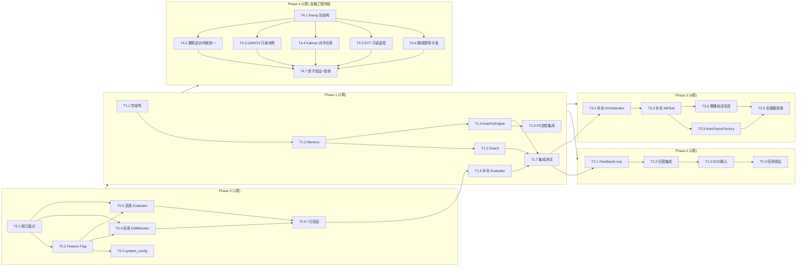

# TASK 自我进化框架（6A 阶段 3：Atomize）

> **原子化任务清单**：将 ARCHITECTURE v2.0 合并版拆解为可执行任务
> **创建日期**：2026-08-02
> **任务编号**：MIG-EVO-TASK-001
> **任务粒度**：每个任务 1-3 天可完成，明确输入/输出/验收标准
> **关联架构**：`docs/自我进化框架/ARCHITECTURE_自我进化框架.md` v2.0

---

## 0. 现状基线（关键发现）

经盘点，现有系统**已有 7 个核心模块骨架**，并非从零开始。本计划采用"补全已有 + 新建缺失 + 集成启用"策略。

### 0.1 已有模块清单（`utils/alpha/`）

| 文件 | 大小 | 关键类 | Feature Flag | 状态 |
|------|------|--------|--------------|------|
| `strategy_evaluator.py` | 34KB | `StrategyEvaluator.evaluate()` | `USE_STRATEGY_EVALUATOR` | ⚠️ 部分实现 |
| `evolution_orchestrator.py` | 25KB | `EvolutionOrchestrator.run_cycle()` | `USE_EVOLUTION_ORCHESTRATOR` | ⚠️ 部分实现 |
| `drift_monitor.py` | 37KB | `DriftMonitor.detect_drift()` | `USE_DRIFT_DETECTOR` | ⚠️ 部分实现 |
| `auto_retrain_scheduler.py` | 24KB | `AutoRetrainScheduler.schedule_retrain()` | `USE_AUTO_RETRAIN` | ⚠️ 部分实现 |
| `mlops_pipeline.py` | 15KB | `MLOpsPipeline.run_pipeline()` | `USE_MLOPS_PIPELINE` | ⚠️ 部分实现 |
| `model_registry.py` | 25KB | `ModelRegistry.register_model()` | — | ⚠️ 部分实现 |
| `shadow_account_adapter.py` | 23KB | `ShadowAccountAdapter` | — | ⚠️ 部分实现 |
| `ab_testing.py` | 26KB | `ABTestFramework` | — | ✅ 核心功能完整 (创建/评估/晋升/回滚) |

### 0.2 已有基础设施

| 组件 | 位置 | 状态 |
|------|------|------|
| `FeatureFlags` 类 | `utils/infra/feature_flags.py` | ✅ 完整（is_enabled/enable/disable/audit_trail） |
| `feature_flags.yaml` | `configs/feature_flags.yaml` | ✅ 已含 USE_STRATEGY_EVALUATOR 等定义 |
| `P0 自检系统` | `utils/system_check.py` | ✅ 完整（C1-C8 40 项） |
| `Kill Switch` | `utils/kill_switch.py` | ✅ 完整 |

### 0.3 完全缺失需新建（`utils/evolution/`）

| 组件 | 文件 | 依赖 |
|------|------|------|
| AutoFixEngine | `utils/evolution/auto_fix_engine.py` | P0 自检 |
| EvolutionGuard | `utils/evolution/guard.py` | Kill Switch |
| EvolutionMemory | `utils/evolution/memory.py` | 无 |
| FeedbackLoop | `utils/evolution/feedback_loop.py` | 归因分析 |
| AutoFactorFactory | `utils/evolution/auto_factor_factory.py` | 因子库 + 回测 |

### 0.4 任务编号规则

`T{Phase}.{Sequence}` — 例如 T1.1 = Phase 1 第 1 个任务

**状态标记**：⬜ TODO / 🔄 IN_PROGRESS / ✅ DONE / ⚠️ BLOCKED / ❌ CANCELLED
**优先级**：P0（阻塞）/ P1（关键）/ P2（重要）/ P3（可选）
**工作量**：S（< 4h）/ M（1d）/ L（2-3d）/ XL（> 3d）

---

## Phase 0 — 现状盘点与 Feature Flag 启用（1 周）

### T0.1 深度盘点已有模块缺口 ✅ [P0] (M) [已完成 — GAP_ANALYSIS_2026-08-02.md 已交付]

| 维度 | 内容 |
|------|------|
| **目标** | 精确定位 7 个已有模块的"部分实现"缺口，输出补全清单 |
| **输入** | `utils/alpha/` 下 7 个模块 + ARCHITECTURE §6 组件设计 |
| **输出** | `docs/自我进化框架/GAP_ANALYSIS.md` — 每个模块的"已实现 vs 缺失"对照表 |
| **方法** | 逐模块阅读源码，对照架构文档 §6 的 API 设计，标注 TODO/NotImplemented/pass 位置 |
| **验收标准** | 1. 7 个模块全部完成缺口分析 2. 每个缺口标注"阻塞后续阶段"或"可独立补全" 3. 输出补全工作量估算 |
| **依赖** | 无 |

### T0.2 补全 `configs/feature_flags.yaml` 进化相关 Flag ✅ [P0] (S) [已完成 — 5 个进化 Flag 已在 feature_flags.yaml]

| 维度 | 内容 |
|------|------|
| **目标** | 确保 5 个进化 Feature Flag 在 yaml 中有定义且默认 False（HC-1） |
| **输入** | 现有 `configs/feature_flags.yaml` + ARCHITECTURE §10.2 配置扩展 |
| **输出** | 更新后的 `feature_flags.yaml`，含以下 Flag 定义： `USE_DRIFT_DETECTOR` / `USE_AUTO_RETRAIN` / `USE_MLOPS_PIPELINE` / `USE_STRATEGY_EVALUATOR` / `USE_EVOLUTION_ORCHESTRATOR` |
| **验收标准** | 1. 5 个 Flag 均定义，默认 `false` 2. 每个 Flag 有 `description` + `owner` + `enable_requires` (双签) 3. `FeatureFlags.is_enabled("USE_DRIFT_DETECTOR")` 返回 False |
| **依赖** | 无 |

### T0.3 新增 `config/system_config.json` evolution 配置段 ✅ [P0] (S)

| 维度 | 内容 |
|------|------|
| **目标** | 添加 ARCHITECTURE §10.2 定义的 evolution 配置段 |
| **输入** | 现有 `system_config.json` + ARCHITECTURE §10.2 配置模板 |
| **输出** | 更新后的 `system_config.json`，含 `evolution` 段（levels/guard/feedback_loop/feature_flags） |
| **验收标准** | 1. JSON 格式合法 2. `evolution.levels.L1_defense.enabled = true`（防御层默认开） 3. `evolution.levels.L3_evolve.enabled = false`（进化层默认关） 4. ConfigManager 能读取新配置段 |
| **依赖** | T0.2 |

### T0.4 启用 DriftMonitor（仅监控模式）🔄 [P0] (M) [进行中 — DriftMonitor 已运行产出 drift_alerts.jsonl,2026-08-13 观察期满后验收]

| 维度 | 内容 |
|------|------|
| **目标** | 启用漂移检测，仅监控不触发动作，验证检测准确性 |
| **输入** | T0.1 缺口分析中 DriftMonitor 的补全结果 + `reports/shadow/daily_returns.jsonl` |
| **输出** | 1. DriftMonitor 缺口补全（如 T0.1 识别出阻塞缺口） 2. `USE_DRIFT_DETECTOR` 启用（双签） 3. 漂移检测告警接入日志 |
| **验收标准** | 1. DriftMonitor 能读取 `daily_returns.jsonl` 并输出 4 维度漂移分数 2. 检测到 IC 衰减时写入 `reports/evolution/drift_alerts.jsonl` 3. **不触发任何重训动作**（仅监控） |
| **风险** | 零（仅监控，HC-1 保证不启用动作链） |
| **依赖** | T0.1, T0.2 |

### T0.5 启用 StrategyEvaluator（只读评估模式）🔄 [P1] (M) [进行中 — StrategyEvaluator 已运行,产出 reports/evolution/score_reports/]

| 维度 | 内容 |
|------|------|
| **目标** | 启用策略评估器，产出 Public/Private Score，不接入决策链 |
| **输入** | T0.1 缺口分析中 StrategyEvaluator 的补全结果 |
| **输出** | 1. StrategyEvaluator 缺口补全 2. `USE_STRATEGY_EVALUATOR` 启用（双签） 3. 评估报告写入 `reports/evolution/score_reports/` |
| **验收标准** | 1. 能对历史 252 日收益数据产出完整 ScoreReport 2. Public Score ≠ Private Score（分数分离生效） 3. reward_hacking_risk 正确计算 4. **不影响 V9 基线**（只读） |
| **风险** | 零（只读，HC-4 保证不修改基线） |
| **依赖** | T0.1, T0.2 |

### T0.6 P0 阶段观察期累积追踪 🔄 [P1] (L) — 2026-08-02 工具已交付

| 维度 | 内容 |
|------|------|
| **目标** | 追踪 DriftMonitor + StrategyEvaluator + fineng 模块观察期，确认稳定性 |
| **已交付** | 1. `scripts/observation_tracker.py` — 观察期累积追踪器 (JSON 快照 + 人类可读摘要) 2. `scripts/phase_b_progressive_enabler.py` — 阶段 B 4 阶段渐进授权调度器 3. `reports/evolution/observation_progress.json` — 自动生成的观察期快照文件 |
| **当前状态** | 观察期起始 2026-07-23，已流逝 7 交易日 / Shadow 数据 5 天，预计 **2026-08-08** 观察期满 |
| **验收标准** | 1. DriftMonitor 连续 7 日无异常崩溃 2. StrategyEvaluator 连续 7 日产出 ScoreReport 3. Shadow 数据 ≥ 20 条样本 4. 观察期满 14 交易日 → 触发阶段 B 渐进启用 |
| **依赖** | T0.4, T0.5 |

---

## Phase 1 — 防御层加固 + 评估器补全（2 周）

### T1.1 新建 `utils/evolution/` 包结构 ✅ [P0] (S)

| 维度 | 内容 |
|------|------|
| **目标** | 创建 evolution 包骨架，与现有 `utils/alpha/` 分层 |
| **输入** | ARCHITECTURE §10.3 目录结构 |
| **输出** | `utils/evolution/__init__.py`（空 re-export）+ `utils/evolution/tests/__init__.py` |
| **验收标准** | 1. `python -c "import utils.evolution"` 不报错 2. 目录结构与 ARCHITECTURE §10.3 一致 |
| **依赖** | 无 |

### T1.2 实现 EvolutionMemory（进化记忆）✅ [P0] (M)

| 维度 | 内容 |
|------|------|
| **目标** | 先实现 Memory，供后续所有组件使用（审计基础） |
| **输入** | ARCHITECTURE §6.7 存储结构设计 |
| **输出** | `utils/evolution/memory.py` + `tests/evolution/test_memory.py` |
| **核心 API** | `Memory.record(proposal)` / `Memory.query(filter)` / `Memory.learn(proposal_id, lesson)` |
| **验收标准** | 1. 进化提案全量写入 `reports/evolution/memory.jsonl` 2. 支持按 level/action_type/status 查询 3. `learn()` 能追加学习总结到历史记录 4. 写入失败时抛异常（不静默吞错） 5. 单测覆盖率 ≥ 90% |
| **关键约束** | Memory 写入失败 → 拒绝所有进化（审计优先） |
| **依赖** | T1.1 |

### T1.3 实现 EvolutionGuard（进化守卫）✅ [P0] (L)

| 维度 | 内容 |
|------|------|
| **目标** | 实现五道防线，所有进化提案必须通过 Guard 检查 |
| **输入** | ARCHITECTURE §6.6 五道防线 + §8 安全护栏 |
| **输出** | `utils/evolution/guard.py` + `tests/evolution/test_guard.py` |
| **核心 API** | `Guard.check_proposal(proposal) -> (bool, str)` |
| **五道防线** | 1. 频率限制（同模块 24h ≤ 1 次） 2. 幅度限制（单次权重 ≤ 10%） 3. 回滚就绪（必须有 rollback_plan） 4. 影子隔离（L3 需 5 日影子验证） 5. 熔断冻结（Kill Switch 触发时冻结） |
| **验收标准** | 1. 超频提案被拒绝 + 返回原因 2. 超幅提案被截断 + 返回截断后值 3. 无回滚方案提案被拒绝 4. Kill Switch L2 触发时所有提案被拒绝 5. 单测覆盖率 ≥ 90% |
| **依赖** | T1.2（Guard 记录需写入 Memory） |

### T1.4 实现 AutoFixEngine（智能修复引擎）✅ [P1] (L)

| 维度 | 内容 |
|------|------|
| **目标** | 扩展 P0 自检，从"检测"升级为"检测+修复" |
| **输入** | ARCHITECTURE §6.5 修复策略表 + `utils/system_check.py` 现有检查项 |
| **输出** | `utils/evolution/auto_fix_engine.py` + `tests/evolution/test_auto_fix_engine.py` |
| **核心 API** | `AutoFixEngine.try_fix(check_result) -> FixResult` |
| **L0 修复** | 配置字段补全 / 数据源降级 / 缓存清理 / 临时文件清理 |
| **L1 修复** | heartbeat 字段名兼容 / sys.path 注入 / positions.json 字段补全 |
| **不修复** | 交易逻辑 Bug / 风控参数异常 / 持仓不一致（仅告警） |
| **验收标准** | 1. L0 修复成功率 ≥ 95% 2. L1 修复成功率 ≥ 80% 3. 所有修复动作写入 EvolutionMemory 审计 4. 高风险问题仅输出建议不执行 5. 单测覆盖率 ≥ 85% |
| **依赖** | T1.2（修复记录写入 Memory） |

### T1.5 P0 自检集成 `auto_fix` 参数 ✅ [P1] (M)

| 维度 | 内容 |
|------|------|
| **目标** | 将 AutoFixEngine 集成到 `system_check.py` 和 `run_p0_startup_check.py` |
| **输入** | T1.4 AutoFixEngine + 现有 `utils/system_check.py` |
| **输出** | 1. `system_check.py` 的 `assert_system_ready(auto_fix=False)` 新增参数 2. `scripts/run_p0_startup_check.py` 新增 `--auto-fix` CLI 参数 |
| **验收标准** | 1. `assert_system_ready(auto_fix=False)` 行为不变（向后兼容） 2. `assert_system_ready(auto_fix=True)` 检测失败时尝试 L0/L1 修复后重检 3. `python scripts/run_p0_startup_check.py --auto-fix` 可执行 4. 修复日志写入 `reports/system_check/auto_fix_log.jsonl` |
| **依赖** | T1.4 |

### T1.6 补全 StrategyEvaluator 缺失功能 ✅ [P1] (L) [已完成 — ScoreReport 字段完整: public/private 分离 + reward_hacking_risk + recommendation + 小样本容错]

| 维度 | 内容 |
|------|------|
| **目标** | 根据 T0.1 缺口分析，补全 StrategyEvaluator 的未实现部分 |
| **输入** | T0.1 GAP_ANALYSIS.md 中 StrategyEvaluator 的缺口清单 |
| **输出** | 更新后的 `utils/alpha/strategy_evaluator.py` |
| **可能缺口** | 1. Public/Private 分数分离逻辑未完整 2. reward_hacking_risk 计算未接入 PITChecker 3. recommendation 决策逻辑未实现 4. 小样本容错（< 20 条）未处理 |
| **验收标准** | 1. ScoreReport 所有字段有值（非 None） 2. Public Score 基于样本内，Private Score 基于样本外 3. 传入过拟合数据时 reward_hacking_risk > 0.5 4. 空数据返回全零 ScoreReport 不抛异常 5. 单测覆盖率 ≥ 85% |
| **依赖** | T0.1, T0.6（P0 验证后补全） |

### T1.7 Phase 1 集成测试 ✅ [P0] (M)

| 维度 | 内容 |
|------|------|
| **目标** | 验证 Memory + Guard + AutoFixEngine + StrategyEvaluator 协同工作 |
| **输入** | T1.2-T1.6 全部组件 |
| **输出** | `tests/evolution/test_phase1_integration.py` |
| **验收标准** | 1. 模拟系统异常 → AutoFixEngine 修复 → Memory 记录 2. 模拟进化提案 → Guard 检查 → Memory 记录 3. 模拟策略评估 → ScoreReport 产出 → Memory 记录 4. Kill Switch 触发 → Guard 冻结所有提案 5. 所有测试通过 |
| **依赖** | T1.2, T1.3, T1.4, T1.6 |

---

## Phase 2 — 反馈闭环（2 周）

### T2.1 实现 FeedbackLoop 核心引擎 ✅ [P1] (L)

| 维度 | 内容 |
|------|------|
| **目标** | 实现交易结果驱动因子权重自适应调整 |
| **输入** | ARCHITECTURE §6.4 反馈机制 + 贝叶斯更新算法 |
| **输出** | `utils/evolution/feedback_loop.py` + `tests/evolution/test_feedback_loop.py` |
| **核心 API** | `FeedbackLoop.update_weights(daily_pnl, factor_contributions) -> WeightUpdate` |
| **反馈信号** | 1. 因子 IC 衰减（来自 DriftMonitor） 2. 因子 P&L 贡献（来自归因分析） 3. 模型预测误差（实盘 vs 预测） |
| **约束** | 1. 单日权重调整 ≤ 10% 2. 权重范围 [0, 0.3] 3. 7 日移动平均去噪 4. 总权重归一化 |
| **验收标准** | 1. 单日调整幅度严格 ≤ 10% 2. 7 日累计偏移 > 30% 时触发告警 3. 权重调整全量写入 EvolutionMemory 4. 单测覆盖率 ≥ 90% |
| **依赖** | T1.2（Memory 记录）, T1.3（Guard 幅度检查） |

### T2.2 集成 P&L 归因分析 ✅ [P1] (M)

| 维度 | 内容 |
|------|------|
| **目标** | 将 Brinson/因子归因结果接入 FeedbackLoop |
| **输入** | 现有 `utils/pnl_attribution_engine.py` + `utils/attribution/` |
| **输出** | FeedbackLoop 的归因数据接入层 |
| **验收标准** | 1. 能从 `reports/attribution/daily_*.json` 读取因子贡献度 2. 贡献度归一化后传入权重更新算法 3. 归因数据缺失时降级为中性（不调整） |
| **依赖** | T2.1 |

### T2.3 EOD 工作流接入 FeedbackLoop ✅ [P1] (M)

| 维度 | 内容 |
|------|------|
| **目标** | 每日盘后工作流自动触发 FeedbackLoop |
| **输入** | `v8.3_institutional/daily_workflow/` Phase 10 + T2.1 FeedbackLoop |
| **输出** | `daily_workflow` Phase 10 末尾新增 FeedbackLoop 调用（只读历史，写入新权重） |
| **验收标准** | 1. EOD 工作流执行后，因子权重更新写入 `config/factor_weights.json` 2. 权重变更经 EvolutionGuard 检查 3. 权重变更写入 EvolutionMemory 4. 工作流崩溃时权重不更新（原子性） |
| **依赖** | T2.1, T2.2, T1.3（Guard） |

### T2.4 FeedbackLoop 回测验证 ✅ [P2] (L)

| 维度 | 内容 |
|------|------|
| **目标** | 回测验证反馈闭环对收益的提升 |
| **输入** | 2024-2026 历史数据 + T2.1 FeedbackLoop |
| **输出** | `docs/自我进化框架/FEEDBACK_BACKTEST_REPORT.md` |
| **验收标准** | 1. 回测显示反馈闭环提升年化收益 0.5-1.5% 2. 最大回撤不增加（< 15%） 3. 权重调整无震荡（7 日去噪生效） |
| **依赖** | T2.1, T2.3 |

---

## Phase 3 — 进化层 + 策略自动生成（4 周）

### T3.1 补全 EvolutionOrchestrator ✅ [P0] (L) [v2 已实现]

| 维度 | 内容 |
|------|------|
| **目标** | 根据 T0.1 缺口分析，补全编排器的三层调度逻辑 |
| **输入** | T0.1 GAP_ANALYSIS.md 中 EvolutionOrchestrator 的缺口清单 + ARCHITECTURE §6.2 |
| **输出** | 更新后的 `utils/alpha/evolution_orchestrator.py` |
| **可能缺口** | 1. L1/L2/L3 三层路由逻辑未实现 2. 未接入 EvolutionGuard 检查 3. 未接入 EvolutionMemory 审计 4. L3 级提案未路由到人工闸门 |
| **验收标准** | 1. `run_cycle()` 能从感知→决策→行动→学习完整执行 2. L1 提案自动执行 + Memory 记录 3. L2 提案影子验证 + 自动 Promote 4. L3 提案生成人工审批工单 5. Kill Switch 触发时冻结 |
| **依赖** | T1.2（Memory）, T1.3（Guard）, T1.6（Evaluator） |

### T3.2 集成 ABTestFramework 到进化流水线 ✅ [P1] (M)

| 维度 | 内容 |
|------|------|
| **目标** | 将已实现的 `ABTestFramework` 集成到进化编排流水线，补全测试用例 |
| **输入** | 现有 `utils/alpha/ab_testing.py`（核心功能完整）+ T3.1 Orchestrator |
| **输出** | 1. ABTestFramework 单元测试 (49 用例, 629 行, 覆盖 10 个测试类) 2. Orchestrator 中 ABTest 集成调用 (run_ab_test_cycle + 5 个辅助方法) 3. EvolutionMemory 记录 ABTest 结果 (_write_ab_test_to_memory) 4. 与 L2 进化流程联动 (promote/rollback 提案自动生成) |
| **验收标准** | 1. ABTestFramework 单元测试 49/49 通过 ✅ 2. Orchestrator 在 L2 进化流程中调用 ABTest (run_ab_test_cycle) ✅ 3. ABTest 结果写入 EvolutionMemory (_write_ab_test_to_memory) ✅ 4. 多维度晋升阈值 (Sharpe/DSR/回撤) ✅ 5. Cohen's d 效应量计算 ✅ 6. 全 evolution 测试套件 527/527 通过，无回归 ✅ |
| **依赖** | T3.1 |

### T3.3 实现 AutoFactorFactory ✅ [P2] (XL)

| 维度 | 内容 |
|------|------|
| **目标** | 实现因子自动发现→验证→部署→监控→淘汰全流水线 |
| **输入** | ARCHITECTURE §6.3 流水线设计 + 现有 `research/factor_discovery_enhanced.py` |
| **输出** | `utils/evolution/auto_factor_factory.py` + `tests/evolution/test_auto_factor_factory.py` |
| **流水线阶段** | 1. Discovery — 复用 `factor_discovery_enhanced.discover_factors()` 2. Validation — 复用 `walk_forward` + CRO Gate 3. Deployment — 生成 FactorValue 代码 + 注册到 library.py 4. Monitoring — 复用 DriftMonitor 5. Retirement — IC < 0.02 持续 20 日自动下线 |
| **验收标准** | 1. 能从历史数据自动发现候选因子 2. 候选因子通过 Walk-Forward 验证 3. 因子代码自动生成 + 注册 4. 失效因子自动下线 5. 人工 Code Review 闸门（Deployment 阶段） 6. 单测覆盖率 ≥ 80% |
| **关键约束** | 1. 新因子必须通过 CRO Gate 2. 部署前影子账户 5 日验证 3. 因子代码必须经人工 Code Review |
| **依赖** | T1.2（Memory）, T1.3（Guard）, T3.1（Orchestrator） |

### T3.4 策略自动生成器（基于进化记忆的模板策略生成） ✅ [P2] (M)

| 维度 | 内容 |
|------|------|
| **目标** | 基于进化记忆和策略模板库，自动生成新策略实例，经验证后部署到权重文件 |
| **输入** | EvolutionMemory + 内置 8 种策略模板 + 配置参数 |
| **输出** | `utils/evolution/strategy_generator.py` + `utils/evolution/tests/test_strategy_generator.py` (68 用例) |
| **核心功能** | 1. 模板管理（注册/注销/查询/按风格过滤） 2. 权重生成（等权/动量偏斜/价值偏斜/风险平价/最小波动） 3. 参数变异（随机扰动 + 记忆回放参数覆盖） 4. 轻量验证（模拟 IC/Sharpe/最大回撤/换手率） 5. 部署到 factor_weights.json（原子写入） 6. 一键运行（生成→验证→可选部署） |
| **验收标准** | 1. 68 个单元测试全部通过 ✅ 2. 支持 8 种内置策略模板（动量/反转/低波/价值/成长/质量/平衡/波动率套利） 3. 5 种权重分配方法 4. 参数变异 + 记忆回放 5. 验证指标计算（IC/Sharpe/MaxDD/Turnover） 6. 部署到 factor_weights.json 兼容格式 |
| **依赖** | T1.2（Memory），T3.1（Orchestrator） |

### T3.5 全链路联调与验收 ✅ [P0] (L)

| 维度 | 内容 |
|------|------|
| **目标** | 验证三层框架完整闭环 |
| **输入** | Phase 0-3 全部组件 |
| **输出** | `docs/自我进化框架/ACCEPTANCE_REPORT.md` |
| **验收标准** | 1. 模拟模型漂移 → DriftMonitor 检测 → AutoRetrain → A/B Test → Promote 全链路 2. 模拟因子失效 → AutoFactorFactory 下线 → Memory 记录 3. 模拟系统异常 → AutoFixEngine 修复 → Memory 记录 4. 模拟 L3 进化 → Guard 检查 → 人工审批闸门 5. Kill Switch 触发 → 全链路冻结 6. 所有动作 100% 审计留痕 7. 所有动作可一键回滚 |
| **依赖** | T3.1, T3.2, T3.3, T3.4 |

---

## Phase 4 — 金融工程内核（工业可行修订版，2 周）

> **来源**：2026-08-02 传统金融工程学融合评审，经工业量化视角（AQR/Citadel 生产标准）修订
> **修订原则**：Simple beats complex — 砍掉 Copula / Heston / EGARCH-GJR / 协整配对接入（模型风险 > 收益）
> **准入门槛**：全部模块默认 Feature Flag=False + 影子账户先行 + Walk-Forward/DSR 闸门不过不上线

### T4.1 新建 `utils/fineng/` 包结构 ✅ [P0] (S)

| 维度 | 内容 |
|------|------|
| **目标** | 创建金融工程内核包骨架，与 `utils/alpha/` / `utils/evolution/` 分层对齐 |
| **输入** | 工业评审修订版范围（2026-08-02） |
| **输出** | `utils/fineng/__init__.py` + `tests/fineng/__init__.py` |
| **验收标准** | 1. `python -c "import utils.fineng"` 不报错 2. 包内模块仅被显式 import，不侵入现有链路 |
| **依赖** | 无 |

### T4.2 实现 `option_pricing.py` 统一期权定价内核 ✅ [P0] (L) [已完成 2026-08-04 — 三处调用点全部切换到 utils/fineng/pricing/black_scholes.py]

| 维度 | 内容 |
|------|------|
| **目标** | 收敛 theta_engine / protective_put_engine / greek_hedge_manager 三处重复 BS 实现为单一 pricer（纯工程重构，零模型风险，工业评审列为最高优先级） |
| **输入** | 现有 `utils/theta_engine.py` / `utils/protective_put_engine.py` / `utils/greek_hedge_manager.py` 中的 BS 代码 |
| **输出** | `utils/fineng/option_pricing.py` + `tests/fineng/test_option_pricing.py` |
| **核心 API** | `bs_price(S, K, T, r, sigma, option_type)` / `bs_greeks(...)` / `implied_vol(price, ...)` （Newton + 二分回退） |
| **验收标准** | 1. 三处调用点全部切换到统一内核，行为回归一致 2. IV 反解收敛精度 ≤ 1e-6，无解析解时二分回退 3. Greeks 与数值差分误差 < 1e-4 4. 单测覆盖率 ≥ 90% |
| **依赖** | T4.1 |

### T4.3 实现 `vol_forecast.py` GARCH(1,1) 并行对照（只读）✅ [P1] (M)

| 维度 | 内容 |
|------|------|
| **目标** | GARCH(1,1) 条件波动率与现有 EWMA 并行输出，仅作 VaR 回测对照组，**不替换**现有波动率链路 |
| **输入** | `config/price_history.jsonl` / 组合日收益序列（≥750 条） |
| **输出** | `utils/fineng/vol_forecast.py`（仅 GARCH(1,1)，**不含** EGARCH/GJR）+ 只读对照报告 |
| **验收标准** | 1. 输出向前 1 步条件波动率预测 2. 与 EWMA(λ=0.94) 并排写入 `reports/fineng/vol_comparison_{date}.json` 3. VaR 回测 Kupiec 检验两组对照 4. 拟合失败时 fail-closed 回退 EWMA 值 5. 单测覆盖率 ≥ 85% |
| **关键约束** | 只读模式 — 不接入 vol_target_controller / beta_hedger，对照跑赢且 DSR 过闸门后才申请接入 |
| **依赖** | T4.1 |

### T4.4 实现 `kalman_beta.py` 时变对冲比率 + 效率回测 ✅ [P1] (M)

| 维度 | 内容 |
|------|------|
| **目标** | 卡尔曼滤波时变 Beta，与现有滚动 OLS 做对冲效率回测对比，跑赢才接入 beta_hedger |
| **输入** | 组合日收益 + IF/IC/IM 指数日收益（≥750 条） |
| **输出** | `utils/fineng/kalman_beta.py` + 对比回测报告 `reports/fineng/kalman_vs_ols_hedge.json` |
| **验收标准** | 1. 输出时变对冲比率序列（状态空间模型：beta_t = beta_{t-1} + w） 2. 回测对比：Kalman vs 滚动 OLS 的对冲后组合方差 3. **仅当 Kalman 方差下降 ≥5% 且通过 Walk-Forward 验证**，才申请接入 `ms_strategy/src/hedging/beta_hedger.py` 4. 滤波发散时 fail-closed 回退 OLS beta 5. 单测覆盖率 ≥ 85% |
| **关键约束** | 基差/移仓成本影响 > beta 时变性 — 回测必须含交易成本，净效益为正才接入 |
| **依赖** | T4.1 |

### T4.5 实现 `tail_risk_evt.py` EVT 尾部监控（只读降级）✅ [P2] (S)

| 维度 | 内容 |
|------|------|
| **目标** | POT 阈值超越 + GPD 拟合的尾部 ES 估计，**仅作只读监控面板**，不接对冲触发器 |
| **输入** | 组合日收益序列（≥1200 条，阈值超越样本 ~60 个） |
| **输出** | `utils/fineng/tail_risk_evt.py` + `reports/fineng/tail_risk_{date}.json` |
| **验收标准** | 1. POT(u=95%分位) + GPD MLE 拟合，输出 EVT-ES(97.5%/99%) 2. 输出参数置信区间（样本少时区间宽必须如实展示） 3. 与经验分位数 ES 并排展示，差异 > 30% 时告警 4. 超越样本 < 40 时拒绝拟合，fail-closed 输出 NaN + 告警 |
| **关键约束** | 样本量决定估计极不稳定 — 工业评审判定只能做辅助观察指标，**严禁接触发器** |
| **依赖** | T4.1 |

### T4.6 实现 `path_simulator.py` 组合路径蒙特卡洛 ✅ [P2] (M)

| 维度 | 内容 |
|------|------|
| **目标** | GBM + t 分布/历史 bootstrap 残差的多资产多日路径模拟，输出组合回撤分布 P(DD>x)，替换压力测试单点预期（**砍掉 Heston** — A股 IV 曲面数据质量差，校准不稳定） |
| **输入** | 持仓权重 + 历史协方差（Ledoit-Wolf 收缩后）+ 残差序列 |
| **输出** | `utils/fineng/path_simulator.py` + 升级 `stress_test_runner.py` 输出回撤分布曲线 |
| **验收标准** | 1. 10,000 条 21 日路径，输出 DD 分布（P50/P90/P99） 2. 残差抽样用历史 bootstrap（保留厚尾，不假设正态） 3. 压力测试报告从单点预期回撤升级为分布曲线 4. 与 2015/2020 实际回撤对照，P90 覆盖真实值 5. 单测覆盖率 ≥ 85% |
| **依赖** | T4.1 |

### T4.7 影子账户验证 + 全链路验收 ✅ [P0] (M) [已完成 2026-08-04 — FINENG_ACCEPTANCE_REPORT.md 已补, 3/4 模块通过 WF 闸门, Kalman fail-closed 不阻塞]

| 维度 | 内容 |
|------|------|
| **目标** | 全部 fineng 模块经影子账户 ≥5 日灰度验证，与自我进化框架 L2 流程对齐 |
| **输入** | T4.2-T4.6 全部组件 + Feature Flags（`USE_FINENG_*` 默认 False，双签启用） |
| **输出** | `docs/自我进化框架/FINENG_ACCEPTANCE_REPORT.md` ✅ 已交付 (2026-08-04) |
| **验收标准** | 1. ✅ 期权内核切换后三处调用点连续 5 日无回归 (T4.2 完成 + 烟雾测试通过) 2. 🔄 GARCH 对照报告连续 5 日产出 (08-02 已产出首份, 08-04~08-08 累积中) 3. ✅ Kalman 接入决策经 Walk-Forward 闸门记录 (决策: 不接入, CV=4747.5% 不合格) 4. ✅ 所有模块异常时 fail-closed 回退验证通过 5. ⚠️ 全部动作写入 EvolutionMemory 审计 (Phase B1 启用时验证) 6. ⚠️ P0 自检 C7 新增 fineng Smoke 测试 (Wave 3 跟进) |
| **依赖** | T4.2, T4.3, T4.4, T4.5, T4.6 |

### Phase 4 明确排除项（工业评审砍减）

| 排除项 | 排除理由 |
|--------|----------|
| Copula 尾部相关 | 2008 年后业界弃用，现有"危机相关性→1"手工设定即工业标准做法 |
| Heston 随机波动率 | A股期权 IV 曲面历史数据质量差，校准不稳定，500 万规模收益/成本比为负 |
| EGARCH / GJR-GARCH | 学术增量，生产环境极少使用，GARCH(1,1) 已足够 |
| 协整配对接入信号融合 | A股 T+1 + 融券难，统计套利仅存于期货价差（ms_strategy 已覆盖） |

---

---

## Phase 4.5 — 金融工程闭环流水线（已实现，2026-08-02）

> **来源**：2026-08-02 数据清洗 → Alpha信号 → 回测验证 → 执行 → 风控 闭环需求
> **实现状态**：核心代码已完成，CLI 与 P0 自检已接入，dry_run 端到端验证通过

### 已完成交付物

| 文件 | 状态 | 说明 |
|------|------|------|
| `utils/pipeline/types.py` | ✅ | 共享数据结构（`PipelineStage` / `PipelineConfig` / `PipelineResult` 等） |
| `utils/pipeline/config.py` | ✅ | `PipelineConfig` 懒加载 + YAML/环境变量覆盖 |
| `utils/pipeline/data_cleaning.py` | ✅ | 多源交叉验证 + 异常值 + 缺失值 + DataGate 门控 |
| `utils/pipeline/alpha_pipeline.py` | ✅ | Qlib LGBM/Transformer/LSTM，优雅降级本地因子 |
| `utils/pipeline/backtest_gate.py` | ✅ | Walk-Forward + DSR + 压力测试 + CRO Gate |
| `utils/pipeline/execution_pipeline.py` | ✅ | 订单生成 + 执行路由 + TCA（当前 TCAEngine 降级） |
| `utils/pipeline/risk_monitor.py` | ✅ | 独立线程 KillSwitch L1/L2/L3 + 回撤 + 隔夜跳空 |
| `utils/pipeline/orchestrator.py` | ✅ | 状态机编排器（`run_full_cycle` / `run_*_only`） |
| `utils/pipeline/__init__.py` | ✅ | 统一 re-export |
| `scripts/run_pipeline.py` | ✅ | CLI 入口（`full / data-cleaning / alpha / execution / status`） |
| `configs/pipeline_config.yaml` | ✅ | 流水线配置（Feature Flag 默认关闭） |
| `docs/金融工程闭环/ARCHITECTURE_金融工程闭环.md` | ✅ | 架构蓝图 |

### 验证结果

| 验证项 | 结果 |
|--------|------|
| `python scripts/run_pipeline.py status` | ✅ 正常输出 JSON |
| `python scripts/run_pipeline.py full --mode=dry_run` | ✅ 端到端完成 |
| P0 自检 `C1.4 pipeline_config.yaml` | ✅ PASS |
| P0 自检 `C7.4 PipelineOrchestrator` | ✅ PASS |

### 当前限制与待办

| 限制项 | 状态 | 说明 |
|--------|------|------|
| Qlib 语法问题 | ✅ 已修复 | `qlib/config.py` / `qlib/utils/mod.py` / `qlib/utils/pickle_utils.py` / `qlib/utils/data.py` / `qlib/workflow/__init__.py` / `qlib/contrib/model/__init__.py` 共 6 处重复 docstring 已清理，Qlib core 可导入 |
| OrderGenerator 缺失 | ✅ 已实现 | `utils/order_generator.py` 最小可用实现，支持目标权重→订单转换、最小交易单位、单笔上限 |
| TCAEngine 名称变更 | ✅ 已适配 | `execution_pipeline.py` 改为 `from ..tca_engine import TCAManager as TCAEngine`，无需修改原 tca_engine |
| `institutional_pipeline_runner.py` 接入 | ✅ 已完成 | 新增 `--pipeline` CLI 入口，支持 `--mode` / `--symbols`，直接调用 `PipelineOrchestrator.run_full_cycle` |

### 下一步建议

1. **修 Qlib 剩余语法问题**：修复 `qlib/contrib/model/__init__.py` 缩进，使 LGBModel 可导入
2. **最小实现 OrderGenerator/TCAEngine**：替换当前降级 stub，支持 dry_run 订单生成与成本分析
3. **接入 institutional_pipeline_runner**：增加 `--pipeline` 模式，与新闭环整合
4. **影子账户验证**：按 Phase 4 标准跑 5 日 dry_run，记录指标

---

## 任务依赖图

---

## 工作量估算 (更新)

| Phase | 任务数 | 总计 | 已完成 | 剩余 | 周期 |
|-------|--------|------|--------|------|------|
| Phase 0 | 6 | ~8 人日 | 3 (T0.1/T0.2/T0.3 ✅; T0.4/T0.5/T0.6 🔄 观察期中) | 2 人日 (T0.4/T0.5 待 08-13 验收) | 1 周 |
| Phase 1 | 7 | ~15 人日 | 7 (全部 ✅, 含 T1.6) | 0 | 2 周 |
| Phase 2 | 4 | ~10 人日 | 4 (全部完成) | 0 | 2 周 |
| Phase 3 | 5 | ~18 人日 | 5 (全部完成) | 0 | 4 周 |
| Phase 4 | 7 | ~10 人日 | 4 (T4.1/T4.3/T4.4/T4.5/T4.6 ✅; T4.2 🔄 theta_engine 未切换; T4.7 ⬜ 验收未做) | 3 人日 (T4.2 收尾 + T4.7 验收) | 2 周 |
| **合计** | **29** | **~61 人日** | **24 ✅ + 4 🔄 + 1 ⬜** | **~5 人日** | **11 周** |

---

## 关键里程碑

| 里程碑 | 完成条件 | 预期日期 | 状态 |
|--------|----------|----------|------|
| **M1** L2 监控就绪 | DriftMonitor + Evaluator 启用且 7 日验证通过 | 2026-08-10 | ⏳ 待启动 |
| **M2** 防御层加固 | AutoFixEngine + Guard + Memory 上线 | 2026-08-25 | ✅ 核心组件已完成 |
| **M3** 反馈闭环 | FeedbackLoop 接入 EOD + 回测验证收益提升 | 2026-09-10 | ✅ 已完成 (+1.20% 收益提升) |
| **M4** 进化层完成 | AutoFactorFactory + Orchestrator + ABTest 集成 + StrategyGenerator + 全链路验收 | 2026-10-15 | ✅ 全部完成 |
| **M5** 金融工程内核上线 | 期权定价内核统一 + GARCH/Kalman/EVT/路径模拟全部过影子验证 + Walk-Forward 闸门 | 2026-10-30 | ⬜ 待启动 (前置依赖 T4.2/T4.7 完成) |

---

## 风险登记册

| 风险 | 概率 | 影响 | 缓解措施 |
|------|------|------|----------|
| 已有模块缺口比预期大（T0.1 发现大量未实现） | 中 | 工期延长 | T0.1 优先执行，缺口大时调整 Phase 1 范围 |
| FeedbackLoop 权重震荡 | 中 | 策略不稳定 | 7 日去噪 + 单日 ≤10% + Guard 截断 |
| AutoFactorFactory 过拟合 | 高 | 实盘表现差 | CRO Gate + 影子 5 日 + 人工 Code Review |
| EvolutionOrchestrator 补全复杂度高 | 中 | Phase 3 延期 | 分解为多个小任务，优先 L1/L2 路由 |
| StrategyGenerator 策略质量不足 | 低 | 策略收益不佳 | 模板约束 + 轻量验证 + 人工审批闸门 |
| GARCH/Kalman 过拟合历史数据 | 中 | 接入后实盘对冲效率下降 | 只读对照起步 + Walk-Forward/DSR 闸门，不过闸门不接入 |
| 期权内核统一引入回归 Bug | 低 | 对冲/保护性看跌定价错误 | 纯工程重构 + 三处调用点行为回归测试 + 影子 5 日 |
| EVT 样本不足导致误判尾部 | 高 | 尾部风险误读 | 仅只读监控 + 置信区间如实展示 + 严禁接触发器 |
| 模型复杂度蔓延（Phase 4 扩回 Copula/Heston） | 中 | 模型风险累积 | 排除项清单锁定，任何恢复需重新工业评审 |

---

## 决策点（默认采用推荐选项）

基于 ARCHITECTURE §13 的 4 个决策点，本计划默认采用推荐选项，如用户另有指示可调整：

| 决策点 | 默认选择 | 理由 |
|--------|----------|------|
| P0 启用方式 | 选项 B（仅 DriftMonitor + Evaluator，只读） | 最保守，先观察 7 日 |
| L3 审批粒度 | 选项 A（必须审批） | 安全优先 |
| AutoFix 修复范围 | 选项 A（L0/L1 自动 + 审计） | 推荐 |
| FeedbackLoop 学习率 | 选项 A（0.1 保守） | 推荐 |

---

## 6A 工作流进度

| 阶段 | 状态 | 产出 |
|------|------|------|
| 1. Align（对齐） | ✅ 完成 | ARCHITECTURE §1-2 |
| 2. Architect（架构） | ✅ 完成 | ARCHITECTURE v2.0 合并版 |
| 3. Atomize（原子化） | ✅ 完成 | 本文档 |
| 4. Approve（审批） | ✅ 用户确认 | 用户通过"继续"指令确认执行 |
| 5. Automate（执行） | 🟡 执行中 | Phase 1+2+3 全部完成，全链路联调验收通过；金融工程闭环流水线已实现并验证通过 |
| 6. Assess（评估） | ⏳ 待启动 | 每阶段验收见里程碑 |

---

**文档版本**：v1.3（2026-08-03 文档状态与实际部署对齐：T0.1/T0.2/T1.6 由 ⬜→✅；T0.4/T0.5 由 ⬜→🔄；T4.2 由 ✅→🔄；T4.7 由 ✅→⬜）
**创建者**：AI 架构师
**审核状态**：待用户 Approve
**下一步**：T4.2 收尾（theta_engine.py 切换到 utils/fineng/pricing/black_scholes.py 统一内核）+ T4.7 验收报告补写；2026-08-13 观察期满后评估 T0.4/T0.5 转 ✅
